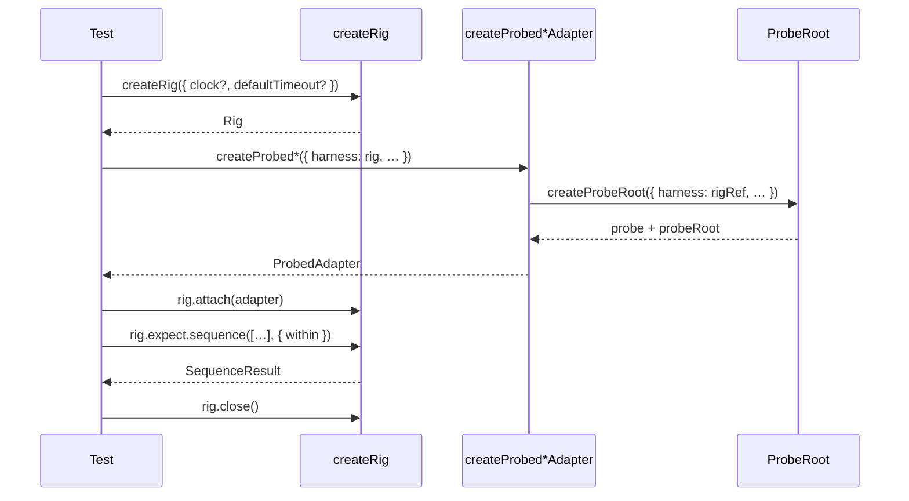

# P02+P03 Harness → Rig rename, all 13 packages to 2.0.0, core as a peerDependency

Applies to: docs/internal/spec/core-public-api.md (new capability file)
Also modifies: docs/internal/spec/docs-truth.md (resolves one deferred row AND
retargets the v1/v2 framing requirement — two edits, see MODIFIED below)
Tickets: RD-24143, RD-24144

**This is a semver event.** It renames five exported symbols of
`@hochgi/test-kit` with no deprecated alias, and republishes all 13 workspace
packages at `2.0.0`. Under npm every consumer pins with a caret, so the leftmost
digit is the only lever that prevents a silent auto-pull. The two tickets ship as
one PR because no ordering of them avoids both the nested dual-install and the
patch-release-with-breaking-dependency traps (see RD-24143's scope-correction
comment).

There is no `docs/internal/spec/core-public-api.md` today. The fold-in after
merge creates it; this delta is written as the requirements that file will hold
about the Rig surface and the package graph.

## ADDED Requirements

### Requirement: The lifecycle owner is named Rig
`@hochgi/test-kit` SHALL export the lifecycle owner of probes and adapters
under the name `Rig`, created by `createRig`. The published names SHALL be:

| exported name | kind |
| --- | --- |
| `Rig` | interface |
| `RigRef` | interface |
| `RigExpectations` | interface |
| `CreateRigOptions` | interface |
| `createRig` | function |

The source of the lifecycle owner SHALL live at `packages/core/src/rig.ts`.

No alias, re-export, or deprecation shim for the former `Harness` names SHALL be
published. The former names SHALL be absent from the built type declarations.

#### Scenario: Rig surface is exported
- **WHEN** `@hochgi/test-kit` is imported
- **THEN** `createRig` is a callable export and `Rig`, `RigRef`,
  `RigExpectations` and `CreateRigOptions` are exported types

#### Scenario: the former Harness names are gone
- **WHEN** the built declarations of `@hochgi/test-kit` are read
- **THEN** none of `Harness`, `HarnessRef`, `HarnessExpectations`,
  `CreateHarnessOptions` or `createHarness` appears as an exported name

#### Scenario: behaviour is unchanged by the rename
- **WHEN** a `Rig` is created, an adapter is attached, and the rig is reset and
  closed
- **THEN** the observable outcomes match those specified for the former
  `Harness` — attach returns the adapter (and a promise for a promised adapter),
  `reset` clears call history and user-installed rules (rig-installed defaults
  are retained) unless `keepRules` is set, `close` runs adapters in reverse
  registration order, and operating on a closed rig fails with
  `Harness is closed.` (attach throws synchronously; reset rejects)

### Requirement: Every workspace package is on major version 2
All 13 workspace packages under `packages/` SHALL declare a version on major
`2`. This PR sets them to `2.0.0`; the requirement is the **major digit**, not
the exact patch.

`vn-ci/init` bumps the patch read from the manifest on every merge to `main`
(`NEW_VERSION=$1.$2.($3+1)`) and pushes a `chore: bump version to vX [skip ci]`
commit before `vn-ci/build-publish` runs. So the first *published* 2.x is
**2.0.1**, and main's manifests advance from there. Major `2` is what carries the
guarantee: it is what stops a consumer on `^1.x` silently auto-pulling the
rename, and any 2.x satisfies the siblings' `^2.0.0` peer range.

#### Scenario: all manifests are on major 2
- **WHEN** every `packages/*/package.json` is parsed
- **THEN** each `version` is a valid `x.y.z` whose major is `2`, and none is on
  `1.x`

### Requirement: Core is a peer dependency of every sibling that needs it
Every package under `packages/` that requires `@hochgi/test-kit` SHALL declare
it in `peerDependencies` at `^2.0.0` and SHALL NOT declare it in
`dependencies`. This scopes to `packages/`: `examples/grpc-client` is a private
workspace *consumer*, not a plugin, and correctly keeps core in `dependencies`
(repointed to `^2.0.0` so npm still links the workspace copy).

This applies to the 11 packages that consume core: `bull`, `kafka`, `mock`,
`mysql`, `pg-knex`, `pg-kysely`, `pg-sequelize`, `redis`, `s3`, `sql`, `sqs`.
`pglite-driver` does not consume core and SHALL NOT gain a dependency on it.

Sibling-to-sibling workspace dependencies (`@hochgi/test-kit-sql`,
`@hochgi/test-kit-pglite-driver`) SHALL be repointed to `^2.0.0` and SHALL
remain in `dependencies`.

#### Scenario: core is a peer, never a direct dependency
- **WHEN** each `packages/*/package.json` is parsed
- **THEN** no `dependencies` map contains `@hochgi/test-kit`, and each of the
  11 consuming packages has `peerDependencies["@hochgi/test-kit"]` equal to
  `^2.0.0`

#### Scenario: internal sibling ranges admit 2.0.0
- **WHEN** each `packages/*/package.json` is parsed
- **THEN** every `@hochgi/test-kit-sql` and
  `@hochgi/test-kit-pglite-driver` range is `^2.0.0`

#### Scenario: the workspace copy is still linked after a clean install
- **WHEN** `node_modules` is removed and `npm install` is run from the repo root
- **THEN** for every package under `packages/`, any
  `packages/<name>/node_modules/@hochgi/test-kit` entry is a symlink into
  `packages/core` and never a materialized directory containing a 1.x manifest

### Requirement: An ADR records the collision and the versioning choice
`docs/adr/` SHALL contain an ADR recording: that "harness" named both this
library's lifecycle owner and the industry term for the agent pipeline; that the
library's concept yielded to `Rig`; that a new word for the agent sense and a
deprecated alias were both considered and rejected; the 118 forced call sites
across 8 consumer repos; and why the middle digit could not carry the break
under npm's resolver.

#### Scenario: the ADR exists and names its subject
- **WHEN** `docs/adr/` is listed
- **THEN** it contains a markdown ADR whose text names `Rig`, `2.0.0`, the
  rejected alternatives, and npm caret resolution

### Requirement: The published option key remains `harness`
The factory option through which a rig is injected SHALL remain spelled
`harness`. `CreateProbed*Options.harness` on the 11 domain factories SHALL keep
its key and change only its type, to `Rig` (or `RigRef` on core and mock).

#### Scenario: option key is unchanged
- **WHEN** a probed adapter is constructed by any domain factory
- **THEN** it accepts the rig under the property name `harness` and rejects no
  previously valid option key

## MODIFIED Requirements

### Requirement: Library docs describe the shipped lifecycle owner
(Modifies `docs/internal/spec/docs-truth.md`.) Library docs — `README.md`,
`APPENDIX.md`, everything under `docs/` that is not `docs/internal/spec/`,
`docs/internal/packets/` or `docs/internal/archive/`, and every
`packages/*/README.md` — SHALL name the lifecycle owner `Rig` / `createRig`, and
SHALL NOT contain `Harness`, `HarnessRef`, `HarnessExpectations`,
`CreateHarnessOptions` or `createHarness` as API names.

Docs SHALL continue to show the injection option as `{ harness, driver }` /
`{ harness: rig }`, because that key does not change.

Design Rule 9 in `docs/concepts.md` SHALL read `rig.clock.advance`.

#### Scenario: docs name Rig, not Harness
- **WHEN** library docs are read
- **THEN** they do not contain the identifiers `createHarness`, `HarnessRef`,
  `HarnessExpectations` or `CreateHarnessOptions`, and do not use `Harness` as a
  type name

#### Scenario: the SQL options object still reads harness and driver
- **WHEN** library docs mention `createProbedSqlAdapter`
- **THEN** they still show a single options object naming both `harness` and
  `driver`, satisfying the existing docs-truth assertion unchanged

### Requirement: Deferred rename row is resolved
(Modifies `docs/internal/spec/docs-truth.md` "Out of scope (deferred)".) The row
`Harness → Rig rename (RD-24143) | Docs still say Harness / createHarness,
matching shipped 1.x` SHALL be removed, because the rename has landed and the
docs now match shipped 2.x.

#### Scenario: no stale deferral remains
- **WHEN** `docs/internal/spec/docs-truth.md` is read
- **THEN** it does not defer the Harness → Rig rename

### Requirement: Version framing matches shipped 2.x
(Modifies `docs/internal/spec/docs-truth.md` — the requirement currently titled
"v1/v2 framing matches shipped 1.x".) `docs/internal/migration-from-v1.md` SHALL
not contradict itself: the migration target is **2.0.0** of this OSS line (as the
title, `docs/README.md` and `docs/internal/README.md` now say), not a "v2"
column. Consumer-facing `docs/concepts.md` SHALL NOT describe behaviour of the
shipped API as belonging to a separate "v2".

The former text asserted the target was `v1.0.0`. This PR moves the shipped
surface to `2.0.0` and updates those three files accordingly, so the requirement
must be retargeted or current truth will contradict the tree. **The fold-in needs
both this edit and the deferred-row removal below — two edits, not one.**

#### Scenario: version framing names the shipped major
- **WHEN** `docs/internal/migration-from-v1.md`, `docs/README.md` and
  `docs/internal/README.md` are read
- **THEN** they name `2.0.0` as the migration target and do not claim the public
  release is version 1

## REMOVED Requirements

### Requirement: `Harness` is the exported lifecycle owner
Removed. Superseded by "The lifecycle owner is named Rig". The name collided
with the industry term for the agent pipeline, which this repo now installs on
itself; one word could not carry both meanings in the one repo that needs both.

## Flow

## Decisions (rung recorded)

| Decision | Outcome | Rung |
| --- | --- | --- |
| Do the 5 named symbols only, or also the `harness` option key? | Key stays `harness`; only the 5 symbols rename | Explicitly requested — RD-24145's forced-site table defines "forced" as *touching test-kit's exported names* and commits to 118 sites (a-consumer-repo-admin 0 despite depending on core). Renaming the key would force nearly every consumer call site and invalidate that committed estimate, which another session owns. |
| Rename `origin: 'harness' \| 'user'` (public union, 6 sites)? | No | Explicitly requested — not among the 5 named symbols; it is an observable string value whose change would break consumer assertions at runtime, not compile time, and is not counted in RD-24145. |
| Rename `errors.harnessClosed()` and its message text (6 sites)? | No | Explicitly requested — a property of the `errors` export, not an exported name; same RD-24145 reasoning. |
| Does anything under `test/` change? | No | Source — every `harness` token under `test/` is the agent-harness sense. The one published-API-sense assertion (`docs-truth.test.ts:496`, "options must include harness and driver") stays *correct* precisely because the option key does not change. |
| `examples/grpc-client` uses `createHarness` / `Harness` | Fold in — rename it | Source — it is a workspace package covered by `npm run check` (`format`, `lint`, `typecheck` all glob `examples/**/*.ts`), so the gate cannot go green without it. Validated against Jira: no packet owns it. RD-24149 (P08) expects it to *still pass* as the extender contract guard. |
| 13 `packages/*/README.md` mention harness (129 occurrences) | Fold in — rename the API names | Source — `docs-truth.test.ts` classifies `packages/*/README.md` as library docs, and they are the published npm READMEs. Validated against Jira: RD-24142 (P01, Done) owned their *truth*, not this rename; no packet owns it. |
| Sibling inter-deps `test-kit-sql` / `test-kit-pglite-driver` at `^1.0.0` | Bump to `^2.0.0`, keep in `dependencies` | Explicitly requested — RD-24144: "Watch the internal chain too." They stay regular deps safely because core is a peer of `sql`, so no nested core can appear beneath it. |
| An ADR under `docs/adr/` | In scope; `docs/adr/` is created | Explicitly requested — RD-24143's description requires it, and RD-24148 (P07) references "the ADR in P02" as existing. The packet prompt omitted it. |
| Capability file for the delta to apply to | New: `docs/internal/spec/core-public-api.md` | Precedent — `docs/internal/spec/README.md` mandates one current-truth file per capability; no core-public-API file exists yet. |

## Out of scope (deferred)

| Item | Consequence of deferring |
| --- | --- |
| The 118 forced call sites in 8 consumer repos (RD-24145) | Those repos stay on `test-kit@^1.x` and keep building until they take 2.0.0 deliberately. This is the intended effect of the major bump. |
| The ~1,948 consumer-defined `create*Harness` factory names | Untouched by design — they name a different thing that merely uses a Rig internally. |
| The `harness` option key still spelled `harness` while its type is `Rig` | 2.0.0 ships a visible naming inconsistency (`createProbedS3Client({ harness: rig })`). Changing it later is a second major bump. Worth a ticket; deliberately not folded in here because RD-24145's committed estimate assumes it. |
| `origin: 'harness' \| 'user'` and `errors.harnessClosed()` | The agent/library word collision survives in two non-`Harness`-named corners of the published surface. |
| Mutation testing / CRAP (RD-24153) | Phase 5 can show the gate is green but not that green *means* anything; 33 of 34 test files resolve through `dist/`. Stated, not hidden. |
| The exact string `2.0.0` never reaching the registry | `vn-ci/init`'s patch bump means the first published 2.x is `2.0.1`. Harmless — every consumer range is a caret — but prose that says "we published 2.0.0" is imprecise. |

## Acceptance mapping

1. `packages/core/src/rig.ts` exists; `packages/core/src/harness.ts` does not.
2. `@hochgi/test-kit` exports `createRig`, `Rig`, `RigRef`, `RigExpectations`,
   `CreateRigOptions`; exports none of the five former names.
3. Attach / reset / close / closed-rig-rejects behaviour is unchanged.
4. All 13 `packages/*/package.json` declare a 2.x version (this PR sets 2.0.0;
   CI's patch bump makes the first published 2.x 2.0.1).
5. No `dependencies` map under `packages/` contains `@hochgi/test-kit`; the 11 consumers declare
   it in `peerDependencies` at `^2.0.0`; `pglite-driver` declares it nowhere.
6. Every internal `test-kit-sql` / `test-kit-pglite-driver` range is `^2.0.0`.
7. After `rm -rf node_modules && npm install`, every
   `packages/*/node_modules/@hochgi/test-kit` is a symlink into
   `packages/core`, not a materialized 1.x directory.
8. `packages/mock/test/integration/rig-lifecycle.test.ts` exists;
   `harness-lifecycle.test.ts` does not.
9. Library docs (incl. all 13 package READMEs) contain none of the five former
   names as API names; Design Rule 9 reads `rig.clock.advance`.
10. Library docs mentioning `createProbedSqlAdapter` still name both `harness`
    and `driver` in one options object.
11. `docs/adr/` contains the ADR naming Rig, 2.0.0, the rejected alternatives,
    and npm caret resolution.
12. Nothing under `test/`, `.harness/`, `scripts/`, `.claude/`, `.cursor/`,
    `.opencode/`, `docs/internal/spec/harness-scaffold.md` or
    `docs/internal/archive/**` is modified.
13. `npm run check` is clean, and `npm run check-agent-skills` still passes.
