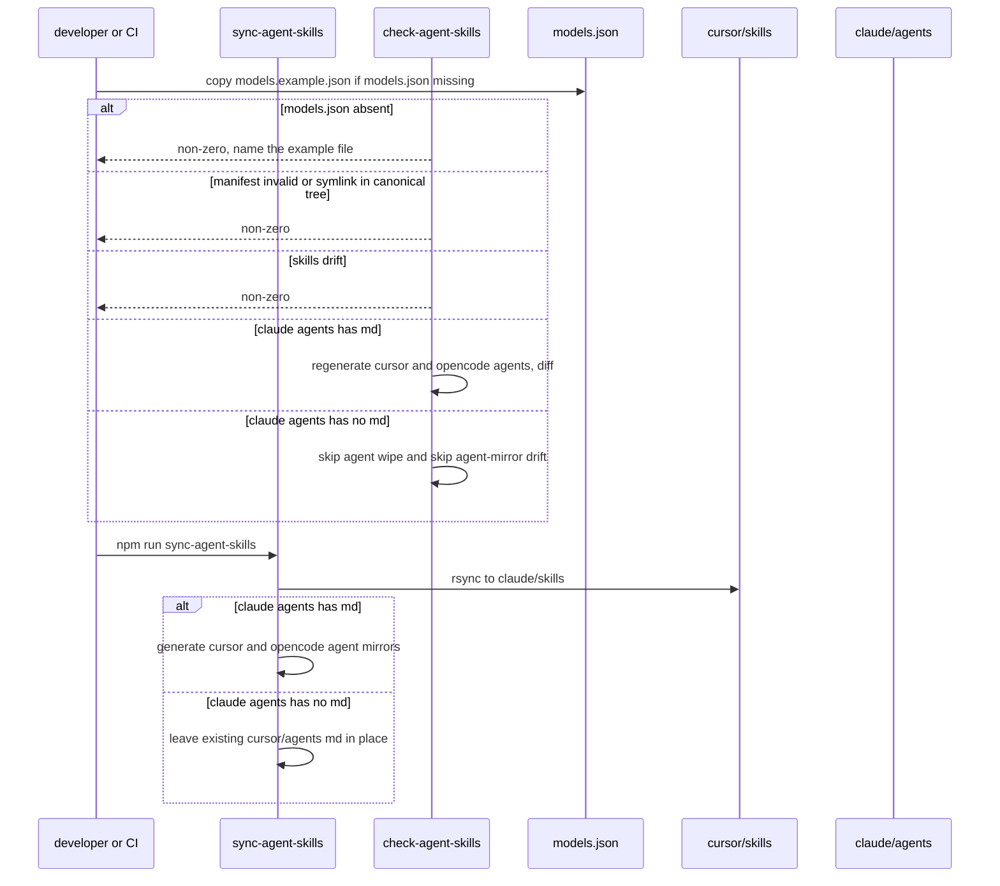

# P05 harness scaffold — surfaces, model manifest, sync/check machinery

Applies to: docs/internal/spec/harness-scaffold.md
Also modifies: docs/internal/spec/ci-gate.md (workspace-wide path list)
Ticket: RD-24146

No published-package public surface changes. Not a semver event.

## ADDED Requirements

### Requirement: Four harness surfaces exist
The repository SHALL contain these directories:

- `.harness/`
- `.claude/agents/`, `.claude/commands/`, `.claude/skills/`
- `.cursor/agents/`, `.cursor/commands/`, `.cursor/rules/`, `.cursor/skills/`
- `.opencode/agents/`, `.opencode/commands/`

`.github/skills/` and `.agents/skills/` SHALL NOT be added as harness surfaces.

#### Scenario: required directories exist
- **WHEN** the repository tree is inspected at those paths
- **THEN** each listed path is a directory

#### Scenario: dropped Copilot and agents-dot surfaces are absent
- **WHEN** the repository is inspected at `.github/skills` and `.agents/skills`
- **THEN** neither path exists

### Requirement: Internal docs three-way layout
`docs/internal/` SHALL contain `packets/`, `spec/`, and `archive/` as sibling
directories. `spec/` holds current-truth capability files, not per-packet
history.

#### Scenario: packets spec and archive exist
- **WHEN** `docs/internal/` is listed
- **THEN** it contains directories named `packets`, `spec`, and `archive`

### Requirement: Model manifest is the single source of per-phase targeting
The tracked file `.harness/models.json` SHALL be the only committed file that
names vendor model ids or LiteLLM role aliases for the five pipeline phases.
It SHALL contain an `agents` object with keys `spec-author`, `test-author`,
`coder`, `reviewer`, `verifier`, each with non-empty string columns `claude`,
`cursor`, and `opencode`, a JSON boolean `readonly`, and a distinct positive
integer `phase` (1 through 5 in that agent order). It SHALL contain
`orchestrator.opencode`. The `opencode` column and `orchestrator.opencode`
SHALL be LiteLLM role aliases starting with `litellm/vn-`. `reviewer` and
`verifier` SHALL have `readonly` true; the other three agents SHALL have
`readonly` false.

The three columns SHALL match the donor table:

| agent | claude | cursor | opencode |
| --- | --- | --- | --- |
| spec-author | opus | cursor-grok-4.6-xhigh | litellm/vn-spec |
| test-author | claude-opus-4-8 | cursor-grok-4.6-xhigh | litellm/vn-test |
| coder | opus | cursor-grok-4.6-xhigh | litellm/vn-coding |
| reviewer | opus | cursor-grok-4.6-xhigh | litellm/vn-review |
| verifier | opus | cursor-grok-4.6-xhigh | litellm/vn-verify |

`orchestrator.opencode` SHALL be `litellm/vn-spec`.

`test-author.claude` SHALL be the deliberate pin `claude-opus-4-8` (not
`opus`). The manifest SHALL include `rationale["test-author.claude"]` whose
text states that Opus 4.8 keeps test scope tight and that newer tiers invent
adjacent scenarios. No other `rationale` key SHALL be present.

#### Scenario: five agents have the donor three columns
- **WHEN** `.harness/models.json` is parsed
- **THEN** each of the five agents has the claude, cursor, and opencode values
  in the table above, `orchestrator.opencode` is `litellm/vn-spec`, phases are
  1–5 in agent order, and `readonly` is false, false, false, true, true

#### Scenario: test-author claude pin is explained
- **WHEN** `.harness/models.json` is parsed
- **THEN** `agents["test-author"].claude` is `claude-opus-4-8` and
  `rationale["test-author.claude"]` is a non-empty string or array of strings
  that mentions `opus` / `4.8` and scope, and `rationale` has no other keys

### Requirement: Example manifest lets a clone restore models.json
The tracked file `.harness/models.example.json` SHALL exist. Its `agents`,
`orchestrator`, and `rationale` values SHALL equal those in
`.harness/models.json`, so copying the example onto `models.json` is enough
to regenerate mirrors.

When `.harness/models.json` is absent, `check-agent-skills` SHALL exit
non-zero and write to stderr that the file is missing and that
`.harness/models.example.json` should be copied to `.harness/models.json`.
It SHALL NOT create `models.json` itself.

#### Scenario: example matches the live manifest
- **WHEN** both `.harness/models.json` and `.harness/models.example.json` are
  parsed
- **THEN** their `agents`, `orchestrator`, and `rationale` values are deep-equal

#### Scenario: missing models.json fails loudly
- **WHEN** `check-agent-skills` is run against a tree that has
  `models.example.json` but no `models.json`
- **THEN** the process exits non-zero, stderr names `.harness/models.example.json`
  and `.harness/models.json`, and `models.json` is still absent afterwards

### Requirement: Sync and check are npm scripts, not git hooks
Root `package.json` SHALL expose `sync-agent-skills` and `check-agent-skills`
as npm scripts that invoke the repository's sync and drift-check programs.
This packet SHALL NOT add husky, lefthook, a `prepare` script, or
`core.hooksPath`. `check-agent-skills` SHALL NOT modify tracked files.

#### Scenario: both scripts are defined
- **WHEN** the root `package.json` `scripts` map is read
- **THEN** it contains `sync-agent-skills` and `check-agent-skills` whose
  commands invoke paths under `scripts/`

#### Scenario: check-agent-skills is read-only
- **WHEN** `npm run check-agent-skills` is run on a consistent tree
- **THEN** it exits 0 and `git status --porcelain` reports no changes to
  tracked files

### Requirement: Skills fan out byte-identical from Cursor
`.cursor/skills` is canonical. After a successful `sync-agent-skills`,
`.claude/skills` SHALL be byte-identical to `.cursor/skills` (aside from
`.DS_Store`). `check-agent-skills` SHALL exit non-zero when those two trees
differ. OpenCode SHALL read `.cursor/skills` in place rather than keep a
third copy.

#### Scenario: claude skills match cursor skills after check passes
- **WHEN** `check-agent-skills` exits 0
- **THEN** `.claude/skills` and `.cursor/skills` contain the same relative
  paths and the same file bytes

#### Scenario: OpenCode skills path is the Cursor canonical dir
- **WHEN** `.opencode/opencode.json` is parsed
- **THEN** `skills.paths` is exactly `["./.cursor/skills"]`

### Requirement: Agents and commands generate from Claude when canonical files exist
`.claude/agents` is canonical for agents. `.claude/commands` is canonical for
commands. When those directories contain `*.md` files, `sync-agent-skills`
SHALL write `.cursor/agents` and `.opencode/agents` from the agents, and
`.cursor/commands` and `.opencode/commands` from the commands, using
per-tool frontmatter (Cursor schema for Cursor agents; OpenCode schema for
OpenCode agents; Cursor wording for Cursor commands; OpenCode wording for
OpenCode commands). `check-agent-skills` SHALL regenerate into a temp tree
and exit non-zero on drift against those four mirrors.

A canonical `.claude/agents/<name>.md` `model:` frontmatter value SHALL equal
`agents[name].claude` in the manifest, or `check-agent-skills` SHALL fail.

#### Scenario: populated claude agents produce matching cursor and opencode mirrors
- **WHEN** `.claude/agents` contains at least one `*.md` and `sync-agent-skills`
  then `check-agent-skills` are run
- **THEN** `check-agent-skills` exits 0

#### Scenario: claude agent model disagrees with the manifest
- **WHEN** a canonical `.claude/agents/<name>.md` pins a `model` other than
  `agents[name].claude` in `.harness/models.json`
- **THEN** `check-agent-skills` exits non-zero

### Requirement: Empty Claude canonical dirs do not destroy Cursor bootstrap
Until P06 writes canonical Claude agent and command files, `.claude/agents`
and `.claude/commands` MAY contain no `*.md`. In that case `sync-agent-skills`
SHALL NOT delete or replace existing `*.md` under `.cursor/agents` or
`.cursor/commands`, and `check-agent-skills` SHALL NOT fail solely because
those Cursor trees contain files the empty Claude trees would not generate.

#### Scenario: empty claude agents leave cursor agents in place
- **WHEN** `.claude/agents` has no `*.md` and `.cursor/agents` already has
  `*.md` and `sync-agent-skills` is run
- **THEN** every `*.md` that was in `.cursor/agents` beforehand is still
  present with the same bytes

#### Scenario: empty claude commands leave cursor commands in place
- **WHEN** `.claude/commands` has no `*.md` and `.cursor/commands` already has
  `*.md` and `sync-agent-skills` is run
- **THEN** every `*.md` that was in `.cursor/commands` beforehand is still
  present with the same bytes

#### Scenario: check passes with empty claude agents and commands
- **WHEN** `.claude/agents` and `.claude/commands` have no `*.md`, skills are
  in sync, the manifest is valid, and `opencode.json` agrees with the manifest
- **THEN** `npm run check-agent-skills` exits 0

### Requirement: OpenCode config tracks the manifest
`.opencode/opencode.json` SHALL exist. Its `model` and `agent.build.model`
SHALL equal `agents.coder.opencode`. Its `agent["spec-to-ship"].model` SHALL
equal `orchestrator.opencode`. `check-agent-skills` SHALL exit non-zero when
any of those disagree.

#### Scenario: opencode.json models match the manifest
- **WHEN** `.opencode/opencode.json` and `.harness/models.json` are parsed
- **THEN** `model` and `agent.build.model` equal `litellm/vn-coding` and
  `agent["spec-to-ship"].model` equals `litellm/vn-spec`

#### Scenario: opencode.json drift fails the check
- **WHEN** `.opencode/opencode.json` `model` differs from
  `agents.coder.opencode` and `check-agent-skills` is run
- **THEN** the process exits non-zero

### Requirement: Manifest validation is fail-closed
`sync-agent-skills` and `check-agent-skills` SHALL refuse to succeed when
`.harness/models.json` is invalid: a non-boolean `readonly`, a missing
`rationale` for a `claude` or `cursor` value that differs from the column
majority, a `rationale` key that does not name a live deviation, an
`opencode` value that does not start with `litellm/`, or a duplicate `phase`.
The `opencode` column differing across phases is not a deviation that needs
rationale.

They SHALL also refuse to succeed when a canonical skills, agents, or
commands tree contains a symlink.

#### Scenario: string readonly fails validation
- **WHEN** an agent's `readonly` in the manifest is the string `"false"`
  rather than the boolean `false` and `check-agent-skills` is run
- **THEN** the process exits non-zero

#### Scenario: unexplained cursor or claude deviation fails validation
- **WHEN** `coder.claude` differs from the other agents' `claude` values and
  `rationale` has no `coder.claude` entry and `check-agent-skills` is run
- **THEN** the process exits non-zero

#### Scenario: symlink under canonical skills fails the check
- **WHEN** `.cursor/skills` contains a symlink and `check-agent-skills` is run
- **THEN** the process exits non-zero

### Requirement: New TypeScript for this capability is on the root test and format paths
Tests that encode these scenarios SHALL run as part of the root `npm test`
workspace, and SHALL be included in the root `format:check` glob.

#### Scenario: harness-scaffold tests are in the Vitest workspace
- **WHEN** `vitest.workspace.ts` is read
- **THEN** it includes a project that picks up the tests for this capability

#### Scenario: harness-scaffold TypeScript is format-checked
- **WHEN** the root `format:check` script is read
- **THEN** its glob covers those test files

## MODIFIED Requirements

### Requirement: Workspace-wide path changes run the root check in CI
CircleCI path-filtering SHALL map a change to any of these paths onto a boolean
pipeline parameter dedicated to a workspace-wide gate (distinct from the
per-package `build_*` parameters):

- `package.json` (repository root only)
- `tsconfig.json`
- `tsconfig.base.json`
- `.eslintrc.json`
- `vitest.workspace.ts`
- anything under `docs/`
- anything under `.circleci/`
- anything under `.cursor/`
- anything under `.claude/`
- anything under `.harness/`
- anything under `.opencode/`

A workflow in `.circleci/ci.yml` gated on that parameter SHALL run the root
`check` script (`npm run check`).

#### Scenario: workspace-wide paths are mapped
- **WHEN** the path-filtering mapping in `.circleci/config.yml` is evaluated
  with `^`/`$` anchors as the orb applies them
- **THEN** each of those paths matches a mapping line that sets the
  workspace-wide parameter to `true`, and `packages/core/package.json` does not
  match the root `package.json` mapping

#### Scenario: workspace-wide workflow runs check
- **WHEN** `.circleci/ci.yml` is read
- **THEN** it declares that workspace-wide parameter (boolean, default `false`)
  and a workflow that runs when the parameter is true whose steps invoke
  `npm run check`

## REMOVED Requirements

n/a

## Flow

## Decisions (rung recorded)

| Decision | Outcome | Rung |
| --- | --- | --- |
| Take donor-bot-repo sync/check lib, not donor-service-repo | Shared lib with manifest validation, OpenCode config assert, symlink refusal, staged generation | Ticket |
| Three columns plus `test-author.claude: claude-opus-4-8` and its rationale | Copy donor-server-repo / donor-service-repo manifest table, not donor-bot-repo's all-`opus` column | Ticket (explicit, including the rationale that over-broad tests spec unasked API) |
| LiteLLM aliases stay `litellm/vn-*` | `vn-spec`, `vn-test`, `vn-coding`, `vn-review`, `vn-verify` | Ticket |
| `models.example.json` is tracked and must match `models.json`; missing `models.json` fails loudly and does not auto-copy | Both files committed (donors commit `models.json`; ticket asks for the example and the loud fail). Missing-file behaviour is still required and is tested on a throwaway tree | Ticket + donor precedent |
| `.github/skills` and `.agents/skills` are not created | Ticket called them droppable | Ticket |
| No new agent/skill/command bodies | P06. Existing RD-24147 Cursor bootstrap files stay | Ticket + source (`git ls-files .cursor`, commit `a0b9e75`) |
| Empty `.claude/agents` and `.claude/commands` do not wipe `.cursor` mirrors and do not fail the drift check | Donor sync would `rm -rf` generated dirs; that would delete the running Cursor pipeline. Skip generation and skip that drift comparison while canonical `*.md` count is zero | Ticket ("no content yet") + source (tracked `.cursor/agents` and `.cursor/commands`) |
| Skills *are* mirrored Cursor → Claude even though P06 still owns skill *prose* | `.cursor/skills` is already canonical and populated; rsync is machinery, not new content | Source + ticket canonical direction |
| `check-agent-skills` is an npm script; not added to the five-step `npm run check` chain | P00 pinned that chain. Harness-scaffold tests invoke the script during `npm test` | Source (`docs/internal/spec/ci-gate.md`) + ticket (script, not a hook) |
| Map `.claude/`, `.harness/`, `.opencode/` onto `build_workspace` | P00 deferred `.claude/` mapping until P05 stood the trees up | Source (ci-gate decision table) + ticket (this PR touches harness paths) |
| `docs/internal/{packets,spec,archive}` layout is required here even though P00/P01 already created it | Ticket lists it as P05; requiring it is idempotent | Ticket |
| No public API / version bump | Root `package.json` is private; no package `src/` change | Source |

## Out of scope (deferred)

| Item | Consequence of deferring |
| --- | --- |
| P06 agent, skill, command, and `.cursor/rules` prose (RD-24147) | Canonical `.claude/agents` and `.claude/commands` stay empty of `*.md`; Cursor bootstrap remains hand-written until P06 writes Claude canonical files and re-syncs |
| Adding `check-agent-skills` to `npm run check` | A human who runs only `check` still hits the script via this packet's tests inside `npm test`; a test skip would hide drift |
| husky / lefthook / `prepare` / `core.hooksPath` | Drift is a script the agent runs (and CI runs via tests), not a pre-push hook |
| `.github/skills`, `.agents/skills` | Those tools are not in the three-surface set |
| `validate-skills.sh` (Anthropic Skills API lint in donor-bot-repo) | Ticket did not ask for a third script |
| Mutation testing / CRAP (RD-24153) | Phase 5 still cannot tell whether green means anything |

## Acceptance mapping

1. The listed `.harness`, `.claude/*`, `.cursor/*`, and `.opencode/*` directories exist; `.github/skills` and `.agents/skills` do not.
2. `docs/internal/` has `packets/`, `spec/`, and `archive/`.
3. `.harness/models.json` has the five agents, donor three-column table, `test-author.claude` = `claude-opus-4-8` with that rationale only, LiteLLM `litellm/vn-*` aliases, and boolean `readonly`.
4. `.harness/models.example.json` matches `agents` / `orchestrator` / `rationale`; a tree without `models.json` fails `check-agent-skills` with a copy instruction and does not create the file.
5. Root npm scripts `sync-agent-skills` and `check-agent-skills` exist; the check is read-only; no git hooks are added.
6. After a passing check, `.claude/skills` is byte-identical to `.cursor/skills`; OpenCode `skills.paths` is `["./.cursor/skills"]`.
7. When `.claude/agents` has `*.md`, sync+check round-trip the Cursor and OpenCode agent mirrors; a disagreeing Claude `model:` fails the check.
8. When `.claude/agents` or `.claude/commands` have no `*.md`, sync leaves existing Cursor `*.md` in place and check still exits 0 if skills/manifest/opencode are consistent.
9. `.opencode/opencode.json` exists; `model` / `agent.build.model` are `litellm/vn-coding`; `agent["spec-to-ship"].model` is `litellm/vn-spec`; drift fails the check.
10. Non-boolean `readonly`, unexplained `claude`/`cursor` deviation, and a symlink under canonical skills each fail `check-agent-skills`.
11. Path-filtering maps `.claude/**`, `.harness/**`, and `.opencode/**` (in addition to the P00 list) onto `build_workspace true`.
12. The tests for these scenarios run under root `npm test` and are in the root `format:check` glob.
