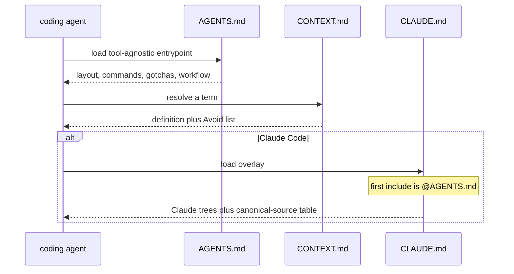

# P07 CONTEXT.md, AGENTS.md, CLAUDE.md

Applies to: docs/internal/spec/harness-prose.md
Ticket: RD-24148

No published-package public surface changes. Not a semver event.

P06 deferred the three repo-root agent entrypoints. This delta adds them.
It does not port donor *content*; it copies donor *shape* into this
repository's vocabulary. It does not add a markdown linter, git hooks,
or CircleCI mappings for the three files (this packet's tests live under
already-mapped `test/` and `docs/`).

## ADDED Requirements

### Requirement: CONTEXT.md is a glossary of canonical terms
Repository-root `CONTEXT.md` SHALL exist. It SHALL be a glossary and
nothing else: no implementation commands, no EARS requirements, no
scratch-pad markers.

Each of these terms SHALL appear as a markdown heading with a definition
and an `_Avoid_:` list of banned near-synonyms:

Library terms: **Rig**, **Adapter**, **Probe**, **Selection**, **Filter**,
**Call**, **Pending Call**, **Backing**, **Rule**, **Settlement**,
**Porcelain**, **Plumbing**, **Goldilocks boundary**.

Harness-side terms: **Harness**, **Blinker**, **Packet**.

Definitions SHALL match current published usage, not invented synonyms:

- **Rig** is the lifecycle owner of probes and adapters (`createRig`).
- **Adapter** is the object injected into the component under test.
- **Probe** is the test-facing control surface for an adapter.
- **Selection** is a filtered view of a probe.
- **Filter** is a `(call) => boolean` predicate that narrows a selection.
- **Call** is a recorded interaction with an adapter.
- **Pending Call** is a live call that has reached the adapter but has
  not yet been settled.
- **Backing** is an optional local implementation behind an adapter.
- **Rule** is pre-programmed behavior for future matching calls
  (`once()` / `always()`).
- **Settlement** is completing a pending call with `answer` / `reject` /
  `forward` (or parking by doing nothing).
- **Porcelain** is pre-programmed behavior for dependencies the scenario
  is not actively testing.
- **Plumbing** is explicit, step-by-step control of the interactions the
  scenario *is* testing.
- **Goldilocks boundary** is a leaf seam fat enough to skip protocol
  noise and thin enough that application logic stays in the component.
- **Harness** is the agent pipeline (tools, prompts, loop, gates,
  skills). Prose SHALL qualify it as "agent harness" where the library
  sense could be meant.
- **Blinker** is a file under `.cursor/rules/`.
- **Packet** is a scoped work item under `docs/internal/packets/` that
  owns shape; the spec delta owns behaviour.

`CONTEXT.md` SHALL NOT contain fenced `typescript`, `ts`, `bash`, or
`sh` code blocks. It SHALL NOT contain `npm run`. It SHALL NOT contain
`SHALL`. It SHALL NOT contain `TODO`.

#### Scenario: CONTEXT.md exists at the repository root
- **WHEN** the repository root is listed
- **THEN** it contains a tracked file named `CONTEXT.md`

#### Scenario: every required term has a heading, a definition, and an Avoid list
- **WHEN** `CONTEXT.md` is read
- **THEN** each of the sixteen terms appears as a heading, and the
  section under that heading contains `_Avoid_:`

#### Scenario: CONTEXT.md is a glossary only
- **WHEN** `CONTEXT.md` is read
- **THEN** it does not contain a fenced `typescript`, `ts`, `bash`, or
  `sh` block, and it does not contain `npm run`, `SHALL`, or `TODO`

### Requirement: CONTEXT.md disambiguates Rule, Harness, and blinkers
The three live collisions SHALL be explicit in the `_Avoid_:` lists:

- **Rule** (published API) SHALL ban using that word for the 13 numbered
  Design Rules in `docs/concepts.md` and for `.cursor/rules/` files.
- **Blinker** SHALL ban calling `.cursor/rules/` files "rules".
- **Harness** (agent pipeline) SHALL ban using that word for the
  lifecycle owner. **Rig** SHALL ban using "Harness" as the name of that
  owner. The **Harness** or **Rig** entry SHALL include one sentence that
  the industry word was kept for the agent sense and the library concept
  became Rig, and SHALL point at
  `docs/adr/0001-rename-the-lifecycle-owner-to-rig-and-ship-2-0-0.md`.

Settlement's `_Avoid_:` list SHALL ban `return`, `reply`, and `respond`
as names for the successful settlement verb.

`CONTEXT.md` SHALL NOT ban the word `digest`. This repository's
`write-spec` skill does not list digest as vocabulary; importing
reports_service's ban would invent a contradiction that is not present
here.

`CONTEXT.md` SHALL NOT present `createHarness` as a current factory.

#### Scenario: Rule and Blinker Avoid lists split the three meanings
- **WHEN** the Rule and Blinker sections of `CONTEXT.md` are read
- **THEN** Rule's `_Avoid_:` list names blinkers and Design Rules, and
  Blinker's `_Avoid_:` list forbids calling `.cursor/rules/` files
  "rules"

#### Scenario: Harness and Rig point at the ADR
- **WHEN** the Harness and Rig sections of `CONTEXT.md` are read
- **THEN** Harness is defined as the agent pipeline, Rig is defined as
  the lifecycle owner, one of those sections contains the ADR path
  `docs/adr/0001-rename-the-lifecycle-owner-to-rig-and-ship-2-0-0.md`,
  and Rig's `_Avoid_:` list includes `Harness`

#### Scenario: Settlement Avoid list keeps the Design Rules verb
- **WHEN** the Settlement section of `CONTEXT.md` is read
- **THEN** its `_Avoid_:` list contains `return`, `reply`, and `respond`

#### Scenario: digest is not banned and createHarness is not current
- **WHEN** `CONTEXT.md` is read
- **THEN** it does not contain `_Avoid_:` text that lists `digest`, and
  it does not contain `createHarness`

### Requirement: AGENTS.md is the tool-agnostic agent entrypoint
Repository-root `AGENTS.md` SHALL exist. It SHALL be tool-agnostic
(Cursor, Claude Code, and OpenCode all read it). It SHALL contain
headings for: what the repo is, layout, commands, blinkers, testing,
workflow, and model targeting.

It SHALL state that this repository is the `@vnatures/test-kit` npm
workspace of published packages.

It SHALL name these layout paths: `packages/`, `examples/`, `docs/`,
`.cursor/`, `.claude/`, `.opencode/`, `.harness/`.

It SHALL name the commands `npm run check`, `npm run build`, and
`npm test`.

It SHALL call `.cursor/rules/` files blinkers.

It SHALL state these testing facts:

- Root `npm test` does not run per-package `pretest` builds, so
  `npm run build` must run first or specifier resolution hits stale
  `dist/`.
- The full gate is `npm run check`.
- There are no git hooks (no husky, no lefthook).
- `packages/mysql` needs Docker.

It SHALL state these git conventions: remote `vn` (there is no
`origin`), base branch `main`, squash-only history, branches
`RD-NNNNN_slug`, Conventional Commits with a package scope.

It SHALL name `/spec-to-ship` and the five phases `spec-author`,
`test-author`, `coder`, `reviewer`, `verifier`. It SHALL NOT instruct
merging onto `main` or moving files into `docs/internal/archive/` while
a PR is open.

It SHALL name `.harness/models.json` as the source of per-phase model
targeting. It SHALL NOT contain `cursor-grok-4.6-xhigh`,
`claude-opus-4-8`, or `litellm/vn-`.

It SHALL name `CONTEXT.md`.

It SHALL NOT contain `prettify`. It SHALL NOT present `mock-aws-s3-v3`
as the current S3 backing. It SHALL NOT contain `no Docker needed`.

#### Scenario: AGENTS.md exists at the repository root
- **WHEN** the repository root is listed
- **THEN** it contains a tracked file named `AGENTS.md`

#### Scenario: AGENTS.md has the required sections
- **WHEN** `AGENTS.md` is read
- **THEN** it contains headings that name the repo, layout, commands,
  blinkers, testing, workflow, and model targeting

#### Scenario: AGENTS.md names layout paths and check commands
- **WHEN** `AGENTS.md` is read
- **THEN** it contains `packages/`, `examples/`, `docs/`, `.cursor/`,
  `.claude/`, `.opencode/`, `.harness/`, `npm run check`,
  `npm run build`, and `npm test`

#### Scenario: AGENTS.md carries the day-one testing gotchas
- **WHEN** `AGENTS.md` is read
- **THEN** it contains `pretest`, `dist`, `npm run check`, `husky`,
  `lefthook`, `Docker`, and `mysql`

#### Scenario: AGENTS.md states git conventions
- **WHEN** `AGENTS.md` is read
- **THEN** it contains `vn`, `origin`, `main`, `squash`, `RD-`, and
  `Conventional Commits`

#### Scenario: AGENTS.md summarises spec-to-ship without merging an open PR
- **WHEN** `AGENTS.md` is read
- **THEN** it contains `spec-to-ship`, `spec-author`, `test-author`,
  `coder`, `reviewer`, and `verifier`, and it does not instruct merging
  onto `main` or moving files into `docs/internal/archive/` while a PR
  is open

#### Scenario: AGENTS.md defers model ids to the manifest
- **WHEN** `AGENTS.md` is read
- **THEN** it contains `.harness/models.json` and does not contain
  `cursor-grok-4.6-xhigh`, `claude-opus-4-8`, or `litellm/vn-`

#### Scenario: AGENTS.md points at the glossary and blinkers
- **WHEN** `AGENTS.md` is read
- **THEN** it contains `CONTEXT.md` and `blinker`

#### Scenario: AGENTS.md is not the stale remote-branch draft
- **WHEN** `AGENTS.md` is read
- **THEN** it does not contain `prettify`, does not contain
  `mock-aws-s3-v3`, and does not contain `no Docker needed`

### Requirement: CLAUDE.md is a thin Claude Code overlay
Repository-root `CLAUDE.md` SHALL exist. It SHALL open with `@AGENTS.md`.
It SHALL inventory Claude Code assets at `.claude/agents/`,
`.claude/commands/`, and `.claude/skills/`. It SHALL include a
canonical-source table that states:

- skills are canonical in `.cursor/skills`
- agents are canonical in `.claude/agents`
- commands are canonical in `.claude/commands`
- per-phase model targeting is canonical in `.harness/models.json`

It SHALL NOT define library domain vocabulary: it SHALL NOT contain
`createRig`, `createHarness`, `Goldilocks`, `Pending Call`, `once()`,
or `always()`. It SHALL NOT contain `cursor-grok-4.6-xhigh`,
`claude-opus-4-8`, or `litellm/vn-`.

#### Scenario: CLAUDE.md exists at the repository root
- **WHEN** the repository root is listed
- **THEN** it contains a tracked file named `CLAUDE.md`

#### Scenario: CLAUDE.md starts from AGENTS.md
- **WHEN** `CLAUDE.md` is read
- **THEN** it contains `@AGENTS.md` before any other `@` include

#### Scenario: CLAUDE.md inventories Claude assets and the canonical table
- **WHEN** `CLAUDE.md` is read
- **THEN** it contains `.claude/agents`, `.claude/commands`,
  `.claude/skills`, `.cursor/skills`, and `.harness/models.json`

#### Scenario: CLAUDE.md does not teach the library domain or pin models
- **WHEN** `CLAUDE.md` is read
- **THEN** it does not contain `createRig`, `createHarness`,
  `Goldilocks`, `Pending Call`, `once()`, `always()`,
  `cursor-grok-4.6-xhigh`, `claude-opus-4-8`, or `litellm/vn-`

## MODIFIED Requirements

n/a

## REMOVED Requirements

n/a

## Flow

## Decisions (rung recorded)

| Decision | Outcome | Rung |
| --- | --- | --- |
| Apply the delta to `harness-prose.md`, not a new capability file | P06 deferred these three files from that capability; they are agent-facing prose, not scaffold machinery | Source (`harness-prose.md` out of scope) + ticket |
| Copy reports_service glossary *shape* (term, definition, `_Avoid_:`), not its content | Donor `CONTEXT.md` is not on `reports_service` default-branch root today; the ticket named the shape | Ticket + sibling lookup (file absent on default branch) |
| Sixteen glossary terms, including Porcelain / Plumbing / Goldilocks boundary | Ticket listed them as taken from `docs/concepts.md`. Those three live in root `README.md` and `component-testing`, not in `concepts.md`. Include them anyway — published usage wins over the ticket's path claim | Ticket + source (`README.md`, `docs/concepts.md` headings) |
| Do not ban `digest` | This repo's `write-spec` does not list digest; reports_service's ban would invent a contradiction the ticket told us not to import | Source (`.cursor/skills/write-spec/SKILL.md`) + ticket |
| Harness/Rig collision is one sentence plus the P02 ADR path | Ticket required that sentence and named the ADR; the ADR exists at `docs/adr/0001-…` | Ticket + source (ADR file) |
| Settlement Avoid list bans `return` / `reply` / `respond` | Design Rule 2 already owns that grammar; the glossary must not reintroduce the synonyms | Source (`docs/concepts.md` Design Rules) |
| AGENTS.md sections are the ticket's list (repo, layout, commands, blinkers, testing, workflow, model targeting) | cycle-processing has no root `AGENTS.md` on default branch; the ticket's heading list is the shape | Ticket + sibling lookup |
| AGENTS.md states `npm run check` exists | Ticket said "no single check script until P00". P00 landed; `package.json` scripts.check is the contract | Source (`package.json`, `ci-gate.md`) |
| AGENTS.md names mysql + Docker | Ticket forbade the stale "no Docker needed" line because mysql now needs Docker | Ticket + source (`packages/mysql`) |
| Ignore `vn/cursor/env-setup-agents-md-025f` | Ticket: that draft is wrong on `prettify`, `mock-aws-s3-v3`, and Docker | Ticket |
| Model ids stay out of AGENTS.md and CLAUDE.md | `harness-scaffold.md` already makes `.harness/models.json` the only targeting table; entrypoints point at it | Source (`harness-scaffold.md`) |
| CLAUDE.md is `@AGENTS.md` plus Claude inventory plus the canonical-source table | Ticket: thin, nothing about the domain | Ticket + source (`harness-scaffold.md` canonical directions) |
| Do not map the three root files onto CircleCI `build_workspace` in this packet | `test/` and `docs/` already map; an AGENTS.md-only later PR can still miss CI | Sibling (`ci-gate.md` / P13) — deferred |
| Tests join `test/harness-prose` | Same capability, same Vitest project; no new workspace entry | Precedent (P06 `test/harness-prose`) |
| No public API / version bump | Root markdown only | Source |

## Out of scope (deferred)

| Item | Consequence of deferring |
| --- | --- |
| CircleCI path-filter lines for root `CONTEXT.md` / `AGENTS.md` / `CLAUDE.md` | A later PR that touches only those files can skip `build_workspace` |
| Extending ci-gate's gate-prose scan to root `AGENTS.md` | Gate facts are asserted by this packet's AGENTS.md scenarios instead |
| Adding `CONTEXT.md` to the docs-truth library-docs corpus | Phantom-API scans still skip the glossary |
| Adding Porcelain / Plumbing / Goldilocks headings to `docs/concepts.md` | `write-spec` still cites those terms as if they lived there |
| Mutation testing / CRAP (RD-24153) | Phase 5 still cannot tell whether green means anything |
| Phase-0 steering command + add-adapter skill (P08, RD-24149) | `extend-test-kit` / `add-module` stay unported |
| summon-review-panel (P11, RD-24152) | Unchanged |
| Markdown / frontmatter linter | `npm run check` stays the five TypeScript-focused scripts |

## Acceptance mapping

1. Root `CONTEXT.md` exists; each of the sixteen terms is a heading with `_Avoid_:`; the file has no ts/js/bash fences, no `npm run`, no `SHALL`, no `TODO`.
2. Rule vs Blinker vs Design Rules are split in Avoid lists; Harness is the agent pipeline; Rig is the lifecycle owner; the ADR path is present; Settlement bans `return`/`reply`/`respond`; `digest` is not banned; `createHarness` is absent.
3. Root `AGENTS.md` exists with the seven section themes; names layout paths and `npm run check` / `build` / `test`; states pretest/`dist`, no husky/lefthook, mysql+Docker; states vn/main/squash/`RD-`/Conventional Commits; names spec-to-ship and the five phases without merge/archive-on-open-PR; points at `.harness/models.json` and `CONTEXT.md`; says blinker; contains none of `prettify`, `mock-aws-s3-v3`, `no Docker needed`, or the distinctive model ids.
4. Root `CLAUDE.md` exists, includes `@AGENTS.md` first, inventories `.claude/{agents,commands,skills}` and the canonical paths, and contains none of the library-domain strings or distinctive model ids.
5. Tests for these scenarios run under root `npm test` (harness-prose project) and are in the root `format:check` glob.
