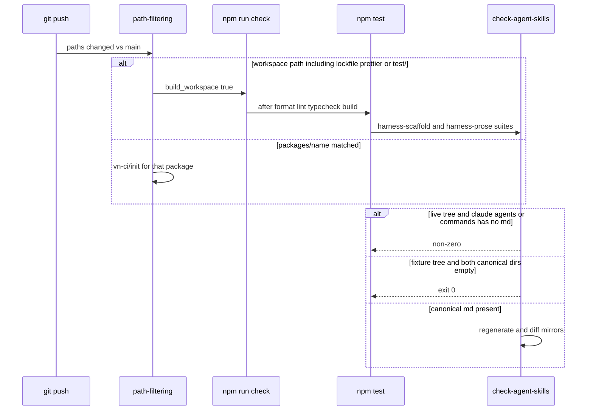

# P13 leftover harness/CI holes

Applies to: docs/internal/spec/ci-gate.md
Also modifies: docs/internal/spec/harness-scaffold.md,
docs/internal/spec/harness-prose.md, docs/internal/spec/docs-truth.md
Ticket: RD-24164

No published-package public surface changes. Not a semver event.

P00 and P06 deferred the CircleCI holes and the "later packet" harness
markdown sentence. PR #53 then parked five harness-machinery findings on
this ticket. This delta closes those leftovers. It does not add a
markdown/frontmatter linter, mutation testing, git hooks, or
`check-agent-skills` to the five-step `npm run check` chain.

## ADDED Requirements

n/a

## MODIFIED Requirements

### Requirement: Workspace-wide path changes run the root check in CI
(from `docs/internal/spec/ci-gate.md`)

CircleCI path-filtering SHALL map a change to any of these paths onto a
boolean pipeline parameter dedicated to a workspace-wide gate (distinct
from the per-package `build_*` parameters):

- `package.json` (repository root only)
- `package-lock.json` (repository root only)
- `.prettierrc` (repository root only)
- `tsconfig.json`
- `tsconfig.base.json`
- `.eslintrc.json`
- `vitest.workspace.ts`
- anything under `docs/`
- anything under `.circleci/`
- anything under `.cursor/`
- anything under `.claude/`
- anything under `.harness/`
- anything under `.opencode/`
- anything under repository-root `test/` (not `packages/*/test/`)

A workflow in `.circleci/ci.yml` gated on that parameter SHALL run the
root `check` script (`npm run check`).

The existing `.cursor/**` / `.claude/**` / `.harness/**` / `.opencode/**`
mappings SHALL remain. Harness-only PRs still set `build_workspace`.
That job's `npm test` still includes the suites that invoke
`check-agent-skills`. This packet SHALL NOT add a markdown or
frontmatter linter to `npm run check`.

#### Scenario: workspace-wide paths are mapped
- **WHEN** the path-filtering mapping in `.circleci/config.yml` is
  evaluated with `^`/`$` anchors as the orb applies them
- **THEN** each of those paths matches a mapping line that sets the
  workspace-wide parameter to `true`, and `packages/core/package.json`
  does not match the root `package.json` mapping, and
  `packages/core/test/unit/duration.test.ts` does not match the
  repository-root `test/` mapping

#### Scenario: workspace-wide workflow runs check
- **WHEN** `.circleci/ci.yml` is read
- **THEN** it declares that workspace-wide parameter (boolean, default
  `false`) and a workflow that runs when the parameter is true whose
  steps invoke `npm run check`

### Requirement: Gate-describing harness prose names the real gates
(from `docs/internal/spec/ci-gate.md`)

Any tracked markdown file under `.cursor/agents/`, `.cursor/skills/`,
`.cursor/commands/`, `.cursor/rules/`, `.claude/agents/`,
`.claude/skills/`, or `.claude/commands/` that tells an agent how to run
the repository-wide quality gate SHALL instruct `npm run check` and SHALL
state that the repository has no git hooks (no husky, no lefthook). It
SHALL NOT claim that there is no `check` script.

It SHALL NOT claim that `package-lock.json` or `.prettierrc` remain
unmapped CircleCI holes.

`.cursor/skills/spec-to-ship/SKILL.md` SHALL state that harness markdown
under `.cursor/` and `.claude/` is not format-checked or linted by
`npm run check`. It SHALL state that changes there still run the
workspace-wide `check` job in CI via the `.cursor/**` and `.claude/**`
path-filter mappings, and that that job's `npm test` includes the
suites that invoke `check-agent-skills`. It SHALL NOT contain the
phrase `a later packet` about a markdown or frontmatter linter. It
SHALL NOT instruct inventing a markdown or frontmatter linter.

#### Scenario: existing gate prose uses check and names the missing hooks
- **WHEN** those directories are scanned for markdown that mentions
  running `format:check` together with `lint`, `typecheck`, `build`,
  and `test`, or that mentions there being no `check` script
- **THEN** every such file contains `npm run check` and states that
  there are no git hooks, and none of them claim the `check` script is
  absent

#### Scenario: files that do not describe the repo gate are out of this requirement
- **WHEN** a tracked markdown file in those directories does not
  describe the repository-wide quality gate
- **THEN** this requirement does not constrain it

#### Scenario: gate prose does not claim lockfile or prettier holes
- **WHEN** those directories are scanned for markdown that describes
  the repository-wide quality gate
- **THEN** none of those files claim that `package-lock.json` or
  `.prettierrc` remain unmapped

#### Scenario: spec-to-ship does not defer a markdown linter as a later packet
- **WHEN** `.cursor/skills/spec-to-ship/SKILL.md` is read
- **THEN** it does not contain `a later packet`, it states that harness
  markdown is not format-checked or linted by `npm run check`, and it
  states that `.cursor/**` and `.claude/**` still run the workspace-wide
  `check` job whose tests invoke `check-agent-skills`

### Requirement: Agents and commands generate from Claude when canonical files exist
(from `docs/internal/spec/harness-scaffold.md`)

`.claude/agents` is canonical for agents. `.claude/commands` is
canonical for commands. When those directories contain `*.md` files,
`sync-agent-skills` SHALL write `.cursor/agents` and `.opencode/agents`
from the agents, and `.cursor/commands` and `.opencode/commands` from
the commands, using per-tool frontmatter (Cursor schema for Cursor
agents; OpenCode schema for OpenCode agents; Cursor wording for Cursor
commands; OpenCode wording for OpenCode commands).
`check-agent-skills` SHALL regenerate into a temp tree and exit
non-zero on drift against those four mirrors.

A canonical `.claude/agents/<name>.md` `model:` frontmatter value SHALL
equal `agents[name].claude` in the manifest, or `check-agent-skills`
SHALL fail.

A generated mirror that no longer matches regeneration SHALL fail the
check.

When the generated OpenCode command text lists per-phase LiteLLM role
aliases, those aliases SHALL be the live `agents[name].opencode` values
from `.harness/models.json` for all five agents.
`check-agent-skills` SHALL exit non-zero when the tracked OpenCode
command omits or contradicts any of those live values.

The three existing scenarios remain. This packet adds the alias-drift
inverse: editing `agents.*.opencode` in the manifest without
regenerating the OpenCode command SHALL fail the check.

#### Scenario: populated claude agents produce matching cursor and opencode mirrors
- **WHEN** `.claude/agents` contains at least one `*.md` and
  `sync-agent-skills` then `check-agent-skills` are run
- **THEN** `check-agent-skills` exits 0

#### Scenario: claude agent model disagrees with the manifest
- **WHEN** a canonical `.claude/agents/<name>.md` pins a `model` other
  than `agents[name].claude` in `.harness/models.json`
- **THEN** `check-agent-skills` exits non-zero

#### Scenario: perturbed Cursor agent mirror fails the check
- **WHEN** a tree has populated canonical Claude agents, a consistent
  sync has been run, then one generated `.cursor/agents/*.md` file is
  edited so its bytes differ, and `check-agent-skills` is run
- **THEN** the process exits non-zero

#### Scenario: OpenCode command aliases that disagree with the manifest fail the check
- **WHEN** a tree's `.harness/models.json` has at least one
  `agents[name].opencode` value that does not appear in the tracked
  `.opencode/commands/spec-to-ship.md`, and `check-agent-skills` is run
- **THEN** the process exits non-zero

### Requirement: Empty Claude canonical dirs do not destroy Cursor bootstrap
(from `docs/internal/spec/harness-scaffold.md`)

`.claude/agents` and `.claude/commands` MAY contain no `*.md` in a
fixture or a partial clone. In that case `sync-agent-skills` SHALL NOT
delete or replace existing `*.md` under `.cursor/agents` or
`.cursor/commands`.

On a fixture tree, `check-agent-skills` SHALL NOT fail solely because
those Cursor trees contain files the empty Claude trees would not
generate.

On the live repository working tree, `check-agent-skills` SHALL exit
non-zero when `.claude/agents` has no `*.md`, and SHALL exit non-zero
when `.claude/commands` has no `*.md`. The live skip that treated an
empty canonical dir like a fixture is closed.

The live repository's canonical Claude agent and command trees SHALL
contain the files required by harness-prose, so on a consistent live
tree `check-agent-skills` SHALL compare generated agent and command
mirrors rather than skip that comparison.

#### Scenario: empty claude agents leave cursor agents in place
- **WHEN** `.claude/agents` has no `*.md` and `.cursor/agents` already
  has `*.md` and `sync-agent-skills` is run
- **THEN** every `*.md` that was in `.cursor/agents` beforehand is
  still present with the same bytes

#### Scenario: empty claude commands leave cursor commands in place
- **WHEN** `.claude/commands` has no `*.md` and `.cursor/commands`
  already has `*.md` and `sync-agent-skills` is run
- **THEN** every `*.md` that was in `.cursor/commands` beforehand is
  still present with the same bytes

#### Scenario: check passes with empty claude agents and commands
- **WHEN** a fixture tree's `.claude/agents` and `.claude/commands`
  have no `*.md`, skills are in sync, the manifest is valid, and
  `opencode.json` agrees with the manifest
- **THEN** `npm run check-agent-skills` exits 0

#### Scenario: live canonical Claude trees are populated
- **WHEN** the repository's `.claude/agents` and `.claude/commands`
  are listed
- **THEN** `.claude/agents` contains at least one `*.md` and
  `.claude/commands` contains at least one `*.md`

#### Scenario: empty canonical agents on the live working tree fail the check
- **WHEN** the live repository working tree's `.claude/agents` has no
  `*.md` and `check-agent-skills` is run against that working tree
- **THEN** the process exits non-zero

#### Scenario: empty canonical commands on the live working tree fail the check
- **WHEN** the live repository working tree's `.claude/commands` has
  no `*.md` and `check-agent-skills` is run against that working tree
- **THEN** the process exits non-zero

### Requirement: Support skills exist under the Cursor canonical tree
(from `docs/internal/spec/harness-prose.md`)

`.cursor/skills/` SHALL contain a `SKILL.md` in each of these
directories: `engineering-principles`, `regression-dog`,
`pr-review-style`, `hotspot-expansion-review`, `mutation-testing`, and
`component-testing`, and in each of these phase-skill directories:
`spec-to-ship`, `write-spec`, `write-failing-tests`, `code-to-green`,
`review-changes`, `verify-changes`.

It SHALL NOT contain skill directories named `slack-driven-sessions`,
`post-deploy-verify`, `help-docs-sync`, `refactor-to-hexagonal`,
`10-http-boundaries`, `extend-test-kit`, or `add-module`.

Donor service names SHALL NOT leak into the ported skills: none of
`engineering-principles`, `regression-dog`, `pr-review-style`,
`hotspot-expansion-review`, or `mutation-testing` SHALL mention
`@cycle-processing/contracts`, `pnpm verify`, or `lefthook`.

The three existing scenarios remain. This packet adds a presence
assertion for the six phase skills so deleting one fails the gate.

#### Scenario: six support skills are present
- **WHEN** `.cursor/skills/` is listed
- **THEN** it contains directories named `engineering-principles`,
  `regression-dog`, `pr-review-style`, `hotspot-expansion-review`,
  `mutation-testing`, and `component-testing`, each with a `SKILL.md`

#### Scenario: six phase skills are present
- **WHEN** `.cursor/skills/` is listed
- **THEN** it contains directories named `spec-to-ship`, `write-spec`,
  `write-failing-tests`, `code-to-green`, `review-changes`, and
  `verify-changes`, each with a `SKILL.md`

#### Scenario: service-shaped donor skills are absent
- **WHEN** `.cursor/skills/` is listed
- **THEN** it has no directory named `slack-driven-sessions`,
  `post-deploy-verify`, `help-docs-sync`, `refactor-to-hexagonal`,
  `10-http-boundaries`, `extend-test-kit`, or `add-module`

#### Scenario: ported support skills do not name donor service machinery
- **WHEN** the five newly ported support `SKILL.md` files other than
  `component-testing` are read
- **THEN** none of them contains `@cycle-processing/contracts`,
  `pnpm verify`, or `lefthook`

### Requirement: component-testing teaches this repo's current API in Vitest
(from `docs/internal/spec/harness-prose.md`)

`.cursor/skills/component-testing/SKILL.md` SHALL be written for this
repository (test-kit is the artifact under development). It SHALL name
`createRig` as the lifecycle-owner factory and SHALL NOT name
`createHarness`. It SHALL show a factory call that injects the rig
under the option key `harness` (for example `harness: rig`). It SHALL
close the lifecycle owner with `rig.close()`. In-repo timer examples
SHALL use `vi.useFakeTimers`. The skill SHALL NOT contain
`jest.advanceTimersByTimeAsync` and SHALL NOT pin the library at
`v1.0.0`.

Every fenced `typescript` or `ts` code block in that file that uses the
identifier `rig` SHALL declare `rig` in the same block: a `const rig`
or `let rig` binding, or a destructuring binding that includes `rig`.

This packet does not compile markdown fences with `tsc`. Declaration
in the same fence is the observable boundary.

#### Scenario: component-testing names createRig not createHarness
- **WHEN** `.cursor/skills/component-testing/SKILL.md` is read
- **THEN** it contains `createRig` and does not contain `createHarness`

#### Scenario: component-testing keeps the harness option key
- **WHEN** `.cursor/skills/component-testing/SKILL.md` is read
- **THEN** it contains a factory options example that includes
  `harness:` as a property name next to a `rig` value

#### Scenario: component-testing uses Vitest fake timers
- **WHEN** `.cursor/skills/component-testing/SKILL.md` is read
- **THEN** it contains `vi.useFakeTimers` and does not contain
  `jest.advanceTimersByTimeAsync`

#### Scenario: component-testing is not pinned to v1.0.0
- **WHEN** `.cursor/skills/component-testing/SKILL.md` is read
- **THEN** it does not contain the string `v1.0.0`

#### Scenario: component-testing TypeScript fences declare rig before using it
- **WHEN** each fenced `typescript` or `ts` code block in
  `.cursor/skills/component-testing/SKILL.md` is read
- **THEN** every block that contains the identifier `rig` also contains
  a `const rig`, `let rig`, or destructuring binding that includes
  `rig` in that same block

### Requirement: Glob-scoped blinkers live under .cursor/rules
(from `docs/internal/spec/harness-prose.md`)

`.cursor/rules/` SHALL contain these Cursor `.mdc` files:

- `12-no-escape-hatches.mdc` — glob covering `packages/**/*.ts`
- `13-method-readability.mdc` — glob covering `packages/**/*.ts`
- `15-commands-over-hand-edits.mdc` — `alwaysApply: true` and no
  `globs:` key
- `complexity-budget.mdc` — names the complexity ≤ 12, max-depth ≤ 4,
  max-lines-per-function ≤ 80, max-params ≤ 5 budget, and SHALL NOT
  claim a git hook enforces those numbers (this repository has none)
- `00-architecture-ratchet.mdc` — glob covering `packages/**/*.ts`
- `01-architecture-bssn.mdc` — glob covering `packages/**/*.ts`

It SHALL NOT contain `component-testing.mdc` or `10-http-boundaries.mdc`.

Tracked markdown under `.cursor/agents/`, `.claude/agents/`,
`.cursor/skills/`, and `.claude/skills/` that points at `.cursor/rules/`
SHALL use the word `blinker` or `blinkers` and SHALL NOT call those
files "rules" (the published API already owns `Rule`).

The existing scenarios remain. This packet extends the glob assertion
to the two architecture blinkers and extends the complexity-budget
assertion to all four limits, so drift of those numbers fails the gate.

#### Scenario: portable blinker files exist
- **WHEN** `.cursor/rules/` is listed
- **THEN** it contains `12-no-escape-hatches.mdc`,
  `13-method-readability.mdc`, `15-commands-over-hand-edits.mdc`,
  `complexity-budget.mdc`, `00-architecture-ratchet.mdc`, and
  `01-architecture-bssn.mdc`

#### Scenario: globbed blinkers cover packages
- **WHEN** `12-no-escape-hatches.mdc`, `13-method-readability.mdc`,
  `00-architecture-ratchet.mdc`, and `01-architecture-bssn.mdc` are
  read
- **THEN** each file's frontmatter `globs` value contains `packages/`

#### Scenario: commands-over-hand-edits is always-on with no globs
- **WHEN** `15-commands-over-hand-edits.mdc` is read
- **THEN** its frontmatter has `alwaysApply: true` and no `globs:` key

#### Scenario: complexity-budget names the four limits and does not invent a hook gate
- **WHEN** `complexity-budget.mdc` is read
- **THEN** it names `complexity` and `12`, `max-depth` and `4`,
  `max-lines-per-function` and `80`, and `max-params` and `5`, and it
  does not contain `lefthook`, `pre-push`, or `husky`

#### Scenario: dropped donor blinkers are absent
- **WHEN** `.cursor/rules/` is listed
- **THEN** it does not contain `component-testing.mdc` or
  `10-http-boundaries.mdc`

#### Scenario: agent and skill prose calls them blinkers
- **WHEN** tracked markdown under `.cursor/agents/`, `.claude/agents/`,
  `.cursor/skills/`, and `.claude/skills/` that contains the path
  `.cursor/rules` is read
- **THEN** each such file contains `blinker` and does not contain the
  phrase `the rules in`

## REMOVED Requirements

n/a

## Flow

## Decisions (rung recorded)

| Decision | Outcome | Rung |
| --- | --- | --- |
| Map `package-lock.json`, `.prettierrc`, and repository-root `test/` onto `build_workspace` | A lockfile-only, prettier-config-only, or `test/`-only PR runs `npm run check` | Ticket |
| Root-only anchors, same as `package.json` | `packages/core/package.json` still does not match the root lockfile/package mapping; `packages/*/test/` still does not match repository-root `test/` | Source (existing `package.json` mapping + `pathMatchesMapping` `^`/`$` in `test/ci-gate/ci-gate.test.ts`) |
| Do not add a markdown/frontmatter linter | `npm run check` stays the five TypeScript-focused scripts; harness-only PRs already hit `check-agent-skills` via `build_workspace` → `npm test` | Ticket ("cheap", "do not invent") |
| Close the spec-to-ship "later packet" sentence once those mappings and tests are the gate | The skill still says harness markdown is not prettier/eslint-linted; it no longer promises a future linter packet | Ticket |
| Derive OpenCode command alias lists from the live manifest, rather than narrow the spec | Sibling generators already read `agents.*.opencode`; a hardcoded list lets `check-agent-skills` exit 0 on a stale command | Ticket comment (option A) + source (`translate_opencode_command` in `scripts/agent-sync-lib.sh`; agent generation already uses `agent_model`) |
| Keep the empty-canonical *sync* skip on fixtures; fail `check-agent-skills` when the live working tree is empty | Sync still cannot wipe Cursor bootstrap; live `check-agent-skills` can no longer pass by skipping comparison | Ticket comment + source (`has_canonical_md` in `scripts/check-agent-skills.sh`) |
| Presence assertion for the six phase skills | Deleting `.cursor/skills/review-changes/SKILL.md` fails the gate | Ticket comment |
| TypeScript fences in `component-testing` must declare `rig` in the same fence | Separate `afterEach` / fake-timer fences that reference an undeclared `rig` are defects; this is not `tsc` on fences | Ticket comment + source (`docs-truth.md` deferred compiling every markdown fence) |
| Extend blinker tests to architecture globs and all four budget numbers | The requirement text already named them; the gate could not fail on drift | Ticket comment + source (`.cursor/rules/*.mdc`) |
| Fold-in removes the deferred `package-lock.json` / `.prettierrc` / `test/` rows from `ci-gate.md` and the `test/` row from `docs-truth.md` | Current truth must not keep a closed hole as deferred | Ticket (those rows named this packet) |
| No public API / version bump | Root `package.json` is private; no `packages/*/src` behaviour change | Source |

## Out of scope (deferred)

| Item | Consequence of deferring |
| --- | --- |
| Markdown/frontmatter linter for `.cursor/` / `.claude/` | Harness markdown can still be mistyped; CI still runs `npm run check` and `check-agent-skills` via tests |
| Adding `check-agent-skills` to the five-step `npm run check` chain | A human who runs only `check` still hits the script via harness tests inside `npm test` |
| git hooks / husky / lefthook / `prepare` / `core.hooksPath` | Agents and humans can still push without running `check` |
| Compiling every markdown TypeScript fence with `tsc` | Fence declaration is locked by identifier presence, not typecheck |
| Mutation testing / CRAP (RD-24153) | Phase 5 still cannot tell whether green means anything |
| CONTEXT.md / add-adapter / ESLint complexity plugin / s3 handleList / summon-review-panel (P07–P11) | Ticket: do not fold those packets here |
| Reversing P06 permission choices (readonly agents still have Bash) | Declined on PR #52; ticket records it as settled |
| Published JSDoc still saying "the harness" / mechanical `rig`-parameter guard | Cosmetic library-docs gaps in `core-public-api.md` |

## Acceptance mapping

1. Path-filtering maps root `package-lock.json`, root `.prettierrc`, and repository-root `test/**` onto `build_workspace true`, without mapping `packages/core/package.json` via the root `package.json` line or `packages/core/test/**` via the `test/` line.
2. Existing workspace-wide mappings (root `package.json`, tsconfigs, eslint, vitest.workspace, `docs/**`, `.circleci/**`, `.cursor/**`, `.claude/**`, `.harness/**`, `.opencode/**`) remain, and the `build_workspace` workflow still runs `npm run check`.
3. Gate-describing harness markdown does not claim `package-lock.json` or `.prettierrc` are unmapped, still instructs `npm run check`, and still names the missing git hooks.
4. `.cursor/skills/spec-to-ship/SKILL.md` does not call a markdown linter `a later packet`; it says harness markdown is not format-checked or linted by `npm run check` and that `.cursor/**` / `.claude/**` still run the workspace `check` job whose tests invoke `check-agent-skills`.
5. `npm run check` is still the five TypeScript-focused scripts; no markdown linter is added to that chain.
6. Changing an `agents.*.opencode` alias in the manifest without regenerating `.opencode/commands/spec-to-ship.md` makes `check-agent-skills` exit non-zero.
7. `check-agent-skills` on a fixture with empty Claude canonical dirs still exits 0; on the live working tree it exits non-zero if `.claude/agents` or `.claude/commands` has no `*.md`. Sync still leaves existing Cursor agent/command markdown in place when those Claude dirs are empty.
8. `.cursor/skills/` presence assertions include the six phase skills as well as the six support skills.
9. Every `typescript`/`ts` fence in `component-testing/SKILL.md` that uses `rig` declares `rig` in that same fence.
10. Blinker tests require `packages/` globs on the two architecture files and require complexity-budget to name 12, 4, 80, and 5.
11. Tests for these scenarios run under root `npm test` and are in the root `format:check` glob.
