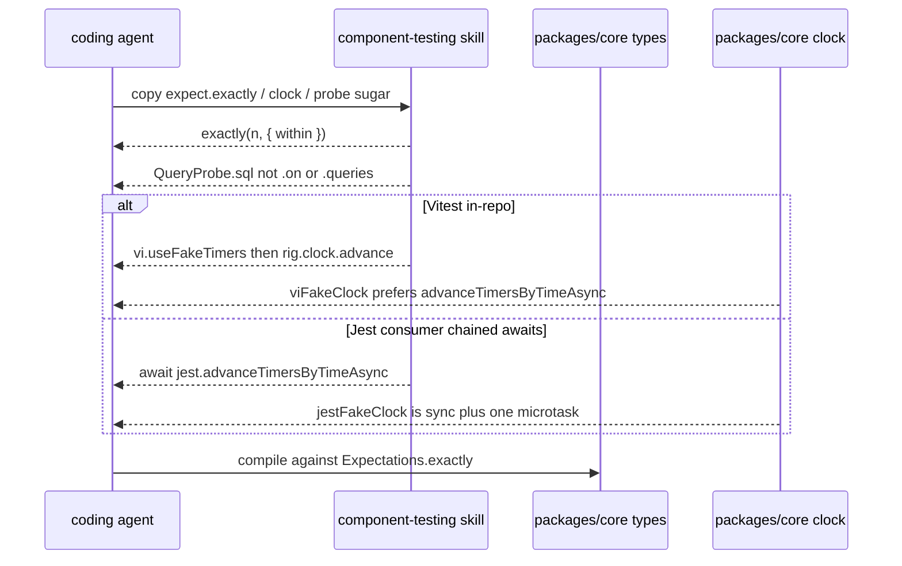

# RD-24169 component-testing 2.x API

Applies to: docs/internal/spec/harness-prose.md
Ticket: RD-24169

No published-package public surface changes. Not a semver event.

The canonical skill `.cursor/skills/component-testing/SKILL.md` (P06) still
teaches `createRig` and Vitest in-repo recipes, but it currently compiles
wrong (`expect.exactly(3)` omits required `within`), tells every runner that
`rig.clock.advance` flushes microtask continuations (true only for
`viFakeClock`), and never teaches several live 2.x names that consumers
therefore invent or miss. This delta corrects that card against
`packages/*/src`. `.claude/skills` stays a generated byte-identical copy
(`harness-scaffold.md`); do not hand-edit it.

## ADDED Requirements

### Requirement: component-testing cardinality exactly and none require within
`.cursor/skills/component-testing/SKILL.md` SHALL show `Expectations.exactly`
and `Expectations.none` with a `within` option on every call, matching
`packages/core/src/types.ts` (`RequiredWithinOptions`). It SHALL state the
arity asymmetry: `atLeast(n, options?)` MAY omit `within`; `exactly` and
`none` SHALL NOT.

It SHALL NOT contain a TypeScript call of the form `expect.exactly(<number>)`
or `expect.none()` with no second-argument options object.

#### Scenario: every exactly call supplies within
- **WHEN** fenced `typescript` or `ts` blocks in
  `.cursor/skills/component-testing/SKILL.md` are scanned for
  `expect.exactly(`
- **THEN** every such call includes a `within` option in the same call, and
  at least one call is of the shape `expect.exactly(3, { within: … })`

#### Scenario: skill states the within asymmetry
- **WHEN** `.cursor/skills/component-testing/SKILL.md` is read
- **THEN** it contains `atLeast`, `exactly`, `none`, and `within`, and it
  states that `exactly` and `none` require `within` while `atLeast` may omit
  it

### Requirement: component-testing teaches the missing 2.x probe surface
`.cursor/skills/component-testing/SKILL.md` SHALL teach these live names from
`packages/*/src`. Each SHALL appear in a fenced `typescript` or `ts` block,
not only in prose:

- `observation(` wrapping a selection passed to `rig.expect.sequence`,
  imported from `@hochgi/test-kit`
- `rig.expect.allOf(`
- `drain(`, `drainAndReject(`, and `drainAndForward(`
- `expect.calledTimes(`, `expect.neverCalled(`, and `expect.called(`
- `QueryProbe` sugar `sql(` with three matchers: a string, a `RegExp`, and a
  predicate. Prose SHALL state that a string matches by exact equality, a
  `RegExp` via `.test()`, and a function as a predicate on the SQL text
- `clearRules(`, `clearCalls(`, `resetProbe(`, and `rig.reset(` with
  `keepRules`
- `createRig({` options named `clock`, `defaultTimeout`, and
  `safetyTimeout`

The skill SHALL NOT present `probe.queries`, `QueryProbe.queries`, or
`db.probe.queries` as a member. That name has never existed
(`docs-truth.md`; `QueryProbe` in `packages/sql/src/types.ts` is `sql` plus
inherited `filter` / `calls`).

`.on()` is not universal. The skill SHALL state that `MethodProbe` and
`BullQueueProbe` have `.on(method)`, that `QueryProbe` does not have `.on`,
and that `QueryProbe` uses `.sql(...)` instead. It SHALL state that both
inherit `filter()`.

#### Scenario: observation is demonstrated in sequence
- **WHEN** fenced `typescript` or `ts` blocks in
  `.cursor/skills/component-testing/SKILL.md` are read
- **THEN** at least one block contains `observation(` and
  `rig.expect.sequence`, and the file contains `from '@hochgi/test-kit'`
  together with `observation`

#### Scenario: allOf is demonstrated
- **WHEN** fenced `typescript` or `ts` blocks in
  `.cursor/skills/component-testing/SKILL.md` are read
- **THEN** at least one block contains `rig.expect.allOf(`

#### Scenario: drain family is demonstrated
- **WHEN** fenced `typescript` or `ts` blocks in
  `.cursor/skills/component-testing/SKILL.md` are read
- **THEN** they jointly contain `drain(`, `drainAndReject(`, and
  `drainAndForward(`

#### Scenario: synchronous assertions are demonstrated
- **WHEN** fenced `typescript` or `ts` blocks in
  `.cursor/skills/component-testing/SKILL.md` are read
- **THEN** they jointly contain `expect.calledTimes(`, `expect.neverCalled(`,
  and `expect.called(`

#### Scenario: QueryProbe.sql matchers are taught and queries is absent
- **WHEN** `.cursor/skills/component-testing/SKILL.md` is read
- **THEN** a fenced `typescript` or `ts` block contains `sql(`, the file
  shows a string matcher, a `RegExp` matcher, and a function matcher for
  `sql`, and the file does not contain `probe.queries`, `QueryProbe.queries`,
  or `db.probe.queries`

#### Scenario: probe admin and rig.reset keepRules are taught
- **WHEN** `.cursor/skills/component-testing/SKILL.md` is read
- **THEN** it contains `clearRules(`, `clearCalls(`, `resetProbe(`, and
  `rig.reset(`, and it contains `keepRules`

#### Scenario: CreateRigOptions keys are named
- **WHEN** `.cursor/skills/component-testing/SKILL.md` is read
- **THEN** it contains `clock`, `defaultTimeout`, and `safetyTimeout` as
  `createRig` option names

#### Scenario: on is not taught as universal
- **WHEN** `.cursor/skills/component-testing/SKILL.md` is read
- **THEN** it contains `MethodProbe`, `BullQueueProbe`, `QueryProbe`,
  `.sql(`, and `filter()`, and it states that `QueryProbe` has no `.on`

### Requirement: harness-prose TypeScript fence scan includes CommonMark indent
The harness-prose gate that extracts fenced `typescript` / `ts` blocks from
`.cursor/skills/component-testing/SKILL.md` SHALL treat an opening fence with
0–3 leading spaces as a fence, and a closing fence with 0–3 leading spaces
as its close (CommonMark). A snippet whose only such fence is indented, uses
the identifier `rig`, and does not declare `rig` in that block SHALL fail the
same declaration check applied to the live skill.

This packet does not compile markdown fences with `tsc`. Declaration in the
same fence, plus the `exactly`/`within` scan above, are the observable
boundaries.

#### Scenario: indented typescript fences are extracted
- **WHEN** a markdown string contains a `typescript` fence whose opening
  line has 1, 2, or 3 leading spaces
- **THEN** that fence's body is included in the extracted block list

#### Scenario: an indented fence without a local rig declaration fails
- **WHEN** a markdown string whose only `typescript` fence is indented by 1–3
  spaces uses identifier `rig` and does not declare `rig` in that block
- **THEN** the rig-declaration check used for
  `.cursor/skills/component-testing/SKILL.md` fails for that snippet

## MODIFIED Requirements

### Requirement: component-testing teaches this repo's current API in Vitest
(from `docs/internal/spec/harness-prose.md`)

`.cursor/skills/component-testing/SKILL.md` SHALL be written for this
repository (test-kit is the artifact under development) **and** SHALL be the
canonical 2.x API card that consumers copy. It SHALL name `createRig` as the
lifecycle-owner factory and SHALL NOT name `createHarness`. It SHALL show a
factory call that injects the rig under the option key `harness` (for
example `harness: rig`). It SHALL close the lifecycle owner with
`rig.close()`. In-repo timer examples SHALL use `vi.useFakeTimers`. The
skill SHALL NOT pin the library at `v1.0.0`.

The skill SHALL state the two fake clocks separately, matching
`packages/core/src/clock.ts`:

- `viFakeClock().advance` prefers `vi.advanceTimersByTimeAsync`
- `jestFakeClock().advance` calls synchronous `jest.advanceTimersByTime` and
  then awaits a single `Promise.resolve()` (one microtask tick)

It SHALL tell Jest consumers whose SUT chains `await`s between timers to
use `await jest.advanceTimersByTimeAsync(ms)` rather than treating
`rig.clock.advance` as a drain of those continuations. It SHALL NOT claim
that `rig.clock.advance` and `jest.advanceTimersByTimeAsync` are
interchangeable. It SHALL NOT claim, as a universal rule covering Jest, that
`rig.clock.advance` makes microtask continuations flush between timer ticks.

In-repo recipes SHALL still drive the SUT with `rig.clock.advance` under
`vi.useFakeTimers`.

Every fenced `typescript` or `ts` code block in that file that uses the
identifier `rig` SHALL declare `rig` in the same block: a `const rig` or
`let rig` binding, or a destructuring binding that includes `rig`. That scan
SHALL include CommonMark-indented fences (0–3 leading spaces), not only
column-zero fences.

This packet does not compile markdown fences with `tsc`. Declaration in the
same fence is the observable boundary for undeclared `rig`.

#### Scenario: component-testing names createRig not createHarness
- **WHEN** `.cursor/skills/component-testing/SKILL.md` is read
- **THEN** it contains `createRig` and does not contain `createHarness`

#### Scenario: component-testing keeps the harness option key
- **WHEN** `.cursor/skills/component-testing/SKILL.md` is read
- **THEN** it contains a factory options example that includes
  `harness:` as a property name next to a `rig` value

#### Scenario: component-testing uses Vitest fake timers in-repo and names Jest drain
- **WHEN** `.cursor/skills/component-testing/SKILL.md` is read
- **THEN** it contains `vi.useFakeTimers` and contains
  `jest.advanceTimersByTimeAsync`

#### Scenario: component-testing is not pinned to v1.0.0
- **WHEN** `.cursor/skills/component-testing/SKILL.md` is read
- **THEN** it does not contain the string `v1.0.0`

#### Scenario: Jest and Vitest clocks are not presented as interchangeable
- **WHEN** `.cursor/skills/component-testing/SKILL.md` is read
- **THEN** it states that `jestFakeClock` uses synchronous
  `advanceTimersByTime` plus one `Promise.resolve`, that `viFakeClock`
  prefers `advanceTimersByTimeAsync`, and it tells Jest consumers to use
  `await jest.advanceTimersByTimeAsync` when continuations must drain

#### Scenario: component-testing TypeScript fences declare rig before using it
- **WHEN** each fenced `typescript` or `ts` code block in
  `.cursor/skills/component-testing/SKILL.md` is read, including fences
  whose opening line has 0–3 leading spaces
- **THEN** every block that contains the identifier `rig` also contains
  a `const rig`, `let rig`, or destructuring binding that includes
  `rig` in that same block

## REMOVED Requirements

n/a

The previous SHALL NOT on `jest.advanceTimersByTimeAsync` in this
requirement is dropped (replaced by the Jest-consumer drain requirement
above). No requirement heading is deleted.

## Flow

## Decisions (rung recorded)

| Decision | Outcome | Rung |
| --- | --- | --- |
| Apply the delta to `harness-prose.md`, not a new capability file | The skill is already a harness-prose requirement; this ticket corrects that card | Source (`harness-prose.md`) + ticket |
| `exactly` / `none` require `within`; `atLeast` may omit it | Matches `Expectations` in `packages/core/src/types.ts` | Source |
| Jest vs Vitest clock drain is stated separately; in-repo recipes stay Vitest | `jestFakeClock` is sync `advanceTimersByTime` + one `Promise.resolve`; `viFakeClock` prefers `advanceTimersByTimeAsync`. Ticket: Jest consumers drain with `await jest.advanceTimersByTimeAsync(ms)` | Source (`packages/core/src/clock.ts`) + ticket |
| Drop the P06 SHALL NOT on `jest.advanceTimersByTimeAsync` | That ban hid the consumer drain path this ticket requires | Ticket (overrides P06) |
| Keep `createRig`, `harness:` option key, `rig.close()`, no `v1.0.0`, no `createHarness` | Still true; not a reason to rewrite the rest of the skill | Source (existing requirement) |
| Teach `observation`, `allOf`, drain family, sync assertions, `sql`, admin reset, `CreateRigOptions` | Ticket named each as absent from the canonical skill | Ticket + source (`rig.ts`, `types.ts`, `sql/src/types.ts`) |
| `.on()` is not universal: MethodProbe and BullQueueProbe have it; QueryProbe has `sql` and `filter` | Ticket. Do not catalog Redis/S3 sugars here | Ticket + source (`mock/src/types.ts`, `bull/src/types.ts`, `sql/src/types.ts`) |
| Ban `probe.queries` / `QueryProbe.queries` / `db.probe.queries` in the skill | That member has never existed; two consumers invented it | Ticket + source (`docs-truth.md`, `packages/sql/src/types.ts`) |
| Broaden the TypeScript fence extractor to CommonMark 0–3 leading spaces | Rider on this ticket from the RD-24164 fold review | Ticket comment |
| Do not compile markdown fences with `tsc` | Ticket said compiling "may" subsume the indent gate. Fragments are not a program. String scan for `exactly`/`within` plus declaration-presence is the BSSN gate | Ticket ("may") + source (existing harness-prose gate) |
| Canonical path remains `.cursor/skills/component-testing/SKILL.md` | Skills fan out Cursor → Claude; do not hand-edit `.claude/skills` | Source (`harness-scaffold.md`) |
| No public API / version bump | Harness markdown and repo tests only | Source |
| Do not rewrite `docs/concepts.md` Clock wording in this packet | Ticket scoped the skill. concepts.md still prefers `rig.clock.advance` as uniform across runners — a documented discrepancy, not this packet's surface | Ticket (Done when) |

## Out of scope (deferred)

| Item | Consequence of deferring |
| --- | --- |
| Compiling skill TypeScript fences with `tsc` | An `exactly` arity error is caught by the string scan, not by the compiler. Fragments can still be ill-typed in other ways |
| Rewriting `docs/concepts.md` Clock / `rig.clock.advance` guidance | Published concepts still present `rig.clock.advance` as the uniform driver; Jest consumers who read concepts.md (not the skill) can still hit the one-microtask drain |
| Teaching CacheProbe / S3 `command()` sugars | Readers of redis/s3 still learn those from package READMEs |
| Changing `jestFakeClock` to call `advanceTimersByTimeAsync` | Would be a published behavioural change and a semver event. Ticket asked the skill to describe current clocks |
| Mutation testing / CRAP (RD-24153) | Phase 5 still cannot tell whether green means anything |
| Adding `check-agent-skills` to `npm run check` | Unchanged |

## Acceptance mapping

1. Every fenced `expect.exactly(` in the canonical skill includes `within`; at least one call is `expect.exactly(3, { within: … })`; the skill states that `exactly` and `none` require `within` and `atLeast` may omit it.
2. The skill demonstrates `observation(` inside `rig.expect.sequence`, `rig.expect.allOf(`, `drain(` / `drainAndReject(` / `drainAndForward(`, and `expect.calledTimes(` / `expect.neverCalled(` / `expect.called(`.
3. The skill teaches `sql(` with string, `RegExp`, and predicate matchers, and does not document `probe.queries` / `QueryProbe.queries` / `db.probe.queries`.
4. The skill names `clearRules`, `clearCalls`, `resetProbe`, `rig.reset` with `keepRules`, and `createRig` options `clock`, `defaultTimeout`, `safetyTimeout`.
5. The skill states that `MethodProbe` and `BullQueueProbe` have `.on(method)`, `QueryProbe` does not, and both inherit `filter()`.
6. In-repo recipes still use `vi.useFakeTimers` and `createRig` (not `createHarness`), keep `harness: rig`, close with `rig.close()`, and do not pin `v1.0.0`.
7. The skill states the two clocks separately and tells Jest consumers to `await jest.advanceTimersByTimeAsync` when continuations must drain; it does not treat that as interchangeable with `rig.clock.advance`.
8. The harness-prose TypeScript fence extractor includes fences indented 0–3 spaces; an indented fence that uses `rig` without declaring it fails the declaration check; the live skill's fences (including indented ones) still declare `rig` before use.
9. Tests for these scenarios run under root `npm test` in the existing `test/harness-prose` project and stay on the root `format:check` glob.
