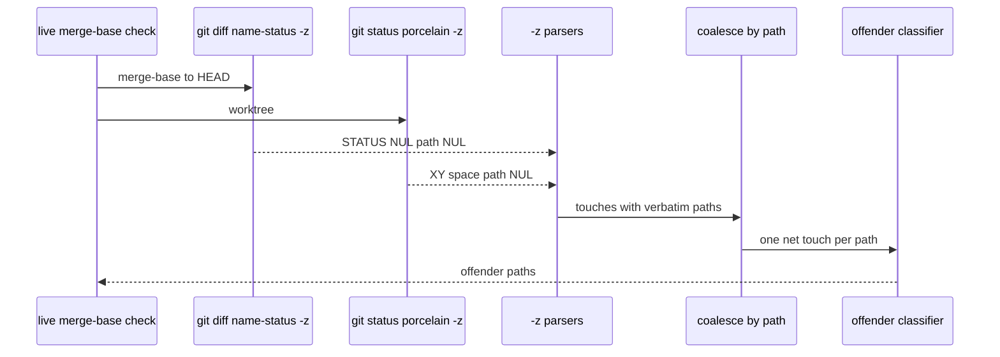

# RD-24162 harden the rig-rename do-not-touch guard

Applies to: docs/internal/spec/core-public-api.md
Ticket: RD-24162

No published-package public surface changes. Not a semver event.

The layout guard in `packages/core/test/unit/rig-rename-layout.test.ts`
enforces "the agent-sense zone is untouched by library renames". Two
review findings on that guard were verified during the RD-24143/RD-24144
fold (PR #51) and deferred. Neither touches shipped library code; both
live in the guard's git-parsing helper. This delta hardens that helper.

## ADDED Requirements

### Requirement: Do-not-touch classifier coalesces touches by path
The do-not-touch classifier SHALL collapse multiple touches that share a
path into one net classification before it decides whether that path
offends. A path SHALL be classified as an **addition** when any of those
touches is an addition. A path SHALL be classified as a **non-addition**
only when every touch for that path is a non-addition.

Net-addition is what lets an append-only archive path that was added on
the branch and then edited in the worktree pass the guard: the net
base-to-working-tree state is still "added". A modification or deletion
of an archive path that already existed at the merge-base remains a
non-addition and SHALL still offend.

This SHALL hold for the synthetic classifier the unit tests drive and
for the live merge-base check that concatenates the committed
`diff --name-status` list with the worktree `status --porcelain` list.

#### Scenario: a committed archive addition with unstaged edits is still an addition
- **WHEN** the classifier is given two touches for the same
  `docs/internal/archive/` path, one an addition and one a non-addition
- **THEN** that path does not appear in the offender list

#### Scenario: repeated non-additions of an archive path still offend
- **WHEN** the classifier is given two non-addition touches for the same
  `docs/internal/archive/` path
- **THEN** that path appears in the offender list

### Requirement: Do-not-touch parsers keep NUL-delimited paths verbatim
The `-z` parsers SHALL pass each git-provided path through unchanged,
except that they SHALL drop empty fields (the trailing NUL on git `-z`
output). They SHALL NOT trim whitespace from a path and SHALL NOT strip
a quote character from either end of a path. NUL-delimited git output
never quotes or escapes paths, so those transforms can only corrupt a
legitimate filename.

#### Scenario: a -z path with leading or trailing whitespace is kept
- **WHEN** a porcelain `-z` record or a diff `-z` record carries a path
  that begins or ends with a space
- **THEN** the parsed touch's path equals that git-provided path,
  including the space

#### Scenario: a -z path with boundary quotes is kept
- **WHEN** a porcelain `-z` record or a diff `-z` record carries a path
  that begins and ends with a `"` character
- **THEN** the parsed touch's path equals that git-provided path,
  including both quotes

## MODIFIED Requirements

n/a

## REMOVED Requirements

n/a

## Flow

## Decisions (rung recorded)

| Decision | Outcome | Rung |
| --- | --- | --- |
| Where does this live? | Added requirements on `core-public-api.md`, the home of the do-not-touch scenario the guard enforces. Helpers stay in the one existing test file. | Explicitly requested — RD-24162: "Both fixes are small and confined to one test file." |
| Mixed addition + non-addition for one path | Net addition (`any` touch is an addition). That is the observed PR #51 false failure: committed `A` plus unstaged ` M`. | Explicitly requested — RD-24162: "coalesce touches by path and classify on the net base-to-working-tree state." |
| Porcelain `AM` as a single status | Unchanged. `AM` is already one addition (`status.startsWith('A')`). This delta covers the two-record case the single-status test does not. | Source — `packages/core/test/unit/rig-rename-layout.test.ts` "an archive addition is allowed, even with further unstaged edits (`AM`)". |
| Strip / trim on `-z` paths | Remove. Keep only the empty-field drop. | Explicitly requested — RD-24162 finding 2. |
| Semver | Not a semver event. No exported name, type, or runtime behaviour of `@vnatures/test-kit` changes. | Source — shipped code is untouched. |
| MR/MC porcelain records | No change. | Explicitly requested — RD-24162: rejected in the same review round; not valid porcelain v1 combinations, and git 2.50.1 does no worktree rename detection in status. |

## Out of scope (deferred)

| Item | Consequence of deferring |
| --- | --- |
| Deletion of a merge-base archive path followed by an untracked recreate at the same path (`D` + `??`) | Net-addition coalescing treats that pair as an addition, so a rewrite of an existing archive file via delete-and-recreate would not offend. The `Touch` record cannot distinguish "existed at merge-base" from "added on this branch" without a third git query. RD-24162's observed defect is a false gate failure, not this missed leak. |
| Extracting the parsers into `packages/core/src` | The guard stays a test-only helper. No production module grows a git porcelain dependency. |
| Mutation testing / CRAP (RD-24153) | Phase 5 can show the gate is green but not that green *means* anything. |

## Acceptance mapping

1. Two touches for one `docs/internal/archive/` path, `{added: true}` then
   `{added: false}`, produce an empty offender list.
2. Two `{added: false}` touches for one `docs/internal/archive/` path
   produce that path in the offender list.
3. A porcelain `-z` path with a leading or trailing space, and a diff `-z`
   path with a leading or trailing space, parse as that exact string.
4. A porcelain `-z` path wrapped in `"…"` and a diff `-z` path wrapped in
   `"…"` parse as that exact string, quotes included.
5. Existing guard classification (rename/copy, `AM`, `??`, archive
   modification, non-archive addition, unprotected paths, `" -> "` in a
   filename) is unchanged.
6. `npm run check` is clean. No published package README or
   `docs/api-surface.md` change is required.
