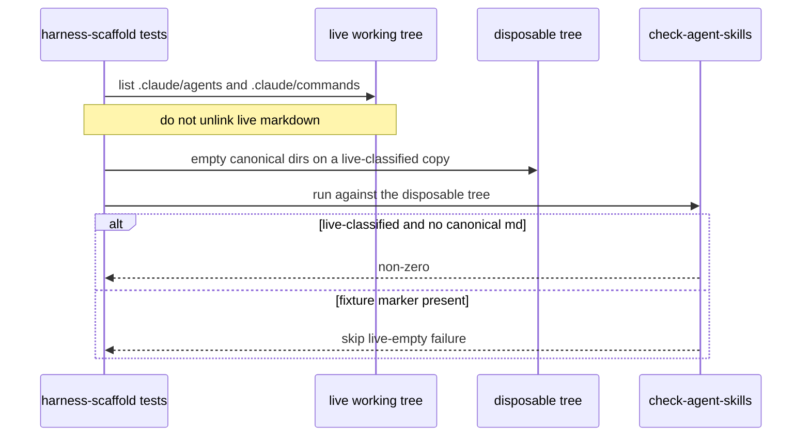
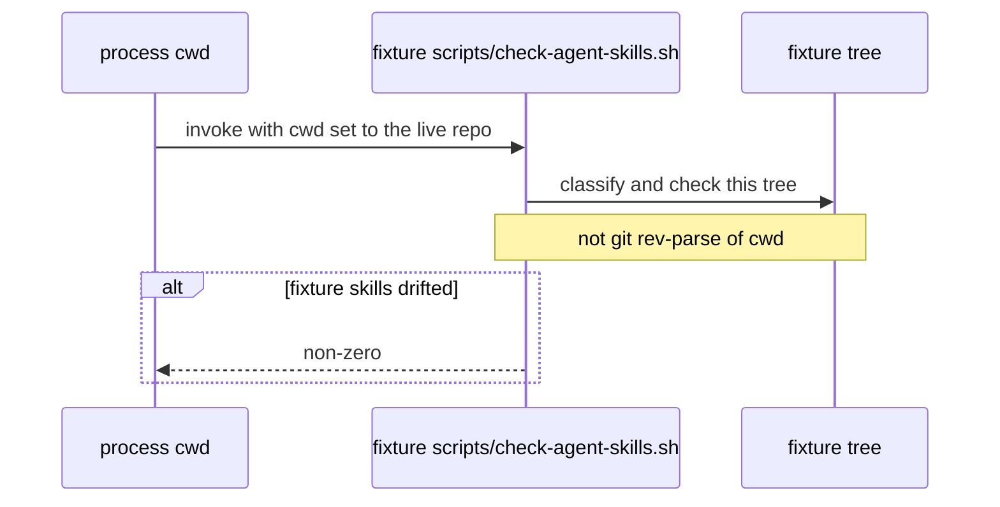

# RD-24173 live-tree harness isolation

Applies to: docs/internal/spec/harness-scaffold.md
Ticket: RD-24173

No published-package public surface changes. Not a semver event.

Parked from the RD-24164 fold review (PR #57). Both findings are already
true of `scripts/agent-sync-lib.sh`, `scripts/check-agent-skills.sh`,
`test/harness-scaffold/harness-scaffold.test.ts`, and `vitest.workspace.ts`.
This delta closes them. It does not serialize Vitest projects, add git
hooks, or put `check-agent-skills` on the five-step `npm run check` chain.

## ADDED Requirements

### Requirement: Harness-scaffold tests do not empty live Claude canonical dirs
`test/harness-scaffold/harness-scaffold.test.ts` SHALL NOT delete `*.md`
under the live working tree's `.claude/agents` or `.claude/commands`.
Empty-canonical failure of a live-classified tree SHALL be exercised on
a disposable tree.

Sibling Vitest projects (`test/harness-prose`, `test/ci-gate`,
`test/docs-truth`) MAY list those live directories while harness-scaffold
tests run. This packet SHALL NOT add `fileParallelism: false` or a
`sequence` config to `vitest.workspace.ts`.

#### Scenario: empty-canonical coverage does not unlink live agents markdown
- **WHEN** `test/harness-scaffold/harness-scaffold.test.ts` is read
- **THEN** it does not pass `path.join(repoRoot, '.claude/agents')` to
  `emptyMarkdownDir`

#### Scenario: empty-canonical coverage does not unlink live commands markdown
- **WHEN** `test/harness-scaffold/harness-scaffold.test.ts` is read
- **THEN** it does not pass `path.join(repoRoot, '.claude/commands')` to
  `emptyMarkdownDir`

### Requirement: Live vs fixture classification is an explicit marker on the tree under check
`check-agent-skills` SHALL classify and check the tree that contains the
invoked `scripts/check-agent-skills.sh`. It SHALL NOT treat
`git rev-parse --show-toplevel` of the process working directory as that
tree when the git root is a different directory.

A tree SHALL be a **fixture** when it contains the file `.harness/fixture`.
The live working tree SHALL NOT contain `.harness/fixture`. A tree
without that file SHALL be **live-classified**.

Presence of `packages/core/package.json` SHALL NOT by itself classify a
tree as live. Absence of `packages/core/package.json` SHALL NOT by itself
classify a tree as a fixture.

On a fixture tree, `check-agent-skills` SHALL NOT fail solely because
`.claude/agents` or `.claude/commands` have no `*.md`. On a
live-classified tree it SHALL exit non-zero when either of those
directories has no `*.md`.

#### Scenario: a fixture containing packages/core/package.json is still a fixture
- **WHEN** a fixture tree contains `.harness/fixture` and
  `packages/core/package.json`, its `.claude/agents` and
  `.claude/commands` have no `*.md`, skills are in sync, the manifest is
  valid, and `opencode.json` agrees with the manifest, and
  `check-agent-skills` is run against that tree
- **THEN** the process exits 0

#### Scenario: a live-classified tree without packages/core/package.json is still live
- **WHEN** a disposable live-classified tree has no
  `packages/core/package.json`, its `.claude/agents` has no `*.md`, and
  `check-agent-skills` is run against that tree
- **THEN** the process exits non-zero

#### Scenario: check-agent-skills checks the invoked script's tree, not cwd's git root
- **WHEN** a fixture tree's `.cursor/skills` and `.claude/skills` differ
  and that tree's `scripts/check-agent-skills.sh` is invoked with cwd set
  to the live repository working tree
- **THEN** the process exits non-zero

## MODIFIED Requirements

### Requirement: Empty Claude canonical dirs do not destroy Cursor bootstrap
`.claude/agents` and `.claude/commands` MAY contain no `*.md` in a
fixture or a partial clone. In that case `sync-agent-skills` SHALL NOT
delete or replace existing `*.md` under `.cursor/agents` or
`.cursor/commands`.

On a fixture tree (one that contains `.harness/fixture`),
`check-agent-skills` SHALL NOT fail solely because those Cursor trees
contain files the empty Claude trees would not generate.

On a live-classified tree (one that does not contain `.harness/fixture`),
`check-agent-skills` SHALL exit non-zero when `.claude/agents` has no
`*.md`, and SHALL exit non-zero when `.claude/commands` has no `*.md`.
The live skip that treated an empty canonical dir like a fixture is
closed.

The live repository's canonical Claude agent and command trees SHALL
contain the files required by harness-prose, so on a consistent live
tree `check-agent-skills` SHALL compare generated agent and command
mirrors rather than skip that comparison.

#### Scenario: empty claude agents leave cursor agents in place
- **WHEN** `.claude/agents` has no `*.md` and `.cursor/agents` already
  has `*.md` and `sync-agent-skills` is run
- **THEN** every `*.md` that was in `.cursor/agents` beforehand is
  still present with the same bytes

#### Scenario: empty claude commands leave cursor commands in place
- **WHEN** `.claude/commands` has no `*.md` and `.cursor/commands`
  already has `*.md` and `sync-agent-skills` is run
- **THEN** every `*.md` that was in `.cursor/commands` beforehand is
  still present with the same bytes

#### Scenario: check passes with empty claude agents and commands
- **WHEN** a fixture tree's `.claude/agents` and `.claude/commands`
  have no `*.md`, skills are in sync, the manifest is valid, and
  `opencode.json` agrees with the manifest
- **THEN** `npm run check-agent-skills` exits 0

#### Scenario: live canonical Claude trees are populated
- **WHEN** the repository's `.claude/agents` and `.claude/commands`
  are listed
- **THEN** `.claude/agents` contains at least one `*.md` and
  `.claude/commands` contains at least one `*.md`

#### Scenario: empty canonical agents on a live-classified tree fail the check
- **WHEN** a live-classified tree's `.claude/agents` has no `*.md` and
  `check-agent-skills` is run against that tree
- **THEN** the process exits non-zero

#### Scenario: empty canonical commands on a live-classified tree fail the check
- **WHEN** a live-classified tree's `.claude/commands` has no `*.md` and
  `check-agent-skills` is run against that tree
- **THEN** the process exits non-zero

## REMOVED Requirements

n/a

## Flow

## Decisions (rung recorded)

| Decision | Outcome | Rung |
| --- | --- | --- |
| Stop wiping live `.claude` dirs rather than serialize Vitest projects | The race is the wipe. `createTempHarnessRepo` already builds disposable trees. `vitest.workspace.ts` stays parallel | Ticket (options) + source (`createTempHarnessRepo`, workspace has no `fileParallelism` / `sequence`) + BSSN |
| Empty-canonical failure runs on a live-classified disposable tree | The live checkout is still asserted populated and still used for the consistent-tree check | Ticket ("the live-tree assertion is the part that genuinely needs the real tree") + source |
| Explicit fixture marker `.harness/fixture`; absence is live (fail-closed) | Sparse live checkout without `packages/core/package.json` still fails empty canonical dirs; a fixture that happens to contain that file is still a fixture | Ticket (explicit marker, both boundaries) + source (`is_live_monorepo` today is only that one file) |
| Classify and resolve the manifest from the tree that owns the invoked script, not cwd's git toplevel | A fixture invoked with cwd inside the live repo is judged as that fixture | Ticket (finding 2b) + source (`is_live_monorepo` and `HARNESS_MANIFEST` both call `git rev-parse --show-toplevel`) |
| Keep the source-level `emptyMarkdownDir` guard as the race test | Wipe-and-restore in `finally` would still pass a post-test snapshot of the live dirs | Source (current tests restore in `finally`) |
| No public API / version bump | Root `package.json` is private; no package `src/` change | Source |

## Out of scope (deferred)

| Item | Consequence of deferring |
| --- | --- |
| `fileParallelism: false` / Vitest `sequence` for harness projects | Unnecessary once live dirs are not wiped; a later suite that mutates live harness files would reintroduce a race |
| Adding `check-agent-skills` to `npm run check` | Unchanged: harness-scaffold tests still invoke the script under `npm test` |
| gitignore for `.harness/fixture` | Accidental creation on the live tree would classify it as a fixture until removed; the live-populated and live-classified scenarios still fail closed if someone adds it and empties canonical dirs only on a disposable tree |
| husky / lefthook / mutation testing / CRAP (RD-24153) | Unchanged |

## Acceptance mapping

1. `test/harness-scaffold/harness-scaffold.test.ts` does not pass the live working tree `.claude/agents` or `.claude/commands` to `emptyMarkdownDir`.
2. Empty `.claude/agents` on a live-classified disposable tree fails `check-agent-skills`; empty `.claude/commands` on a live-classified disposable tree fails it.
3. The live working tree's `.claude/agents` and `.claude/commands` still contain `*.md` (read-only populated assertion).
4. A fixture with `.harness/fixture` and `packages/core/package.json` and empty Claude canonical dirs still passes `check-agent-skills`.
5. A live-classified disposable tree without `packages/core/package.json` and with empty `.claude/agents` fails `check-agent-skills`.
6. Invoking a fixture's `scripts/check-agent-skills.sh` with cwd in the live repo against drifted fixture skills exits non-zero (the live tree is not the tree under check).
7. Existing fixture empty-Claude, empty-canonical-leave-cursor, populated-live, and workspace/format-path scenarios stay intact.
8. `vitest.workspace.ts` is not given `fileParallelism: false` or a `sequence` config by this packet.
