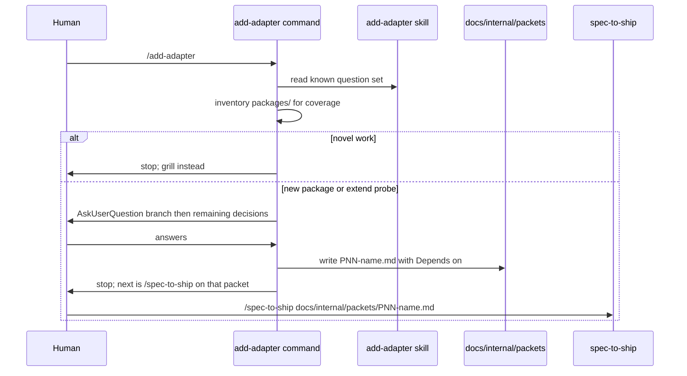

# P08 phase-0 steering command + add-adapter skill

Applies to: docs/internal/spec/harness-prose.md
Ticket: RD-24149

No published-package public surface changes. Not a semver event.

`/spec-to-ship` starts in the middle: it is handed a packet and runs. This
delta owns the missing step 0 for the work this repo does most — adding
an adapter or probe. One command asks a known question set and writes a
**packet**. The spec (phase 1) still owns behaviour. Grilling stays the
fallback for novel work.

The donor skill in cycle-processing is inverted, not copied. Canonical
names in this repo are the command and skill `add-adapter`. The donor
directories `extend-test-kit` and `add-module` stay absent.

## ADDED Requirements

### Requirement: Canonical add-adapter command exists
`.claude/commands/` SHALL contain `add-adapter.md`. That file is the
single phase-0 command for both "new `packages/<domain>/`" and "extend
an existing probe's surface". `.claude/commands/` SHALL NOT contain a
second command file that splits those branches (`extend-probe.md`,
`new-package.md`, or `extend-test-kit.md`).

The command SHALL tell the orchestrator to read the `add-adapter` skill
before asking questions. Its first question SHALL be the branch: new
`packages/<domain>/` versus extend an existing probe's surface.

The command SHALL ask the human the decision questions (via
`AskUserQuestion` in the canonical Claude file). It SHALL look up facts
itself (`packages/` coverage, `SqlDriver`, existing factory names,
whether `testcontainers` is already a dependency) and SHALL NOT ask the
human for those facts.

The command SHALL write one file under `docs/internal/packets/` whose
name matches `PNN-*.md` and whose body includes a `Depends on:` header.
It SHALL NOT write a spec delta under `docs/internal/spec/`. It SHALL
NOT run `/spec-to-ship`. After writing the packet it SHALL stop and name
`/spec-to-ship` with that packet path as the next step.

When the work is neither a new domain package nor an extension of an
existing probe, the command SHALL stop without writing a packet and SHALL
leave grilling as the fallback.

The command runs in the main thread. It SHALL NOT add a sixth pipeline
agent.

#### Scenario: add-adapter command is canonical under Claude
- **WHEN** `.claude/commands/` is listed
- **THEN** it contains `add-adapter.md` and does not contain
  `extend-probe.md`, `new-package.md`, or `extend-test-kit.md`

#### Scenario: command reads the skill and branches first
- **WHEN** `.claude/commands/add-adapter.md` is read
- **THEN** it contains `add-adapter` as the skill to read, contains
  `AskUserQuestion`, and asks whether the work is a new
  `packages/<domain>/` or an extension of an existing probe

#### Scenario: command writes a packet and does not run spec-to-ship
- **WHEN** `.claude/commands/add-adapter.md` is read
- **THEN** it tells the orchestrator to write under
  `docs/internal/packets/`, contains `Depends on:`, does not tell it to
  write under `docs/internal/spec/deltas/`, and does not tell it to run
  `/spec-to-ship` as part of this command

#### Scenario: novel work falls back to grilling
- **WHEN** `.claude/commands/add-adapter.md` is read
- **THEN** it says to stop without writing a packet when the work is
  not a new domain package and not an extension of an existing probe,
  and it names grilling as the fallback

### Requirement: add-adapter skill is the in-repo extender contract
`.cursor/skills/add-adapter/SKILL.md` SHALL exist. It is the in-repo
authoring guide that cycle-processing's `extend-test-kit` lacked: the
seven-step walkthrough from `docs/architecture.md` ("Adding a New Domain
Package: Walkthrough") plus `examples/grpc-client` as the extender
contract guard.

The skill SHALL tell the agent to inventory current coverage from
`packages/` rather than from a hardcoded missing list. It SHALL contain
`npm` and `workspaces`. It SHALL NOT contain `pnpm workspaces`,
`pnpm link`, `Missing (author these)`, or
`/Users/giladhoch/dev/test-kit`.

The skill SHALL name these decision topics so the command can ask them
without rediscovering the tree:

- Goldilocks boundary as too thin / too fat / just right, and that the
  Goldilocks ruling and its justification live in the **packet**
- call shapes `{method, args}`, `{sql, parameters}`, and
  `{commandName, command, input}`
- adapter categories programmable mock, backed, hybrid, and function
  boundary
- backing choices, including that PGlite is Postgres-only, and that
  `testcontainers` and `@testcontainers/mysql` are already dependencies
- `ProbedResource` `reset` / `close` when the adapter owns resources
- default-forward (`probe.always().forward()`) versus park
- filter sugars as strictly optional (Design Rule 13)
- SQL family via the `SqlDriver` seam in `packages/sql`, versus
  standalone
- factory naming `createProbed` and package naming
  `@vnatures/test-kit-`

The skill SHALL include a packet skeleton for `docs/internal/packets/PNN-*.md`
that contains `Depends on:`, a Goldilocks ruling, adapter category,
backing, what is explicitly out, and a size estimate against a ~40-test
split.

The skill SHALL state that its output is a packet (scope and shape), not
a spec (behaviour).

#### Scenario: add-adapter skill exists under the Cursor canonical tree
- **WHEN** `.cursor/skills/add-adapter/` is listed
- **THEN** it contains `SKILL.md`

#### Scenario: skill is not the stale consumer copy
- **WHEN** `.cursor/skills/add-adapter/SKILL.md` is read
- **THEN** it contains `npm` and `workspaces` and `packages/`, and it
  does not contain `pnpm workspaces`, `pnpm link`,
  `Missing (author these)`, or `/Users/giladhoch/dev/test-kit`

#### Scenario: skill teaches the seven-step walkthrough and contract guard
- **WHEN** `.cursor/skills/add-adapter/SKILL.md` is read
- **THEN** it contains `Adding a New Domain Package`, names call shape,
  pending call, probe, adapter, `ProbedResource`, `forward`, and
  factory, and contains `examples/grpc-client`

#### Scenario: skill names the known question set
- **WHEN** `.cursor/skills/add-adapter/SKILL.md` is read
- **THEN** it contains `too thin`, `too fat`, `just right`,
  `{method, args}`, `{sql, parameters}`, `{commandName, command, input}`,
  `programmable mock`, `hybrid`, `function-boundary` or
  `function boundary`, `PGlite`, `testcontainers`,
  `@testcontainers/mysql`, `ProbedResource`, `reset`, `close`,
  `probe.always().forward()`, `park`, `strictly optional`,
  `SqlDriver`, `createProbed`, and `@vnatures/test-kit-`

#### Scenario: skill packet skeleton owns scope not behaviour
- **WHEN** `.cursor/skills/add-adapter/SKILL.md` is read
- **THEN** it contains `docs/internal/packets/`, `Depends on:`,
  `Goldilocks`, `40`, and states that the packet owns scope and the spec
  owns behaviour

### Requirement: Generated command mirrors include add-adapter
After a successful `sync-agent-skills`, `.cursor/commands/` and
`.opencode/commands/` SHALL each contain `add-adapter.md`.

This packet SHALL NOT add `.opencode/agents/add-adapter.md` or a sixth
pipeline agent. The generated OpenCode command MAY keep the existing
translator `agent: spec-to-ship` binding (the primary orchestrator,
which already allows `question`).

#### Scenario: Cursor and OpenCode command mirrors include add-adapter
- **WHEN** `.cursor/commands/` and `.opencode/commands/` are listed after
  a consistent sync
- **THEN** each directory contains `add-adapter.md`

#### Scenario: no sixth OpenCode add-adapter agent
- **WHEN** `.opencode/agents/` is listed
- **THEN** it does not contain `add-adapter.md`

### Requirement: spec-to-ship names add-adapter as the adapter packet-shaping step
`.claude/commands/spec-to-ship.md` and
`.cursor/skills/spec-to-ship/SKILL.md` SHALL name `/add-adapter` as the
step that shapes an adapter or probe packet before the five phases.
They SHALL NOT fold the add-adapter question set into `/spec-to-ship`
itself.

#### Scenario: spec-to-ship command names add-adapter
- **WHEN** `.claude/commands/spec-to-ship.md` is read
- **THEN** it contains `add-adapter`

#### Scenario: spec-to-ship skill names add-adapter
- **WHEN** `.cursor/skills/spec-to-ship/SKILL.md` is read
- **THEN** it contains `add-adapter`

## MODIFIED Requirements

### Requirement: Generated agent mirrors carry readonly from the manifest
After a successful `sync-agent-skills`, `.cursor/agents/reviewer.md` and
`.cursor/agents/verifier.md` SHALL have YAML `readonly: true`;
`.cursor/agents/spec-author.md`, `.cursor/agents/test-author.md`, and
`.cursor/agents/coder.md` SHALL have `readonly: false`. The OpenCode
reviewer and verifier mirrors SHALL deny the edit permission.

`.opencode/agents/` SHALL contain the same five agent markdown filenames,
and `.opencode/commands/` SHALL contain `spec-to-ship.md` and
`add-adapter.md`.

#### Scenario: Cursor readonly flags match the manifest
- **WHEN** the five `.cursor/agents/<name>.md` files are parsed after a
  consistent sync
- **THEN** `readonly` is false, false, false, true, true in phase order

#### Scenario: OpenCode reviewer and verifier deny edit
- **WHEN** `.opencode/agents/reviewer.md` and `.opencode/agents/verifier.md`
  are read after a consistent sync
- **THEN** each file's frontmatter includes `permission:` with `edit: deny`

#### Scenario: OpenCode mirrors are populated
- **WHEN** `.opencode/agents/` and `.opencode/commands/` are listed after a
  consistent sync
- **THEN** the agents directory contains the five phase markdown files and
  the commands directory contains `spec-to-ship.md` and `add-adapter.md`

### Requirement: Support skills exist under the Cursor canonical tree
`.cursor/skills/` SHALL contain a `SKILL.md` in each of these
directories: `engineering-principles`, `regression-dog`,
`pr-review-style`, `hotspot-expansion-review`, `mutation-testing`,
`component-testing`, and `add-adapter`, and in each of these phase-skill
directories: `spec-to-ship`, `write-spec`, `write-failing-tests`,
`code-to-green`, `review-changes`, `verify-changes`.

It SHALL NOT contain skill directories named `slack-driven-sessions`,
`post-deploy-verify`, `help-docs-sync`, `refactor-to-hexagonal`,
`10-http-boundaries`, `extend-test-kit`, or `add-module`.

Donor service names SHALL NOT leak into the ported skills: none of
`engineering-principles`, `regression-dog`, `pr-review-style`,
`hotspot-expansion-review`, or `mutation-testing` SHALL mention
`@cycle-processing/contracts`, `pnpm verify`, or `lefthook`.

#### Scenario: seven support skills are present
- **WHEN** `.cursor/skills/` is listed
- **THEN** it contains directories named `engineering-principles`,
  `regression-dog`, `pr-review-style`, `hotspot-expansion-review`,
  `mutation-testing`, `component-testing`, and `add-adapter`, each with
  a `SKILL.md`

#### Scenario: six phase skills are present
- **WHEN** `.cursor/skills/` is listed
- **THEN** it contains directories named `spec-to-ship`, `write-spec`,
  `write-failing-tests`, `code-to-green`, `review-changes`, and
  `verify-changes`, each with a `SKILL.md`

#### Scenario: service-shaped donor skills are absent
- **WHEN** `.cursor/skills/` is listed
- **THEN** it has no directory named `slack-driven-sessions`,
  `post-deploy-verify`, `help-docs-sync`, `refactor-to-hexagonal`,
  `10-http-boundaries`, `extend-test-kit`, or `add-module`

#### Scenario: ported support skills do not name donor service machinery
- **WHEN** the five newly ported support `SKILL.md` files other than
  `component-testing` are read
- **THEN** none of them contains `@cycle-processing/contracts`,
  `pnpm verify`, or `lefthook`

### Requirement: AGENTS.md is the tool-agnostic agent entrypoint
Repository-root `AGENTS.md` SHALL exist. It SHALL be tool-agnostic
(Cursor, Claude Code, and OpenCode all read it). It SHALL contain
headings for: what the repo is, layout, commands, blinkers, testing,
workflow, and model targeting.

It SHALL state that this repository is the `@vnatures/test-kit` npm
workspace of published packages.

It SHALL name these layout paths: `packages/`, `examples/`, `docs/`,
`.cursor/`, `.claude/`, `.opencode/`, `.harness/`.

It SHALL name the commands `npm run check`, `npm run build`, and
`npm test`.

It SHALL call `.cursor/rules/` files blinkers.

It SHALL state these testing facts:

- Root `npm test` does not run per-package `pretest` builds, so
  `npm run build` must run first or specifier resolution hits stale
  `dist/`.
- The full gate is `npm run check`.
- There are no git hooks (no husky, no lefthook).
- `packages/mysql` needs Docker.

It SHALL state these git conventions: remote `vn` (there is no
`origin`), base branch `main`, squash-only history, branches
`RD-NNNNN_slug`, Conventional Commits with a package scope.

It SHALL name `/spec-to-ship` and the five phases `spec-author`,
`test-author`, `coder`, `reviewer`, `verifier`. It SHALL name
`/add-adapter` as the command that shapes an adapter or probe packet
before `/spec-to-ship`. It SHALL NOT instruct merging onto `main` or
moving files into `docs/internal/archive/` while a PR is open.

It SHALL name `.harness/models.json` as the source of per-phase model
targeting. It SHALL NOT contain `cursor-grok-4.6-xhigh`,
`claude-opus-4-8`, or `litellm/vn-`.

It SHALL name `CONTEXT.md`.

It SHALL NOT contain `prettify`. It SHALL NOT present `mock-aws-s3-v3`
as the current S3 backing. It SHALL NOT contain `no Docker needed`.

#### Scenario: AGENTS.md exists at the repository root
- **WHEN** the repository root is listed
- **THEN** it contains a tracked file named `AGENTS.md`

#### Scenario: AGENTS.md has the required sections
- **WHEN** `AGENTS.md` is read
- **THEN** it contains headings that name the repo, layout, commands,
  blinkers, testing, workflow, and model targeting

#### Scenario: AGENTS.md names layout paths and check commands
- **WHEN** `AGENTS.md` is read
- **THEN** it contains `packages/`, `examples/`, `docs/`, `.cursor/`,
  `.claude/`, `.opencode/`, `.harness/`, `npm run check`,
  `npm run build`, and `npm test`

#### Scenario: AGENTS.md carries the day-one testing gotchas
- **WHEN** `AGENTS.md` is read
- **THEN** it contains `pretest`, `dist`, `npm run check`, `husky`,
  `lefthook`, `Docker`, and `mysql`

#### Scenario: AGENTS.md states git conventions
- **WHEN** `AGENTS.md` is read
- **THEN** it contains `vn`, `origin`, `main`, `squash`, `RD-`, and
  `Conventional Commits`

#### Scenario: AGENTS.md summarises spec-to-ship without merging an open PR
- **WHEN** `AGENTS.md` is read
- **THEN** it contains `spec-to-ship`, `spec-author`, `test-author`,
  `coder`, `reviewer`, and `verifier`, and it does not instruct merging
  onto `main` or moving files into `docs/internal/archive/` while a PR
  is open

#### Scenario: AGENTS.md names add-adapter as packet shaping
- **WHEN** `AGENTS.md` is read
- **THEN** it contains `add-adapter`

#### Scenario: AGENTS.md defers model ids to the manifest
- **WHEN** `AGENTS.md` is read
- **THEN** it contains `.harness/models.json` and does not contain
  `cursor-grok-4.6-xhigh`, `claude-opus-4-8`, or `litellm/vn-`

#### Scenario: AGENTS.md points at the glossary and blinkers
- **WHEN** `AGENTS.md` is read
- **THEN** it contains `CONTEXT.md` and `blinker`

#### Scenario: AGENTS.md is not the stale remote-branch draft
- **WHEN** `AGENTS.md` is read
- **THEN** it does not contain `prettify`, does not contain
  `mock-aws-s3-v3`, and does not contain `no Docker needed`

### Requirement: CLAUDE.md is a thin Claude Code overlay
Repository-root `CLAUDE.md` SHALL exist. It SHALL open with `@AGENTS.md`.
It SHALL inventory Claude Code assets at `.claude/agents/`,
`.claude/commands/`, and `.claude/skills/`. It SHALL name the command
files `spec-to-ship` and `add-adapter`. It SHALL include a
canonical-source table that states:

- skills are canonical in `.cursor/skills`
- agents are canonical in `.claude/agents`
- commands are canonical in `.claude/commands`
- per-phase model targeting is canonical in `.harness/models.json`

It SHALL NOT define library domain vocabulary: it SHALL NOT contain
`createRig`, `createHarness`, `Goldilocks`, `Pending Call`, `once()`,
or `always()`. It SHALL NOT contain `cursor-grok-4.6-xhigh`,
`claude-opus-4-8`, or `litellm/vn-`.

#### Scenario: CLAUDE.md exists at the repository root
- **WHEN** the repository root is listed
- **THEN** it contains a tracked file named `CLAUDE.md`

#### Scenario: CLAUDE.md starts from AGENTS.md
- **WHEN** `CLAUDE.md` is read
- **THEN** it contains `@AGENTS.md` before any other `@` include

#### Scenario: CLAUDE.md inventories Claude assets and the canonical table
- **WHEN** `CLAUDE.md` is read
- **THEN** it contains `.claude/agents`, `.claude/commands`,
  `.claude/skills`, `.cursor/skills`, and `.harness/models.json`

#### Scenario: CLAUDE.md inventories spec-to-ship and add-adapter commands
- **WHEN** `CLAUDE.md` is read
- **THEN** it contains `spec-to-ship` and `add-adapter`

#### Scenario: CLAUDE.md does not teach the library domain or pin models
- **WHEN** `CLAUDE.md` is read
- **THEN** it does not contain `createRig`, `createHarness`,
  `Goldilocks`, `Pending Call`, `once()`, `always()`,
  `cursor-grok-4.6-xhigh`, `claude-opus-4-8`, or `litellm/vn-`

## REMOVED Requirements

n/a

## Flow

## Decisions (rung recorded)

| Decision | Outcome | Rung |
| --- | --- | --- |
| One command covering new package and extend-existing, not two | `.claude/commands/add-adapter.md` only | Ticket ("two commands would be two phase-0 skills to keep in sync") |
| Command and skill named `add-adapter`, not `extend-test-kit` | Donor directory names stay banned; this is the inverted in-repo guide | Ticket (skill name) + source (`harness-prose.md` still forbids `extend-test-kit` / `add-module` as donor copies) |
| Output is a packet under `docs/internal/packets/`, not a spec delta | Goldilocks ruling lives in the packet | Ticket |
| Command stops after writing the packet; does not chain `/spec-to-ship` | Human runs spec-to-ship on the packet path | Ticket ("output is a packet") |
| Grilling stays the fallback; grilling skill is not ported | Command names grilling and stops on novel work | Ticket |
| Facts come from `packages/`; no hardcoded missing-adapter list | Avoids the donor rot (SQS/Kafka/MySQL listed as missing while they ship) | Source (`packages/{sqs,kafka,mysql}`) + ticket ("fix both while porting") |
| Repo is npm workspaces, not pnpm; no hardcoded checkout path | Matches this repo | Source (`package.json` `workspaces`) + ticket |
| Sugars cite Design Rule 13 / "strictly optional", not "Design Rule 4" | Ticket numbered the Filter prose as Rule 4; current `docs/concepts.md` Rule 4 is call shapes and Rule 13 is sugars | Source |
| SQL seam is `SqlDriver` in `packages/sql` (`types.ts`), not `packages/sql/src/driver.ts` | That path does not exist; interface lives in `packages/sql/src/types.ts` | Source |
| Factory pattern is `createProbed…` as siblings actually export (`createProbedMysqlAdapter`, `createProbedKafkaProducer`, …) | Donor said `createProbedMySql*Adapter` | Source (`packages/*/src/factory.ts`) |
| No sixth pipeline agent; OpenCode command may keep `agent: spec-to-ship` | Primary orchestrator already has `question: allow`; translator hardcodes that agent field | Source (`.opencode/opencode.json`, `translate_opencode_command`) |
| spec-to-ship names `/add-adapter` but does not absorb its questions | Fills the drawn step 0 without collapsing phases | Ticket |
| Cycle-processing `extend-test-kit` copy is not edited in this PR | Different repo; test-author/coder allowlists are this tree. P07 also stayed in-repo | Source (this repo) + sibling (P07) |
| No published-API / version bump | Harness markdown and repo tests only | Source |

## Out of scope (deferred)

| Item | Consequence of deferring |
| --- | --- |
| Updating cycle-processing's `extend-test-kit` skill | That copy stays stale (pnpm, hardcoded path, SQS/Kafka/MySQL as missing) until a follow-up in that repo |
| Porting the grilling skill into this repo | Novel work still falls back to grilling; there is no in-repo grilling skill |
| A second command if the branch grows past a third of the questions | Ticket said split later if that happens |
| Changing `translate_opencode_command` to set `agent:` from the command stem | OpenCode `/add-adapter` keeps `agent: spec-to-ship` (primary orchestrator) |
| Adding `add-adapter` to `.opencode/opencode.json` `agent` map | No sixth OpenCode agent |
| Mutation testing / CRAP (RD-24153) | Phase 5 still cannot tell whether green means anything |
| summon-review-panel (P11, RD-24152) | Unchanged |
| Teaching a consumer how to `npm link` a WIP adapter | Packet-shaping does not publish |
| Rewriting `docs/architecture.md` line citations or adding `packages/sql/src/driver.ts` | Skill points at the walkthrough heading and `SqlDriver` in `packages/sql` |

## Acceptance mapping

1. `.claude/commands/add-adapter.md` exists; `.claude/commands/` has no `extend-probe.md`, `new-package.md`, or `extend-test-kit.md`.
2. That command names the `add-adapter` skill, contains `AskUserQuestion`, and branches on new `packages/<domain>/` vs extend an existing probe.
3. That command writes under `docs/internal/packets/` with `Depends on:`, does not write a spec delta, and does not run `/spec-to-ship`.
4. That command stops without a packet on novel work and names grilling as the fallback.
5. `.cursor/skills/add-adapter/SKILL.md` exists.
6. The skill contains `npm` and `workspaces` and `packages/`, and does not contain `pnpm workspaces`, `pnpm link`, `Missing (author these)`, or `/Users/giladhoch/dev/test-kit`.
7. The skill names the architecture walkthrough heading, the seven-step topics, and `examples/grpc-client`.
8. The skill names the known question set (Goldilocks trio, three call shapes, four categories, PGlite, testcontainers, ProbedResource lifecycle, default-forward vs park, strictly optional sugars, SqlDriver, `createProbed`, `@vnatures/test-kit-`).
9. The skill's packet skeleton includes `docs/internal/packets/`, `Depends on:`, Goldilocks, and `40`, and states packet-owns-scope / spec-owns-behaviour.
10. After sync, `.cursor/commands/add-adapter.md` and `.opencode/commands/add-adapter.md` exist; `.opencode/agents/add-adapter.md` does not.
11. `.claude/commands/spec-to-ship.md` and `.cursor/skills/spec-to-ship/SKILL.md` contain `add-adapter`.
12. Support skills include `add-adapter`; donor directories `extend-test-kit` and `add-module` remain absent.
13. `AGENTS.md` contains `add-adapter`.
14. `CLAUDE.md` contains `spec-to-ship` and `add-adapter`.
15. Tests for these scenarios run under root `npm test` in `test/harness-prose` and are in the root `format:check` glob.
