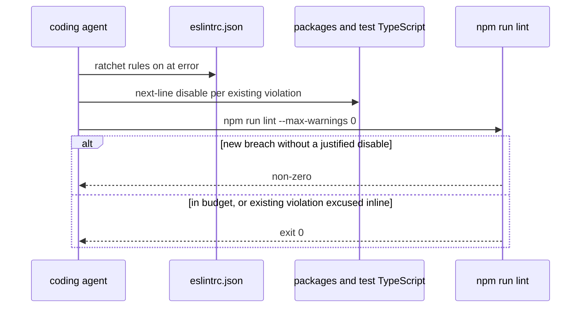

# P09 blinker ratchet in ESLint

Applies to: docs/internal/spec/ci-gate.md
Also modifies: docs/internal/spec/harness-prose.md
Ticket: RD-24150

No published-package public surface changes. Not a semver event.

P06 left the complexity budget as a blinker convention because ESLint did
not enforce the numbers. P09 turns those numbers — plus `no-explicit-any`,
`consistent-type-imports`, and `ban-ts-comment` — on as errors in the root
`.eslintrc.json`. Existing violations get one inline
`eslint-disable-next-line` with a justification. New violations anywhere
then require a visible disable that shows up in review.

`ci-gate.md` owns `.eslintrc.json` and `npm run lint`. `harness-prose.md`
owns `.cursor/rules/complexity-budget.mdc`. This is a two-document fold.

Re-measured 2026-09-10 against ESLint 8.57 + `@typescript-eslint` 8.59.1
(the ticket table was a throwaway config; the tree has moved). Chosen
options: sibling `ban-ts-comment` (`allow-with-description` for all four
directives) and `max-lines-per-function` with `skipBlankLines` /
`skipComments` / `IIFEs` (cycle-processing donor). Under those options:

| rule | `packages/*/src` | `packages/*/test` | repo-root `test/` |
| --- | --- | --- | --- |
| `max-depth` (4) | 0 | 0 | 0 |
| `max-params` (5) | 0 | 0 | 0 |
| `@typescript-eslint/ban-ts-comment` | 0 | 0 | 0 |
| `@typescript-eslint/consistent-type-imports` | 1 | 3 | 0 |
| `complexity` (12) | 5 | 0 | 2 |
| `max-lines-per-function` (80, skip blanks/comments/IIFEs) | 7 | 17 | 3 |
| `@typescript-eslint/no-explicit-any` | 11 visible (plus a file-level disable in `pg-sequelize/src/dialect.ts`) | 0 | 0 |

`"ts-expect-error": true` still turns the 0 `ban-ts-comment` count into 5
in 2 test files. Plain `max-lines-per-function` (no skip) is 11 src / 19
packages-test. Those options are not the pin.

## ADDED Requirements

### Requirement: Blinker ratchet rules are errors in the root ESLint config
(from `docs/internal/spec/ci-gate.md`)

Root `.eslintrc.json` SHALL set these rules to `"error"` on the default
(non-override) `rules` map. The seven **ratchet rules** are:

- `complexity` with option `{ "max": 12 }`
- `max-depth` with option `4`
- `max-params` with option `5`
- `max-lines-per-function` with option
  `{ "max": 80, "skipBlankLines": true, "skipComments": true, "IIFEs": true }`
- `@typescript-eslint/no-explicit-any`
- `@typescript-eslint/consistent-type-imports`
- `@typescript-eslint/ban-ts-comment` with option
  `{ "ts-expect-error": "allow-with-description", "ts-ignore": "allow-with-description", "ts-nocheck": "allow-with-description", "ts-check": "allow-with-description" }`

`.eslintrc.json` `overrides` SHALL NOT set any ratchet rule to `"off"`,
`"warn"`, `0`, or `1`, and SHALL NOT replace a ratchet rule's options with
a more lenient max.

This packet SHALL NOT add a file-glob `overrides` entry whose purpose is
to excuse an already-violating file from a ratchet rule.

`consistent-type-imports` violations SHALL be resolved by type-only
imports (`import type`), not by an `eslint-disable` of that rule.

#### Scenario: complexity-budget ESLint rules are errors with pinned options
- **WHEN** root `.eslintrc.json` `rules` is read
- **THEN** `complexity` is error with `max` 12, `max-depth` is error with
  4, `max-params` is error with 5, and `max-lines-per-function` is error
  with `max` 80, `skipBlankLines` true, `skipComments` true, and `IIFEs`
  true

#### Scenario: type-seam ESLint rules are errors with sibling ban-ts-comment options
- **WHEN** root `.eslintrc.json` `rules` is read
- **THEN** `@typescript-eslint/no-explicit-any` and
  `@typescript-eslint/consistent-type-imports` are error, and
  `@typescript-eslint/ban-ts-comment` is error with
  `ts-expect-error`, `ts-ignore`, `ts-nocheck`, and `ts-check` each set
  to `allow-with-description`

#### Scenario: eslintrc overrides do not weaken the ratchet rules
- **WHEN** each entry in root `.eslintrc.json` `overrides` is read
- **THEN** none of those entries sets a ratchet rule to off, warn, 0, or
  1, and none replaces a ratchet rule's options with a more lenient max

### Requirement: Existing ratchet violations use next-line disables with a justification
(from `docs/internal/spec/ci-gate.md`)

A tracked TypeScript file under `packages/`, `examples/`, or
repository-root `test/` SHALL NOT contain a file-level or block
`eslint-disable` (a directive that is not `eslint-disable-next-line` and
is not `eslint-disable-line`) that names a ratchet rule.

Each `eslint-disable-next-line` or `eslint-disable-line` that names a
ratchet rule SHALL include a `--` justification with at least one
non-whitespace character after the dashes.

`max-classes-per-file` is not a ratchet rule. An existing file-level
disable of that rule alone MAY remain.

#### Scenario: no file-level eslint-disable of a ratchet rule
- **WHEN** tracked `*.ts` files under `packages/`, `examples/`, and
  repository-root `test/` are scanned for `eslint-disable` directives
- **THEN** no directive that is not `eslint-disable-next-line` and not
  `eslint-disable-line` names `complexity`, `max-depth`, `max-params`,
  `max-lines-per-function`, `@typescript-eslint/no-explicit-any`,
  `@typescript-eslint/consistent-type-imports`, or
  `@typescript-eslint/ban-ts-comment`

#### Scenario: ratchet next-line disables carry a justification
- **WHEN** those same files are scanned for `eslint-disable-next-line`
  and `eslint-disable-line` directives that name a ratchet rule
- **THEN** each such directive contains `--` followed by a non-empty
  justification

### Requirement: engineering-principles agrees the lint ratchet is on
(from `docs/internal/spec/harness-prose.md`)

`.cursor/skills/engineering-principles/SKILL.md` SHALL state that
`npm run lint` enforces the complexity budget. It SHALL state that there
are no git hooks. It SHALL NOT claim that `@typescript-eslint/no-explicit-any`
is off. It SHALL NOT claim that this repository's ESLint does not
enforce the complexity budget.

Canonical path is `.cursor/skills/`. After editing it, `sync-agent-skills`
must run so the Claude mirror matches (existing harness-scaffold check).

#### Scenario: engineering-principles does not claim any is off in ESLint
- **WHEN** `.cursor/skills/engineering-principles/SKILL.md` is read
- **THEN** it does not contain `@typescript-eslint/no-explicit-any` is
  off and does not contain `not an ESLint error`

#### Scenario: engineering-principles names lint as enforcing the budget
- **WHEN** `.cursor/skills/engineering-principles/SKILL.md` is read
- **THEN** it contains `npm run lint` and contains `no git hooks`, and
  it does not contain `does not currently enforce`

## MODIFIED Requirements

### Requirement: Glob-scoped blinkers live under .cursor/rules
(from `docs/internal/spec/harness-prose.md`)

`.cursor/rules/` SHALL contain these Cursor `.mdc` files:

- `12-no-escape-hatches.mdc` — glob covering `packages/**/*.ts`
- `13-method-readability.mdc` — glob covering `packages/**/*.ts`
- `15-commands-over-hand-edits.mdc` — `alwaysApply: true` and no
  `globs:` key
- `complexity-budget.mdc` — names the complexity ≤ 12, max-depth ≤ 4,
  max-lines-per-function ≤ 80, max-params ≤ 5 budget. It SHALL state
  that `npm run lint` enforces those numbers. It SHALL NOT claim a git
  hook enforces those numbers (this repository has none)
- `00-architecture-ratchet.mdc` — glob covering `packages/**/*.ts`
- `01-architecture-bssn.mdc` — glob covering `packages/**/*.ts`

It SHALL NOT contain `component-testing.mdc` or `10-http-boundaries.mdc`.

Tracked markdown under `.cursor/agents/`, `.claude/agents/`,
`.cursor/skills/`, and `.claude/skills/` that points at `.cursor/rules/`
SHALL use the word `blinker` or `blinkers` and SHALL NOT call those
files "rules" (the published API already owns `Rule`).

#### Scenario: portable blinker files exist
- **WHEN** `.cursor/rules/` is listed
- **THEN** it contains `12-no-escape-hatches.mdc`,
  `13-method-readability.mdc`, `15-commands-over-hand-edits.mdc`,
  `complexity-budget.mdc`, `00-architecture-ratchet.mdc`, and
  `01-architecture-bssn.mdc`

#### Scenario: globbed blinkers cover packages
- **WHEN** `12-no-escape-hatches.mdc`, `13-method-readability.mdc`,
  `00-architecture-ratchet.mdc`, and `01-architecture-bssn.mdc` are
  read
- **THEN** each file's frontmatter `globs` value contains `packages/`

#### Scenario: commands-over-hand-edits is always-on with no globs
- **WHEN** `15-commands-over-hand-edits.mdc` is read
- **THEN** its frontmatter has `alwaysApply: true` and no `globs:` key

#### Scenario: complexity-budget names the four limits and does not invent a hook gate
- **WHEN** `complexity-budget.mdc` is read
- **THEN** it names `complexity` and `12`, `max-depth` and `4`,
  `max-lines-per-function` and `80`, and `max-params` and `5`, and it
  does not contain `lefthook`, `pre-push`, or `husky`

#### Scenario: complexity-budget names lint as the enforcer
- **WHEN** `complexity-budget.mdc` is read
- **THEN** it contains `npm run lint`

#### Scenario: dropped donor blinkers are absent
- **WHEN** `.cursor/rules/` is listed
- **THEN** it does not contain `component-testing.mdc` or
  `10-http-boundaries.mdc`

#### Scenario: agent and skill prose calls them blinkers
- **WHEN** tracked markdown under `.cursor/agents/`, `.claude/agents/`,
  `.cursor/skills/`, and `.claude/skills/` that contains the path
  `.cursor/rules` is read
- **THEN** each such file contains `blinker` and does not contain the
  phrase `the rules in`

## REMOVED Requirements

n/a

## Flow

## Decisions (rung recorded)

| Decision | Outcome | Rung |
| --- | --- | --- |
| `ban-ts-comment` options | Pin `@vnatures/eslint-config` (reports_service / vn-server): `allow-with-description` for `ts-expect-error`, `ts-ignore`, `ts-nocheck`, `ts-check`. `"ts-expect-error": true` is not used — re-measure still turns 0 into 5 in `checked-methods.test-d.ts` and `pg-kysely` `probe.test.ts`. cycle-processing does not override the rule (recommended default also allows described `ts-expect-error`) | Sibling (`@vnatures/eslint-config` 1.1.0) + re-measure |
| `max-lines-per-function` skip flags | `{ max: 80, skipBlankLines: true, skipComments: true, IIFEs: true }` as in cycle-processing's shared eslint-config. Re-measure: src 11 → 7, packages test 19 → 17 | Sibling (`cycle-processing/packages/eslint-config`) + ticket + re-measure |
| Ratchet via next-line disables, not file-glob `overrides` | New violations in an already-excused file still fail lint unless a new visible disable is added | Ticket |
| Convert `pg-sequelize/src/dialect.ts` file-level `no-explicit-any` disable to next-line | File-level disable of a ratchet rule would let new `any`s slip in. `max-classes-per-file` on that same comment is not a ratchet rule and may stay file-level | Ticket (never file-level for the ratchet) |
| Autofix the 4 `consistent-type-imports` hits rather than disable | Ticket: all four `--fix-dry-run` confirmed. Re-measure still 1 src + 3 test | Ticket + re-measure |
| Do not extract `handleList` (complexity 26) | That extraction is P10 (RD-24151). This packet ratchets it with a next-line disable | Ticket (P10 is the outward blocker) |
| Root `test/` is in the ratchet | `npm run lint` starts with `eslint test vitest.workspace.ts`. Re-measure: 2 complexity + 3 max-lines there. `examples/grpc-client` had 0 | Source (`package.json` `scripts.lint`) + re-measure |
| Two-document fold | `ci-gate.md` owns `.eslintrc.json` / lint; `harness-prose.md` owns `complexity-budget.mdc` and the engineering-principles claim that lint was off | User + current-truth ownership |
| Amend the P06 ESLint-does-not-enforce decision row rather than delete it | Same shape as P08 amending the donor-skill row: keep the P06 fact, then record that P09 turned the numbers on as a lint ratchet. The hook-ban scenario stays — there are still no hooks; the enforcer is `npm run lint` | User + P08 precedent |
| Close the "ESLint complexity plugin matching the budget numbers" deferral | Core ESLint rules (`complexity`, `max-depth`, `max-lines-per-function`, `max-params`), not a plugin. After this packet, lint does fail a 13-complexity function that lacks a disable | Ticket (P09) + source (core ESLint, not a plugin) |
| No public API / version bump | Config, blinker, skill prose, and inline disables only | Source |

## Out of scope (deferred)

| Item | Consequence of deferring |
| --- | --- |
| P10 decompose s3 `handleList` (RD-24151) | complexity 26 stays, behind a next-line disable, until that ticket extracts it to ≤ 12 |
| Extracting the other complexity-13 functions (`recordCallImpl` × 2, `createProbedSequelizeAdapter`, repo-root test helpers) | They stay behind next-line disables until a later touch extracts them |
| Mutation testing / CRAP (RD-24153) | Phase 5 still cannot tell whether green means anything |
| Adding husky / lefthook / `prepare` / `core.hooksPath` | Agents and humans can still push without running `lint`; `npm run lint` (and CircleCI `npm run check` on workspace-wide paths) remain the gates |
| Turning on other currently-off rules (`no-empty-object-type`, `no-empty-function`, `no-namespace`, `no-empty-pattern`) | Those stays-off are not this packet's ratchet |
| Replacing remaining `any` type-seam escapes with `unknown` | The 12-no-escape-hatches blinker still forbids *new* `any`; existing ones are justified inline |
| A markdown / frontmatter linter | `npm run check` stays the five TypeScript-focused scripts |

## Acceptance mapping

1. Root `.eslintrc.json` `rules` has `complexity` error `{ max: 12 }`, `max-depth` error `4`, `max-params` error `5`, `max-lines-per-function` error `{ max: 80, skipBlankLines: true, skipComments: true, IIFEs: true }`.
2. Root `.eslintrc.json` `rules` has `@typescript-eslint/no-explicit-any` error, `@typescript-eslint/consistent-type-imports` error, and `@typescript-eslint/ban-ts-comment` error with the four directives set to `allow-with-description`.
3. No `.eslintrc.json` `overrides` entry turns a ratchet rule off/warn or loosens its max.
4. No tracked `packages/` / `examples/` / repo-root `test/` `*.ts` file has a file-level or block `eslint-disable` of a ratchet rule.
5. Every next-line or same-line disable of a ratchet rule in those files includes `--` plus a non-empty justification.
6. `complexity-budget.mdc` still names 12 / 4 / 80 / 5 and still contains none of `lefthook`, `pre-push`, `husky`; it contains `npm run lint`.
7. `engineering-principles` SKILL.md contains `npm run lint` and `no git hooks`, and contains none of `@typescript-eslint/no-explicit-any` is off, `not an ESLint error`, or `does not currently enforce`.
8. Tests for these scenarios run under root `npm test` (`test/ci-gate` and `test/harness-prose`) and are in the root `format:check` glob.
9. `npm run lint` exits 0 with the ratchet on (`--max-warnings 0`). There are still no git hooks.
