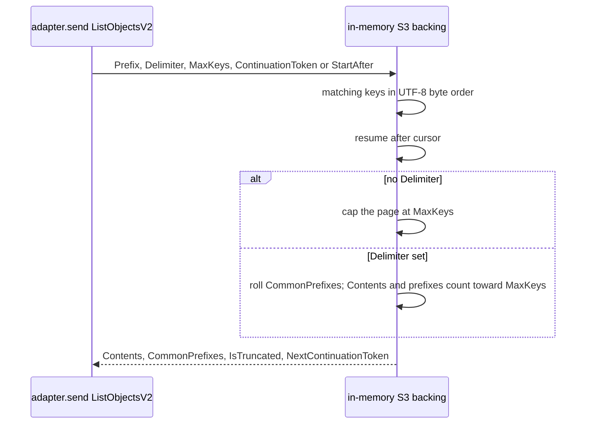

# P10 s3 handleList decomposition

Applies to: docs/internal/spec/s3-backing.md
Also modifies: docs/internal/spec/ci-gate.md
Ticket: RD-24151

No published-package public surface changes. Not a semver event.

P09 (RD-24150) left `handleList` in
`packages/s3/src/s3-client/in-memory-backing.ts` behind
`// eslint-disable-next-line complexity -- P10 / RD-24151`. Re-measure
2026-09-10 with `--no-inline-config`: `handleList` is complexity **26**;
`dispatch` is complexity **14**. `max-lines-per-function` does **not**
fire on `handleList` under the pinned skip flags (the ticket's
"simultaneous max-lines offender" was the pre-P09 count).

This packet extracts `handleList` to ≤ 12 and deletes that disable.
ListObjectsV2 / ListObjects responses do not change. The behaviour lock
is `packages/s3/test/integration/list-pagination.test.ts` — this packet
SHALL NOT edit that file.

**Spec home.** Not `core-public-api.md`: that file is the published
`@hochgi/test-kit` surface (Rig, peers, major 2) and uses
`## Known gaps`. This is `@hochgi/test-kit-s3` backing behaviour plus
closing a P09 deferral. New capability `s3-backing.md` owns the list
contract. `ci-gate.md` owns the ratchet disable (it uses
`## Out of scope (deferred)`).

Phase 2: scenarios marked **existing** are already one-`it` in
`list-pagination.test.ts`. Do **not** re-author them and do **not**
edit that file. Author new tests only for scenarios marked **new**.

## ADDED Requirements

### Requirement: In-memory S3 list honours ListObjectsV2 semantics
The in-memory S3 **backing** SHALL list stored objects with the same
ListObjectsV2 contract the adapter already forwards: prefix filtering,
delimiter / common-prefix rollup, `MaxKeys` default-and-cap 1000,
continuation-token pagination, `StartAfter` as the no-token fallback,
and UTF-8 byte lexicographic key order. `ListObjects` (v1) SHALL keep
using `Marker` / `NextMarker` and omitting `KeyCount` through the same
handler. This packet SHALL NOT change those responses.

#### Scenario: prefix filtering is preserved across pages
**(existing:** `list-pagination.test.ts` — `prefix filtering is preserved across pages`**)**
- **WHEN** objects under two prefixes are listed with `Prefix` set to one of them
- **THEN** only keys under that prefix are returned, in UTF-8 order, with `IsTruncated` false when they fit in one page

#### Scenario: Delimiter rolls common prefixes and counts them toward MaxKeys
**(existing:** `list-pagination.test.ts` — `Delimiter rolls up keys into CommonPrefixes and counts toward MaxKeys (M6)`**)**
- **WHEN** keys `a/1`, `a/2`, `b/1`, `b/2`, `c.txt` are listed with `Delimiter: '/'`
- **THEN** `CommonPrefixes` is `a/`, `b/`, `Contents` is `c.txt`, `KeyCount` is 3, and `IsTruncated` is false

#### Scenario: a common prefix is not split across pages
**(existing:** `list-pagination.test.ts` — `Delimiter with MaxKeys=1 paginates correctly (common prefix not split across pages)`**)**
- **WHEN** keys `a/1`, `a/2`, `a/3`, `b/1` are listed with `Delimiter: '/'` and `MaxKeys: 1`
- **THEN** page 1 is only common prefix `a/` and truncated, and page 2 is only common prefix `b/` and not truncated

#### Scenario: MaxKeys defaults to 1000 and values above 1000 are silently capped
**(existing:** `list-pagination.test.ts` — `default MaxKeys (omitted) is 1000`, `MaxKeys above 1000 is silently capped at 1000 (real S3 behaviour)`, `paged walk with MaxKeys=5000 over 2500 keys yields every key exactly once`**)**
- **WHEN** more than 1000 keys are listed with `MaxKeys` omitted or set above 1000
- **THEN** each page contains at most 1000 keys, `IsTruncated` is true until the last page, and walking `NextContinuationToken` yields every key exactly once in UTF-8 order

#### Scenario: MaxKeys=0 returns an empty non-truncated page
**(existing:** `list-pagination.test.ts` — `MaxKeys=0 returns an empty, non-truncated page with no token (M5)`**)**
- **WHEN** a bucket with keys is listed with `MaxKeys: 0`
- **THEN** `Contents` is empty, `IsTruncated` is false, and no `NextContinuationToken` is emitted

#### Scenario: non-finite MaxKeys falls back to 1000
**(existing:** `list-pagination.test.ts` — `non-finite MaxKeys (NaN) falls back to default 1000, not an empty/poisoned page`**)**
- **WHEN** a bucket with fewer than 1000 keys is listed with `MaxKeys: NaN`
- **THEN** every key is returned in one non-truncated page

#### Scenario: continuation resumes after the last key of the previous page
**(existing:** `list-pagination.test.ts` — `IsTruncated is true on non-final pages and carries NextContinuationToken`, `continuation resumes after the exact key boundary (no overlap, no skip)`, `2500 keys with MaxKeys=1000 takes exactly 3 pages with stable order`, `MaxKeys larger than key count returns everything in one non-truncated page`**)**
- **WHEN** a listing is paged with `MaxKeys` smaller than the matching key count
- **THEN** non-final pages set `IsTruncated` and `NextContinuationToken`, the next page starts strictly after the previous page's last key, and a `MaxKeys` larger than the remaining count returns the rest in one non-truncated page

#### Scenario: a malformed ContinuationToken restarts from the beginning
**(existing:** `list-pagination.test.ts` — `a malformed ContinuationToken restarts from the beginning (not an arbitrary key)`**)**
- **WHEN** `ContinuationToken` is not a round-trippable token issued by this backing
- **THEN** the listing starts at the first matching key, not at an arbitrary decoded string

#### Scenario: ContinuationToken takes precedence over StartAfter
**(existing:** `list-pagination.test.ts` — `StartAfter begins listing after the specified key (M7)`, `ContinuationToken takes precedence over StartAfter (M7)`**)**
- **WHEN** `StartAfter` is set alone, listing begins at the first key strictly after that key
- **WHEN** both `ContinuationToken` and `StartAfter` are set
- **THEN** the token cursor wins

#### Scenario: keys are sorted by UTF-8 byte order
**(existing:** `list-pagination.test.ts` — `keys are sorted by UTF-8 byte order, not UTF-16 code-unit order (L4)`**)**
- **WHEN** keys differ in UTF-8 vs UTF-16 order
- **THEN** the listing order is UTF-8 byte order

### Requirement: handleList meets the complexity budget without a disable
`packages/s3/src/s3-client/in-memory-backing.ts` SHALL NOT contain
`eslint-disable-next-line complexity -- P10 / RD-24151` or any other
`complexity` / `max-lines-per-function` disable on `handleList` or on
functions extracted from it. After the extract, `npm run lint` SHALL
exit 0 without that disable. Re-measure with `--no-inline-config`:
`handleList` was complexity 26; it and every function extracted from it
SHALL be complexity ≤ 12.

`dispatch` in the same file MAY keep its existing
`eslint-disable-next-line complexity` (complexity 14). This packet does
not extract it.

#### Scenario: the P10 handleList complexity disable is gone
**(new)**
- **WHEN** `packages/s3/src/s3-client/in-memory-backing.ts` is read
- **THEN** it does not contain `P10 / RD-24151` and does not contain an
  `eslint-disable` of `complexity` or `max-lines-per-function` whose
  next function is `handleList`

#### Scenario: the only remaining complexity disable in the backing is dispatch
**(new)**
- **WHEN** `packages/s3/src/s3-client/in-memory-backing.ts` is scanned
  for next-line `complexity` disables
- **THEN** exactly one remains, and it is the existing `dispatch`
  disable (`existing function over the published budget; extract on next
  touch`)

## MODIFIED Requirements

n/a — no EARS requirement body in `ci-gate.md` changes.

Fold notes for `docs/internal/spec/ci-gate.md`:

- Decisions row **Do not extract `handleList` (complexity 26)** becomes:
  P10 (RD-24151) extracted `handleList` to complexity ≤ 12 and deleted
  the P09 next-line disable.
- Out of scope row **P10 decompose s3 `handleList` (RD-24151)** is
  removed (this packet closes it).
- Out of scope gains: extracting `dispatch` in
  `in-memory-backing.ts` (complexity 14) stays behind its next-line
  disable until a later touch of **that method**.

## REMOVED Requirements

n/a

## Flow

## Decisions (rung recorded)

| Decision | Outcome | Rung |
| --- | --- | --- |
| Spec home is `s3-backing.md` + `ci-gate.md`, not `core-public-api.md` | `core-public-api.md` is the published `@hochgi/test-kit` surface and uses `## Known gaps`. This is s3 backing list behaviour (new capability file) plus closing P09's handleList deferral (`ci-gate.md` / `## Out of scope (deferred)`) | Source (`core-public-api.md`, `ci-gate.md`) + user prompt to check |
| `dispatch` is out of scope | Ticket title, estimate, and decomposition are ListObjectsV2 semantics inside `handleList`. `dispatch` is a command-name switch at complexity 14. Its comment says extract on next touch **of that method**; this packet does not edit `dispatch`. Same-file adjacency is not a touch | Ticket + source |
| Do not edit `list-pagination.test.ts` | It is the behaviour lock (356 lines over exactly this list). Any edit is a signal the extract changed semantics | Ticket + user |
| Existing list `it`s are the scenarios; phase 2 writes only the two **new** disable tests | Re-authoring passing list tests would be a green bar for the wrong reason. Duplicating them would also require editing or paralleling the lock file | Ticket + write-failing-tests (red for missing behaviour) |
| No dedicated ListObjects v1 pagination tests | v1 shares `handleList` (`Marker` / `NextMarker`, no `KeyCount`). The lock file is v2-only. Adding v1 coverage would be new tests, not a refactor proof | Source (`shapeListResponse`) + lock file |
| `max-lines-per-function` disable on `handleList` does not exist to delete | Re-measure with pinned skip flags: only `complexity` 26 fires. Extracted helpers still must stay ≤ 80 / ≤ 12 | Re-measure (`eslint --no-inline-config`) |
| Not a semver event | Private extract; ListObjectsV2 responses unchanged; public README list paragraph stays | Source |
| Two-document fold | `s3-backing.md` created from ADDED; `ci-gate.md` amends the P09 handleList decision and drops the P10 deferral | P09 two-document precedent + ownership |
| New disable tests do not accrete onto `test/ci-gate/ci-gate.test.ts` | That file is already a hotspot. A new small test file (s3 package or `test/ci-gate/`) reads the backing source | Source (`ci-gate.test.ts`) + hotspot blinker |

## Out of scope (deferred)

| Item | Consequence of deferring |
| --- | --- |
| Extract `dispatch` (complexity 14) in the same file | It stays behind `eslint-disable-next-line complexity -- existing function over the published budget; extract on next touch` until that method is edited |
| Dedicated ListObjects v1 pagination integration tests | v1 remains covered only by sharing `handleList` with the v2 lock suite |
| Extracting other complexity-13 functions (`recordCallImpl` × 2, `createProbedSequelizeAdapter`, repo-root test helpers) | They stay behind their P09 next-line disables |
| Mutation testing / CRAP (RD-24153) | Phase 5 can show the gate is green but not that green *means* anything |
| Changing ListObjectsV2 / ListObjects responses | Out of scope by design — this is a refactor |

## Acceptance mapping

1. **(existing)** Prefix filtering — `list-pagination.test.ts` `prefix filtering is preserved across pages`.
2. **(existing)** Delimiter rollup — `Delimiter rolls up keys into CommonPrefixes and counts toward MaxKeys (M6)`.
3. **(existing)** Common prefix not split — `Delimiter with MaxKeys=1 paginates correctly (common prefix not split across pages)`.
4. **(existing)** MaxKeys default and cap 1000 — `default MaxKeys (omitted) is 1000`, `MaxKeys above 1000 is silently capped at 1000 (real S3 behaviour)`, `paged walk with MaxKeys=5000 over 2500 keys yields every key exactly once`.
5. **(existing)** MaxKeys=0 — `MaxKeys=0 returns an empty, non-truncated page with no token (M5)`.
6. **(existing)** Non-finite MaxKeys — `non-finite MaxKeys (NaN) falls back to default 1000, not an empty/poisoned page`.
7. **(existing)** Continuation pagination — `IsTruncated is true on non-final pages and carries NextContinuationToken`, `continuation resumes after the exact key boundary (no overlap, no skip)`, `2500 keys with MaxKeys=1000 takes exactly 3 pages with stable order`, `MaxKeys larger than key count returns everything in one non-truncated page`.
8. **(existing)** Malformed token — `a malformed ContinuationToken restarts from the beginning (not an arbitrary key)`.
9. **(existing)** StartAfter / token precedence — `StartAfter begins listing after the specified key (M7)`, `ContinuationToken takes precedence over StartAfter (M7)`.
10. **(existing)** UTF-8 order — `keys are sorted by UTF-8 byte order, not UTF-16 code-unit order (L4)`.
11. **(new)** `in-memory-backing.ts` does not contain `P10 / RD-24151` and has no `complexity` / `max-lines-per-function` disable on `handleList`.
12. **(new)** Exactly one `complexity` next-line disable remains in that file, on `dispatch`.
13. `packages/s3/test/integration/list-pagination.test.ts` is unmodified versus `main`.
14. `npm run lint` exits 0 after the P10 disable is deleted (`--max-warnings 0`).
15. No public API / README / `docs/api-surface.md` change.
