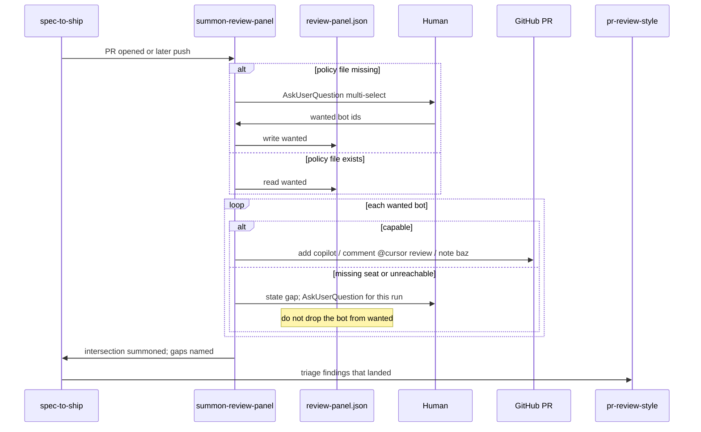

# P11 summon-review-panel skill

Applies to: docs/internal/spec/harness-prose.md
Ticket: RD-24152

No published-package public surface changes. Not a semver event.

PR-level review (AI bots + human) is the acceptance gate. Today
`pr-review-style` inlines how to assemble Copilot and Bugbot when a PR
opens. This packet turns that into a skill that summons the
**intersection** of committed **policy** and live **capability**, and
**states the gap** when they differ. Summoning and triage stay separate
so a later push can re-summon without re-running triage.

Current truth for the support-skill enumeration is the P08-folded
seven-skill list (`add-adapter` included). This delta adds the eighth.

## ADDED Requirements

### Requirement: summon-review-panel skill summons the policy/capability intersection
`.cursor/skills/summon-review-panel/SKILL.md` SHALL exist. It is the
skill that summons the review panel on an open PR.

**Policy** is what this repository wants reviewed. It is committed at
`.harness/review-panel.json`. **Capability** is what the current
account can actually reach. Capability SHALL NOT be committed.

The skill SHALL summon the intersection: each bot in the policy that the
current account can invoke. For each policy bot it cannot invoke, it
SHALL state a gap that names the bot and that capability is missing
(no seat, unreachable). It SHALL NOT treat an unticked or omitted bot as
the same signal as a missing seat.

Known bot ids SHALL be exactly `copilot`, `bugbot`, and `baz`.

The skill SHALL summon those ids as:

- `copilot` — add `copilot` as a reviewer on the PR
- `bugbot` — comment `@cursor review` on the PR (that trigger string is
  the comment body; it SHALL NOT require the `🤖:` prefix used for
  review replies)
- `baz` — org-automatic if present; the skill SHALL NOT add Baz config,
  `CODEOWNERS`, or anything under `.github/`

The skill SHALL state that this does **not** contradict `no GitHub
Actions`: Copilot-as-reviewer and `@cursor review` are per-PR actions
needing zero CI.

Findings SHALL hand off to `pr-review-style`. The skill SHALL NOT
instruct triaging, applying, or rejecting review comments. It SHALL be
invokable after a later push without running triage.

There SHALL NOT be a `.claude/commands/summon-review-panel.md`. This
packet SHALL NOT add a sixth pipeline agent.

#### Scenario: summon-review-panel skill exists under the Cursor canonical tree
- **WHEN** `.cursor/skills/summon-review-panel/` is listed
- **THEN** it contains `SKILL.md`

#### Scenario: skill separates policy from capability
- **WHEN** `.cursor/skills/summon-review-panel/SKILL.md` is read
- **THEN** it contains `policy`, `capability`, and
  `.harness/review-panel.json`

#### Scenario: skill summons copilot as a reviewer and comments @cursor review
- **WHEN** `.cursor/skills/summon-review-panel/SKILL.md` is read
- **THEN** it contains `copilot` as a reviewer and contains
  `@cursor review`

#### Scenario: skill names baz and does not add GitHub Actions or Baz config
- **WHEN** `.cursor/skills/summon-review-panel/SKILL.md` is read
- **THEN** it contains `baz`, contains `no GitHub Actions`, and does
  not contain `.github/workflows`

#### Scenario: skill hands findings to pr-review-style
- **WHEN** `.cursor/skills/summon-review-panel/SKILL.md` is read
- **THEN** it contains `pr-review-style` and does not contain
  `Each finding is either actionable or noise`

#### Scenario: skill can be re-run without triage
- **WHEN** `.cursor/skills/summon-review-panel/SKILL.md` is read
- **THEN** it states that summoning can run again after a push without
  running triage

#### Scenario: no summon-review-panel command
- **WHEN** `.claude/commands/` is listed
- **THEN** it does not contain `summon-review-panel.md`

### Requirement: first-run records policy; later runs re-prompt only on failure
When `.harness/review-panel.json` is absent, the skill SHALL ask via
`AskUserQuestion` multi-select which of the known bot ids this
repository wants, write that answer as the `wanted` array in
`.harness/review-panel.json`, and SHALL NOT ask again on a later run
while that file exists.

After recording (or when the file already exists), the skill SHALL
summon the intersection.

When a summon fails, or a declared bot has gone unreachable, the skill
SHALL re-prompt via `AskUserQuestion` for this run. It SHALL NOT edit
`.harness/review-panel.json` to drop that bot: that would conflate
policy with capability. Changing `wanted` is an explicit committed edit.

#### Scenario: skill bootstraps missing policy via AskUserQuestion
- **WHEN** `.cursor/skills/summon-review-panel/SKILL.md` is read
- **THEN** it contains `AskUserQuestion`, `multi-select`, and
  `review-panel.json`

#### Scenario: later runs use recorded policy without asking
- **WHEN** `.cursor/skills/summon-review-panel/SKILL.md` is read
- **THEN** it states that a later run does not ask while
  `review-panel.json` exists

#### Scenario: skill states a capability gap without editing policy
- **WHEN** `.cursor/skills/summon-review-panel/SKILL.md` is read
- **THEN** it contains `policy wants` and `seat`, and it does not
  instruct removing a bot from `wanted` because a summon failed

#### Scenario: skill re-prompts when a summon fails or a bot is unreachable
- **WHEN** `.cursor/skills/summon-review-panel/SKILL.md` is read
- **THEN** it contains `AskUserQuestion` and `unreachable`

### Requirement: review-panel.json is committed policy without capability
The tracked file `.harness/review-panel.json` SHALL exist alongside
`.harness/models.json`. It SHALL be a JSON object with a `wanted` array
of bot id strings. Every entry SHALL be one of `copilot`, `bugbot`,
`baz`. This repository's committed `wanted` SHALL include `copilot`
and `bugbot`.

The object SHALL NOT contain a `capability` or `seats` key.

A `//` documentation key MAY exist. If present, it SHALL mention
`policy`.

#### Scenario: review-panel.json exists alongside models.json
- **WHEN** `.harness/` is listed
- **THEN** it contains `review-panel.json` and `models.json`

#### Scenario: review-panel.json wanted lists copilot and bugbot and no capability key
- **WHEN** `.harness/review-panel.json` is parsed
- **THEN** `wanted` is an array that includes `copilot` and `bugbot`,
  every entry is one of `copilot`, `bugbot`, or `baz`, and the object
  has no `capability` or `seats` key

### Requirement: spec-to-ship PR loop names summon-review-panel
`.claude/commands/spec-to-ship.md` and
`.cursor/skills/spec-to-ship/SKILL.md` SHALL name `summon-review-panel`
as the way to summon review bots after a PR is opened and after a later
push. They SHALL NOT inline the Copilot-reviewer or `@cursor review`
recipe in the PR loop.

#### Scenario: spec-to-ship command names summon-review-panel
- **WHEN** `.claude/commands/spec-to-ship.md` is read
- **THEN** it contains `summon-review-panel`

#### Scenario: spec-to-ship skill names summon-review-panel
- **WHEN** `.cursor/skills/spec-to-ship/SKILL.md` is read
- **THEN** it contains `summon-review-panel`

### Requirement: pr-review-style defers summoning to summon-review-panel
`.cursor/skills/pr-review-style/SKILL.md` SHALL name
`summon-review-panel` as the skill that assembles the panel. It SHALL
NOT contain the heading `Assembling the review panel`. Triage of
findings that have already landed stays in `pr-review-style`.

#### Scenario: pr-review-style names summon-review-panel and does not assemble the panel
- **WHEN** `.cursor/skills/pr-review-style/SKILL.md` is read
- **THEN** it contains `summon-review-panel` and does not contain
  `Assembling the review panel`

### Requirement: OSS.md tracks org-internal harness pieces
`docs/internal/OSS.md` SHALL exist. It SHALL name
`summon-review-panel` and `.harness/review-panel.json` as
`org-internal`. It SHALL name the LiteLLM role aliases in
`.harness/models.json` (`litellm/vn-`) as `org-internal`. It SHALL
NOT introduce a skill-frontmatter marking convention.

#### Scenario: OSS.md tracks summon-review-panel as org-internal
- **WHEN** `docs/internal/OSS.md` is read
- **THEN** it contains `summon-review-panel`, `litellm`, and
  `org-internal`

## MODIFIED Requirements

### Requirement: Support skills exist under the Cursor canonical tree
`.cursor/skills/` SHALL contain a `SKILL.md` in each of these
directories: `engineering-principles`, `regression-dog`,
`pr-review-style`, `hotspot-expansion-review`, `mutation-testing`,
`component-testing`, `add-adapter`, and `summon-review-panel`, and in
each of these phase-skill directories:
`spec-to-ship`, `write-spec`, `write-failing-tests`, `code-to-green`,
`review-changes`, `verify-changes`.

It SHALL NOT contain skill directories named `slack-driven-sessions`,
`post-deploy-verify`, `help-docs-sync`, `refactor-to-hexagonal`,
`10-http-boundaries`, `extend-test-kit`, or `add-module`.

Donor service names SHALL NOT leak into the ported skills: none of
`engineering-principles`, `regression-dog`, `pr-review-style`,
`hotspot-expansion-review`, or `mutation-testing` SHALL mention
`@donor-service/contracts`, `pnpm verify`, or `lefthook`.

#### Scenario: eight support skills are present
- **WHEN** `.cursor/skills/` is listed
- **THEN** it contains directories named `engineering-principles`,
  `regression-dog`, `pr-review-style`, `hotspot-expansion-review`,
  `mutation-testing`, `component-testing`, `add-adapter`, and
  `summon-review-panel`, each with a `SKILL.md`

#### Scenario: six phase skills are present
- **WHEN** `.cursor/skills/` is listed
- **THEN** it contains directories named `spec-to-ship`, `write-spec`,
  `write-failing-tests`, `code-to-green`, `review-changes`, and
  `verify-changes`, each with a `SKILL.md`

#### Scenario: service-shaped donor skills are absent
- **WHEN** `.cursor/skills/` is listed
- **THEN** it has no directory named `slack-driven-sessions`,
  `post-deploy-verify`, `help-docs-sync`, `refactor-to-hexagonal`,
  `10-http-boundaries`, `extend-test-kit`, or `add-module`

#### Scenario: ported support skills do not name donor service machinery
- **WHEN** the five newly ported support `SKILL.md` files other than
  `component-testing` are read
- **THEN** none of them contains `@donor-service/contracts`,
  `pnpm verify`, or `lefthook`

## REMOVED Requirements

n/a

## Flow

## Decisions (rung recorded)

| Decision | Outcome | Rung |
| --- | --- | --- |
| Treat unpublished P08 fold as current truth | Cherry-picked the local fold so the seven-skill list (including `add-adapter`) is the baseline this delta modifies | Ticket ("P08 folded") + source (tests already list `add-adapter`; fold commit was unpublished) |
| Policy vs capability are different files/signals; a checkbox conflates them | Policy is committed `wanted`; capability is runtime; gaps are stated, not stored | Ticket |
| `.harness/review-panel.json` with a `wanted` array of known ids | Sits next to `models.json`; no `capability` / `seats` keys | Ticket + source (`.harness/models.json`) |
| Known ids are `copilot`, `bugbot`, `baz` | Matches the ticket and the inline panel `pr-review-style` already named | Ticket + source (`pr-review-style`) |
| This repo's committed `wanted` is `copilot` and `bugbot`, not `baz` | Baz org-wide install could not be confirmed (`admin:org` missing); this repo has no `.github/`, no Baz config, no CODEOWNERS | Ticket (open facts) + source (no `.github/`) |
| First run asks, writes `wanted`, then summons; later runs skip the ask | "Stops asking" is not "stops summoning" | Ticket |
| Re-prompt on fail/unreachable; do not edit `wanted` to match capability | That edit would recreate the checkbox | Ticket |
| Skill only — no `/summon-review-panel` command, no sixth agent | Packet is a skill; re-summon by re-reading it; fan-out is existing Cursor→Claude rsync | Ticket (title) + source (`harness-scaffold.md`) |
| spec-to-ship PR loop names the skill instead of "let the bots run" | Makes summoning part of the harness | Ticket |
| `pr-review-style` drops `Assembling the review panel` and names this skill | Summoning and triage stay separate | Ticket |
| Bugbot comment body is exactly `@cursor review`, not `🤖: @cursor review` | Ticket's trigger string; `🤖:` stays the prefix for review replies | Ticket + source (`pr-review-style`) |
| No GitHub Actions, no CODEOWNERS, no Baz repo config | Per-PR Copilot reviewer and `@cursor review` need zero CI | Ticket + source (no `.github/`) |
| Track org-internal in `docs/internal/OSS.md`, no frontmatter mark | Ticket forbade a marking convention; `docs/internal/` is already the OSS-ignore tree | Ticket |
| No published-API / version bump | Harness markdown, one JSON file, and repo tests | Source |

## Out of scope (deferred)

| Item | Consequence of deferring |
| --- | --- |
| Confirming Baz org-wide install on `the org`, or Copilot PR-review seats on private repos | Capability stays a runtime gap statement; this repo's committed `wanted` omits `baz` until someone adds it |
| A `/summon-review-panel` slash command | Re-summon by invoking the skill; no Cursor/Claude/OpenCode command mirror |
| A sixth pipeline agent | Orchestrator (main thread) runs the skill |
| GitHub Actions, CODEOWNERS, or Baz repo config | test-kit still has no `.github/` |
| A skill-frontmatter `oss:` / `org-internal` mark | `docs/internal/OSS.md` is the list |
| An unattended PR-watching review orchestrator | Ticket: that agent has nobody to ask; this skill's recorded policy is the file it will need |
| Installing Baz or changing org seat policy | Out of this repository |
| Mutation testing / CRAP (RD-24153) | Phase 5 still cannot tell whether green means anything |

## Acceptance mapping

1. `.cursor/skills/summon-review-panel/SKILL.md` exists.
2. That skill names policy vs capability and `.harness/review-panel.json`.
3. That skill adds `copilot` as a reviewer and comments `@cursor review`.
4. That skill names `baz` and `no GitHub Actions`, and does not contain `.github/workflows`.
5. That skill names `pr-review-style` and does not contain the triage sentence `Each finding is either actionable or noise`.
6. That skill states re-summon after a push without triage.
7. `.claude/commands/` has no `summon-review-panel.md`.
8. The skill contains `AskUserQuestion`, `multi-select`, and `review-panel.json`, and states that a later run does not ask while the file exists.
9. The skill contains `policy wants` and `seat`, and does not drop a bot from `wanted` on summon failure; it re-prompts on `unreachable`.
10. `.harness/review-panel.json` exists; `wanted` includes `copilot` and `bugbot`; every entry is a known id; no `capability` or `seats` key.
11. `.claude/commands/spec-to-ship.md` and `.cursor/skills/spec-to-ship/SKILL.md` contain `summon-review-panel`.
12. `.cursor/skills/pr-review-style/SKILL.md` contains `summon-review-panel` and does not contain `Assembling the review panel`.
13. `docs/internal/OSS.md` contains `summon-review-panel`, `litellm`, and `org-internal`.
14. `.cursor/skills/` has the eight support skills (including `add-adapter` and `summon-review-panel`).
