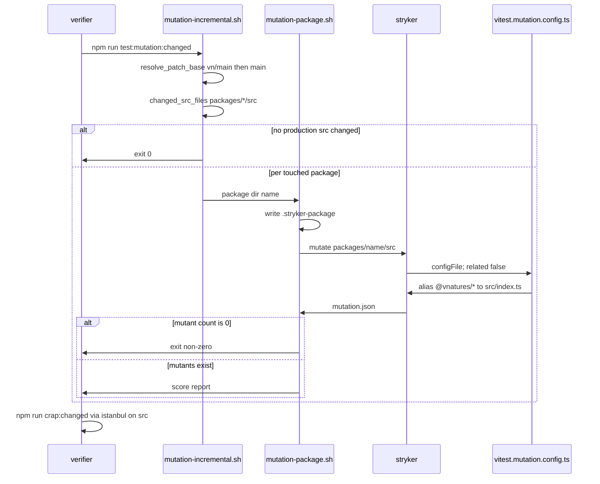

# P12 per-package mutation testing + CRAP

Applies to: docs/internal/spec/ci-gate.md
Also modifies: docs/internal/spec/harness-prose.md,
docs/internal/spec/harness-scaffold.md, docs/internal/spec/docs-truth.md,
docs/internal/spec/core-public-api.md, docs/internal/spec/s3-backing.md
Ticket: RD-24153

No published-package public surface changes. Not a semver event.

This packet gives phase 5 teeth. A timeboxed spike on `packages/core`
(`duration.ts`, then generics-heavy `probe-engine.ts`) and
`packages/mock` (`factory.ts`) confirmed the ticket's recommended shape
holds, with the measured caveats recorded in Decisions.

Six-document fold: four files only drop their "Mutation testing / CRAP
(RD-24153)" deferral row. `harness-prose.md` **modifies** the
`mutation-testing` skill requirement and the verifier-agent requirement
instead of deleting those rows. `core-public-api.md` uses `## Known gaps`
rather than `## Out of scope (deferred)`.

## ADDED Requirements

### Requirement: Vitest projects live in vitest.config.ts
Root `vitest.config.ts` SHALL be the Vitest config that lists every test
project under `test.projects`. The repository SHALL NOT contain
`vitest.workspace.ts`. Root `package.json` `lint` and `format:check`
SHALL name `vitest.config.ts` where they previously named
`vitest.workspace.ts`. CircleCI path-filtering SHALL map
`vitest.config.ts` onto `build_workspace true` and SHALL NOT map
`vitest.workspace.ts`.

`npm test` SHALL keep using each package's own `vite.config.ts` (built
`dist/` via package name), not the mutation aliases.

#### Scenario: defineWorkspace and vitest.workspace.ts are gone
- **WHEN** the repository root is listed and `vitest.config.ts` is read
- **THEN** `vitest.workspace.ts` does not exist, `vitest.config.ts`
  contains `test.projects` and does not contain `defineWorkspace`, and
  `test.projects` includes `packages/core`, `packages/mock`,
  `test/ci-gate`, `test/harness-prose`, `test/harness-scaffold`, and
  `test/docs-truth`

#### Scenario: root scripts and path-filter name vitest.config.ts
- **WHEN** root `package.json` scripts `lint` and `format:check`, and
  `.circleci/config.yml` path-filtering mapping, are read
- **THEN** each names `vitest.config.ts` and none names
  `vitest.workspace.ts`

### Requirement: Mutation-only Vite config aliases workspace packages to source
Root `vitest.mutation.config.ts` SHALL alias every published
`@vnatures/test-kit*` workspace package name to that package's
`packages/<dir>/src/index.ts`. It SHALL NOT enable Vitest typecheck. It
SHALL NOT list `test.projects` and SHALL NOT import `defineWorkspace`.
It SHALL set `test.server.deps.inline` so `@vnatures/` packages are
transformed. Test include SHALL be scoped to one package (see
`.stryker-package` below), not to repository-root `test/`.

Stryker SHALL load this file via `vitest.configFile` and SHALL set
`vitest.related` to `false`. It SHALL NOT rely on Stryker `vitest.dir` as
the scoping mechanism (Vitest 3.2 treats the runner's top-level `dir` as
Vite cache, not `test.dir`).

#### Scenario: mutation config aliases each workspace package to src/index.ts
- **WHEN** `vitest.mutation.config.ts` is loaded
- **THEN** its resolve aliases map `@vnatures/test-kit` to
  `packages/core/src/index.ts` and `@vnatures/test-kit-mock` to
  `packages/mock/src/index.ts`, and every other published workspace
  package name under `packages/*/package.json` has a corresponding
  alias to that directory's `src/index.ts`

#### Scenario: mutation config does not load the default project graph
- **WHEN** `vitest.mutation.config.ts` is read
- **THEN** it does not contain `defineWorkspace` or `test.projects`, and
  it sets typecheck enabled to false

#### Scenario: Stryker uses the mutation config and disables related mode
- **WHEN** the Stryker config is read
- **THEN** `testRunner` is `vitest`, `vitest.configFile` is
  `vitest.mutation.config.ts`, and `vitest.related` is `false`

#### Scenario: mutation vitest loads source, not dist
- **WHEN** `npx vitest run --config vitest.mutation.config.ts` is run
  against `packages/core/test/unit/duration.test.ts` after writing the
  package name `core` to `.stryker-package`
- **THEN** the run's resolved `@vnatures/test-kit` module path contains
  `packages/core/src` and does not contain `packages/core/dist`

### Requirement: Per-package mutation runner
`scripts/mutation-package.sh` SHALL take a published package directory
name, write that name to repository-root `.stryker-package` (so the
sandbox copy can read it — Stryker workers do not reliably see
`STRYKER_PACKAGE`), and invoke Stryker with `mutate` limited to
`packages/<name>/src/**/*.ts` excluding `*.d.ts`.

The mutation Vite config SHALL include `packages/<name>/test/**/*.test.ts`
for that name. When the name is `core`, it SHALL also include
`packages/*/test/**/*.test.ts` except `packages/mysql/test/**` (Docker)
and except these core layout files that fail a sandbox dry run and do
not kill production mutants:

- `packages/core/test/unit/rig-docs-naming.test.ts`
- `packages/core/test/unit/rig-rename-layout.test.ts`
- `packages/core/test/unit/package-graph.test.ts`
- `packages/core/test/unit/rig-public-surface.test.ts`

Stryker `concurrency` SHALL be `1` when the package is `mysql` and SHALL
be greater than `1` for in-process packages. `thresholds.break` SHALL be
`null` (not a merge-score gate). Mutator `excludedMutations` MAY omit
`StringLiteral` and `ObjectLiteral` (sibling precedent).

`scripts/mutation-incremental.sh` SHALL source `scripts/changed-src.sh`,
group changed production files by `packages/<name>`, and invoke the
per-package runner for each touched published package that has tests.
It SHALL exit 0 without invoking Stryker when no production src files
changed. It SHALL skip a package that has no `packages/<name>/test/**/*.test.ts`
files (`pglite-driver` today).

Root `package.json` SHALL define `test:mutation` (per-package) and
`test:mutation:changed` (incremental). Neither SHALL be a step of
`scripts.check`.

#### Scenario: mutation-package writes .stryker-package and mutates that package's src
- **WHEN** `scripts/mutation-package.sh` is read
- **THEN** it writes the package directory name to `.stryker-package`
  and invokes Stryker with a `--mutate` glob under `packages/<name>/src`

#### Scenario: mutation include for mock is that package's tests only
- **WHEN** `.stryker-package` contains `mock` and the mutation Vite
  config is loaded
- **THEN** its test include contains `packages/mock/test/**/*.test.ts`
  and does not contain `packages/core/test/**/*.test.ts` as a required
  match for a mock-only run

#### Scenario: mutation include for core covers sibling in-process tests and drops layout files
- **WHEN** `.stryker-package` contains `core` and the mutation Vite
  config is loaded
- **THEN** its test include covers `packages/*/test/**/*.test.ts`, its
  exclude lists the four core layout files named above, and it excludes
  `packages/mysql/test/**`

#### Scenario: mysql mutation concurrency is 1
- **WHEN** the Stryker configuration used for `mysql` is read
- **THEN** `concurrency` is `1`

#### Scenario: incremental mutation skips when no production src changed
- **WHEN** `scripts/mutation-incremental.sh` is invoked on a tree whose
  `changed_src_files` list is empty
- **THEN** it exits 0 without invoking `stryker`

#### Scenario: test:mutation scripts exist and are not in check
- **WHEN** root `package.json` `scripts` is read
- **THEN** it defines `test:mutation` and `test:mutation:changed`, and
  `scripts.check` equals
  `npm run format:check && npm run lint && npm run typecheck && npm run build && npm test`

### Requirement: A zero-mutant Stryker success is a failure
The per-package mutation runner SHALL exit non-zero when Stryker
instruments zero mutants for the requested mutate glob, including the
case where zero files matched. A mutation JSON report whose mutant count
is 0 SHALL NOT be treated as success.

#### Scenario: mutating a glob that matches no source fails
- **WHEN** the per-package runner is invoked with a mutate glob that
  matches no `packages/*/src/**/*.ts` file
- **THEN** the process exits non-zero

#### Scenario: duration.ts mutation produces a non-zero mutant count
- **WHEN** Stryker is run against `packages/core/src/duration.ts` with
  the mutation Vite config and `.stryker-package` set to `core`
- **THEN** the JSON report records more than 0 mutants and more than 0
  killed mutants

### Requirement: CRAP scores source functions from istanbul coverage
`scripts/crap-report.js` SHALL exist in the existing `scripts/` directory
(P05). It SHALL implement
`CRAP(m) = comp(m)^2 * (1 - cov(m))^3 + comp(m)` per function, reading
coverage from Istanbul `coverage-final.json` `statementMap` (not v8).
Test paths SHALL be treated as `packages/*/test/**`, repository-root
`test/**`, and `*.test.ts` / `*.spec.ts` files — not a root `specs/`
directory. Patch scoping SHALL look at `packages/*/src/**/*.ts`.

Root `package.json` SHALL define `crap` (full istanbul run via the
mutation Vite config, then `crap-report.js`) and `crap:changed`
(`scripts/crap-changed.sh`). `@vitest/coverage-istanbul` SHALL be a
root devDependency. Neither crap script SHALL be a step of
`scripts.check`. Coverage collection SHALL use the mutation Vite config
so `coverage-final.json` keys are `packages/*/src/**/*.ts` files, not
`packages/*/dist/**/*.js`.

#### Scenario: crap-report.js lives under the existing scripts directory
- **WHEN** `scripts/` is listed
- **THEN** it contains `crap-report.js` and the P05 files
  `agent-sync-lib.sh`, `sync-agent-skills.sh`, and
  `check-agent-skills.sh`

#### Scenario: crap-report uses istanbul statementMap and packages/*/src
- **WHEN** `scripts/crap-report.js` is read
- **THEN** it contains `statementMap`, `packages/*/src`, and
  `CRAP(m) = comp(m)^2 * (1 - cov(m))^3 + comp(m)`, and it does not
  treat a root `specs/` directory as the test corpus

#### Scenario: crap scripts exist, use istanbul, and are not in check
- **WHEN** root `package.json` is read
- **THEN** `scripts.crap` and `scripts.crap:changed` exist,
  `devDependencies` contains `@vitest/coverage-istanbul`, `scripts.crap`
  names `istanbul` or `vitest.mutation.config.ts`, and `scripts.check`
  does not contain `crap`

#### Scenario: istanbul coverage keys are TypeScript sources
- **WHEN** `npx vitest run --config vitest.mutation.config.ts --coverage`
  is run for package `core` with provider istanbul
- **THEN** `coverage/coverage-final.json` has at least one key whose
  path contains `packages/core/src/` and ends with `.ts`, and has no key
  whose path contains `packages/core/dist/`

### Requirement: changed-src.sh resolves vn/main and packages/*/src
`scripts/changed-src.sh` SHALL define `resolve_patch_base` that prefers
`vn/main`, then local `main`, and SHALL fail if neither exists. It SHALL
NOT look up `vn/master` or `origin/master`. `changed_src_files` SHALL
list production TypeScript under `packages/*/src` (committed, staged,
unstaged, and untracked vs that base) and SHALL exclude
`packages/*/test/**` and `*.test.ts` / `*.spec.ts` files.

#### Scenario: resolve_patch_base prefers vn/main then main
- **WHEN** `scripts/changed-src.sh` is read
- **THEN** `resolve_patch_base` contains `vn/main` and `main`, and does
  not contain `vn/master` or `origin/master`

#### Scenario: changed_src_files is packages/*/src, not root src or specs
- **WHEN** `scripts/changed-src.sh` is read
- **THEN** `changed_src_files` names `packages/` and `src`, and does not
  use a pathspec that is exactly `src` at the repository root, and does
  not grep for `/specs/`

### Requirement: Mutation artifacts are gitignored and scripts/ is on the workspace-wide CI path
Root `.gitignore` SHALL ignore `.stryker-tmp`, `reports/mutation`,
`coverage/`, `stryker.log`, and `.stryker-package`. CircleCI
path-filtering SHALL map `scripts/**`, `vitest.mutation.config.ts`, and
the Stryker config file onto `build_workspace true`. A change to those
paths SHALL still run `npm run check`, not Stryker.

#### Scenario: gitignore lists mutation artifacts
- **WHEN** root `.gitignore` is read
- **THEN** it contains `.stryker-tmp`, `reports/mutation`, `coverage`,
  `stryker.log`, and `.stryker-package`

#### Scenario: scripts and mutation configs map to build_workspace
- **WHEN** `.circleci/config.yml` path-filtering mapping is read
- **THEN** it maps `scripts/.*`, `vitest.mutation.config.ts`, and a
  Stryker config filename onto `build_workspace true`

### Requirement: mutation-testing skill is the Stryker how-to
`.cursor/skills/mutation-testing/SKILL.md` SHALL tell the agent how to
run this repository's mutation and CRAP gates: `test:mutation`,
`test:mutation:changed`, `crap`, `crap:changed`, and that Stryker uses
`vitest.mutation.config.ts` so mutants in `src` are loaded. It SHALL
state that `npm test` still resolves through `dist/`. It SHALL state
that a zero-mutant report is a failure. It SHALL name
[stryker-js#6192](https://github.com/stryker-mutator/stryker-js/issues/6192)
and tell phase 5 to hand-apply survivors before treating them as missing
tests. It SHALL name [stryker-js#6183](https://github.com/stryker-mutator/stryker-js/issues/6183)
and tell the agent to treat a zero-mutant success as that failure mode.
It SHALL NOT mention `@cycle-processing/contracts`, `pnpm verify`,
`lefthook`, or `pnpm crap`. Canonical path remains `.cursor/skills/`;
`sync-agent-skills` must run after the edit.

#### Scenario: mutation-testing instructs the current Stryker how-to
- **WHEN** `.cursor/skills/mutation-testing/SKILL.md` is read
- **THEN** it contains `test:mutation`, `crap:changed`,
  `vitest.mutation.config.ts`, and `dist`

#### Scenario: mutation-testing names the two upstream risks
- **WHEN** `.cursor/skills/mutation-testing/SKILL.md` is read
- **THEN** it contains `6192` and `6183`

#### Scenario: mutation-testing does not import donor service machinery
- **WHEN** `.cursor/skills/mutation-testing/SKILL.md` is read
- **THEN** it does not contain `pnpm crap`, `pnpm verify`, `lefthook`,
  or `@cycle-processing/contracts`

### Requirement: Verifier runs mutation and CRAP
`.cursor/skills/verify-changes/SKILL.md` SHALL tell the verifier to run
`npm run test:mutation:changed` and `npm run crap:changed` in addition to
`npm run check`. It SHALL NOT state that this repository has no mutation
testing or no CRAP report. It SHALL state that a zero-mutant Stryker
success is a defect.

`.claude/agents/verifier.md` SHALL name `verify-changes` and `RD-24153`.
It SHALL NOT contain the phrase `no mutation testing`. It SHALL tell the
verifier to run the mutation and CRAP scripts named in `verify-changes`.

`.claude/agents/coder.md` and `.claude/agents/reviewer.md` SHALL still
not contain `test:mutation`, `stryker run`, or `pnpm crap`.
`.cursor/skills/code-to-green/SKILL.md` SHALL NOT tell the coder to run
Stryker or CRAP. `.cursor/skills/spec-to-ship/SKILL.md` SHALL NOT state
that test-kit has no mutation testing.

#### Scenario: verify-changes runs the coverage-quality scripts
- **WHEN** `.cursor/skills/verify-changes/SKILL.md` is read
- **THEN** it contains `test:mutation:changed` and `crap:changed`, and
  does not contain the phrase `no mutation testing`

#### Scenario: verifier agent names RD-24153 and does not claim the gate is missing
- **WHEN** `.claude/agents/verifier.md` is read
- **THEN** it contains `verify-changes` and `RD-24153`, and does not
  contain the phrase `no mutation testing`

#### Scenario: coder and reviewer still do not run coverage-quality gates
- **WHEN** `.claude/agents/coder.md` and `.claude/agents/reviewer.md`
  are read
- **THEN** neither file contains `test:mutation`, `stryker run`, or
  `pnpm crap`

#### Scenario: spec-to-ship no longer states the missing gate
- **WHEN** `.cursor/skills/spec-to-ship/SKILL.md` is read
- **THEN** it does not contain the phrase `no mutation testing` and does
  not contain `no CRAP report`

## MODIFIED Requirements

### Requirement: mutation-testing skill is thin until RD-24153
(from `docs/internal/spec/harness-prose.md`)

Replace with **Requirement: mutation-testing skill is the Stryker how-to**
above. The skill remains at `.cursor/skills/mutation-testing/SKILL.md`
and remains one of the eight support skills. It is no longer a stated
missing-gate card.

### Requirement: Per-agent files name their skills and do not import donor bugs
(from `docs/internal/spec/harness-prose.md`)

Keep the coder/reviewer ban on `test:mutation` / `stryker run` /
`pnpm crap`. Change the verifier clause to: `.claude/agents/verifier.md`
SHALL name `verify-changes` and `RD-24153`, and SHALL NOT contain the
phrase `no mutation testing`.

#### Scenario: verifier states the missing gate
Removed. Replaced by **Scenario: verifier agent names RD-24153 and does
not claim the gate is missing**.

### Requirement: Workspace-wide path changes run the root check in CI
(from `docs/internal/spec/ci-gate.md`)

The mapped path list SHALL name `vitest.config.ts` instead of
`vitest.workspace.ts`, and SHALL also include `scripts/**`,
`vitest.mutation.config.ts`, and the Stryker config file. The workflow
SHALL still run `npm run check` (not Stryker).

#### Scenario: workspace-wide paths are mapped
- **WHEN** the path-filtering mapping in `.circleci/config.yml` is
  evaluated with `^`/`$` anchors as the orb applies them
- **THEN** `vitest.config.ts`, `scripts/crap-report.js`, and
  `vitest.mutation.config.ts` each match a mapping line that sets the
  workspace-wide parameter to `true`, `vitest.workspace.ts` is not a
  mapped path, `packages/core/package.json` does not match the root
  `package.json` mapping, and `packages/core/test/unit/duration.test.ts`
  does not match the repository-root `test/` mapping

### Requirement: New TypeScript for this capability is on the root test and format paths
(from `docs/internal/spec/ci-gate.md`)

#### Scenario: repo-gate tests are in the Vitest workspace
- **WHEN** `vitest.config.ts` is read
- **THEN** its `test.projects` includes a project that picks up the
  tests for this capability

#### Scenario: repo-gate TypeScript is format-checked
- **WHEN** the root `format:check` script is read
- **THEN** its glob covers those test files and covers
  `vitest.config.ts` and `vitest.mutation.config.ts`

### Requirement: gitignore tracks harness, ignores local Claude state
(from `docs/internal/spec/ci-gate.md`)

Keep the Claude narrowing. Also ignore the mutation artifacts listed in
**Requirement: Mutation artifacts are gitignored**.

## REMOVED Requirements

### Requirement: mutation-testing skill is thin until RD-24153
(the missing-gate card). Replaced by the how-to requirement. The
scenarios "mutation-testing names the missing gate" and
"mutation-testing does not run Stryker today" go with it.

### Requirement: verifier states the missing gate
(the harness-prose scenario that required the phrase `no mutation
testing`). Replaced by the verifier how-to scenario.

Deferral rows titled `Mutation testing / CRAP (RD-24153)` SHALL be
removed from:

- `docs/internal/spec/ci-gate.md` (`## Out of scope (deferred)`)
- `docs/internal/spec/docs-truth.md` (`## Out of scope (deferred)`)
- `docs/internal/spec/harness-scaffold.md` (`## Out of scope (deferred)`)
- `docs/internal/spec/s3-backing.md` (`## Out of scope (deferred)`)
- `docs/internal/spec/harness-prose.md` (`## Out of scope (deferred)`)
- `docs/internal/spec/core-public-api.md` (`## Known gaps` row
  `No mutation testing or CRAP (RD-24153)`)

`harness-prose.md` acceptance items 8 and 10 SHALL be rewritten to match
the modified skill and verifier requirements. The decision row
"`mutation-testing` is a thin missing-gate card" SHALL be updated to
record that RD-24153 landed.

## Flow

## Decisions (rung recorded)

| Decision | Outcome | Rung |
| --- | --- | --- |
| Mutation-only Vite aliases `@vnatures/*` → `packages/*/src/index.ts`; `npm test` keeps validating `dist/` | Spike: poisoning `duration.ts` failed mutation vitest and passed workspace vitest | Spike measurement + ticket |
| Replace `vitest.workspace.ts` / `defineWorkspace` with `vitest.config.ts` `test.projects` | Prerequisite: with the workspace file present, `--config vitest.mutation.config.ts` still loaded dist | Spike measurement + ticket (Vitest 3.2 deprecation) |
| Scope tests via mutation config include / `.stryker-package`, not Stryker `vitest.dir` | Stryker 10 passes `dir` as top-level `createVitest` option; Vitest 3.2.7 treats that as Vite cache dir | Spike measurement |
| `vitest.related: false` | Tests import by package name, not by file path | Ticket + source |
| Package name is a file `.stryker-package`, not only `STRYKER_PACKAGE` env | Vite-bundled mutation config in Stryker workers did not see the env | Spike measurement |
| Core mutation include is all in-process package tests, minus mysql and four layout files | `probe-engine.ts` scored 0% killed against core's 18 remaining tests; duration.ts scored 91.67% with 22 killed | Spike measurement |
| Exclude four core layout tests from mutation | They `git ls-files` or read `dist/index.d.ts` and fail sandbox dry run; they do not kill production mutants | Spike measurement |
| `concurrency: 1` only for mysql | Only mysql starts Testcontainers; s3/redis/kafka/sqs/pg-* are in-process | Source (`packages/*/src`) |
| `@babel/generator@8.0.5` from Stryker 10.0.0; #6183 did not reproduce | `duration.ts` 27 mutants, `probe-engine.ts` 371, `mock/factory.ts` 42. Wrapper still fails closed on 0 mutants | Spike measurement + closed upstream issue |
| #6192 not reproduced on single-project mutation config + Vitest 3.2.7 | duration survivors were genuine `<` vs `<=`. Skill still requires hand-applying survivors | Spike measurement + open upstream issue |
| Istanbul, not v8 | `coverage-final.json` keys were `packages/core/src/*.ts` (8 files, 0 dist) | Spike measurement + ticket |
| `thresholds.break: null`; not added to `npm run check`; not a CircleCI merge gate | P00 pinned the five-step check chain; sibling Stryker configs keep `break: null` | Source (`ci-gate.md`) + sibling (`reports_service`) |
| `changed-src.sh` grows a `vn/main` then `main` arm; pathspec `packages/*/src` | Ticket named those two bugs. Do not port van-damme's multi-remote ambiguity resolver | Ticket |
| `crap-report.js` joins existing `scripts/` | P05 already created the directory | Ticket + source |
| Coder and reviewer still do not run Stryker | Coverage quality stays phase 5 | Source (harness-prose coder/reviewer ban) |
| Toolchain pins: `@stryker-mutator/core@10`, `@stryker-mutator/vitest-runner@10`, `@vitest/coverage-istanbul@^3.2` | Installed 10.0.0 / 10.0.0 / 3.2.7 against vitest 3.2.7 | Ticket + install |
| No public API / version bump | Root tooling and harness prose only | Source |

## Out of scope (deferred)

| Item | Consequence of deferring |
| --- | --- |
| Adding mutation or CRAP to the five-step `npm run check` | `npm run check` stays fast; phase 5 runs the extra scripts |
| CircleCI job that runs Stryker / a non-null `thresholds.break` | CI still only runs `npm run check`; a PR can merge with un-run mutation unless the verifier ran it |
| Mutating `examples/grpc-client` or `pglite-driver` (no tests) | Those trees are not scored |
| Killing the genuine `duration.ts` `<` vs `<=` survivors | Score is not 100%; the skill says hand-apply survivors |
| van-damme `HARNESS_BASE_REF` / multi-remote `changed-src.sh` | This clone's remote is `vn`; a fork with only `origin/main` must set tracking or add an arm later |
| Fixing open stryker-js#6192 | Single-project mutation config avoids the reported projects repro; survivors are still hand-checked |
| Git hooks | Still none |
| Range-scoped `--mutate file:start-end` | Incremental mutates whole changed files, like reports_service |

## Acceptance mapping

1. `vitest.workspace.ts` is gone; `vitest.config.ts` has `test.projects` listing the published packages and the four root `test/` projects; `npm test` still uses package `vite.config.ts` (dist).
2. `vitest.mutation.config.ts` aliases every `@vnatures/test-kit*` workspace package to `packages/<dir>/src/index.ts`, disables typecheck, inlines `@vnatures/`, and does not use `defineWorkspace` / `test.projects`.
3. Stryker config: `testRunner` vitest, `configFile` `vitest.mutation.config.ts`, `related` false, `break` null.
4. `.stryker-package` + `scripts/mutation-package.sh` scope mutate and test include per package; core include adds sibling in-process tests and excludes mysql plus the four layout files.
5. `test:mutation` / `test:mutation:changed` exist; `scripts.check` is unchanged; zero-mutant runs exit non-zero; `duration.ts` mutation reports >0 mutants and >0 killed.
6. `scripts/crap-report.js` and `scripts/crap-changed.sh` exist beside the P05 scripts; formula and istanbul `statementMap`; `packages/*/src`; `crap` / `crap:changed` scripts; `@vitest/coverage-istanbul` installed; coverage keys are `src/**/*.ts` not `dist/**/*.js`.
7. `scripts/changed-src.sh` resolves `vn/main` then `main`, lists `packages/*/src`, does not mention `vn/master` or `/specs/`.
8. `.gitignore` lists `.stryker-tmp`, `reports/mutation`, `coverage`, `stryker.log`, `.stryker-package`; path-filter maps `vitest.config.ts`, `vitest.mutation.config.ts`, Stryker config, and `scripts/**` onto `build_workspace`.
9. `mutation-testing` skill is a how-to: `test:mutation`, `crap:changed`, `vitest.mutation.config.ts`, `dist`, `6192`, `6183`; not `pnpm crap` / donor machinery.
10. `verify-changes` runs `test:mutation:changed` and `crap:changed` and does not say `no mutation testing`; `verifier.md` names `RD-24153` and does not say `no mutation testing`; coder/reviewer still do not run Stryker; `spec-to-ship` no longer states the missing gate.
11. The six spec files no longer defer RD-24153 as a missing gate; harness-prose acceptance 8 and 10 match the modified skill and verifier.
12. Tests for these scenarios run under root `npm test` and are in the root `format:check` glob.
