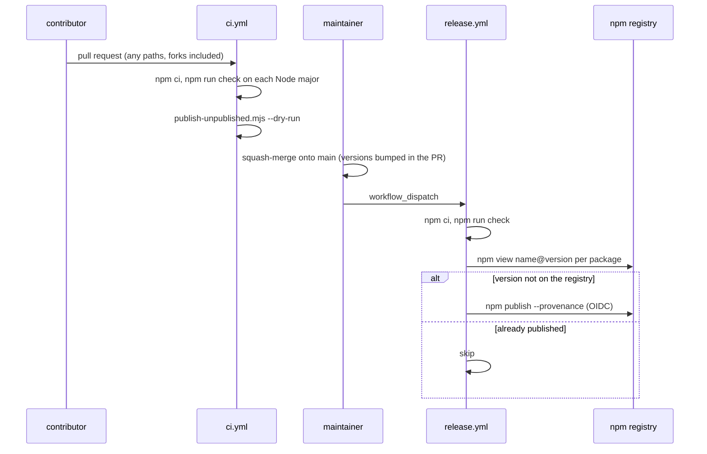
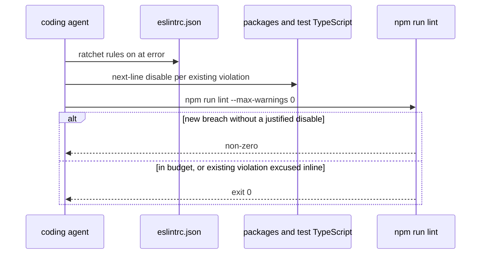
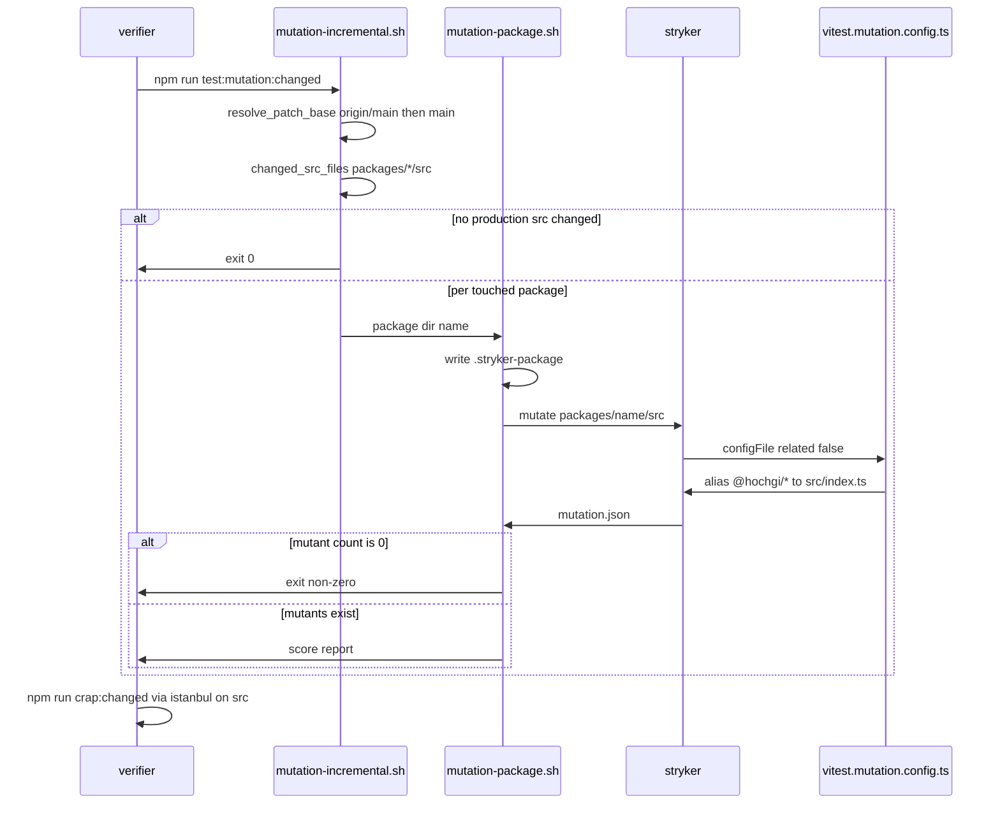

# CI gate

What currently gates a change to this repository: GitHub Actions runs the
whole `npm run check` on every pull request and every push to `main`, with
no secrets, plus a dry run of the release. Publishing is a separate, manual
workflow. There are no git hooks (no husky, no lefthook).
`npm run lint` enforces the complexity budget and type-seam rules as a
ratchet (P09 / RD-24150). P10 (RD-24151) extracted s3 `handleList` to
complexity ≤ 12 and deleted the P09 next-line disable.

Folded from the P09 delta (RD-24150), preserved at
`docs/internal/archive/2026-09-10-P09-blinker-ratchet/delta.md`.
P10 list-contract current truth is `docs/internal/spec/s3-backing.md`;
its delta is at
`docs/internal/archive/2026-09-10-P10-s3-handlelist-decomposition/delta.md`.
P12 (RD-24153) landed per-package Stryker and CRAP; they are not a
step of `npm run check`. Phase 5 runs `test:mutation:changed` and
`crap:changed`. Folded from
`docs/internal/archive/2026-09-17-P12-mutation-and-crap/delta.md`.
RD-24255 collapsed the per-package runner's three `--mutate` flags into
one comma-joined glob; the repeated flag had made every package
instrument zero mutants.

When the repository went public, CircleCI (path-filtered per-package
`vn-ci` workflows, auto-publish to GitHub Packages on merge, main-only
backup and audit) was replaced by `.github/workflows/ci.yml` and
`.github/workflows/release.yml`. The requirements that described CircleCI
were removed rather than archived; the previous text is in git history.

## Requirements

### Requirement: Root check script
The repository SHALL expose a root npm script named `check` that runs the
existing root scripts `format:check`, `lint`, `typecheck`, `build`, and `test`,
in that order, each joined to the next with `&&` so the chain stops at the first
non-zero exit.

#### Scenario: check script is defined
- **WHEN** the root `package.json` `scripts` map is read
- **THEN** it contains `check` whose command invokes those five scripts in that
  order, separated only by `&&`

#### Scenario: check is fail-closed
- **WHEN** the `check` script command is inspected
- **THEN** it does not use `;` or `&` between steps in a way that would continue
  after a failure

### Requirement: Pull-request CI runs the whole gate without secrets
`.github/workflows/ci.yml` SHALL trigger on `pull_request` and on `push`
to `main`, with no `paths` / `paths-ignore` filter and no
`pull_request_target`. It SHALL run `npm ci` and then `npm run check`.
It SHALL NOT reference any secret or request `id-token`, and its
top-level `permissions` SHALL be `contents: read`. Its Node matrix SHALL
include the minimum major named by root `engines.node`. It SHALL run
`node scripts/publish-unpublished.mjs --dry-run`. `.circleci/` SHALL
NOT exist.

#### Scenario: ci workflow runs on every pull request and on main, with no path filter
- **WHEN** `.github/workflows/ci.yml` is read
- **THEN** its triggers are exactly `pull_request` and `push`, `push` is
  limited to `main`, and it contains no `paths:`, `paths-ignore:`, or
  `pull_request_target`

#### Scenario: ci workflow runs npm run check after npm ci
- **WHEN** the `run:` steps of `ci.yml` are listed
- **THEN** `npm run check` comes after `npm ci`

#### Scenario: ci workflow holds no secrets and only read permission
- **WHEN** `ci.yml` is read
- **THEN** it contains no `secrets.` and no `id-token`, and top-level
  `permissions` is `contents: read`

#### Scenario: ci workflow tests the minimum Node major from engines
- **WHEN** root `engines.node` (`>=<major>`) and the `ci.yml` node matrix are read
- **THEN** the matrix contains that major

#### Scenario: ci workflow dry-runs the release
- **WHEN** the `run:` steps of `ci.yml` are listed
- **THEN** one is `node scripts/publish-unpublished.mjs --dry-run`

#### Scenario: CircleCI is gone
- **WHEN** the repository root is listed
- **THEN** `.circleci/` does not exist

### Requirement: Releases are manual and isolated
`.github/workflows/release.yml` SHALL trigger only on
`workflow_dispatch`. It SHALL run `npm run check` before
`node scripts/publish-unpublished.mjs`. It SHALL request
`id-token: write` (npm trusted publishing and provenance), run in the
`npm` environment, and reference no secret other than `NPM_TOKEN`
(the first-publish fallback). `scripts/publish-unpublished.mjs` SHALL
publish, in dependency order, every `packages/*` workspace whose
manifest version is not yet on the npm registry, and SHALL skip one that
is.

#### Scenario: release workflow only runs on manual dispatch
- **WHEN** `release.yml` is read
- **THEN** its only trigger is `workflow_dispatch`

#### Scenario: release workflow runs the gate before publishing
- **WHEN** the `run:` steps of `release.yml` are listed
- **THEN** `node scripts/publish-unpublished.mjs` comes after `npm run check`

#### Scenario: release workflow uses OIDC in a protected environment and no other secret
- **WHEN** `release.yml` is read
- **THEN** it requests `id-token: write`, runs in environment `npm`, and
  the only secret it names is `NPM_TOKEN`

### Requirement: Every published package is publicly publishable
Root `LICENSE` SHALL be the MIT license. Each of the thirteen
`packages/<name>/package.json` manifests SHALL have `license` `MIT`,
`publishConfig` exactly `{ "access": "public", "provenance": true }`, and
`LICENSE` in `files`, and `packages/<name>/LICENSE` SHALL equal the root
`LICENSE`. The repository SHALL NOT commit a root `.npmrc`.

#### Scenario: each package is MIT, public, provenance-signed, and ships the license
- **WHEN** root `LICENSE` and each package manifest and `LICENSE` are read
- **THEN** each meets the requirement above

#### Scenario: no committed npmrc points the scope at a private registry
- **WHEN** the repository root is listed
- **THEN** `.npmrc` does not exist

### Requirement: No cross-repo Claude launch config
The path `.claude/launch.json` SHALL NOT exist on disk.

#### Scenario: launch.json is absent
- **WHEN** the filesystem is inspected at `.claude/launch.json`
- **THEN** the path does not exist

### Requirement: Local Claude settings do not undercut read-only phases
If `.claude/settings.local.json` exists, its `permissions.allow` list SHALL NOT
contain `Bash(git push *)`, `Bash(gh pr *)`, or any `Read(//Users/…/dev/**)`
grant that reaches across sibling checkouts.

#### Scenario: forbidden grants are absent when the file exists
- **WHEN** `.claude/settings.local.json` exists
- **THEN** none of those permission strings appear in it

#### Scenario: missing local settings file is allowed
- **WHEN** `.claude/settings.local.json` does not exist
- **THEN** this requirement is satisfied (fresh clone / CI)

### Requirement: gitignore tracks harness, ignores local Claude state
Root `.gitignore` SHALL ignore `.claude/settings.local.json` and
`.claude/worktrees/`, and SHALL NOT ignore the entire `.claude/` directory.
It SHALL also ignore `.stryker-tmp`, `reports/mutation`, `coverage`,
`stryker.log`, and `.stryker-package`.

#### Scenario: gitignore is narrowed
- **WHEN** root `.gitignore` is read
- **THEN** it lists `.claude/settings.local.json` and `.claude/worktrees/`, and
  it has no ignore pattern that is exactly `.claude/`

#### Scenario: gitignore lists mutation artifacts
- **WHEN** root `.gitignore` is read
- **THEN** it contains `.stryker-tmp`, `reports/mutation`, `coverage`,
  `stryker.log`, and `.stryker-package`

### Requirement: Vitest projects live in vitest.config.ts
Root `vitest.config.ts` SHALL be the Vitest config that lists every test
project under `test.projects`. The repository SHALL NOT contain
`vitest.workspace.ts`. Root `package.json` `lint` and `format:check`
SHALL name `vitest.config.ts`. `npm test` SHALL keep using each package's own
`vite.config.ts` (built `dist/` via package name), not the mutation
aliases.

#### Scenario: defineWorkspace and vitest.workspace.ts are gone
- **WHEN** the repository root is listed and `vitest.config.ts` is read
- **THEN** `vitest.workspace.ts` does not exist, `vitest.config.ts`
  contains `test.projects` and does not contain `defineWorkspace`, and
  `test.projects` includes `packages/core`, `packages/mock`,
  `test/ci-gate`, `test/harness-prose`, `test/harness-scaffold`, and
  `test/docs-truth`

#### Scenario: root scripts name vitest.config.ts
- **WHEN** root `package.json` scripts `lint` and `format:check` are read
- **THEN** each names `vitest.config.ts` and none names
  `vitest.workspace.ts`

### Requirement: Mutation-only Vite config aliases workspace packages to source
Root `vitest.mutation.config.ts` SHALL alias every published
`@hochgi/test-kit*` workspace package name to that package's
`packages/<dir>/src/index.ts`. It SHALL NOT enable Vitest typecheck. It
SHALL NOT list `test.projects` and SHALL NOT import `defineWorkspace`.
It SHALL set `test.server.deps.inline` so `@hochgi/` packages are
transformed. Test include SHALL be scoped to one package via
`.stryker-package`, not to repository-root `test/`.

Stryker SHALL load this file via `vitest.configFile` and SHALL set
`vitest.related` to `false`. It SHALL NOT rely on Stryker `vitest.dir`
as the scoping mechanism.

#### Scenario: mutation config aliases each workspace package to src/index.ts
- **WHEN** `vitest.mutation.config.ts` is loaded
- **THEN** its resolve aliases map `@hochgi/test-kit` to
  `packages/core/src/index.ts` and `@hochgi/test-kit-mock` to
  `packages/mock/src/index.ts`, and every other published workspace
  package name under `packages/*/package.json` has a corresponding
  alias to that directory's `src/index.ts`

#### Scenario: mutation config does not load the default project graph
- **WHEN** `vitest.mutation.config.ts` is read
- **THEN** it does not contain `defineWorkspace` or `test.projects`, and
  it sets typecheck enabled to false

#### Scenario: Stryker uses the mutation config and disables related mode
- **WHEN** the Stryker config is read
- **THEN** `testRunner` is `vitest`, `vitest.configFile` is
  `vitest.mutation.config.ts`, and `vitest.related` is `false`

#### Scenario: mutation vitest loads source, not dist
- **WHEN** `npx vitest run --config vitest.mutation.config.ts` is run
  against `packages/core/test/unit/duration.test.ts` after writing the
  package name `core` to `.stryker-package`
- **THEN** the run's resolved `@hochgi/test-kit` module path contains
  `packages/core/src` and does not contain `packages/core/dist`

### Requirement: Per-package mutation runner
`scripts/mutation-package.sh` SHALL take a published package directory
name, write that name to repository-root `.stryker-package`, and invoke
Stryker with `mutate` limited to the `.ts` and `.tsx` sources under
`packages/<name>/src`, excluding `*.d.ts`.

The mutation Vite config SHALL include `packages/<name>/test/**/*.test.ts`
for that name. When the name is `mysql`, that include SHALL NOT be
listed in `test.exclude` (Vitest exclude wins over include). When the
name is `core`, it SHALL also include `packages/*/test/**/*.test.ts`
except `packages/mysql/test/**` and except these core layout files:

- `packages/core/test/unit/rig-docs-naming.test.ts`
- `packages/core/test/unit/rig-rename-layout.test.ts`
- `packages/core/test/unit/package-graph.test.ts`
- `packages/core/test/unit/rig-public-surface.test.ts`

When `.stryker-package` is absent (the `crap` / `crap:changed` path),
include SHALL be `packages/*/test/**/*.test.ts` and SHALL NOT exclude
`packages/mysql/test/**`.

Stryker `concurrency` SHALL be `1` when the package is `mysql` and SHALL
be greater than `1` for in-process packages. `thresholds.break` SHALL be
`null`.

`scripts/mutation-incremental.sh` SHALL source `scripts/changed-src.sh`,
group changed production files by `packages/<name>`, and invoke the
per-package runner for each touched published package that has tests.
It SHALL exit 0 without invoking Stryker when no production src files
changed. It SHALL skip a package that has no
`packages/<name>/test/**/*.test.ts` files.

Root `package.json` SHALL define `test:mutation` and
`test:mutation:changed`. Neither SHALL be a step of `scripts.check`.

#### Scenario: mutation-package writes .stryker-package and mutates that package's src
- **WHEN** `scripts/mutation-package.sh` is read
- **THEN** it writes the package directory name to `.stryker-package`
  and invokes Stryker with a `--mutate` glob under `packages/<name>/src`

#### Scenario: mutation include for mock is that package's tests only
- **WHEN** `.stryker-package` contains `mock` and the mutation Vite
  config is loaded
- **THEN** its test include contains `packages/mock/test/**/*.test.ts`
  and does not contain `packages/core/test/**/*.test.ts` as a required
  match for a mock-only run

#### Scenario: mutation include for mysql is that package's tests only
- **WHEN** `.stryker-package` contains `mysql` and the mutation Vite
  config is loaded
- **THEN** its test include contains `packages/mysql/test/**/*.test.ts`
  and its exclude does not contain `packages/mysql/test/**`

#### Scenario: mutation include for core covers sibling in-process tests and drops layout files
- **WHEN** `.stryker-package` contains `core` and the mutation Vite
  config is loaded
- **THEN** its test include covers `packages/*/test/**/*.test.ts`, its
  exclude lists the four core layout files named above, and it excludes
  `packages/mysql/test/**`

#### Scenario: mysql mutation concurrency is 1
- **WHEN** the Stryker configuration used for `mysql` is read
- **THEN** `concurrency` is `1`

#### Scenario: incremental mutation skips when no production src changed
- **WHEN** `scripts/mutation-incremental.sh` is invoked on a tree whose
  `changed_src_files` list is empty
- **THEN** it exits 0 without invoking `stryker`

#### Scenario: test:mutation scripts exist and are not in check
- **WHEN** root `package.json` `scripts` is read
- **THEN** it defines `test:mutation` and `test:mutation:changed`, and
  `scripts.check` equals
  `npm run format:check && npm run lint && npm run typecheck && npm run build && npm test`

### Requirement: A zero-mutant Stryker success is a failure
The per-package mutation runner SHALL exit non-zero when Stryker
instruments zero mutants for the requested mutate glob, including the
case where zero files matched.

`scripts/mutation-package.sh` SHALL pass `--mutate` exactly once. The
Stryker CLI parses `--mutate` with a comma splitter and keeps only the
last occurrence, so repeating the flag silently discards every earlier
glob. The single value SHALL be the comma-joined list
`packages/<name>/src/**/*.ts`, `packages/<name>/src/**/*.tsx`,
`!packages/<name>/src/**/*.d.ts`.

#### Scenario: mutating a glob that matches no source fails
- **WHEN** the per-package runner is invoked with a mutate glob that
  matches no `.ts` or `.tsx` file under `packages/*/src`
- **THEN** the process exits non-zero

#### Scenario: duration.ts mutation produces a non-zero mutant count
- **WHEN** Stryker is run against `packages/core/src/duration.ts` with
  the mutation Vite config and `.stryker-package` set to `core`
- **THEN** the JSON report records more than 0 mutants and more than 0
  killed mutants

#### Scenario: the shipped runner instruments and kills mutants for a real package
- **WHEN** `scripts/mutation-package.sh` is invoked end to end with the
  package directory name `sql`
- **THEN** it exits 0 and the JSON report it leaves at
  `reports/mutation/mutation.json` records more than 0 mutants and more
  than 0 killed mutants

#### Scenario: the per-package runner passes one mutate flag
- **WHEN** the non-comment lines of `scripts/mutation-package.sh` are
  scanned for `--mutate`
- **THEN** the flag appears exactly once, and its value joins the
  `*.ts` and `*.tsx` globs for that package's `src` with commas

### Requirement: CRAP scores source functions from istanbul coverage
`scripts/crap-report.js` SHALL exist in the existing `scripts/`
directory. It SHALL implement
`CRAP(m) = comp(m)^2 * (1 - cov(m))^3 + comp(m)` per function, reading
coverage from Istanbul `coverage-final.json` `statementMap` (not v8).
Test paths SHALL be treated as `packages/*/test/**`, repository-root
`test/**`, and `*.test.ts` / `*.spec.ts` files. Patch scoping SHALL look
at `packages/*/src/**/*.ts`.

Root `package.json` SHALL define `crap` and `crap:changed`.
`@vitest/coverage-istanbul` SHALL be a root devDependency. Neither crap
script SHALL be a step of `scripts.check`. Coverage collection SHALL use
the mutation Vite config so `coverage-final.json` keys are
`packages/*/src/**/*.ts` files, not `packages/*/dist/**/*.js`.

#### Scenario: crap-report.js lives under the existing scripts directory
- **WHEN** `scripts/` is listed
- **THEN** it contains `crap-report.js` and the P05 files
  `agent-sync-lib.sh`, `sync-agent-skills.sh`, and
  `check-agent-skills.sh`

#### Scenario: crap-report uses istanbul statementMap and packages/*/src
- **WHEN** `scripts/crap-report.js` is read
- **THEN** it contains `statementMap`, `packages/*/src`, and
  `CRAP(m) = comp(m)^2 * (1 - cov(m))^3 + comp(m)`, and it does not
  treat a root `specs/` directory as the test corpus

#### Scenario: crap scripts exist, use istanbul, and are not in check
- **WHEN** root `package.json` is read
- **THEN** `scripts.crap` and `scripts.crap:changed` exist,
  `devDependencies` contains `@vitest/coverage-istanbul`, `scripts.crap`
  names `istanbul` or `vitest.mutation.config.ts`, and `scripts.check`
  does not contain `crap`

#### Scenario: istanbul coverage keys are TypeScript sources
- **WHEN** `npx vitest run --config vitest.mutation.config.ts --coverage`
  is run for package `core` with provider istanbul
- **THEN** `coverage/coverage-final.json` has at least one key whose
  path contains `packages/core/src/` and ends with `.ts`, and has no key
  whose path contains `packages/core/dist/`

### Requirement: changed-src.sh resolves origin/main and packages/*/src
`scripts/changed-src.sh` SHALL define `resolve_patch_base` that prefers
`origin/main`, then local `main`, and SHALL fail if neither exists. It SHALL
NOT look up `vn/main`, `vn/master`, or `origin/master`. `changed_src_files` SHALL
list production TypeScript under `packages/*/src` (committed, staged,
unstaged, and untracked vs that base) and SHALL exclude
`packages/*/test/**` and `*.test.ts` / `*.spec.ts` files.

#### Scenario: resolve_patch_base prefers origin/main then main
- **WHEN** `scripts/changed-src.sh` is read
- **THEN** `resolve_patch_base` contains `origin/main` and `main`, and
  does not contain `vn/main`, `vn/master`, or `origin/master`

#### Scenario: changed_src_files is packages/*/src, not root src or specs
- **WHEN** `scripts/changed-src.sh` is read
- **THEN** `changed_src_files` names `packages/` and `src`, and does not
  use a pathspec that is exactly `src` at the repository root, and does
  not grep for `/specs/`

### Requirement: Gate-describing harness prose names the real gates
Any tracked markdown file under `.cursor/agents/`, `.cursor/skills/`,
`.cursor/commands/`, `.cursor/rules/`, `.claude/agents/`,
`.claude/skills/`, or `.claude/commands/` that tells an agent how to run
the repository-wide quality gate SHALL instruct `npm run check` and SHALL
state that the repository has no git hooks (no husky, no lefthook). It
SHALL NOT claim that there is no `check` script.

It SHALL NOT claim that `package-lock.json` or `.prettierrc` remain
unmapped CI holes.

`.cursor/skills/spec-to-ship/SKILL.md` SHALL state that harness markdown
under `.cursor/` and `.claude/` is not format-checked or linted by
`npm run check`. It SHALL state that changes there (`.cursor/**`, `.claude/**`) still
run the full `check` job in CI, and that that job's `npm test` includes
the suites that invoke `check-agent-skills`. It SHALL NOT contain the
phrase `a later packet` about a markdown or frontmatter linter. It
SHALL NOT instruct inventing a markdown or frontmatter linter.

#### Scenario: existing gate prose uses check and names the missing hooks
- **WHEN** those directories are scanned for markdown that mentions
  running `format:check` together with `lint`, `typecheck`, `build`,
  and `test`, or that mentions there being no `check` script
- **THEN** every such file contains `npm run check` and states that
  there are no git hooks, and none of them claim the `check` script is
  absent

#### Scenario: files that do not describe the repo gate are out of this requirement
- **WHEN** a tracked markdown file in those directories does not
  describe the repository-wide quality gate
- **THEN** this requirement does not constrain it

#### Scenario: gate prose does not claim lockfile or prettier holes
- **WHEN** those directories are scanned for markdown that describes
  the repository-wide quality gate
- **THEN** none of those files claim that `package-lock.json` or
  `.prettierrc` remain unmapped

#### Scenario: spec-to-ship does not defer a markdown linter as a later packet
- **WHEN** `.cursor/skills/spec-to-ship/SKILL.md` is read
- **THEN** it does not contain `a later packet`, it states that harness
  markdown is not format-checked or linted by `npm run check`, and it
  states that `.cursor/**` and `.claude/**` still run the workspace-wide
  `check` job whose tests invoke `check-agent-skills`

### Requirement: Blinker ratchet rules are errors in the root ESLint config
Root `.eslintrc.json` SHALL set these rules to `"error"` on the default
(non-override) `rules` map. The seven **ratchet rules** are:

- `complexity` with option `{ "max": 12 }`
- `max-depth` with option `4`
- `max-params` with option `5`
- `max-lines-per-function` with option
  `{ "max": 80, "skipBlankLines": true, "skipComments": true, "IIFEs": true }`
- `@typescript-eslint/no-explicit-any`
- `@typescript-eslint/consistent-type-imports`
- `@typescript-eslint/ban-ts-comment` with option
  `{ "ts-expect-error": "allow-with-description", "ts-ignore": "allow-with-description", "ts-nocheck": "allow-with-description", "ts-check": "allow-with-description" }`

`.eslintrc.json` `overrides` SHALL NOT set any ratchet rule to `"off"`,
`"warn"`, `0`, or `1`, and SHALL NOT replace a ratchet rule's options with
a more lenient max.

This packet SHALL NOT add a file-glob `overrides` entry whose purpose is
to excuse an already-violating file from a ratchet rule.

`consistent-type-imports` violations SHALL be resolved by type-only
imports (`import type`), not by an `eslint-disable` of that rule.

#### Scenario: complexity-budget ESLint rules are errors with pinned options
- **WHEN** root `.eslintrc.json` `rules` is read
- **THEN** `complexity` is error with `max` 12, `max-depth` is error with
  4, `max-params` is error with 5, and `max-lines-per-function` is error
  with `max` 80, `skipBlankLines` true, `skipComments` true, and `IIFEs`
  true

#### Scenario: type-seam ESLint rules are errors with sibling ban-ts-comment options
- **WHEN** root `.eslintrc.json` `rules` is read
- **THEN** `@typescript-eslint/no-explicit-any` and
  `@typescript-eslint/consistent-type-imports` are error, and
  `@typescript-eslint/ban-ts-comment` is error with
  `ts-expect-error`, `ts-ignore`, `ts-nocheck`, and `ts-check` each set
  to `allow-with-description`

#### Scenario: eslintrc overrides do not weaken the ratchet rules
- **WHEN** each entry in root `.eslintrc.json` `overrides` is read
- **THEN** none of those entries sets a ratchet rule to off, warn, 0, or
  1, and none replaces a ratchet rule's options with a more lenient max

### Requirement: Existing ratchet violations use next-line disables with a justification
A tracked TypeScript file under `packages/`, `examples/`, or
repository-root `test/` SHALL NOT contain a file-level or block
`eslint-disable` (a directive that is not `eslint-disable-next-line` and
is not `eslint-disable-line`) that names a ratchet rule.

Each `eslint-disable-next-line` or `eslint-disable-line` that names a
ratchet rule SHALL include a `--` justification with at least one
non-whitespace character after the dashes.

`max-classes-per-file` is not a ratchet rule. An existing file-level
disable of that rule alone MAY remain.

#### Scenario: no file-level eslint-disable of a ratchet rule
- **WHEN** tracked `*.ts` files under `packages/`, `examples/`, and
  repository-root `test/` are scanned for `eslint-disable` directives
- **THEN** no directive that is not `eslint-disable-next-line` and not
  `eslint-disable-line` names `complexity`, `max-depth`, `max-params`,
  `max-lines-per-function`, `@typescript-eslint/no-explicit-any`,
  `@typescript-eslint/consistent-type-imports`, or
  `@typescript-eslint/ban-ts-comment`

#### Scenario: ratchet next-line disables carry a justification
- **WHEN** those same files are scanned for `eslint-disable-next-line`
  and `eslint-disable-line` directives that name a ratchet rule
- **THEN** each such directive contains `--` followed by a non-empty
  justification

### Requirement: New TypeScript for this capability is on the root test and format paths
Tests that encode these scenarios SHALL run as part of the root `npm test`
workspace, and SHALL be included in the root `format:check` glob.

#### Scenario: repo-gate tests are in the Vitest workspace
- **WHEN** `vitest.config.ts` is read
- **THEN** it includes a project that picks up the tests for this capability

#### Scenario: repo-gate TypeScript is format-checked
- **WHEN** the root `format:check` script is read
- **THEN** its glob covers those test files and covers
  `vitest.config.ts` and `vitest.mutation.config.ts`

## Flow

## Decisions (rung recorded)

| Decision | Outcome | Rung |
| --- | --- | --- |
| gitignore narrows `.claude/` rather than deleting the directory | Ignore only `settings.local.json` and `worktrees/` | Ticket |
| Git hooks are not added | Document absence in gate-describing harness prose | Ticket ("document, do not fix here") |
| Tests live at repo-file boundaries, not inside a published package | A Vitest project included from `vitest.config.ts` that reads tracked files | Ticket (this capability is the repo gate) plus write-failing-tests layout does not apply to a non-package |
| No public API / version bump | Root `package.json` is private; no package `src/` change | Source |
| One GitHub Actions gate for every PR, no path filtering | A public repo takes fork PRs; the whole gate is ~1 minute, so per-path jobs bought nothing but holes | Repository going public |
| Release is a manual `workflow_dispatch` that publishes whatever version is not on npm yet | Merging never publishes; a partial failure is fixed by re-running | Repository going public |
| npm trusted publishing (OIDC) with an `NPM_TOKEN` fallback for first publish | A package cannot have a trusted publisher until it exists on the registry | npm documentation |
| `ban-ts-comment` options | Pin a sibling repository's shared `eslint-config`: `allow-with-description` for `ts-expect-error`, `ts-ignore`, `ts-nocheck`, `ts-check`. `"ts-expect-error": true` is not used | Sibling + re-measure (RD-24150) |
| `max-lines-per-function` skip flags | `{ max: 80, skipBlankLines: true, skipComments: true, IIFEs: true }` as in a sibling repository's shared eslint-config | Sibling + ticket + re-measure (RD-24150) |
| Ratchet via next-line disables, not file-glob `overrides` | New violations in an already-excused file still fail lint unless a new visible disable is added | Ticket (RD-24150) |
| Convert `pg-sequelize/src/dialect.ts` file-level `no-explicit-any` disable to next-line | File-level disable of a ratchet rule would let new `any`s slip in. `max-classes-per-file` on that same comment is not a ratchet rule and may stay file-level | Ticket (RD-24150) |
| Autofix `consistent-type-imports` rather than disable | Ticket: all four `--fix-dry-run` confirmed | Ticket + re-measure (RD-24150) |
| Do not extract `handleList` (complexity 26) | Superseded by P10 (RD-24151): `handleList` is extracted to complexity ≤ 12 and the P09 next-line disable is gone | Ticket (P10) |
| Root `test/` is in the ratchet | `npm run lint` starts with `eslint test vitest.config.ts vitest.mutation.config.ts` | Source (`package.json` `scripts.lint`) + re-measure (RD-24150) |
| Mutation-only Vite aliases `@hochgi/*` → `packages/*/src/index.ts`; `npm test` keeps validating `dist/` | Spike: poisoning `duration.ts` failed mutation vitest and passed workspace vitest | Spike measurement + ticket (RD-24153) |
| Replace `vitest.workspace.ts` / `defineWorkspace` with `vitest.config.ts` `test.projects` | With the workspace file present, `--config vitest.mutation.config.ts` still loaded dist | Spike measurement + ticket (Vitest 3.2 deprecation) |
| Scope tests via mutation config include / `.stryker-package`, not Stryker `vitest.dir` | Stryker 10 passes `dir` as top-level `createVitest` option; Vitest 3.2.7 treats that as Vite cache dir | Spike measurement |
| `vitest.related: false` | Tests import by package name, not by file path | Ticket + source |
| Core mutation include is all in-process package tests, minus mysql and four layout files | `probe-engine.ts` scored 0% killed against core's 18 remaining tests | Spike measurement |
| `concurrency: 1` only for mysql; mysql include is that package's tests and is not excluded | Only mysql starts Testcontainers; Vitest exclude wins over include | Source + Bugbot on RD-24153 |
| Istanbul, not v8; `thresholds.break: null`; not a step of `npm run check` | Coverage keys are `packages/*/src/**/*.ts`; P00 pinned the five-step check chain | Spike + source (`ci-gate.md`) |
| `changed-src.sh` prefers `origin/main` then `main`; pathspec `packages/*/src` | Ticket named those two bugs | Ticket |
| One comma-joined `--mutate`, not three `--mutate` flags | Stryker 10 parses `--mutate` with a comma splitter and keeps only the last occurrence, so three flags collapsed to the bare `!*.d.ts` negation and every package instrumented 0 mutants | Measurement (RD-24255): shipped runner on `sql` went from `Instrumented 0 source file(s) with 0 mutant(s)` (exit 1) to `Instrumented 3 source file(s) with 49 mutant(s)`, 15 killed; `--mutate "packages/sql/src/**/*.ts,!packages/sql/src/**/factory.ts"` instrumented 2 files, so a negation inside the comma list is still honoured |

## Out of scope (deferred)

| Item | Consequence of deferring |
| --- | --- |
| Adding husky/lefthook/`prepare` / setting `core.hooksPath` | Agents and humans can still push without running `check`; GitHub Actions plus `npm run check` remain the only gates |
| Extract `dispatch` in `packages/s3/src/s3-client/in-memory-backing.ts` (complexity 14) | It stays behind `eslint-disable-next-line complexity -- existing function over the published budget; extract on next touch` until that method is edited |
| Extracting the other complexity-13 functions (`recordCallImpl` × 2, `createProbedSequelizeAdapter`, repo-root test helpers) | They stay behind next-line disables until a later touch extracts them |
| Turning on other currently-off rules (`no-empty-object-type`, `no-empty-function`, `no-namespace`, `no-empty-pattern`) | Those stays-off are not this packet's ratchet |
| Replacing remaining `any` type-seam escapes with `unknown` | The 12-no-escape-hatches blinker still forbids *new* `any`; existing ones are justified inline |
| Adding mutation or CRAP to the five-step `npm run check` | `npm run check` stays fast; phase 5 runs the extra scripts |
| A CI job that runs Stryker / a non-null `thresholds.break` | CI still only runs `npm run check`; a PR can merge with un-run mutation unless the verifier ran it |
| Mutating `examples/grpc-client` or `pglite-driver` (no tests) | Those trees are not scored |
| Killing the genuine `duration.ts` `<` vs `<=` survivors | Score is not 100%; the skill says hand-apply survivors |
| Fixing open stryker-js#6192 | Single-project mutation config avoids the reported projects repro; survivors are still hand-checked |

## Acceptance mapping

1. Root `package.json` has `scripts.check` running `format:check`, `lint`, `typecheck`, `build`, `test` in order with `&&`.
2. `.github/workflows/ci.yml` runs on every pull request and on `main` with no path filter, runs `npm run check` after `npm ci` on a Node matrix that includes the `engines` minimum, holds no secret, and dry-runs the release; `.circleci/` does not exist.
3. `.claude/launch.json` does not exist.
4. If `.claude/settings.local.json` exists, it lacks the forbidden push/PR/cross-repo-read grants.
5. `.gitignore` ignores `.claude/settings.local.json` and `.claude/worktrees/` and does not ignore `.claude/` wholesale; it also ignores `.stryker-tmp`, `reports/mutation`, `coverage`, `stryker.log`, and `.stryker-package`.
6. `.github/workflows/release.yml` runs only on `workflow_dispatch`, runs `npm run check` before `publish-unpublished.mjs`, uses `id-token: write` in the `npm` environment, and names no secret but `NPM_TOKEN`.
7. Root `LICENSE` is MIT; every published package is `MIT`, `publishConfig` `{ access: public, provenance: true }`, ships `LICENSE`; no root `.npmrc`.
8. (removed: CircleCI grpc-client mapping; every PR runs the whole gate, which includes `examples/grpc-client`.)
9. (removed: CircleCI grpc-client workflow.)
10. (removed: CircleCI per-package mappings.)
11. Gate-describing harness markdown, if any, says `npm run check` and that there are no git hooks, and does not claim `package-lock.json` or `.prettierrc` remain unmapped.
12. The tests for these scenarios run under root `npm test` and are in the root `format:check` glob.
13. `.cursor/skills/spec-to-ship/SKILL.md` contains no `a later packet` about a markdown linter, states that harness markdown under `.cursor/` and `.claude/` is not format-checked or linted by `npm run check`, and states that those paths still run the workspace-wide `check` job whose `npm test` invokes `check-agent-skills`.
14. Root `.eslintrc.json` `rules` has `complexity` error `{ max: 12 }`, `max-depth` error `4`, `max-params` error `5`, `max-lines-per-function` error `{ max: 80, skipBlankLines: true, skipComments: true, IIFEs: true }`.
15. Root `.eslintrc.json` `rules` has `@typescript-eslint/no-explicit-any` error, `@typescript-eslint/consistent-type-imports` error, and `@typescript-eslint/ban-ts-comment` error with the four directives set to `allow-with-description`.
16. No `.eslintrc.json` `overrides` entry turns a ratchet rule off/warn or loosens its max.
17. No tracked `packages/` / `examples/` / repo-root `test/` `*.ts` file has a file-level or block `eslint-disable` of a ratchet rule.
18. Every next-line or same-line disable of a ratchet rule in those files includes `--` plus a non-empty justification.
19. `npm run lint` exits 0 with the ratchet on (`--max-warnings 0`). There are still no git hooks.
20. `vitest.workspace.ts` is gone; `vitest.config.ts` has `test.projects`; `vitest.mutation.config.ts` aliases `@hochgi/*` to `src/index.ts`.
21. `test:mutation` / `test:mutation:changed` / `crap` / `crap:changed` exist and are not steps of `scripts.check`; a zero-mutant Stryker success exits non-zero.
22. Mysql mutation include is `packages/mysql/test/**/*.test.ts` and that glob is not excluded; core mutation still excludes mysql tests.
23. `scripts/mutation-package.sh` passes `--mutate` exactly once with the comma-joined `*.ts` / `*.tsx` / `!*.d.ts` globs, and running the shipped runner end to end against `sql` exits 0 with more than 0 mutants and more than 0 killed.
