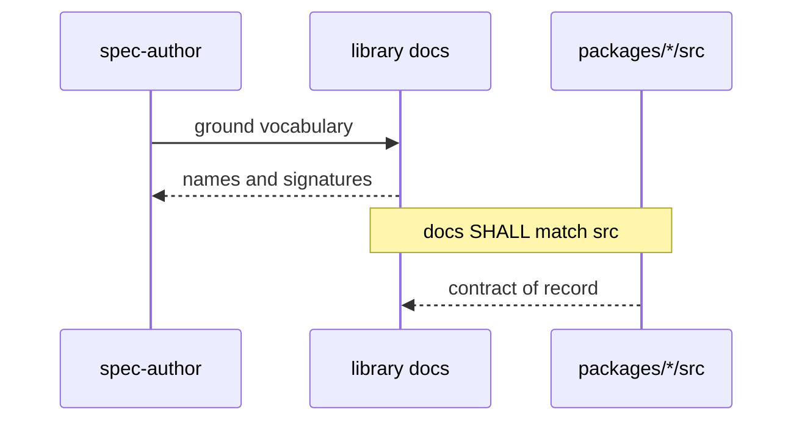

# Docs truth

Published library docs, package READMEs, and adjacent source comments / test
titles match `packages/*/src`. The TypeScript public API is not rewritten to
match old documentation. Not a semver event.

**Library docs** means tracked markdown at:

- repository-root `README.md` and `APPENDIX.md`
- `docs/**/*.md` except `docs/internal/spec/**`, `docs/internal/packets/**`,
  and `docs/internal/archive/**`
- `packages/*/README.md`

**Implementation corpus** means tracked `packages/**/*.ts` excluding
`**/dist/**`.

**Harness markdown** means tracked files under `.cursor/agents/`,
`.cursor/skills/`, `.cursor/commands/`, `.claude/agents/`, `.claude/skills/`,
and `.claude/commands/`.

## Requirements

### Requirement: Phantom public APIs are absent from library docs
Library docs SHALL NOT present any of these identifiers as a callable or
importable public API of this repository:

- `commandsOf` (S3 probe)
- `harness.expect.unordered` / `.unordered([`
- `InMemoryCache`
- `NotImplementedError`
- `SqlDriver.executeForward` / `executeForward(query)`
- `formatBoundParameters`
- `QueryProbe.queries` / `db.probe.queries` / probe member `.queries`
- `createProbedSqlAdapter(driver, harness`

The real names, from `packages/*/src`, are: `command(ctor)` / `command(name)`;
`harness.expect.allOf`; `CacheAdapter` and `CacheProbe`; a plain `Error` from
`errors.unsupportedForward`; `SqlDriver.onApplicationQuery` / `reset` /
`close`; `createProbedSqlAdapter({ harness, driver, defaultTimeout? })`
returning `{ probe, probeRoot }`; `QueryProbe.sql(...)` plus inherited
`calls`.

#### Scenario: phantom S3 commandsOf is absent
- **WHEN** library docs are read
- **THEN** they do not contain the identifier `commandsOf`

#### Scenario: phantom harness.expect.unordered is absent
- **WHEN** library docs are read
- **THEN** they do not contain `unordered(` as a `harness.expect` API

#### Scenario: phantom InMemoryCache is absent
- **WHEN** library docs are read
- **THEN** they do not contain the identifier `InMemoryCache`

#### Scenario: phantom NotImplementedError is absent
- **WHEN** library docs are read
- **THEN** they do not contain the identifier `NotImplementedError`

#### Scenario: phantom QueryProbe.queries is absent
- **WHEN** library docs are read
- **THEN** they do not document `.queries` as a member of `QueryProbe` or of
  a SQL adapter's `probe`

#### Scenario: phantom SqlDriver executeForward and formatBoundParameters are absent
- **WHEN** library docs are read
- **THEN** they do not contain `executeForward` or `formatBoundParameters`

#### Scenario: createProbedSqlAdapter is not documented as positional
- **WHEN** library docs mention `createProbedSqlAdapter`
- **THEN** they show a single options object `{ harness, driver }` (optional
  `defaultTimeout`) and a return of `{ probe, probeRoot }`, not positional
  `(driver, harness, options)` and not an adapter/probe pair

### Requirement: Redis README matches CacheAdapter and Duration
`packages/redis/README.md` SHALL document the exported `CacheAdapter`
interface and SHALL use `Duration` (not raw numbers) for public timing
parameters, matching `packages/redis/src/types.ts`.

#### Scenario: redis README names CacheAdapter and CacheProbe
- **WHEN** `packages/redis/README.md` is read
- **THEN** it names `CacheAdapter` as the injected adapter type and
  `CacheProbe` as the probe type, and it does not name `MethodProbe` as the
  redis probe type

#### Scenario: redis README timing parameters are Duration
- **WHEN** the `CacheAdapter` sketch in `packages/redis/README.md` is read
- **THEN** `set` takes `ttl?: Duration`, `setnx` takes required
  `options: { readonly ttl: Duration }` with no `mode` / `"PX"` / `"EX"`,
  and `getSet` takes `ttl?: Duration | ((result: T) => Duration)`

### Requirement: SQL README matches QueryCall, QueryProbe, and SqlDriver
`packages/sql/README.md` SHALL describe `QueryCall` as `{ sql, parameters }`
only, `QueryProbe` as carrying `sql(...)` plus inherited `calls` (not
`.queries` / `.on`), and `SqlDriver` as `onApplicationQuery` / `reset` /
`close`. `docs/architecture.md` SHALL use that same `SqlDriver` shape (no
`forward()` method on the driver). `docs/internal/tech-design.md` already
matches source and SHALL remain consistent with it.

#### Scenario: QueryCall is documented without a raw-statement field
- **WHEN** `packages/sql/README.md` describes `QueryCall`
- **THEN** the documented fields are `sql` and `parameters` only

#### Scenario: SqlDriver in architecture matches source
- **WHEN** `docs/architecture.md` sketches `SqlDriver`
- **THEN** the sketch includes `onApplicationQuery`, `reset`, and `close`,
  and does not include a `forward` method on the driver

### Requirement: S3 docs match in-memory backing and recorded call shapes
Library docs and the S3 implementation corpus SHALL present the S3 backing as
the in-memory dispatcher in `packages/s3/src/s3-client/in-memory-backing.ts`.
They SHALL NOT present `mock-aws-s3` or `mock-aws-s3-v3` as the current
backing. Historical wording that it *replaced* that dependency is allowed.

`reset()` / `close()` SHALL be documented as operating on that in-memory
store, not as filesystem operations. `localDirectory` SHALL be documented as
deprecated and ignored (always `''`). Presigner SHALL be documented as having
no default rule (calls park). `S3Call` SHALL be `{ commandName, command,
input }`. `PresignCall` SHALL be `{ commandName, commandInput, options }` at
the top level (no `input` field). Unsupported forwards SHALL be documented as
a plain `Error` whose message uses `command`, matching
`errors.unsupportedForward`.

#### Scenario: mock-aws-s3 is not the current S3 backing
- **WHEN** library docs and the S3 implementation corpus are read
- **THEN** they do not claim `mock-aws-s3` or `mock-aws-s3-v3` is the current
  backing, and S3 integration test titles do not name `mock-aws-s3-v3` as the
  backing under test

#### Scenario: S3 reset and close are not filesystem operations
- **WHEN** `docs/api-surface.md` describes S3 `reset()` and `close()`
- **THEN** it does not say they empty or remove a local directory

#### Scenario: localDirectory is documented as deprecated and ignored
- **WHEN** `docs/api-surface.md` documents `CreateProbedS3AdapterOptions` or
  `ProbedS3Adapter.localDirectory`
- **THEN** it states that `localDirectory` is deprecated, ignored by the
  in-memory backing, and always the empty string on the returned handle

#### Scenario: presigner has no default rule
- **WHEN** `packages/s3/README.md` describes the presigner default
- **THEN** it states that calls park with no default rule, and it does not
  claim the default is `reject`

#### Scenario: S3 and Presign call shapes match source
- **WHEN** `packages/s3/README.md` documents recorded call shapes
- **THEN** `S3Call` is `{ commandName, command, input }` without `options`,
  `PresignCall` is `{ commandName, commandInput, options }` at the top level,
  and examples that settle a presign call read `commandInput` / `options`
  from the call itself rather than from `call.input`

### Requirement: pg factory types in api-surface match source
`docs/api-surface.md` SHALL document the pg-* factory option and handle
types as declared in `packages/pg-kysely/src/factory.ts`,
`packages/pg-knex/src/factory.ts`, and
`packages/pg-sequelize/src/factory.ts`.

#### Scenario: knex factory options include extensions and knexConfig
- **WHEN** `CreateProbedKnexAdapterOptions` is documented in
  `docs/api-surface.md`
- **THEN** it includes optional `extensions` and `knexConfig`

#### Scenario: sequelize factory options match source
- **WHEN** `CreateProbedSequelizeAdapterOptions` and
  `ProbedSequelizeAdapter` are documented in `docs/api-surface.md`
- **THEN** `bootstrap` is optional; `preBootstrap`, `models`,
  `SequelizeClass`, `extensions`, and `sequelizeOptions` are documented; and
  `seed` is `seed(table: string, rows: ReadonlyArray<Record<string, unknown>>)`

#### Scenario: kysely handle documents pglite and notifications
- **WHEN** `ProbedKyselyAdapter` is documented in `docs/api-surface.md`
- **THEN** it includes `pglite` and `notifications`

### Requirement: Unshipped HTTP package is not presented as current
Library docs SHALL NOT present `@vnatures/test-kit-http` as a shipped
package, a reserved API with types, or a runnable probe. There is no
`packages/http/` workspace. A single explicit "not shipped" mention is
allowed; whole sections of types and examples are not.

#### Scenario: test-kit-http is not documented as a live package
- **WHEN** library docs are read
- **THEN** they do not contain a section that defines `HttpClient`,
  `HttpCall`, `HttpPendingCall`, or `HttpProbe` as current API, and they do
  not list `packages/http/` as part of the live repository tree

### Requirement: Live documentation filenames are current
Library docs and the implementation corpus SHALL cite the live paths
`docs/concepts.md`, `docs/api-surface.md`, `docs/architecture.md`, and
`docs/internal/tech-design.md`. They SHALL NOT cite `docs/v2-*.md` (or
`v2-concepts.md` / `v2-api-surface.md` / `v2-architecture.md` /
`v2-tech-design.md`) as existing files.

#### Scenario: v2-prefixed doc filenames are not cited as live paths
- **WHEN** library docs and the implementation corpus are read
- **THEN** they do not contain `v2-concepts.md`, `v2-api-surface.md`,
  `v2-architecture.md`, or `v2-tech-design.md` as file paths

### Requirement: pglite-driver is documented as published
Library docs and `packages/pglite-driver/src/index.ts` comments SHALL NOT
claim `@vnatures/test-kit-pglite-driver` is `private: true` or
workspace-internal-only. The package is published (`publishConfig` set, no
`private` field).

#### Scenario: pglite-driver is not documented as private
- **WHEN** library docs and `packages/pglite-driver/src/index.ts` are read
- **THEN** they do not state that the package is `private: true` or
  unpublished

### Requirement: pg-kysely's dialect dependency is named correctly
`APPENDIX.md` SHALL name the Kysely dialect package actually depended on:
`kysely-pglite-dialect`.

#### Scenario: APPENDIX names kysely-pglite-dialect
- **WHEN** `APPENDIX.md` describes what `test-kit-pg-kysely` uses
- **THEN** it names `kysely-pglite-dialect` and does not claim `kysely-pglite`
  is that dependency

### Requirement: Package inventories list every published workspace package
Root `README.md`, `docs/architecture.md` (package graph and domain-layer
sentence), and `docs/api-surface.md` (Package Names) SHALL each name all
thirteen published packages:

`@vnatures/test-kit`, `@vnatures/test-kit-pglite-driver`,
`@vnatures/test-kit-mock`, `@vnatures/test-kit-sql`,
`@vnatures/test-kit-redis`, `@vnatures/test-kit-bull`,
`@vnatures/test-kit-s3`, `@vnatures/test-kit-sqs`,
`@vnatures/test-kit-kafka`, `@vnatures/test-kit-mysql`,
`@vnatures/test-kit-pg-kysely`, `@vnatures/test-kit-pg-knex`,
`@vnatures/test-kit-pg-sequelize`.

#### Scenario: root README package table is complete
- **WHEN** the Packages table in root `README.md` is read
- **THEN** it includes a row for each of those thirteen packages

#### Scenario: architecture package graph is complete
- **WHEN** the Package Graph and domain-layer list in
  `docs/architecture.md` are read
- **THEN** they include kafka, sqs, and mysql as well as the packages
  already listed

#### Scenario: api-surface package names list is complete
- **WHEN** the Package Names list in `docs/api-surface.md` is read
- **THEN** it includes `@vnatures/test-kit-sql` and
  `@vnatures/test-kit-pglite-driver` as well as the packages already listed

### Requirement: architecture repository layout matches the tree
The "Repository Layout" tree and per-package "Module layout" lists in
`docs/architecture.md` SHALL name files that exist under `packages/*/src`
and `docs/`, SHALL NOT name files that do not exist, and SHALL include all
thirteen package directories (not omit bull, kafka, mysql, sqs).
`docs/internal/` SHALL list `tech-design.md`. `docs/` SHALL list
`concepts.md`, `api-surface.md`, and `architecture.md` (not `v2-*`
filenames). Core source SHALL include `expectation-engine.ts`,
`stream-probe-engine.ts`, `stream-types.ts`, `types.ts`, and `index.ts`, and
SHALL NOT list `selection.ts`, `rule-builder.ts`, `expectations.ts`,
`pending-call.ts`, or `probe-root.ts`. Mock SHALL list `factory.ts` (not
`proxy.ts`). SQL SHALL not list a non-existent `driver.ts`. pglite-driver
SHALL list `index.ts` only. pg-* SHALL not list non-existent `seed.ts` /
`reset.ts`; pg-sequelize's dialect file is `dialect.ts`. Redis SHALL list
`key.ts` (not `adapter.ts`). S3 SHALL list `s3-client/factory.ts`,
`s3-client/in-memory-backing.ts`, and `presigner/factory.ts` (not
`adapter.ts` or `command-extraction.ts`).

#### Scenario: architecture layout files exist on disk
- **WHEN** the Repository Layout tree in `docs/architecture.md` is read
- **THEN** every `packages/*/src/...` file it names exists, and it does not
  name `selection.ts`, `rule-builder.ts`, `expectations.ts`,
  `pending-call.ts`, `probe-root.ts`, mock `proxy.ts`, sql `driver.ts`,
  pglite-driver `lifecycle.ts` or `maintenance-connection.ts`, pg-*
  `seed.ts` or `reset.ts`, redis `adapter.ts`, or s3 `adapter.ts` /
  `command-extraction.ts`

#### Scenario: architecture layout includes the omitted packages and files
- **WHEN** the Repository Layout tree in `docs/architecture.md` is read
- **THEN** it includes `packages/bull`, `packages/kafka`, `packages/mysql`,
  and `packages/sqs`, lists `docs/internal/tech-design.md`, and lists core
  `expectation-engine.ts`, `stream-probe-engine.ts`, `stream-types.ts`, and
  `types.ts`

### Requirement: tech-design build section matches the manifests
`docs/internal/tech-design.md` Build & Distribution SHALL match the live
root `package.json`, per-package `package.json` files, and root
`tsconfig.json`: Vite library mode emitting `./dist/index.js` (not
`.mjs`); nested `exports` with `import`/`require` and `.d.cts`; root
`build` is `npm run build --workspaces --if-present` (no preceding
`tsc --build`); tooling majors vite 6 / vitest 3 / eslint 8; per-package
scripts include `pretest` (except pglite-driver) rather than `test:watch`;
tsconfig references include all thirteen packages plus
`examples/grpc-client`; packages *do* declare their own `devDependencies`
for vite/vitest/eslint/typescript. It SHALL NOT claim pglite-driver has a
`test/` directory. It SHALL NOT offer `tsd` as an installed type-testing
tool (`expect-type` is what is installed). Version examples SHALL not
claim the family is at `2.0.0` while packages are at 1.x.

#### Scenario: tech-design module path is dist/index.js
- **WHEN** the Build & Distribution example `package.json` in
  `docs/internal/tech-design.md` is read
- **THEN** `"module"` is `./dist/index.js`, not `./dist/index.mjs`

#### Scenario: tech-design root scripts match package.json
- **WHEN** the root scripts sketch in `docs/internal/tech-design.md` is read
- **THEN** `build` does not chain `tsc --build &&`, `lint` is workspace
  `npm run lint --workspaces --if-present` (or equivalent), and
  `format:check` is present

#### Scenario: tech-design does not claim pglite-driver has tests or that tsd is installed
- **WHEN** `docs/internal/tech-design.md` and `docs/architecture.md` discuss
  type testing and per-package tests
- **THEN** they do not claim `packages/pglite-driver/` has a `test/`
  directory, and they do not present `tsd` as an installed option without
  stating it is not in the lockfile

### Requirement: Resolved design decisions are not listed as open
`docs/architecture.md` "Decisions Still Open" and matching pre-release
rename framing in `docs/internal/tech-design.md` SHALL NOT present as
unresolved things that shipped: `createProbeRoot` exists; storage model is
implemented; pglite-driver is published; errors are plain `Error` /
`RangeError`; packages ship as `@vnatures/test-kit-*` at 1.x (not as a
placeholder pending `boundary-probe`). `docs/api-surface.md` SHALL NOT
hedge whether `QueryProbe` lives in core or `@vnatures/test-kit-sql` — it
lives in `@vnatures/test-kit-sql`.

#### Scenario: architecture does not list shipped decisions as open
- **WHEN** `docs/architecture.md` "Decisions Still Open" is read
- **THEN** it does not list `createProbeRoot` signature, internal storage
  representation, pglite-driver private-vs-published, error class
  hierarchy, or package naming as still open

#### Scenario: QueryProbe package location is not hedged
- **WHEN** `docs/api-surface.md` names the package that defines `QueryProbe`
- **THEN** it names `@vnatures/test-kit-sql` without an "or a sibling"
  hedge

### Requirement: Named consumer-facing exports appear in api-surface
`docs/api-surface.md` SHALL mention each of these exported names:

`autoDetectClock`, `ManualClock`, `pgliteTypes`, `InMemoryKafkaBacking`,
`InMemorySqsBacking`, `SUPPORTED_SQS_COMMANDS`,
`DEFAULT_VISIBILITY_TIMEOUT_SECONDS`, `BullProcessor`, `BullJobType`,
`BullQueueType`, `InMemoryJob`, `JobCounts`, `ModelCtor`, `SequelizeCtor`,
`CreateProbedSqlAdapterOptions`, `PgliteNotifications`,
`CreatePgliteHandleOptions`, `StreamChunkOf`, `StreamExpectations`,
`StreamPendingCallBase`, `createChannel`, `makeStreamPendingBase`.

#### Scenario: consumer-facing exports are named in api-surface
- **WHEN** `docs/api-surface.md` is read
- **THEN** each of those identifiers appears at least once

### Requirement: api-surface type sketches match source aliases
`docs/api-surface.md` SHALL declare `QueryProbe`, `CacheProbe`, and
`S3Probe` as extending `ForwardableProbe` (not `Probe`). It SHALL use
`ProbedAdapterWithLifecycle` where source does, or an equivalent that
names that alias. `QueryCall`, `CacheCall`, `BullQueueCall`, `S3Call`,
`PresignCall`, and `SqsCall` SHALL be documented as `interface` (as in
source), not `export type X = {…}`. The unsupported-forward template in
the Error Message Requirements list SHALL say `command` (not `call`). That
list SHALL include the `atLeast` and `cannotForwardNoBacking` templates
from `packages/core/src/errors.ts`. Section titles SHALL not frame the
shipped 1.x reference as "Finalized v2 API Decisions" / "part of the v2
target".

#### Scenario: probes that forward are documented as ForwardableProbe
- **WHEN** `docs/api-surface.md` declares `QueryProbe`, `CacheProbe`, and
  `S3Probe`
- **THEN** each extends `ForwardableProbe`

#### Scenario: call shapes are documented as interfaces
- **WHEN** `docs/api-surface.md` declares `QueryCall`, `CacheCall`,
  `BullQueueCall`, `S3Call`, `PresignCall`, and `SqsCall`
- **THEN** each is an `interface`, not a `type` alias to an object literal

#### Scenario: error templates include command wording, atLeast, and cannotForwardNoBacking
- **WHEN** the Error Message Requirements list in `docs/api-surface.md` is
  read
- **THEN** the unsupported-forward template uses `command`, and the list
  includes the `atLeast` and `cannotForwardNoBacking` messages from
  `packages/core/src/errors.ts`

### Requirement: Version framing matches the shipped major
`docs/internal/migration-from-v1.md` SHALL not contradict itself: the
migration target is **2.0.0** of this OSS line (as the title, `docs/README.md`
and `docs/internal/README.md` now say), not a "v1.0.0" claim beside a 2.x API
and not a "v2" column. Consumer-facing `docs/concepts.md` SHALL NOT say
"v2 uses" / "A v2 adapter" / "v2 inverts the model" for behaviour that is
simply true of the shipped API.

Retargeted from `v1.0.0` by RD-24143/RD-24144, which moved the shipped surface
to major 2. Note the published patch advances on its own: `vn-ci/init` bumps it
on every merge to `main`, so the first published 2.x was `2.0.1`. Prose should
name the **major line**, not a frozen patch — see
[`core-public-api.md`](core-public-api.md).

#### Scenario: migration tables are not headed v1 vs v2
- **WHEN** mapping tables in `docs/internal/migration-from-v1.md` are read
- **THEN** they are not headed `| v1 | v2 |`

#### Scenario: concepts.md does not describe the shipped API as v2
- **WHEN** `docs/concepts.md` is read
- **THEN** it does not contain `v2 uses`, `A v2 adapter`, or
  `v2 inverts the model`

### Requirement: Relative documentation links resolve
Every relative markdown link in library docs SHALL resolve to a tracked
file. `packages/pglite-driver/` is a published package and SHALL have a
`README.md` so the sql README link to it is valid.

#### Scenario: pglite-driver README exists
- **WHEN** the filesystem is inspected at `packages/pglite-driver/README.md`
- **THEN** the path exists

#### Scenario: sql README pglite-driver link resolves
- **WHEN** the relative link from `packages/sql/README.md` to
  `pglite-driver/README.md` is resolved
- **THEN** the target file exists

### Requirement: Harness prose does not claim the 41 defects are still open
Harness markdown SHALL NOT claim, in the present tense, that published docs
contain 41 known defects, 21 actively misleading APIs, or that READMEs
document APIs that do not exist. That caveat is false. Referring to
RD-24142 as the ticket that reconciled docs is allowed.

#### Scenario: present-tense 41-defect caveat is gone
- **WHEN** harness markdown is scanned for "41 known defects" /
  "41 of them" / "until RD-24142 lands" / "docs currently lie"
- **THEN** none of those files claim the defects are still outstanding

### Requirement: Docs-truth tests run on the root test path
Tests that encode these scenarios SHALL run as part of the root `npm test`
workspace. (Root `format:check` already globs `test/**/*.ts`, so new files
under `test/docs-truth/` are format-checked without a further glob change.)

#### Scenario: docs-truth tests are in the Vitest workspace
- **WHEN** `vitest.workspace.ts` is read
- **THEN** it includes a project that picks up the tests for this capability

## Flow

## Decisions (rung recorded)

| Decision | Outcome | Rung |
| --- | --- | --- |
| Code wins over docs; docs are rewritten | Phantom APIs are removed from docs; source signatures are not changed to match the old READMEs | Source (`packages/*/src`) plus ticket ("docs truth pass") |
| `SqlDriver` is `onApplicationQuery` / `reset` / `close` | architecture.md and sql README are aligned to that; tech-design already matches | Source `packages/sql/src/types.ts`; sibling: tech-design.md:845 |
| HTTP adapter sections are removed as live API | Not shipped; a one-line "not shipped" mention is allowed | Source: no `packages/http/` |
| Historical "replaced mock-aws-s3-v3" wording stays | Only *current-backing* claims are forbidden | Ticket inventory (s3 README:169 is the correct one) |
| Adjacent test titles and source comments are in scope | S3 test titles and `docs/v2-*.md` comments are corrected | Ticket ("3 misleading test names"; "same find/replace") |
| B12 scoped to the named consumer-facing exports | Not all ~50 engine types | Ticket inventory ("~12 consumer-facing"; "documenting all 50 is a different packet") |
| `packages/pglite-driver/README.md` is added | Fixes the only broken relative link; published package gets a README | Ticket A14 plus source: package is published |
| Library-docs corpus excludes spec/packets/archive | So a delta can name phantoms without failing its own tests | Precedent: P00 tests read tracked files at a defined boundary |
| Tests live at `test/docs-truth/` | Sibling of `test/ci-gate/`, not inside a published package | P00 precedent (repo-file boundary) plus write-failing-tests |
| No public API / version bump | Docs follow code | Source: no `packages/*/src` behaviour change |

## Out of scope (deferred)

| Item | Consequence of deferring |
| --- | --- |
| Documenting remaining internal engine exports (`FilterChain`, `CallRecord`, `StreamRecord`, …) | api-surface still omits types that domain packages import from core |
| Adding a `packages/pglite-driver/test/` suite | Package still uses `--passWithNoTests`; a README is added, not tests |
| Compiling every markdown TypeScript fence | Signature drift is locked by string/shape assertions, not `tsc` on fences |
| Mutation testing / CRAP (RD-24153) | Phase 5 still cannot tell whether green means anything |

## Acceptance mapping

1. Library docs do not contain `commandsOf`, `InMemoryCache`, `NotImplementedError`, `executeForward`, or `formatBoundParameters`.
2. Library docs do not document `harness.expect.unordered`, `QueryProbe.queries` / `db.probe.queries`, or positional `createProbedSqlAdapter(driver, harness, …)`.
3. Redis README documents `CacheAdapter` / `CacheProbe` with `Duration` timing (required `setnx` options, no `mode`).
4. SQL README `QueryCall` is `{ sql, parameters }`; architecture `SqlDriver` matches source (no driver `forward()`).
5. S3 backing is in-memory; `mock-aws-s3-v3` is not the current backing in docs or S3 test titles; `reset`/`close` are not filesystem ops; `localDirectory` is deprecated/ignored; presigner has no default rule; call shapes match `S3Call` / `PresignCall`.
6. api-surface knex options include `extensions` and `knexConfig`; sequelize `bootstrap` is optional and the other real options exist; sequelize `seed(table, rows)`; kysely handle includes `pglite` and `notifications`.
7. `@vnatures/test-kit-http` is not a live API section; `packages/http/` is not in the live tree.
8. `v2-concepts.md` / `v2-api-surface.md` / `v2-architecture.md` / `v2-tech-design.md` are not cited as live paths in library docs or `packages/**/*.ts`.
9. pglite-driver is not documented as `private: true`.
10. `APPENDIX.md` names `kysely-pglite-dialect` for pg-kysely.
11. README, architecture package graph, and api-surface Package Names each list all thirteen published packages.
12. architecture Repository Layout names only files that exist and includes bull, kafka, mysql, sqs, `tech-design.md`, and the real core/mock/sql/redis/s3/pglite-driver filenames.
13. tech-design Build & Distribution matches live manifests (`dist/index.js`, workspace build, vite 6 / vitest 3 / eslint 8, no false pglite-driver `test/` or installed `tsd`).
14. Shipped decisions are not listed as open; QueryProbe is in `@vnatures/test-kit-sql` without a hedge.
15. The named consumer-facing exports appear in `docs/api-surface.md`.
16. `QueryProbe` / `CacheProbe` / `S3Probe` extend `ForwardableProbe`; listed call shapes are `interface`; unsupported-forward says `command`; `atLeast` and `cannotForwardNoBacking` are in the error list.
17. migration-from-v1 tables are not `| v1 | v2 |`; concepts.md does not describe shipped behaviour as "v2".
18. `packages/pglite-driver/README.md` exists and the sql README relative link resolves.
19. Harness markdown does not claim the 41 defects are still outstanding.
20. Docs-truth tests are in `vitest.workspace.ts` (root `format:check` already covers `test/**/*.ts`).
