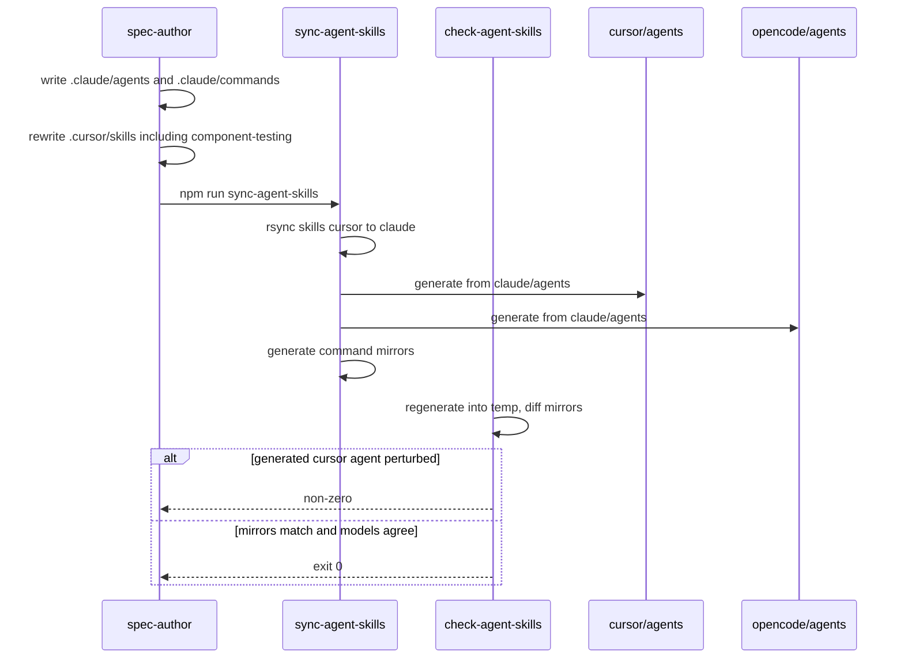
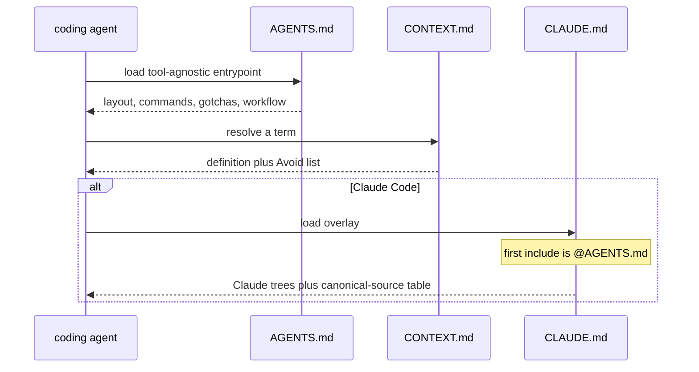
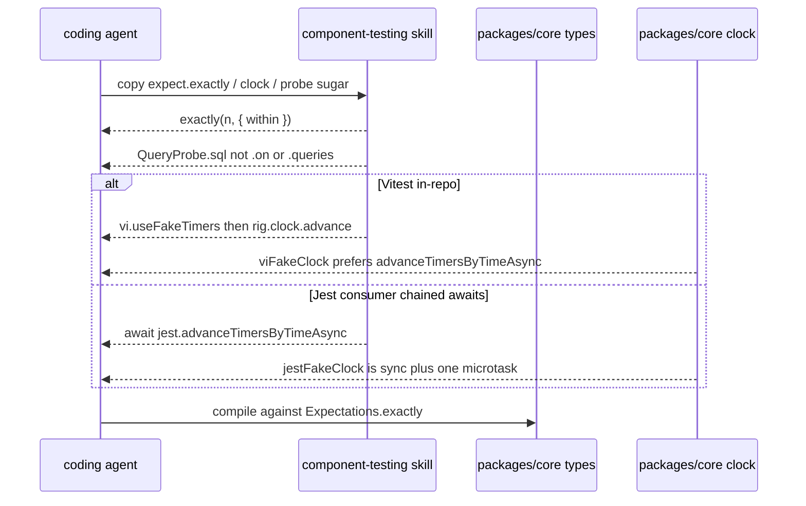
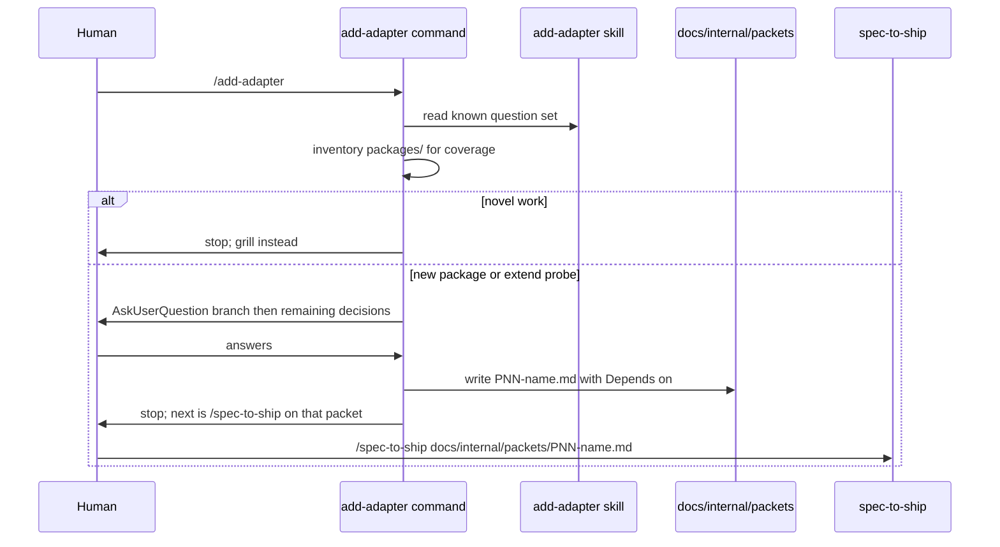
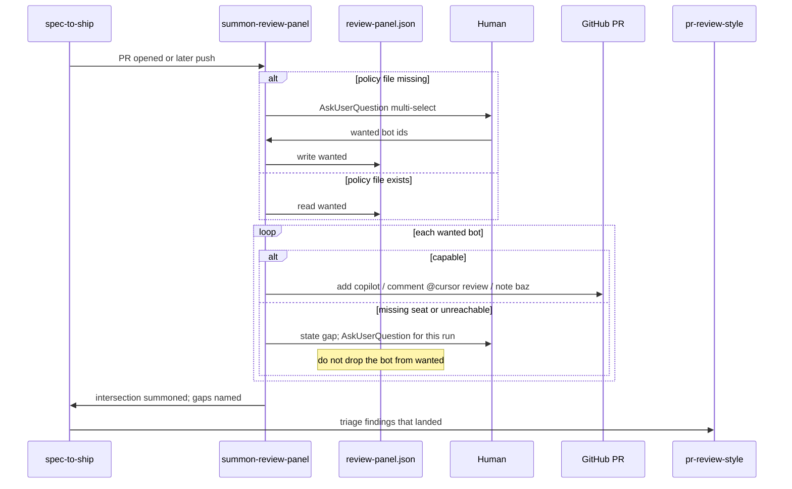

# Harness prose

Current truth for the *content* of this repository's agent harness: the five
phase agents, the `spec-to-ship` command, the phase and support skills, the
`.cursor/rules` blinkers, and the three repo-root agent entrypoints
(`CONTEXT.md`, `AGENTS.md`, `CLAUDE.md`). One file, not a pile of packet
histories.

The directories, model manifest, and sync/check machinery that carry this prose
are a separate capability — see `harness-scaffold.md`.

Folded from the P06 delta (RD-24147), preserved at
`docs/internal/archive/2026-09-07-P06-harness-agents-skills/delta.md`.

Folded from the P07 delta (RD-24148), preserved at
`docs/internal/archive/2026-09-08-P07-context-and-agent-docs/delta.md`.

Folded from the RD-24169 delta, preserved at
`docs/internal/archive/2026-09-08-RD-24169-component-testing-2x-api/delta.md`.

Folded from the P08 delta (RD-24149), preserved at
`docs/internal/archive/2026-09-10-P08-add-adapter-steering/delta.md`.

Folded from the P11 delta (RD-24152), preserved at
`docs/internal/archive/2026-09-10-P11-summon-review-panel/delta.md`.

Folded from the P09 delta (RD-24150), preserved at
`docs/internal/archive/2026-09-10-P09-blinker-ratchet/delta.md`.

## Requirements

### Requirement: Canonical Claude agent files exist
`.claude/agents/` SHALL contain exactly these five markdown files, one per
pipeline phase: `spec-author.md`, `test-author.md`, `coder.md`,
`reviewer.md`, `verifier.md`. Each file's YAML `model:` value SHALL equal
`agents[<name>].claude` in `.harness/models.json`. `reviewer.md` and
`verifier.md` SHALL NOT list `Edit` or `Write` among their `tools:`.

#### Scenario: five canonical Claude agent files exist
- **WHEN** `.claude/agents/` is listed
- **THEN** it contains `spec-author.md`, `test-author.md`, `coder.md`,
  `reviewer.md`, and `verifier.md`

#### Scenario: each Claude agent model matches the manifest
- **WHEN** each `.claude/agents/<name>.md` frontmatter `model:` is read
  alongside `.harness/models.json`
- **THEN** that value equals `agents[name].claude`

#### Scenario: reviewer and verifier cannot edit
- **WHEN** `.claude/agents/reviewer.md` and `.claude/agents/verifier.md` are
  read
- **THEN** neither file's `tools:` list contains `Edit` or `Write`

### Requirement: Canonical spec-to-ship command exists
`.claude/commands/` SHALL contain `spec-to-ship.md`. That file SHALL include
a paragraph that starts with `**Model selection.**` so the Cursor command
translator can append its `generalPurpose` fallback. The command SHALL tell
the orchestrator to stop after the PR is addressed, and SHALL NOT instruct
a merge onto `main` or an archive of the spec delta while the PR is open.

#### Scenario: spec-to-ship command is canonical under Claude
- **WHEN** `.claude/commands/` is listed
- **THEN** it contains `spec-to-ship.md`

#### Scenario: command has a Model selection paragraph
- **WHEN** `.claude/commands/spec-to-ship.md` is read
- **THEN** it contains `**Model selection.**`

#### Scenario: command does not merge or archive on an open PR
- **WHEN** `.claude/commands/spec-to-ship.md` is read
- **THEN** it tells the orchestrator to stop after review threads are
  addressed, and it does not instruct merging onto `main` or moving files
  into `docs/internal/archive/` while the PR is open

### Requirement: Canonical add-adapter command exists
`.claude/commands/` SHALL contain `add-adapter.md`. That file is the
single phase-0 command for both "new `packages/<domain>/`" and "extend
an existing probe's surface". `.claude/commands/` SHALL NOT contain a
second command file that splits those branches (`extend-probe.md`,
`new-package.md`, or `extend-test-kit.md`).

The command SHALL tell the orchestrator to read the `add-adapter` skill
before asking questions. Its first question SHALL be the branch: new
`packages/<domain>/` versus extend an existing probe's surface.

The command SHALL ask the human the decision questions (via
`AskUserQuestion` in the canonical Claude file). It SHALL look up facts
itself (`packages/` coverage, `SqlDriver`, existing factory names,
whether `testcontainers` is already a dependency) and SHALL NOT ask the
human for those facts.

The command SHALL write one file under `docs/internal/packets/` whose
name matches `PNN-*.md` and whose body includes a `Depends on:` header.
It SHALL NOT write a spec delta under `docs/internal/spec/`. It SHALL
NOT run `/spec-to-ship`. After writing the packet it SHALL stop and name
`/spec-to-ship` with that packet path as the next step.

When the work is neither a new domain package nor an extension of an
existing probe, the command SHALL stop without writing a packet and SHALL
leave grilling as the fallback.

The command runs in the main thread. It SHALL NOT add a sixth pipeline
agent.

#### Scenario: add-adapter command is canonical under Claude
- **WHEN** `.claude/commands/` is listed
- **THEN** it contains `add-adapter.md` and does not contain
  `extend-probe.md`, `new-package.md`, or `extend-test-kit.md`

#### Scenario: command reads the skill and branches first
- **WHEN** `.claude/commands/add-adapter.md` is read
- **THEN** it contains `add-adapter` as the skill to read, contains
  `AskUserQuestion`, and asks whether the work is a new
  `packages/<domain>/` or an extension of an existing probe

#### Scenario: command writes a packet and does not run spec-to-ship
- **WHEN** `.claude/commands/add-adapter.md` is read
- **THEN** it tells the orchestrator to write under
  `docs/internal/packets/`, contains `Depends on:`, does not tell it to
  write under `docs/internal/spec/deltas/`, and does not tell it to run
  `/spec-to-ship` as part of this command

#### Scenario: novel work falls back to grilling
- **WHEN** `.claude/commands/add-adapter.md` is read
- **THEN** it says to stop without writing a packet when the work is
  not a new domain package and not an extension of an existing probe,
  and it names grilling as the fallback

### Requirement: spec-to-ship names add-adapter as the adapter packet-shaping step
`.claude/commands/spec-to-ship.md` and
`.cursor/skills/spec-to-ship/SKILL.md` SHALL name `/add-adapter` as the
step that shapes an adapter or probe packet before the five phases.
They SHALL NOT fold the add-adapter question set into `/spec-to-ship`
itself.

#### Scenario: spec-to-ship command names add-adapter
- **WHEN** `.claude/commands/spec-to-ship.md` is read
- **THEN** it contains `add-adapter`

#### Scenario: spec-to-ship skill names add-adapter
- **WHEN** `.cursor/skills/spec-to-ship/SKILL.md` is read
- **THEN** it contains `add-adapter`

### Requirement: Generated agent mirrors carry readonly from the manifest
After a successful `sync-agent-skills`, `.cursor/agents/reviewer.md` and
`.cursor/agents/verifier.md` SHALL have YAML `readonly: true`;
`.cursor/agents/spec-author.md`, `.cursor/agents/test-author.md`, and
`.cursor/agents/coder.md` SHALL have `readonly: false`. The OpenCode
reviewer and verifier mirrors SHALL deny the edit permission.

`.opencode/agents/` SHALL contain the same five agent markdown filenames,
and `.opencode/commands/` SHALL contain `spec-to-ship.md` and
`add-adapter.md`.

#### Scenario: Cursor readonly flags match the manifest
- **WHEN** the five `.cursor/agents/<name>.md` files are parsed after a
  consistent sync
- **THEN** `readonly` is false, false, false, true, true in phase order

#### Scenario: OpenCode reviewer and verifier deny edit
- **WHEN** `.opencode/agents/reviewer.md` and `.opencode/agents/verifier.md`
  are read after a consistent sync
- **THEN** each file's frontmatter includes `permission:` with `edit: deny`

#### Scenario: OpenCode mirrors are populated
- **WHEN** `.opencode/agents/` and `.opencode/commands/` are listed after a
  consistent sync
- **THEN** the agents directory contains the five phase markdown files and
  the commands directory contains `spec-to-ship.md` and `add-adapter.md`

### Requirement: Generated command mirrors include add-adapter
After a successful `sync-agent-skills`, `.cursor/commands/` and
`.opencode/commands/` SHALL each contain `add-adapter.md`.

There SHALL NOT be a `.opencode/agents/add-adapter.md` or a sixth
pipeline agent. The generated OpenCode command MAY keep the existing
translator `agent: spec-to-ship` binding (the primary orchestrator,
which already allows `question`).

#### Scenario: Cursor and OpenCode command mirrors include add-adapter
- **WHEN** `.cursor/commands/` and `.opencode/commands/` are listed after
  a consistent sync
- **THEN** each directory contains `add-adapter.md`

#### Scenario: no sixth OpenCode add-adapter agent
- **WHEN** `.opencode/agents/` is listed
- **THEN** it does not contain `add-adapter.md`

### Requirement: Support skills exist under the Cursor canonical tree
`.cursor/skills/` SHALL contain a `SKILL.md` in each of these
directories: `engineering-principles`, `regression-dog`,
`pr-review-style`, `hotspot-expansion-review`, `mutation-testing`,
`component-testing`, `add-adapter`, and `summon-review-panel`, and in
each of these phase-skill directories:
`spec-to-ship`, `write-spec`, `write-failing-tests`, `code-to-green`,
`review-changes`, `verify-changes`.

It SHALL NOT contain skill directories named `slack-driven-sessions`,
`post-deploy-verify`, `help-docs-sync`, `refactor-to-hexagonal`,
`10-http-boundaries`, `extend-test-kit`, or `add-module`.

Donor service names SHALL NOT leak into the ported skills: none of
`engineering-principles`, `regression-dog`, `pr-review-style`,
`hotspot-expansion-review`, or `mutation-testing` SHALL mention
`@cycle-processing/contracts`, `pnpm verify`, or `lefthook`.

#### Scenario: eight support skills are present
- **WHEN** `.cursor/skills/` is listed
- **THEN** it contains directories named `engineering-principles`,
  `regression-dog`, `pr-review-style`, `hotspot-expansion-review`,
  `mutation-testing`, `component-testing`, `add-adapter`, and
  `summon-review-panel`, each with a `SKILL.md`

#### Scenario: six phase skills are present
- **WHEN** `.cursor/skills/` is listed
- **THEN** it contains directories named `spec-to-ship`, `write-spec`,
  `write-failing-tests`, `code-to-green`, `review-changes`, and
  `verify-changes`, each with a `SKILL.md`

#### Scenario: service-shaped donor skills are absent
- **WHEN** `.cursor/skills/` is listed
- **THEN** it has no directory named `slack-driven-sessions`,
  `post-deploy-verify`, `help-docs-sync`, `refactor-to-hexagonal`,
  `10-http-boundaries`, `extend-test-kit`, or `add-module`

#### Scenario: ported support skills do not name donor service machinery
- **WHEN** the five newly ported support `SKILL.md` files other than
  `component-testing` are read
- **THEN** none of them contains `@cycle-processing/contracts`,
  `pnpm verify`, or `lefthook`

### Requirement: add-adapter skill is the in-repo extender contract
`.cursor/skills/add-adapter/SKILL.md` SHALL exist. It is the in-repo
authoring guide that cycle-processing's `extend-test-kit` lacked: the
seven-step walkthrough from `docs/architecture.md` ("Adding a New Domain
Package: Walkthrough") plus `examples/grpc-client` as the extender
contract guard.

The skill SHALL tell the agent to inventory current coverage from
`packages/` rather than from a hardcoded missing list. It SHALL contain
`npm` and `workspaces`. It SHALL NOT contain `pnpm workspaces`,
`pnpm link`, `Missing (author these)`, or
`/Users/giladhoch/dev/test-kit`.

The skill SHALL name these decision topics so the command can ask them
without rediscovering the tree:

- Goldilocks boundary as too thin / too fat / just right, and that the
  Goldilocks ruling and its justification live in the **packet**
- call shapes `{method, args}`, `{sql, parameters}`, and
  `{commandName, command, input}`
- adapter categories programmable mock, backed, hybrid, and function
  boundary
- backing choices, including that PGlite is Postgres-only, and that
  `testcontainers` and `@testcontainers/mysql` are already dependencies
- `ProbedResource` `reset` / `close` when the adapter owns resources
- default-forward (`probe.always().forward()`) versus park
- filter sugars as strictly optional (Design Rule 13)
- SQL family via the `SqlDriver` seam in `packages/sql`, versus
  standalone
- factory naming `createProbed` and package naming
  `@vnatures/test-kit-`

The skill SHALL include a packet skeleton for `docs/internal/packets/PNN-*.md`
that contains `Depends on:`, a Goldilocks ruling, adapter category,
backing, what is explicitly out, and a size estimate against a ~40-test
split.

The skill SHALL state that its output is a packet (scope and shape), not
a spec (behaviour).

#### Scenario: add-adapter skill exists under the Cursor canonical tree
- **WHEN** `.cursor/skills/add-adapter/` is listed
- **THEN** it contains `SKILL.md`

#### Scenario: skill is not the stale consumer copy
- **WHEN** `.cursor/skills/add-adapter/SKILL.md` is read
- **THEN** it contains `npm` and `workspaces` and `packages/`, and it
  does not contain `pnpm workspaces`, `pnpm link`,
  `Missing (author these)`, or `/Users/giladhoch/dev/test-kit`

#### Scenario: skill teaches the seven-step walkthrough and contract guard
- **WHEN** `.cursor/skills/add-adapter/SKILL.md` is read
- **THEN** it contains `Adding a New Domain Package`, names call shape,
  pending call, probe, adapter, `ProbedResource`, `forward`, and
  factory, and contains `examples/grpc-client`

#### Scenario: skill names the known question set
- **WHEN** `.cursor/skills/add-adapter/SKILL.md` is read
- **THEN** it contains `too thin`, `too fat`, `just right`,
  `{method, args}`, `{sql, parameters}`, `{commandName, command, input}`,
  `programmable mock`, `hybrid`, `function-boundary` or
  `function boundary`, `PGlite`, `testcontainers`,
  `@testcontainers/mysql`, `ProbedResource`, `reset`, `close`,
  `probe.always().forward()`, `park`, `strictly optional`,
  `SqlDriver`, `createProbed`, and `@vnatures/test-kit-`

#### Scenario: skill packet skeleton owns scope not behaviour
- **WHEN** `.cursor/skills/add-adapter/SKILL.md` is read
- **THEN** it contains `docs/internal/packets/`, `Depends on:`,
  `Goldilocks`, `40`, and states that the packet owns scope and the spec
  owns behaviour

### Requirement: summon-review-panel skill summons the policy/capability intersection
`.cursor/skills/summon-review-panel/SKILL.md` SHALL exist. It is the
skill that summons the review panel on an open PR.

**Policy** is what this repository wants reviewed. It is committed at
`.harness/review-panel.json`. **Capability** is what the current
account can actually reach. Capability SHALL NOT be committed.

The skill SHALL summon the intersection: each bot in the policy that the
current account can invoke. For each policy bot it cannot invoke, it
SHALL state a gap that names the bot and that capability is missing
(no seat, unreachable). It SHALL NOT treat an unticked or omitted bot as
the same signal as a missing seat.

Known bot ids SHALL be exactly `copilot`, `bugbot`, and `baz`.

The skill SHALL summon those ids as:

- `copilot` — add `copilot` as a reviewer on the PR
- `bugbot` — comment `@cursor review` on the PR (that trigger string is
  the comment body; it SHALL NOT require the `🤖:` prefix used for
  review replies)
- `baz` — org-automatic if present; the skill SHALL NOT add Baz config,
  `CODEOWNERS`, or anything under `.github/`

The skill SHALL state that this does **not** contradict `no GitHub
Actions`: Copilot-as-reviewer and `@cursor review` are per-PR actions
needing zero CI.

Findings SHALL hand off to `pr-review-style`. The skill SHALL NOT
instruct triaging, applying, or rejecting review comments. It SHALL be
invokable after a later push without running triage.

There SHALL NOT be a `.claude/commands/summon-review-panel.md`. This
packet SHALL NOT add a sixth pipeline agent.

#### Scenario: summon-review-panel skill exists under the Cursor canonical tree
- **WHEN** `.cursor/skills/summon-review-panel/` is listed
- **THEN** it contains `SKILL.md`

#### Scenario: skill separates policy from capability
- **WHEN** `.cursor/skills/summon-review-panel/SKILL.md` is read
- **THEN** it contains `policy`, `capability`, and
  `.harness/review-panel.json`

#### Scenario: skill summons copilot as a reviewer and comments @cursor review
- **WHEN** `.cursor/skills/summon-review-panel/SKILL.md` is read
- **THEN** it contains `copilot` as a reviewer and contains
  `@cursor review`

#### Scenario: skill names baz and does not add GitHub Actions or Baz config
- **WHEN** `.cursor/skills/summon-review-panel/SKILL.md` is read
- **THEN** it contains `baz`, contains `no GitHub Actions`, and does
  not contain `.github/workflows`

#### Scenario: skill hands findings to pr-review-style
- **WHEN** `.cursor/skills/summon-review-panel/SKILL.md` is read
- **THEN** it contains `pr-review-style` and does not contain
  `Each finding is either actionable or noise`

#### Scenario: skill can be re-run without triage
- **WHEN** `.cursor/skills/summon-review-panel/SKILL.md` is read
- **THEN** it states that summoning can run again after a push without
  running triage

#### Scenario: no summon-review-panel command
- **WHEN** `.claude/commands/` is listed
- **THEN** it does not contain `summon-review-panel.md`

### Requirement: first-run records policy; later runs re-prompt only on failure
When `.harness/review-panel.json` is absent, the skill SHALL ask via
`AskUserQuestion` multi-select which of the known bot ids this
repository wants, write that answer as the `wanted` array in
`.harness/review-panel.json`, and SHALL NOT ask again on a later run
while that file exists.

After recording (or when the file already exists), the skill SHALL
summon the intersection.

When a summon fails, or a declared bot has gone unreachable, the skill
SHALL re-prompt via `AskUserQuestion` for this run. It SHALL NOT edit
`.harness/review-panel.json` to drop that bot: that would conflate
policy with capability. Changing `wanted` is an explicit committed edit.

#### Scenario: skill bootstraps missing policy via AskUserQuestion
- **WHEN** `.cursor/skills/summon-review-panel/SKILL.md` is read
- **THEN** it contains `AskUserQuestion`, `multi-select`, and
  `review-panel.json`

#### Scenario: later runs use recorded policy without asking
- **WHEN** `.cursor/skills/summon-review-panel/SKILL.md` is read
- **THEN** it states that a later run does not ask while
  `review-panel.json` exists

#### Scenario: skill states a capability gap without editing policy
- **WHEN** `.cursor/skills/summon-review-panel/SKILL.md` is read
- **THEN** it contains `policy wants` and `seat`, and it does not
  instruct removing a bot from `wanted` because a summon failed

#### Scenario: skill re-prompts when a summon fails or a bot is unreachable
- **WHEN** `.cursor/skills/summon-review-panel/SKILL.md` is read
- **THEN** it contains `AskUserQuestion` and `unreachable`

### Requirement: review-panel.json is committed policy without capability
The tracked file `.harness/review-panel.json` SHALL exist alongside
`.harness/models.json`. It SHALL be a JSON object with a `wanted` array
of bot id strings. Every entry SHALL be one of `copilot`, `bugbot`,
`baz`. This repository's committed `wanted` SHALL include `copilot`
and `bugbot`.

The object SHALL NOT contain a `capability` or `seats` key.

A `//` documentation key MAY exist. If present, it SHALL mention
`policy`.

#### Scenario: review-panel.json exists alongside models.json
- **WHEN** `.harness/` is listed
- **THEN** it contains `review-panel.json` and `models.json`

#### Scenario: review-panel.json wanted lists copilot and bugbot and no capability key
- **WHEN** `.harness/review-panel.json` is parsed
- **THEN** `wanted` is an array that includes `copilot` and `bugbot`,
  every entry is one of `copilot`, `bugbot`, or `baz`, and the object
  has no `capability` or `seats` key

### Requirement: spec-to-ship PR loop names summon-review-panel
`.claude/commands/spec-to-ship.md` and
`.cursor/skills/spec-to-ship/SKILL.md` SHALL name `summon-review-panel`
as the way to summon review bots after a PR is opened and after a later
push. They SHALL NOT inline the Copilot-reviewer or `@cursor review`
recipe in the PR loop.

#### Scenario: spec-to-ship command names summon-review-panel
- **WHEN** `.claude/commands/spec-to-ship.md` is read
- **THEN** it contains `summon-review-panel`

#### Scenario: spec-to-ship skill names summon-review-panel
- **WHEN** `.cursor/skills/spec-to-ship/SKILL.md` is read
- **THEN** it contains `summon-review-panel`

### Requirement: pr-review-style defers summoning to summon-review-panel
`.cursor/skills/pr-review-style/SKILL.md` SHALL name
`summon-review-panel` as the skill that assembles the panel. It SHALL
NOT contain the heading `Assembling the review panel`. Triage of
findings that have already landed stays in `pr-review-style`. GitHub-facing
comments SHALL use the `🤖:` prefix except the Bugbot trigger that
`summon-review-panel` posts (`@cursor review` as the whole body).

#### Scenario: pr-review-style names summon-review-panel and does not assemble the panel
- **WHEN** `.cursor/skills/pr-review-style/SKILL.md` is read
- **THEN** it contains `summon-review-panel` and `@cursor review` and does
  not contain `Assembling the review panel`

### Requirement: OSS.md tracks versatile-internal harness pieces
`docs/internal/OSS.md` SHALL exist. It SHALL name
`summon-review-panel` and `.harness/review-panel.json` as
`versatile-internal`. It SHALL name the LiteLLM role aliases in
`.harness/models.json` (`litellm/vn-`) as `versatile-internal`. It SHALL
NOT introduce a skill-frontmatter marking convention.

#### Scenario: OSS.md tracks summon-review-panel as versatile-internal
- **WHEN** `docs/internal/OSS.md` is read
- **THEN** it contains `summon-review-panel`, `litellm`, and
  `versatile-internal`

### Requirement: component-testing teaches this repo's current API in Vitest
`.cursor/skills/component-testing/SKILL.md` SHALL be written for this
repository (test-kit is the artifact under development) **and** SHALL be the
canonical 2.x API card that consumers copy. It SHALL name `createRig` as the
lifecycle-owner factory and SHALL NOT name `createHarness`. It SHALL show a
factory call that injects the rig under the option key `harness` (for
example `harness: rig`). It SHALL close the lifecycle owner with
`rig.close()`. In-repo timer examples SHALL use `vi.useFakeTimers`. The
skill SHALL NOT pin the library at `v1.0.0`.

The skill SHALL state the two fake clocks separately, matching
`packages/core/src/clock.ts`:

- `viFakeClock().advance` prefers `vi.advanceTimersByTimeAsync`
- `jestFakeClock().advance` calls synchronous `jest.advanceTimersByTime` and
  then awaits a single `Promise.resolve()` (one microtask tick)

It SHALL tell Jest consumers whose SUT chains `await`s between timers to
use `await jest.advanceTimersByTimeAsync(ms)` rather than treating
`rig.clock.advance` as a drain of those continuations. It SHALL NOT claim
that `rig.clock.advance` and `jest.advanceTimersByTimeAsync` are
interchangeable. It SHALL NOT claim, as a universal rule covering Jest, that
`rig.clock.advance` makes microtask continuations flush between timer ticks.

In-repo recipes SHALL still drive the SUT with `rig.clock.advance` under
`vi.useFakeTimers`.

Every fenced `typescript` or `ts` code block in that file that uses the
identifier `rig` SHALL declare `rig` in the same block: a `const rig` or
`let rig` binding, or a destructuring binding that includes `rig`. That scan
SHALL include CommonMark-indented fences (0–3 leading spaces), not only
column-zero fences.

This capability does not compile markdown fences with `tsc`. Declaration in
the same fence is the observable boundary for undeclared `rig`.

#### Scenario: component-testing names createRig not createHarness
- **WHEN** `.cursor/skills/component-testing/SKILL.md` is read
- **THEN** it contains `createRig` and does not contain `createHarness`

#### Scenario: component-testing keeps the harness option key
- **WHEN** `.cursor/skills/component-testing/SKILL.md` is read
- **THEN** it contains a factory options example that includes
  `harness:` as a property name next to a `rig` value

#### Scenario: component-testing uses Vitest fake timers in-repo and names Jest drain
- **WHEN** `.cursor/skills/component-testing/SKILL.md` is read
- **THEN** it contains `vi.useFakeTimers` and contains
  `jest.advanceTimersByTimeAsync`

#### Scenario: component-testing is not pinned to v1.0.0
- **WHEN** `.cursor/skills/component-testing/SKILL.md` is read
- **THEN** it does not contain the string `v1.0.0`

#### Scenario: Jest and Vitest clocks are not presented as interchangeable
- **WHEN** `.cursor/skills/component-testing/SKILL.md` is read
- **THEN** it states that `jestFakeClock` uses synchronous
  `advanceTimersByTime` plus one `Promise.resolve`, that `viFakeClock`
  prefers `advanceTimersByTimeAsync`, and it tells Jest consumers to use
  `await jest.advanceTimersByTimeAsync` when continuations must drain

#### Scenario: component-testing TypeScript fences declare rig before using it
- **WHEN** each fenced `typescript` or `ts` code block in
  `.cursor/skills/component-testing/SKILL.md` is read, including fences
  whose opening line has 0–3 leading spaces
- **THEN** every block that contains the identifier `rig` also contains
  a `const rig`, `let rig`, or destructuring binding that includes
  `rig` in that same block

### Requirement: component-testing cardinality exactly and none require within
`.cursor/skills/component-testing/SKILL.md` SHALL show `Expectations.exactly`
and `Expectations.none` with a `within` option on every call, matching
`packages/core/src/types.ts` (`RequiredWithinOptions`). It SHALL state the
arity asymmetry: `atLeast(n, options?)` MAY omit `within`; `exactly` and
`none` SHALL NOT.

It SHALL NOT contain a TypeScript call of the form `expect.exactly(<number>)`
or `expect.none()` with no second-argument options object.

#### Scenario: every exactly call supplies within
- **WHEN** fenced `typescript` or `ts` blocks in
  `.cursor/skills/component-testing/SKILL.md` are scanned for
  `expect.exactly(`
- **THEN** every such call includes a `within` option in the same call, and
  at least one call is of the shape `expect.exactly(3, { within: … })`

#### Scenario: skill states the within asymmetry
- **WHEN** `.cursor/skills/component-testing/SKILL.md` is read
- **THEN** it contains `atLeast`, `exactly`, `none`, and `within`, and it
  states that `exactly` and `none` require `within` while `atLeast` may omit
  it

### Requirement: component-testing teaches the missing 2.x probe surface
`.cursor/skills/component-testing/SKILL.md` SHALL teach these live names from
`packages/*/src`. Each SHALL appear in a fenced `typescript` or `ts` block,
not only in prose:

- `observation(` wrapping a selection passed to `rig.expect.sequence`,
  imported from `@vnatures/test-kit`
- `rig.expect.allOf(`
- `drain(`, `drainAndReject(`, and `drainAndForward(`
- `expect.calledTimes(`, `expect.neverCalled(`, and `expect.called(`
- `QueryProbe` sugar `sql(` with three matchers: a string, a `RegExp`, and a
  predicate. Prose SHALL state that a string matches by exact equality, a
  `RegExp` via `.test()`, and a function as a predicate on the SQL text
- `clearRules(`, `clearCalls(`, `resetProbe(`, and `rig.reset(` with
  `keepRules`
- `createRig({` options named `clock`, `defaultTimeout`, and
  `safetyTimeout`

The skill SHALL NOT present `probe.queries`, `QueryProbe.queries`, or
`db.probe.queries` as a member. That name has never existed
(`docs-truth.md`; `QueryProbe` in `packages/sql/src/types.ts` is `sql` plus
inherited `filter` / `calls`).

`.on()` is not universal. The skill SHALL state that `MethodProbe` and
`BullQueueProbe` have `.on(method)`, that `QueryProbe` does not have `.on`,
and that `QueryProbe` uses `.sql(...)` instead. It SHALL state that both
inherit `filter()`.

#### Scenario: observation is demonstrated in sequence
- **WHEN** fenced `typescript` or `ts` blocks in
  `.cursor/skills/component-testing/SKILL.md` are read
- **THEN** at least one block contains `observation(` and
  `rig.expect.sequence`, and the file contains `from '@vnatures/test-kit'`
  together with `observation`

#### Scenario: allOf is demonstrated
- **WHEN** fenced `typescript` or `ts` blocks in
  `.cursor/skills/component-testing/SKILL.md` are read
- **THEN** at least one block contains `rig.expect.allOf(`

#### Scenario: drain family is demonstrated
- **WHEN** fenced `typescript` or `ts` blocks in
  `.cursor/skills/component-testing/SKILL.md` are read
- **THEN** they jointly contain `drain(`, `drainAndReject(`, and
  `drainAndForward(`

#### Scenario: synchronous assertions are demonstrated
- **WHEN** fenced `typescript` or `ts` blocks in
  `.cursor/skills/component-testing/SKILL.md` are read
- **THEN** they jointly contain `expect.calledTimes(`, `expect.neverCalled(`,
  and `expect.called(`

#### Scenario: QueryProbe.sql matchers are taught and queries is absent
- **WHEN** `.cursor/skills/component-testing/SKILL.md` is read
- **THEN** a fenced `typescript` or `ts` block contains `sql(`, the file
  shows a string matcher, a `RegExp` matcher, and a function matcher for
  `sql`, and the file does not contain `probe.queries`, `QueryProbe.queries`,
  or `db.probe.queries`

#### Scenario: probe admin and rig.reset keepRules are taught
- **WHEN** `.cursor/skills/component-testing/SKILL.md` is read
- **THEN** it contains `clearRules(`, `clearCalls(`, `resetProbe(`, and
  `rig.reset(`, and it contains `keepRules`

#### Scenario: CreateRigOptions keys are named
- **WHEN** `.cursor/skills/component-testing/SKILL.md` is read
- **THEN** it contains `clock`, `defaultTimeout`, and `safetyTimeout` as
  `createRig` option names

#### Scenario: on is not taught as universal
- **WHEN** `.cursor/skills/component-testing/SKILL.md` is read
- **THEN** it contains `MethodProbe`, `BullQueueProbe`, `QueryProbe`,
  `.sql(`, and `filter()`, and it states that `QueryProbe` has no `.on`

### Requirement: harness-prose TypeScript fence scan includes CommonMark indent
The harness-prose gate that extracts fenced `typescript` / `ts` blocks from
`.cursor/skills/component-testing/SKILL.md` SHALL treat an opening fence with
0–3 leading spaces as a fence, and a closing fence with 0–3 leading spaces
as its close (CommonMark). A snippet whose only such fence is indented, uses
the identifier `rig`, and does not declare `rig` in that block SHALL fail the
same declaration check applied to the live skill.

This capability does not compile markdown fences with `tsc`. Declaration in
the same fence, plus the `exactly`/`within` scan above, are the observable
boundaries.

#### Scenario: indented typescript fences are extracted
- **WHEN** a markdown string contains a `typescript` fence whose opening
  line has 1, 2, or 3 leading spaces
- **THEN** that fence's body is included in the extracted block list

#### Scenario: an indented fence without a local rig declaration fails
- **WHEN** a markdown string whose only `typescript` fence is indented by 1–3
  spaces uses identifier `rig` and does not declare `rig` in that block
- **THEN** the rig-declaration check used for
  `.cursor/skills/component-testing/SKILL.md` fails for that snippet

### Requirement: write-failing-tests no longer warns agents off component-testing
`.cursor/skills/write-failing-tests/SKILL.md` SHALL NOT tell the agent to
ignore `component-testing`. Lifecycle close in that skill SHALL be
`rig.close()`, not `harness.close()`.

#### Scenario: ignore-this-skill warning is gone
- **WHEN** `.cursor/skills/write-failing-tests/SKILL.md` is read
- **THEN** it does not contain `Do not follow` and does not contain
  `Ignore this skill`

#### Scenario: write-failing-tests closes a rig
- **WHEN** `.cursor/skills/write-failing-tests/SKILL.md` is read
- **THEN** it contains `rig.close()` and does not contain `harness.close()`

### Requirement: mutation-testing skill is thin until RD-24153
`.cursor/skills/mutation-testing/SKILL.md` SHALL state that mutation
testing and CRAP have not landed (RD-24153) and that tests resolve through
`dist/`, so a mutant applied to `src` is never loaded. It SHALL NOT
instruct the agent to run `test:mutation`, `pnpm crap`, or `stryker run`
as a current gate of this repository.

#### Scenario: mutation-testing names the missing gate
- **WHEN** `.cursor/skills/mutation-testing/SKILL.md` is read
- **THEN** it contains `RD-24153` and `dist`

#### Scenario: mutation-testing does not run Stryker today
- **WHEN** `.cursor/skills/mutation-testing/SKILL.md` is read
- **THEN** it does not contain `test:mutation`, `pnpm crap`, or
  `stryker run`

### Requirement: Glob-scoped blinkers live under .cursor/rules
`.cursor/rules/` SHALL contain these Cursor `.mdc` files:

- `12-no-escape-hatches.mdc` — glob covering `packages/**/*.ts`
- `13-method-readability.mdc` — glob covering `packages/**/*.ts`
- `15-commands-over-hand-edits.mdc` — `alwaysApply: true` and no
  `globs:` key
- `complexity-budget.mdc` — names the complexity ≤ 12, max-depth ≤ 4,
  max-lines-per-function ≤ 80, max-params ≤ 5 budget. It SHALL state
  that `npm run lint` enforces those numbers. It SHALL NOT claim a git
  hook enforces those numbers (this repository has none)
- `00-architecture-ratchet.mdc` — glob covering `packages/**/*.ts`
- `01-architecture-bssn.mdc` — glob covering `packages/**/*.ts`

It SHALL NOT contain `component-testing.mdc` or `10-http-boundaries.mdc`.

Tracked markdown under `.cursor/agents/`, `.claude/agents/`,
`.cursor/skills/`, and `.claude/skills/` that points at `.cursor/rules/`
SHALL use the word `blinker` or `blinkers` and SHALL NOT call those
files "rules" (the published API already owns `Rule`).

#### Scenario: portable blinker files exist
- **WHEN** `.cursor/rules/` is listed
- **THEN** it contains `12-no-escape-hatches.mdc`,
  `13-method-readability.mdc`, `15-commands-over-hand-edits.mdc`,
  `complexity-budget.mdc`, `00-architecture-ratchet.mdc`, and
  `01-architecture-bssn.mdc`

#### Scenario: globbed blinkers cover packages
- **WHEN** `12-no-escape-hatches.mdc`, `13-method-readability.mdc`,
  `00-architecture-ratchet.mdc`, and `01-architecture-bssn.mdc` are
  read
- **THEN** each file's frontmatter `globs` value contains `packages/`

#### Scenario: commands-over-hand-edits is always-on with no globs
- **WHEN** `15-commands-over-hand-edits.mdc` is read
- **THEN** its frontmatter has `alwaysApply: true` and no `globs:` key

#### Scenario: complexity-budget names the four limits and does not invent a hook gate
- **WHEN** `complexity-budget.mdc` is read
- **THEN** it names `complexity` and `12`, `max-depth` and `4`,
  `max-lines-per-function` and `80`, and `max-params` and `5`, and it
  does not contain `lefthook`, `pre-push`, or `husky`

#### Scenario: complexity-budget names lint as the enforcer
- **WHEN** `complexity-budget.mdc` is read
- **THEN** it contains `npm run lint`

#### Scenario: dropped donor blinkers are absent
- **WHEN** `.cursor/rules/` is listed
- **THEN** it does not contain `component-testing.mdc` or
  `10-http-boundaries.mdc`

#### Scenario: agent and skill prose calls them blinkers
- **WHEN** tracked markdown under `.cursor/agents/`, `.claude/agents/`,
  `.cursor/skills/`, and `.claude/skills/` that contains the path
  `.cursor/rules` is read
- **THEN** each such file contains `blinker` and does not contain the
  phrase `the rules in`

### Requirement: engineering-principles agrees the lint ratchet is on
`.cursor/skills/engineering-principles/SKILL.md` SHALL state that
`npm run lint` enforces the complexity budget. It SHALL state that there
are no git hooks. It SHALL NOT claim that `@typescript-eslint/no-explicit-any`
is off. It SHALL NOT claim that this repository's ESLint does not
enforce the complexity budget.

Canonical path is `.cursor/skills/`. After editing it, `sync-agent-skills`
must run so the Claude mirror matches (existing harness-scaffold check).

#### Scenario: engineering-principles does not claim any is off in ESLint
- **WHEN** `.cursor/skills/engineering-principles/SKILL.md` is read
- **THEN** it does not contain `@typescript-eslint/no-explicit-any` is
  off and does not contain `not an ESLint error`

#### Scenario: engineering-principles names lint as enforcing the budget
- **WHEN** `.cursor/skills/engineering-principles/SKILL.md` is read
- **THEN** it contains `npm run lint` and contains `no git hooks`, and
  it does not contain `does not currently enforce`

### Requirement: Per-agent files name their skills and do not import donor bugs
`.claude/agents/spec-author.md` SHALL name `write-spec`.
`.claude/agents/test-author.md` SHALL name `write-failing-tests`.
`.claude/agents/coder.md` SHALL name `code-to-green` and SHALL NOT
instruct running `test:mutation`, `stryker run`, or `pnpm crap`.
`.claude/agents/reviewer.md` SHALL name `review-changes` and
`pr-review-style`, and SHALL NOT instruct running `test:mutation`,
`stryker run`, or `pnpm crap`.
`.claude/agents/verifier.md` SHALL name `verify-changes` and `RD-24153`,
and SHALL state that this repository has no mutation testing and no CRAP
report.

#### Scenario: each agent names the skill it drives
- **WHEN** the five `.claude/agents/<name>.md` files are read
- **THEN** spec-author contains `write-spec`, test-author contains
  `write-failing-tests`, coder contains `code-to-green`, reviewer contains
  `review-changes`, and verifier contains `verify-changes`

#### Scenario: coder and reviewer do not run coverage-quality gates
- **WHEN** `.claude/agents/coder.md` and `.claude/agents/reviewer.md` are
  read
- **THEN** neither file contains `test:mutation`, `stryker run`, or
  `pnpm crap`

#### Scenario: reviewer names pr-review-style
- **WHEN** `.claude/agents/reviewer.md` is read
- **THEN** it contains `pr-review-style`

#### Scenario: verifier states the missing gate
- **WHEN** `.claude/agents/verifier.md` is read
- **THEN** it contains `RD-24153` and the phrase `no mutation testing`

### Requirement: CONTEXT.md is a glossary of canonical terms
Repository-root `CONTEXT.md` SHALL exist. It SHALL be a glossary and
nothing else: no implementation commands, no EARS requirements, no
scratch-pad markers.

Each of these terms SHALL appear as a markdown heading with a definition
and an `_Avoid_:` list of banned near-synonyms:

Library terms: **Rig**, **Adapter**, **Probe**, **Selection**, **Filter**,
**Call**, **Pending Call**, **Backing**, **Rule**, **Settlement**,
**Porcelain**, **Plumbing**, **Goldilocks boundary**.

Harness-side terms: **Harness**, **Blinker**, **Packet**.

Definitions SHALL match current published usage, not invented synonyms:

- **Rig** is the lifecycle owner of probes and adapters (`createRig`).
- **Adapter** is the object injected into the component under test.
- **Probe** is the test-facing control surface for an adapter.
- **Selection** is a filtered view of a probe.
- **Filter** is a `(call) => boolean` predicate that narrows a selection.
- **Call** is a recorded interaction with an adapter.
- **Pending Call** is a live call that has reached the adapter but has
  not yet been settled.
- **Backing** is an optional local implementation behind an adapter.
- **Rule** is pre-programmed behavior for future matching calls
  (`once()` / `always()`).
- **Settlement** is completing a pending call with `answer` / `reject` /
  `forward` (or parking by doing nothing).
- **Porcelain** is pre-programmed behavior for dependencies the scenario
  is not actively testing.
- **Plumbing** is explicit, step-by-step control of the interactions the
  scenario *is* testing.
- **Goldilocks boundary** is a leaf seam fat enough to skip protocol
  noise and thin enough that application logic stays in the component.
- **Harness** is the agent pipeline (tools, prompts, loop, gates,
  skills). Prose SHALL qualify it as "agent harness" where the library
  sense could be meant.
- **Blinker** is a file under `.cursor/rules/`.
- **Packet** is a scoped work item under `docs/internal/packets/` that
  owns shape; the spec delta owns behaviour.

`CONTEXT.md` SHALL NOT contain fenced `typescript`, `ts`, `bash`, or
`sh` code blocks. It SHALL NOT contain `npm run`. It SHALL NOT contain
`SHALL`. It SHALL NOT contain `TODO`.

#### Scenario: CONTEXT.md exists at the repository root
- **WHEN** the repository root is listed
- **THEN** it contains a tracked file named `CONTEXT.md`

#### Scenario: every required term has a heading, a definition, and an Avoid list
- **WHEN** `CONTEXT.md` is read
- **THEN** each of the sixteen terms appears as a heading, and the
  section under that heading contains `_Avoid_:`

#### Scenario: CONTEXT.md is a glossary only
- **WHEN** `CONTEXT.md` is read
- **THEN** it does not contain a fenced `typescript`, `ts`, `bash`, or
  `sh` block, and it does not contain `npm run`, `SHALL`, or `TODO`

### Requirement: CONTEXT.md disambiguates Rule, Harness, and blinkers
The three live collisions SHALL be explicit in the `_Avoid_:` lists:

- **Rule** (published API) SHALL ban using that word for the 13 numbered
  Design Rules in `docs/concepts.md` and for `.cursor/rules/` files.
- **Blinker** SHALL ban calling `.cursor/rules/` files "rules".
- **Harness** (agent pipeline) SHALL ban using that word for the
  lifecycle owner. **Rig** SHALL ban using "Harness" as the name of that
  owner. The **Harness** or **Rig** entry SHALL include one sentence that
  the industry word was kept for the agent sense and the library concept
  became Rig, and SHALL point at
  `docs/adr/0001-rename-the-lifecycle-owner-to-rig-and-ship-2-0-0.md`.

Settlement's `_Avoid_:` list SHALL ban `return`, `reply`, and `respond`
as names for the successful settlement verb.

`CONTEXT.md` SHALL NOT ban the word `digest`. This repository's
`write-spec` skill does not list digest as vocabulary; importing
reports_service's ban would invent a contradiction that is not present
here.

`CONTEXT.md` SHALL NOT present `createHarness` as a current factory.

#### Scenario: Rule and Blinker Avoid lists split the three meanings
- **WHEN** the Rule and Blinker sections of `CONTEXT.md` are read
- **THEN** Rule's `_Avoid_:` list names blinkers and Design Rules, and
  Blinker's `_Avoid_:` list forbids calling `.cursor/rules/` files
  "rules"

#### Scenario: Harness and Rig point at the ADR
- **WHEN** the Harness and Rig sections of `CONTEXT.md` are read
- **THEN** Harness is defined as the agent pipeline, Rig is defined as
  the lifecycle owner, one of those sections contains the ADR path
  `docs/adr/0001-rename-the-lifecycle-owner-to-rig-and-ship-2-0-0.md`,
  and Rig's `_Avoid_:` list includes `Harness`

#### Scenario: Settlement Avoid list keeps the Design Rules verb
- **WHEN** the Settlement section of `CONTEXT.md` is read
- **THEN** its `_Avoid_:` list contains `return`, `reply`, and `respond`

#### Scenario: digest is not banned and createHarness is not current
- **WHEN** `CONTEXT.md` is read
- **THEN** it does not contain `_Avoid_:` text that lists `digest`, and
  it does not contain `createHarness`

### Requirement: AGENTS.md is the tool-agnostic agent entrypoint
Repository-root `AGENTS.md` SHALL exist. It SHALL be tool-agnostic
(Cursor, Claude Code, and OpenCode all read it). It SHALL contain
headings for: what the repo is, layout, commands, blinkers, testing,
workflow, and model targeting.

It SHALL state that this repository is the `@vnatures/test-kit` npm
workspace of published packages.

It SHALL name these layout paths: `packages/`, `examples/`, `docs/`,
`.cursor/`, `.claude/`, `.opencode/`, `.harness/`.

It SHALL name the commands `npm run check`, `npm run build`, and
`npm test`.

It SHALL call `.cursor/rules/` files blinkers.

It SHALL state these testing facts:

- Root `npm test` does not run per-package `pretest` builds, so
  `npm run build` must run first or specifier resolution hits stale
  `dist/`.
- The full gate is `npm run check`.
- There are no git hooks (no husky, no lefthook).
- `packages/mysql` needs Docker.

It SHALL state these git conventions: remote `vn` (there is no
`origin`), base branch `main`, squash-only history, branches
`RD-NNNNN_slug`, Conventional Commits with a package scope.

It SHALL name `/spec-to-ship` and the five phases `spec-author`,
`test-author`, `coder`, `reviewer`, `verifier`. It SHALL name
`/add-adapter` as the command that shapes an adapter or probe packet
before `/spec-to-ship`. It SHALL NOT instruct merging onto `main` or
moving files into `docs/internal/archive/` while a PR is open.

It SHALL name `.harness/models.json` as the source of per-phase model
targeting. It SHALL NOT contain `cursor-grok-4.6-xhigh`,
`claude-opus-4-8`, or `litellm/vn-`.

It SHALL name `CONTEXT.md`.

It SHALL NOT contain `prettify`. It SHALL NOT present `mock-aws-s3-v3`
as the current S3 backing. It SHALL NOT contain `no Docker needed`.

#### Scenario: AGENTS.md exists at the repository root
- **WHEN** the repository root is listed
- **THEN** it contains a tracked file named `AGENTS.md`

#### Scenario: AGENTS.md has the required sections
- **WHEN** `AGENTS.md` is read
- **THEN** it contains headings that name the repo, layout, commands,
  blinkers, testing, workflow, and model targeting

#### Scenario: AGENTS.md names layout paths and check commands
- **WHEN** `AGENTS.md` is read
- **THEN** it contains `packages/`, `examples/`, `docs/`, `.cursor/`,
  `.claude/`, `.opencode/`, `.harness/`, `npm run check`,
  `npm run build`, and `npm test`

#### Scenario: AGENTS.md carries the day-one testing gotchas
- **WHEN** `AGENTS.md` is read
- **THEN** it contains `pretest`, `dist`, `npm run check`, `husky`,
  `lefthook`, `Docker`, and `mysql`

#### Scenario: AGENTS.md states git conventions
- **WHEN** `AGENTS.md` is read
- **THEN** it contains `vn`, `origin`, `main`, `squash`, `RD-`, and
  `Conventional Commits`

#### Scenario: AGENTS.md summarises spec-to-ship without merging an open PR
- **WHEN** `AGENTS.md` is read
- **THEN** it contains `spec-to-ship`, `spec-author`, `test-author`,
  `coder`, `reviewer`, and `verifier`, and it does not instruct merging
  onto `main` or moving files into `docs/internal/archive/` while a PR
  is open

#### Scenario: AGENTS.md names add-adapter as packet shaping
- **WHEN** `AGENTS.md` is read
- **THEN** it contains `add-adapter`

#### Scenario: AGENTS.md defers model ids to the manifest
- **WHEN** `AGENTS.md` is read
- **THEN** it contains `.harness/models.json` and does not contain
  `cursor-grok-4.6-xhigh`, `claude-opus-4-8`, or `litellm/vn-`

#### Scenario: AGENTS.md points at the glossary and blinkers
- **WHEN** `AGENTS.md` is read
- **THEN** it contains `CONTEXT.md` and `blinker`

#### Scenario: AGENTS.md is not the stale remote-branch draft
- **WHEN** `AGENTS.md` is read
- **THEN** it does not contain `prettify`, does not contain
  `mock-aws-s3-v3`, and does not contain `no Docker needed`

### Requirement: CLAUDE.md is a thin Claude Code overlay
Repository-root `CLAUDE.md` SHALL exist. It SHALL open with `@AGENTS.md`.
It SHALL inventory Claude Code assets at `.claude/agents/`,
`.claude/commands/`, and `.claude/skills/`. It SHALL name the command
files `spec-to-ship` and `add-adapter`. It SHALL include a
canonical-source table that states:

- skills are canonical in `.cursor/skills`
- agents are canonical in `.claude/agents`
- commands are canonical in `.claude/commands`
- per-phase model targeting is canonical in `.harness/models.json`

It SHALL NOT define library domain vocabulary: it SHALL NOT contain
`createRig`, `createHarness`, `Goldilocks`, `Pending Call`, `once()`,
or `always()`. It SHALL NOT contain `cursor-grok-4.6-xhigh`,
`claude-opus-4-8`, or `litellm/vn-`.

#### Scenario: CLAUDE.md exists at the repository root
- **WHEN** the repository root is listed
- **THEN** it contains a tracked file named `CLAUDE.md`

#### Scenario: CLAUDE.md starts from AGENTS.md
- **WHEN** `CLAUDE.md` is read
- **THEN** it contains `@AGENTS.md` before any other `@` include

#### Scenario: CLAUDE.md inventories Claude assets and the canonical table
- **WHEN** `CLAUDE.md` is read
- **THEN** it contains `.claude/agents`, `.claude/commands`,
  `.claude/skills`, `.cursor/skills`, and `.harness/models.json`

#### Scenario: CLAUDE.md inventories spec-to-ship and add-adapter commands
- **WHEN** `CLAUDE.md` is read
- **THEN** it contains `spec-to-ship` and `add-adapter`

#### Scenario: CLAUDE.md does not teach the library domain or pin models
- **WHEN** `CLAUDE.md` is read
- **THEN** it does not contain `createRig`, `createHarness`,
  `Goldilocks`, `Pending Call`, `once()`, `always()`,
  `cursor-grok-4.6-xhigh`, `claude-opus-4-8`, or `litellm/vn-`

### Requirement: New TypeScript for this capability is on the root test and format paths
Tests that encode these scenarios SHALL run as part of the root `npm test`
workspace, and SHALL be included in the root `format:check` glob.

#### Scenario: harness-prose tests are in the Vitest workspace
- **WHEN** `vitest.workspace.ts` is read
- **THEN** it includes a project that picks up the tests for this
  capability

#### Scenario: harness-prose TypeScript is format-checked
- **WHEN** the root `format:check` script is read
- **THEN** its glob covers those test files

## Flow

## Decisions (rung recorded)

| Decision | Outcome | Rung |
| --- | --- | --- |
| Sibling capability `harness-prose.md`, not a dump into `harness-scaffold.md` | Scaffold stays machinery (dirs, manifest, sync/check). Prose is the content those trees hold. Scaffold already deferred this surface to P06 | Source (`harness-scaffold.md` intro) + ticket |
| Keep the empty-canonical skip as fixture safety; require the live tree to be populated so the skip is not taken there | Turning hollow green into a real comparison is the core move; deleting the skip would make a partial clone wipe Cursor agents | Ticket + source (`has_canonical_md` in `scripts/check-agent-skills.sh`) |
| Inverse of the existing populated-mirror scenario: perturbing a generated `.cursor/agents` file fails the check | `check-agent-skills` exiting 0 is not proof until the comparison actually runs | Ticket (phase 5 instruction) |
| Canonical agents/commands stay Claude-shaped (`tools:`, `model:` = claude column); Cursor/OpenCode mirrors are generated | Matches P05 canonical direction | Source (`scripts/agent-sync-lib.sh`) + ticket |
| Add `**Model selection.**` to the Claude command so Cursor translation injects `generalPurpose` | Donor command translator requires that paragraph; bootstrap Cursor command lacked it | Source (`translate_cursor_command`) + donor precedent |
| Command still stops on an open PR — no squash-merge, no archive | This repo's merge is a human action via `vn`; donors ff-merge | Ticket comments + source (bootstrap `.cursor/commands/spec-to-ship.md`) |
| Rewrite `component-testing` for this repo: `createRig` / Vitest / no v1.0.0 pin; keep `harness:` option key | Three defects (consumer-perspective, Jest, removed API). Option key is a deliberate keep | Ticket + source (`core-public-api.md`, `createProbedMock({ harness })`) |
| Delete the write-failing-tests "ignore this skill" warning once the rewrite is true; lifecycle close is `rig.close()` | Stopgap becomes a lie the moment the skill is current | Ticket |
| `mutation-testing` is a thin missing-gate card, not a Stryker how-to | RD-24153 has not landed; tests resolve through `dist/` | Ticket + source (`spec-to-ship` skill, `verify-changes`) |
| Port blinkers `12`, `13`, `15`, plus adapted ratchet, BSSN, and complexity-budget; re-anchor globs to `packages/**/*.ts` | Ticket named those three as nearly-as-is; coder allocation also names ratchet, BSSN, and the budget. P06's ESLint did not enforce complexity, and there are no git hooks — the budget file must not claim a hook. P09 (RD-24150) then turned the budget numbers on in ESLint as a ratchet (`npm run lint`); the blinker still must not claim a git hook | Ticket + source (`.eslintrc.json`; `ci-gate.md`) + RD-24150 |
| Call `.cursor/rules/` contents blinkers in agent/skill prose | `Rule` is a published API concept; RD-24143 spent a major version killing the collision | Ticket |
| Do not port `10-http-boundaries`, hexagonal refactor, `component-testing.mdc`, Slack/post-deploy/help-docs, `extend-test-kit`, `add-module` | Service-shaped; dead in a library monorepo. P08 (RD-24149) then inverted `extend-test-kit` into the in-repo `add-adapter` skill rather than porting it; the donor directory names stay banned | Ticket + RD-24149 |
| Do not add `check-agent-skills` to the five-step `npm run check` chain | P00 pinned that chain; scaffold tests (and these) already invoke the script under `npm test` | Source (`ci-gate.md`, `harness-scaffold.md` out of scope) |
| Extend ci-gate's gate-prose scan to `.cursor/rules/` | New blinkers can describe the gate; leaving them unscanned would hide a `lefthook` copy-paste | Ticket ("new skill prose must comply") + source (ci-gate test lists dirs) |
| Close the core-public-api known-gap row about `createHarness` in component-testing | This packet owns that rewrite | Source (`core-public-api.md` known gaps) + ticket |
| No public API / version bump | Harness markdown and repo tests only | Source |
| Apply the P07 delta to `harness-prose.md`, not a new capability file | P06 deferred these three files from that capability; they are agent-facing prose, not scaffold machinery | Source (`harness-prose.md` out of scope) + ticket |
| Copy reports_service glossary *shape* (term, definition, `_Avoid_:`), not its content | Donor `CONTEXT.md` is not on `reports_service` default-branch root today; the ticket named the shape | Ticket + sibling lookup (file absent on default branch) |
| Sixteen glossary terms, including Porcelain / Plumbing / Goldilocks boundary | Ticket listed them as taken from `docs/concepts.md`. Those three live in root `README.md` and `component-testing`, not in `concepts.md`. Include them anyway — published usage wins over the ticket's path claim | Ticket + source (`README.md`, `docs/concepts.md` headings) |
| Do not ban `digest` | This repo's `write-spec` does not list digest; reports_service's ban would invent a contradiction the ticket told us not to import | Source (`.cursor/skills/write-spec/SKILL.md`) + ticket |
| Harness/Rig collision is one sentence plus the P02 ADR path | Ticket required that sentence and named the ADR; the ADR exists at `docs/adr/0001-…` | Ticket + source (ADR file) |
| Settlement Avoid list bans `return` / `reply` / `respond` | Design Rule 2 already owns that grammar; the glossary must not reintroduce the synonyms | Source (`docs/concepts.md` Design Rules) |
| AGENTS.md sections are the ticket's list (repo, layout, commands, blinkers, testing, workflow, model targeting) | cycle-processing has no root `AGENTS.md` on default branch; the ticket's heading list is the shape | Ticket + sibling lookup |
| AGENTS.md states `npm run check` exists | Ticket said "no single check script until P00". P00 landed; `package.json` scripts.check is the contract | Source (`package.json`, `ci-gate.md`) |
| AGENTS.md names mysql + Docker | Ticket forbade the stale "no Docker needed" line because mysql now needs Docker | Ticket + source (`packages/mysql`) |
| Ignore `vn/cursor/env-setup-agents-md-025f` | Ticket: that draft is wrong on `prettify`, `mock-aws-s3-v3`, and Docker | Ticket |
| Model ids stay out of AGENTS.md and CLAUDE.md | `harness-scaffold.md` already makes `.harness/models.json` the only targeting table; entrypoints point at it | Source (`harness-scaffold.md`) |
| CLAUDE.md is `@AGENTS.md` plus Claude inventory plus the canonical-source table | Ticket: thin, nothing about the domain | Ticket + source (`harness-scaffold.md` canonical directions) |
| Do not map the three root files onto CircleCI `build_workspace` in P07 | `test/` and `docs/` already map; an AGENTS.md-only later PR can still miss CI | Sibling (`ci-gate.md` / P13) — deferred |
| Tests join `test/harness-prose` | Same capability, same Vitest project; no new workspace entry | Precedent (P06 `test/harness-prose`) |
| Apply the RD-24169 delta to `harness-prose.md`, not a new capability file | The skill is already a harness-prose requirement; this ticket corrects that card | Source (`harness-prose.md`) + ticket |
| `exactly` / `none` require `within`; `atLeast` may omit it | Matches `Expectations` in `packages/core/src/types.ts` | Source |
| Jest vs Vitest clock drain is stated separately; in-repo recipes stay Vitest | `jestFakeClock` is sync `advanceTimersByTime` + one `Promise.resolve`; `viFakeClock` prefers `advanceTimersByTimeAsync`. Ticket: Jest consumers drain with `await jest.advanceTimersByTimeAsync(ms)` | Source (`packages/core/src/clock.ts`) + ticket |
| Drop the P06 SHALL NOT on `jest.advanceTimersByTimeAsync` | That ban hid the consumer drain path RD-24169 requires | Ticket (overrides P06) |
| Teach `observation`, `allOf`, drain family, sync assertions, `sql`, admin reset, `CreateRigOptions` | Ticket named each as absent from the canonical skill | Ticket + source (`rig.ts`, `types.ts`, `sql/src/types.ts`) |
| `.on()` is not universal: MethodProbe and BullQueueProbe have it; QueryProbe has `sql` and `filter` | Ticket. Do not catalog Redis/S3 sugars here | Ticket + source (`mock/src/types.ts`, `bull/src/types.ts`, `sql/src/types.ts`) |
| Ban `probe.queries` / `QueryProbe.queries` / `db.probe.queries` in the skill | That member has never existed; two consumers invented it | Ticket + source (`docs-truth.md`, `packages/sql/src/types.ts`) |
| Broaden the TypeScript fence extractor to CommonMark 0–3 leading spaces | Rider on this ticket from the RD-24164 fold review | Ticket comment |
| Do not compile markdown fences with `tsc` | Ticket said compiling "may" subsume the indent gate. Fragments are not a program. String scan for `exactly`/`within` plus declaration-presence is the BSSN gate | Ticket ("may") + source (existing harness-prose gate) |
| Canonical path remains `.cursor/skills/component-testing/SKILL.md` | Skills fan out Cursor → Claude; do not hand-edit `.claude/skills` | Source (`harness-scaffold.md`) |
| Do not rewrite `docs/concepts.md` Clock wording in this packet | Ticket scoped the skill. concepts.md still prefers `rig.clock.advance` as uniform across runners — a documented discrepancy, not this packet's surface | Ticket (Done when) |
| One command covering new package and extend-existing, not two | Two commands would be two phase-0 surfaces to keep in sync; the branch is the first question instead | Ticket |
| Command and skill named `add-adapter`, not `extend-test-kit` | The donor names stay banned; this is the inverted in-repo guide, pointed inward | Ticket + source (donor-skill ban above) |
| Output is a packet under `docs/internal/packets/`, not a spec delta | Packet owns scope and shape (Goldilocks ruling and its justification); the spec still owns behaviour | Ticket |
| Command stops after writing the packet; does not chain `/spec-to-ship` | The human runs `/spec-to-ship` on the packet path, so phase 0 stays a human checkpoint | Ticket |
| Grilling stays the fallback; the grilling skill is not ported | Novel work that is neither branch stops without a packet | Ticket |
| Facts come from `packages/`; no hardcoded missing-adapter list | Avoids the donor rot that listed SQS/Kafka/MySQL as missing while all three ship | Source (`packages/{sqs,kafka,mysql}`) + ticket |
| Sugars cite Design Rule 13 / "strictly optional", not "Design Rule 4" | The ticket numbered the Filter prose as Rule 4; current `docs/concepts.md` Rule 4 is call shapes and Rule 13 is sugars | Source (`docs/concepts.md`) |
| SQL seam is `SqlDriver` in `packages/sql` (`types.ts`), not `packages/sql/src/driver.ts` | That path does not exist | Source (`packages/sql/src/types.ts`) |
| Factory pattern is `createProbed…` as siblings actually export | Donor said `createProbedMySql*Adapter`; the tree says `createProbedMysqlAdapter`, `createProbedKafkaProducer` | Source (`packages/*/src/factory.ts`) |
| No sixth pipeline agent; the OpenCode `add-adapter` command keeps `agent: spec-to-ship` | The primary orchestrator already has `question: allow`; the translator hardcodes that agent field | Source (`.opencode/opencode.json`, `translate_opencode_command`) |
| `/spec-to-ship` names `/add-adapter` but does not absorb its questions | Fills the drawn step 0 without collapsing the phases into one command | Ticket |
| Cycle-processing's `extend-test-kit` copy is not edited from this repo | Different repo, different allowlists; P07 also stayed in-repo | Source (this repo) + sibling (P07) |
| Policy vs capability are different files/signals; a checkbox conflates them | Policy is committed `wanted`; capability is runtime; gaps are stated, not stored | Ticket (RD-24152) |
| `.harness/review-panel.json` with a `wanted` array of known ids | Sits next to `models.json`; no `capability` / `seats` keys | Ticket + source (`.harness/models.json`) |
| Known ids are `copilot`, `bugbot`, `baz` | Matches the ticket and the inline panel `pr-review-style` already named | Ticket + source (`pr-review-style`) |
| This repo's committed `wanted` is `copilot` and `bugbot`, not `baz` | Baz org-wide install could not be confirmed (`admin:org` missing); this repo has no `.github/`, no Baz config, no CODEOWNERS | Ticket (open facts) + source (no `.github/`) |
| First run asks, writes `wanted`, then summons; later runs skip the ask | "Stops asking" is not "stops summoning" | Ticket |
| Re-prompt on fail/unreachable; do not edit `wanted` to match capability | That edit would recreate the checkbox | Ticket |
| Skill only — no `/summon-review-panel` command, no sixth agent | Packet is a skill; re-summon by re-reading it; fan-out is existing Cursor→Claude rsync | Ticket (title) + source (`harness-scaffold.md`) |
| spec-to-ship PR loop names the skill instead of "let the bots run" | Makes summoning part of the harness | Ticket |
| `pr-review-style` drops `Assembling the review panel` and names this skill | Summoning and triage stay separate | Ticket |
| Bugbot comment body is exactly `@cursor review`, not `🤖: @cursor review` | Ticket's trigger string; `🤖:` stays the prefix for review replies | Ticket + source (`pr-review-style`) |
| No GitHub Actions, no CODEOWNERS, no Baz repo config | Per-PR Copilot reviewer and `@cursor review` need zero CI | Ticket + source (no `.github/`) |
| Track versatile-internal in `docs/internal/OSS.md`, no frontmatter mark | Ticket forbade a marking convention; `docs/internal/` is already the OSS-ignore tree | Ticket |
| Two-document P09 fold | `ci-gate.md` owns `.eslintrc.json` / `npm run lint`; `harness-prose.md` owns `complexity-budget.mdc` and the engineering-principles lint-enforcer claim | User + current-truth ownership (RD-24150) |

## Out of scope (deferred)

| Item | Consequence of deferring |
| --- | --- |
| Mutation testing / CRAP (RD-24153) | Phase 5 still cannot tell whether green means anything; the mutation-testing skill is a stated missing gate, not a runner |
| Adding `check-agent-skills` to `npm run check` | A human who runs only `check` still hits the script via tests inside `npm test` |
| husky / lefthook / `prepare` / `core.hooksPath` | Still no git hooks |
| Confirming Baz org-wide install on `vnatures`, or Copilot PR-review seats on private repos | Capability stays a runtime gap statement; this repo's committed `wanted` omits `baz` until someone adds it |
| A `/summon-review-panel` slash command | Re-summon by invoking the skill; no Cursor/Claude/OpenCode command mirror |
| An unattended PR-watching review orchestrator | Ticket: that agent has nobody to ask; this skill's recorded policy is the file it will need |
| Installing Baz or changing org seat policy | Out of this repository |
| GitHub Actions, CODEOWNERS, or Baz repo config | test-kit still has no `.github/` |
| A skill-frontmatter `oss:` / `versatile-internal` mark | `docs/internal/OSS.md` is the list |
| Renaming the `harness` option key, `origin: 'harness'`, or `errors.harnessClosed()` texts | Deliberate keeps from RD-24143 |
| CircleCI path-filter lines for root `CONTEXT.md` / `AGENTS.md` / `CLAUDE.md` | A later PR that touches only those files can skip `build_workspace` |
| Extending ci-gate's gate-prose scan to root `AGENTS.md` | Gate facts are asserted by AGENTS.md scenarios instead |
| Adding `CONTEXT.md` to the docs-truth library-docs corpus | Phantom-API scans still skip the glossary |
| Adding Porcelain / Plumbing / Goldilocks headings to `docs/concepts.md` | `write-spec` still cites those terms as if they lived there |
| Updating cycle-processing's `extend-test-kit` skill | That copy stays stale (pnpm, hardcoded checkout path, SQS/Kafka/MySQL listed as missing) until a follow-up in that repo |
| Porting a grilling skill into this repo | Novel work still falls back to grilling, and there is no in-repo grilling skill to fall back to |
| A second phase-0 command if one branch grows past a third of the questions | `/add-adapter` carries both branches until that happens |
| Changing `translate_opencode_command` to set `agent:` from the command stem | OpenCode `/add-adapter` keeps `agent: spec-to-ship` |
| Adding `add-adapter` to the `.opencode/opencode.json` `agent` map | No sixth OpenCode agent |
| Teaching a consumer how to `npm link` a work-in-progress adapter | Packet shaping stops short of publishing |
| Rewriting `docs/architecture.md` line citations, or adding `packages/sql/src/driver.ts` | The skill points at the walkthrough heading and at `SqlDriver` in `packages/sql` instead of line numbers |
| Markdown / frontmatter linter | `npm run check` stays the five TypeScript-focused scripts |
| Compiling skill TypeScript fences with `tsc` | An `exactly` arity error is caught by the string scan, not by the compiler. Fragments can still be ill-typed in other ways |
| Rewriting `docs/concepts.md` Clock / `rig.clock.advance` guidance | Published concepts still present `rig.clock.advance` as the uniform driver; Jest consumers who read concepts.md (not the skill) can still hit the one-microtask drain |
| Teaching CacheProbe / S3 `command()` sugars | Readers of redis/s3 still learn those from package READMEs |
| Changing `jestFakeClock` to call `advanceTimersByTimeAsync` | Would be a published behavioural change and a semver event. Ticket asked the skill to describe current clocks |

## Acceptance mapping

1. `.claude/agents/` has the five phase markdown files; each `model:` equals the manifest `claude` column; reviewer and verifier list no Edit/Write tools.
2. `.claude/commands/spec-to-ship.md` exists, contains `**Model selection.**`, and does not merge or archive on an open PR.
3. After sync, Cursor agent `readonly` is false/false/false/true/true; OpenCode reviewer and verifier deny edit; OpenCode agents and commands trees are populated.
4. Editing a generated `.cursor/agents` file makes `check-agent-skills` exit non-zero.
5. `.cursor/skills/` has the eight support skills (including `add-adapter` and `summon-review-panel`) plus the six phase skills, and does not have the listed service-shaped donor skills; ported support skills do not name cycle-processing / pnpm verify / lefthook.
6. `component-testing` names `createRig` (not `createHarness`), shows `harness: rig`, uses `vi.useFakeTimers`, does not pin `v1.0.0`, states the two clocks separately, tells Jest consumers to `await jest.advanceTimersByTimeAsync` when continuations must drain, and every `typescript`/`ts` fence that uses `rig` (including CommonMark-indented fences) declares `rig` in the same fence.
7. `write-failing-tests` has no ignore-this-skill warning and says `rig.close()`.
8. `mutation-testing` names RD-24153 and `dist/` and does not instruct running Stryker as a current gate.
9. `.cursor/rules/` has the six blinker files with the stated globs / alwaysApply, including `packages/` globs on the two architecture blinkers; dropped donor blinkers are absent; complexity-budget names 12 / 4 / 80 / 5 and `npm run lint` and does not claim a hook; agent/skill prose that mentions `.cursor/rules` says blinker.
10. Each canonical agent names its phase skill; coder and reviewer do not run Stryker/CRAP; reviewer names `pr-review-style`; verifier names RD-24153 and no mutation testing.
11. Empty-canonical skip still holds on fixtures; the live `.claude/agents` and `.claude/commands` trees each contain `*.md`.
12. Gate-describing markdown under `.cursor/rules/` is in the ci-gate scan.
13. The component-testing known-gap row is gone from `core-public-api.md`.
14. Tests for these scenarios run under root `npm test` and are in the root `format:check` glob.
15. Root `CONTEXT.md` exists; each of the sixteen terms is a heading with `_Avoid_:`; the file has no `typescript`/`ts`/`bash`/`sh` fences, no `npm run`, no `SHALL`, no `TODO`.
16. Rule vs Blinker vs Design Rules are split in Avoid lists; Harness is the agent pipeline; Rig is the lifecycle owner; the ADR path is present; Settlement bans `return`/`reply`/`respond`; `digest` is not banned; `createHarness` is absent.
17. Root `AGENTS.md` exists with the seven section themes; names layout paths and `npm run check` / `build` / `test`; states pretest/`dist`, no husky/lefthook, mysql+Docker; states vn/main/squash/`RD-`/Conventional Commits; names spec-to-ship and the five phases without merge/archive-on-open-PR; points at `.harness/models.json` and `CONTEXT.md`; says blinker; contains none of `prettify`, `mock-aws-s3-v3`, `no Docker needed`, or the distinctive model ids.
18. Root `CLAUDE.md` exists, includes `@AGENTS.md` first, inventories `.claude/{agents,commands,skills}` and the canonical paths, and contains none of the library-domain strings or distinctive model ids.
19. Every fenced `expect.exactly(` in the canonical skill includes `within`; at least one call is `expect.exactly(3, { within: … })`; the skill states that `exactly` and `none` require `within` and `atLeast` may omit it.
20. The skill demonstrates `observation(` inside `rig.expect.sequence`, `rig.expect.allOf(`, `drain(` / `drainAndReject(` / `drainAndForward(`, and `expect.calledTimes(` / `expect.neverCalled(` / `expect.called(`.
21. The skill teaches `sql(` with string, `RegExp`, and predicate matchers, and does not document `probe.queries` / `QueryProbe.queries` / `db.probe.queries`.
22. The skill names `clearRules`, `clearCalls`, `resetProbe`, `rig.reset` with `keepRules`, and `createRig` options `clock`, `defaultTimeout`, `safetyTimeout`.
23. The skill states that `MethodProbe` and `BullQueueProbe` have `.on(method)`, `QueryProbe` does not, and both inherit `filter()`.
24. The harness-prose TypeScript fence extractor includes fences indented 0–3 spaces; an indented fence that uses `rig` without declaring it fails the declaration check.
25. `.claude/commands/add-adapter.md` exists; `.claude/commands/` has no `extend-probe.md`, `new-package.md`, or `extend-test-kit.md`.
26. That command names the `add-adapter` skill, contains `AskUserQuestion`, and branches on new `packages/<domain>/` vs extending an existing probe.
27. That command writes under `docs/internal/packets/` with `Depends on:`, does not write a spec delta, and does not run `/spec-to-ship`.
28. That command stops without a packet on novel work and names grilling as the fallback.
29. `.cursor/skills/add-adapter/SKILL.md` exists, contains `npm` / `workspaces` / `packages/`, and contains none of `pnpm workspaces`, `pnpm link`, `Missing (author these)`, or a hardcoded checkout path.
30. That skill names the architecture walkthrough heading, the seven-step topics, `examples/grpc-client`, and the known question set (Goldilocks trio, three call shapes, four categories, PGlite, testcontainers, `ProbedResource` lifecycle, default-forward vs park, strictly optional sugars, `SqlDriver`, `createProbed`, `@vnatures/test-kit-`).
31. That skill's packet skeleton includes `docs/internal/packets/`, `Depends on:`, Goldilocks, and `40`, and states packet-owns-scope / spec-owns-behaviour.
32. After sync, `.cursor/commands/add-adapter.md` and `.opencode/commands/add-adapter.md` exist; `.opencode/agents/add-adapter.md` does not.
33. `.claude/commands/spec-to-ship.md`, `.cursor/skills/spec-to-ship/SKILL.md`, `AGENTS.md`, and `CLAUDE.md` each name `add-adapter`.
34. `.cursor/skills/summon-review-panel/SKILL.md` exists; names policy vs capability and `.harness/review-panel.json`; adds `copilot` as a reviewer and comments `@cursor review`; names `baz` and `no GitHub Actions` and does not contain `.github/workflows`; names `pr-review-style` and does not contain the triage sentence `Each finding is either actionable or noise`; states re-summon after a push without triage.
35. `.claude/commands/` has no `summon-review-panel.md`.
36. The skill contains `AskUserQuestion`, `multi-select`, and `review-panel.json`, and states that a later run does not ask while the file exists; it contains `policy wants` and `seat`, does not drop a bot from `wanted` on summon failure, and re-prompts on `unreachable`.
37. `.harness/review-panel.json` exists; `wanted` includes `copilot` and `bugbot`; every entry is a known id; no `capability` or `seats` key.
38. `.claude/commands/spec-to-ship.md` and `.cursor/skills/spec-to-ship/SKILL.md` contain `summon-review-panel`.
39. `.cursor/skills/pr-review-style/SKILL.md` contains `summon-review-panel` and `@cursor review` and does not contain `Assembling the review panel`.
40. `docs/internal/OSS.md` contains `summon-review-panel`, `litellm`, and `versatile-internal`.
41. `engineering-principles` SKILL.md contains `npm run lint` and `no git hooks`, and contains none of `@typescript-eslint/no-explicit-any` is off, `not an ESLint error`, or `does not currently enforce`.
