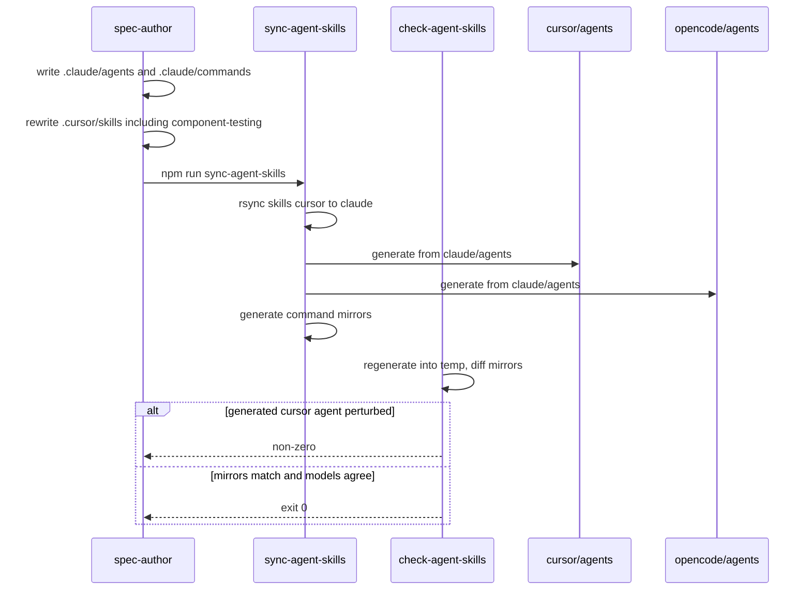
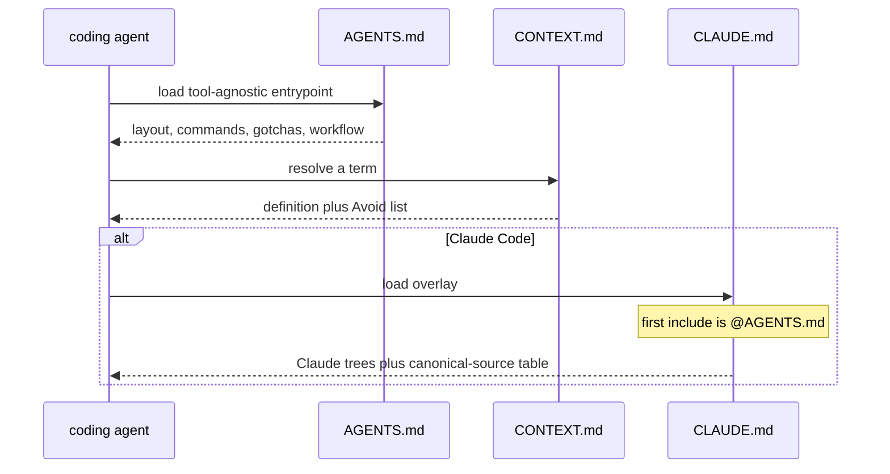

# Harness prose

Current truth for the *content* of this repository's agent harness: the five
phase agents, the `spec-to-ship` command, the phase and support skills, the
`.cursor/rules` blinkers, and the three repo-root agent entrypoints
(`CONTEXT.md`, `AGENTS.md`, `CLAUDE.md`). One file, not a pile of packet
histories.

The directories, model manifest, and sync/check machinery that carry this prose
are a separate capability — see `harness-scaffold.md`.

Folded from the P06 delta (RD-24147), preserved at
`docs/internal/archive/2026-09-07-P06-harness-agents-skills/delta.md`.

Folded from the P07 delta (RD-24148), preserved at
`docs/internal/archive/2026-09-08-P07-context-and-agent-docs/delta.md`.

## Requirements

### Requirement: Canonical Claude agent files exist
`.claude/agents/` SHALL contain exactly these five markdown files, one per
pipeline phase: `spec-author.md`, `test-author.md`, `coder.md`,
`reviewer.md`, `verifier.md`. Each file's YAML `model:` value SHALL equal
`agents[<name>].claude` in `.harness/models.json`. `reviewer.md` and
`verifier.md` SHALL NOT list `Edit` or `Write` among their `tools:`.

#### Scenario: five canonical Claude agent files exist
- **WHEN** `.claude/agents/` is listed
- **THEN** it contains `spec-author.md`, `test-author.md`, `coder.md`,
  `reviewer.md`, and `verifier.md`

#### Scenario: each Claude agent model matches the manifest
- **WHEN** each `.claude/agents/<name>.md` frontmatter `model:` is read
  alongside `.harness/models.json`
- **THEN** that value equals `agents[name].claude`

#### Scenario: reviewer and verifier cannot edit
- **WHEN** `.claude/agents/reviewer.md` and `.claude/agents/verifier.md` are
  read
- **THEN** neither file's `tools:` list contains `Edit` or `Write`

### Requirement: Canonical spec-to-ship command exists
`.claude/commands/` SHALL contain `spec-to-ship.md`. That file SHALL include
a paragraph that starts with `**Model selection.**` so the Cursor command
translator can append its `generalPurpose` fallback. The command SHALL tell
the orchestrator to stop after the PR is addressed, and SHALL NOT instruct
a merge onto `main` or an archive of the spec delta while the PR is open.

#### Scenario: spec-to-ship command is canonical under Claude
- **WHEN** `.claude/commands/` is listed
- **THEN** it contains `spec-to-ship.md`

#### Scenario: command has a Model selection paragraph
- **WHEN** `.claude/commands/spec-to-ship.md` is read
- **THEN** it contains `**Model selection.**`

#### Scenario: command does not merge or archive on an open PR
- **WHEN** `.claude/commands/spec-to-ship.md` is read
- **THEN** it tells the orchestrator to stop after review threads are
  addressed, and it does not instruct merging onto `main` or moving files
  into `docs/internal/archive/` while the PR is open

### Requirement: Generated agent mirrors carry readonly from the manifest
After a successful `sync-agent-skills`, `.cursor/agents/reviewer.md` and
`.cursor/agents/verifier.md` SHALL have YAML `readonly: true`;
`.cursor/agents/spec-author.md`, `.cursor/agents/test-author.md`, and
`.cursor/agents/coder.md` SHALL have `readonly: false`. The OpenCode
reviewer and verifier mirrors SHALL deny the edit permission.

`.opencode/agents/` SHALL contain the same five agent markdown filenames,
and `.opencode/commands/` SHALL contain `spec-to-ship.md`.

#### Scenario: Cursor readonly flags match the manifest
- **WHEN** the five `.cursor/agents/<name>.md` files are parsed after a
  consistent sync
- **THEN** `readonly` is false, false, false, true, true in phase order

#### Scenario: OpenCode reviewer and verifier deny edit
- **WHEN** `.opencode/agents/reviewer.md` and `.opencode/agents/verifier.md`
  are read after a consistent sync
- **THEN** each file's frontmatter includes `permission:` with `edit: deny`

#### Scenario: OpenCode mirrors are populated
- **WHEN** `.opencode/agents/` and `.opencode/commands/` are listed after a
  consistent sync
- **THEN** the agents directory contains the five phase markdown files and
  the commands directory contains `spec-to-ship.md`

### Requirement: Support skills exist under the Cursor canonical tree
`.cursor/skills/` SHALL contain a `SKILL.md` in each of these
directories: `engineering-principles`, `regression-dog`,
`pr-review-style`, `hotspot-expansion-review`, `mutation-testing`, and
`component-testing`, and in each of these phase-skill directories:
`spec-to-ship`, `write-spec`, `write-failing-tests`, `code-to-green`,
`review-changes`, `verify-changes`.

It SHALL NOT contain skill directories named `slack-driven-sessions`,
`post-deploy-verify`, `help-docs-sync`, `refactor-to-hexagonal`,
`10-http-boundaries`, `extend-test-kit`, or `add-module`.

Donor service names SHALL NOT leak into the ported skills: none of
`engineering-principles`, `regression-dog`, `pr-review-style`,
`hotspot-expansion-review`, or `mutation-testing` SHALL mention
`@cycle-processing/contracts`, `pnpm verify`, or `lefthook`.

#### Scenario: six support skills are present
- **WHEN** `.cursor/skills/` is listed
- **THEN** it contains directories named `engineering-principles`,
  `regression-dog`, `pr-review-style`, `hotspot-expansion-review`,
  `mutation-testing`, and `component-testing`, each with a `SKILL.md`

#### Scenario: six phase skills are present
- **WHEN** `.cursor/skills/` is listed
- **THEN** it contains directories named `spec-to-ship`, `write-spec`,
  `write-failing-tests`, `code-to-green`, `review-changes`, and
  `verify-changes`, each with a `SKILL.md`

#### Scenario: service-shaped donor skills are absent
- **WHEN** `.cursor/skills/` is listed
- **THEN** it has no directory named `slack-driven-sessions`,
  `post-deploy-verify`, `help-docs-sync`, `refactor-to-hexagonal`,
  `10-http-boundaries`, `extend-test-kit`, or `add-module`

#### Scenario: ported support skills do not name donor service machinery
- **WHEN** the five newly ported support `SKILL.md` files other than
  `component-testing` are read
- **THEN** none of them contains `@cycle-processing/contracts`,
  `pnpm verify`, or `lefthook`

### Requirement: component-testing teaches this repo's current API in Vitest
`.cursor/skills/component-testing/SKILL.md` SHALL be written for this
repository (test-kit is the artifact under development). It SHALL name
`createRig` as the lifecycle-owner factory and SHALL NOT name
`createHarness`. It SHALL show a factory call that injects the rig
under the option key `harness` (for example `harness: rig`). It SHALL
close the lifecycle owner with `rig.close()`. In-repo timer examples
SHALL use `vi.useFakeTimers`. The skill SHALL NOT contain
`jest.advanceTimersByTimeAsync` and SHALL NOT pin the library at
`v1.0.0`.

Every fenced `typescript` or `ts` code block in that file that uses the
identifier `rig` SHALL declare `rig` in the same block: a `const rig`
or `let rig` binding, or a destructuring binding that includes `rig`.

This packet does not compile markdown fences with `tsc`. Declaration
in the same fence is the observable boundary.

#### Scenario: component-testing names createRig not createHarness
- **WHEN** `.cursor/skills/component-testing/SKILL.md` is read
- **THEN** it contains `createRig` and does not contain `createHarness`

#### Scenario: component-testing keeps the harness option key
- **WHEN** `.cursor/skills/component-testing/SKILL.md` is read
- **THEN** it contains a factory options example that includes
  `harness:` as a property name next to a `rig` value

#### Scenario: component-testing uses Vitest fake timers
- **WHEN** `.cursor/skills/component-testing/SKILL.md` is read
- **THEN** it contains `vi.useFakeTimers` and does not contain
  `jest.advanceTimersByTimeAsync`

#### Scenario: component-testing is not pinned to v1.0.0
- **WHEN** `.cursor/skills/component-testing/SKILL.md` is read
- **THEN** it does not contain the string `v1.0.0`

#### Scenario: component-testing TypeScript fences declare rig before using it
- **WHEN** each fenced `typescript` or `ts` code block in
  `.cursor/skills/component-testing/SKILL.md` is read
- **THEN** every block that contains the identifier `rig` also contains
  a `const rig`, `let rig`, or destructuring binding that includes
  `rig` in that same block

### Requirement: write-failing-tests no longer warns agents off component-testing
`.cursor/skills/write-failing-tests/SKILL.md` SHALL NOT tell the agent to
ignore `component-testing`. Lifecycle close in that skill SHALL be
`rig.close()`, not `harness.close()`.

#### Scenario: ignore-this-skill warning is gone
- **WHEN** `.cursor/skills/write-failing-tests/SKILL.md` is read
- **THEN** it does not contain `Do not follow` and does not contain
  `Ignore this skill`

#### Scenario: write-failing-tests closes a rig
- **WHEN** `.cursor/skills/write-failing-tests/SKILL.md` is read
- **THEN** it contains `rig.close()` and does not contain `harness.close()`

### Requirement: mutation-testing skill is thin until RD-24153
`.cursor/skills/mutation-testing/SKILL.md` SHALL state that mutation
testing and CRAP have not landed (RD-24153) and that tests resolve through
`dist/`, so a mutant applied to `src` is never loaded. It SHALL NOT
instruct the agent to run `test:mutation`, `pnpm crap`, or `stryker run`
as a current gate of this repository.

#### Scenario: mutation-testing names the missing gate
- **WHEN** `.cursor/skills/mutation-testing/SKILL.md` is read
- **THEN** it contains `RD-24153` and `dist`

#### Scenario: mutation-testing does not run Stryker today
- **WHEN** `.cursor/skills/mutation-testing/SKILL.md` is read
- **THEN** it does not contain `test:mutation`, `pnpm crap`, or
  `stryker run`

### Requirement: Glob-scoped blinkers live under .cursor/rules
`.cursor/rules/` SHALL contain these Cursor `.mdc` files:

- `12-no-escape-hatches.mdc` — glob covering `packages/**/*.ts`
- `13-method-readability.mdc` — glob covering `packages/**/*.ts`
- `15-commands-over-hand-edits.mdc` — `alwaysApply: true` and no
  `globs:` key
- `complexity-budget.mdc` — names the complexity ≤ 12, max-depth ≤ 4,
  max-lines-per-function ≤ 80, max-params ≤ 5 budget, and SHALL NOT
  claim a git hook enforces those numbers (this repository has none)
- `00-architecture-ratchet.mdc` — glob covering `packages/**/*.ts`
- `01-architecture-bssn.mdc` — glob covering `packages/**/*.ts`

It SHALL NOT contain `component-testing.mdc` or `10-http-boundaries.mdc`.

Tracked markdown under `.cursor/agents/`, `.claude/agents/`,
`.cursor/skills/`, and `.claude/skills/` that points at `.cursor/rules/`
SHALL use the word `blinker` or `blinkers` and SHALL NOT call those
files "rules" (the published API already owns `Rule`).

#### Scenario: portable blinker files exist
- **WHEN** `.cursor/rules/` is listed
- **THEN** it contains `12-no-escape-hatches.mdc`,
  `13-method-readability.mdc`, `15-commands-over-hand-edits.mdc`,
  `complexity-budget.mdc`, `00-architecture-ratchet.mdc`, and
  `01-architecture-bssn.mdc`

#### Scenario: globbed blinkers cover packages
- **WHEN** `12-no-escape-hatches.mdc`, `13-method-readability.mdc`,
  `00-architecture-ratchet.mdc`, and `01-architecture-bssn.mdc` are
  read
- **THEN** each file's frontmatter `globs` value contains `packages/`

#### Scenario: commands-over-hand-edits is always-on with no globs
- **WHEN** `15-commands-over-hand-edits.mdc` is read
- **THEN** its frontmatter has `alwaysApply: true` and no `globs:` key

#### Scenario: complexity-budget names the four limits and does not invent a hook gate
- **WHEN** `complexity-budget.mdc` is read
- **THEN** it names `complexity` and `12`, `max-depth` and `4`,
  `max-lines-per-function` and `80`, and `max-params` and `5`, and it
  does not contain `lefthook`, `pre-push`, or `husky`

#### Scenario: dropped donor blinkers are absent
- **WHEN** `.cursor/rules/` is listed
- **THEN** it does not contain `component-testing.mdc` or
  `10-http-boundaries.mdc`

#### Scenario: agent and skill prose calls them blinkers
- **WHEN** tracked markdown under `.cursor/agents/`, `.claude/agents/`,
  `.cursor/skills/`, and `.claude/skills/` that contains the path
  `.cursor/rules` is read
- **THEN** each such file contains `blinker` and does not contain the
  phrase `the rules in`

### Requirement: Per-agent files name their skills and do not import donor bugs
`.claude/agents/spec-author.md` SHALL name `write-spec`.
`.claude/agents/test-author.md` SHALL name `write-failing-tests`.
`.claude/agents/coder.md` SHALL name `code-to-green` and SHALL NOT
instruct running `test:mutation`, `stryker run`, or `pnpm crap`.
`.claude/agents/reviewer.md` SHALL name `review-changes` and
`pr-review-style`, and SHALL NOT instruct running `test:mutation`,
`stryker run`, or `pnpm crap`.
`.claude/agents/verifier.md` SHALL name `verify-changes` and `RD-24153`,
and SHALL state that this repository has no mutation testing and no CRAP
report.

#### Scenario: each agent names the skill it drives
- **WHEN** the five `.claude/agents/<name>.md` files are read
- **THEN** spec-author contains `write-spec`, test-author contains
  `write-failing-tests`, coder contains `code-to-green`, reviewer contains
  `review-changes`, and verifier contains `verify-changes`

#### Scenario: coder and reviewer do not run coverage-quality gates
- **WHEN** `.claude/agents/coder.md` and `.claude/agents/reviewer.md` are
  read
- **THEN** neither file contains `test:mutation`, `stryker run`, or
  `pnpm crap`

#### Scenario: reviewer names pr-review-style
- **WHEN** `.claude/agents/reviewer.md` is read
- **THEN** it contains `pr-review-style`

#### Scenario: verifier states the missing gate
- **WHEN** `.claude/agents/verifier.md` is read
- **THEN** it contains `RD-24153` and the phrase `no mutation testing`

### Requirement: CONTEXT.md is a glossary of canonical terms
Repository-root `CONTEXT.md` SHALL exist. It SHALL be a glossary and
nothing else: no implementation commands, no EARS requirements, no
scratch-pad markers.

Each of these terms SHALL appear as a markdown heading with a definition
and an `_Avoid_:` list of banned near-synonyms:

Library terms: **Rig**, **Adapter**, **Probe**, **Selection**, **Filter**,
**Call**, **Pending Call**, **Backing**, **Rule**, **Settlement**,
**Porcelain**, **Plumbing**, **Goldilocks boundary**.

Harness-side terms: **Harness**, **Blinker**, **Packet**.

Definitions SHALL match current published usage, not invented synonyms:

- **Rig** is the lifecycle owner of probes and adapters (`createRig`).
- **Adapter** is the object injected into the component under test.
- **Probe** is the test-facing control surface for an adapter.
- **Selection** is a filtered view of a probe.
- **Filter** is a `(call) => boolean` predicate that narrows a selection.
- **Call** is a recorded interaction with an adapter.
- **Pending Call** is a live call that has reached the adapter but has
  not yet been settled.
- **Backing** is an optional local implementation behind an adapter.
- **Rule** is pre-programmed behavior for future matching calls
  (`once()` / `always()`).
- **Settlement** is completing a pending call with `answer` / `reject` /
  `forward` (or parking by doing nothing).
- **Porcelain** is pre-programmed behavior for dependencies the scenario
  is not actively testing.
- **Plumbing** is explicit, step-by-step control of the interactions the
  scenario *is* testing.
- **Goldilocks boundary** is a leaf seam fat enough to skip protocol
  noise and thin enough that application logic stays in the component.
- **Harness** is the agent pipeline (tools, prompts, loop, gates,
  skills). Prose SHALL qualify it as "agent harness" where the library
  sense could be meant.
- **Blinker** is a file under `.cursor/rules/`.
- **Packet** is a scoped work item under `docs/internal/packets/` that
  owns shape; the spec delta owns behaviour.

`CONTEXT.md` SHALL NOT contain fenced `typescript`, `ts`, `bash`, or
`sh` code blocks. It SHALL NOT contain `npm run`. It SHALL NOT contain
`SHALL`. It SHALL NOT contain `TODO`.

#### Scenario: CONTEXT.md exists at the repository root
- **WHEN** the repository root is listed
- **THEN** it contains a tracked file named `CONTEXT.md`

#### Scenario: every required term has a heading, a definition, and an Avoid list
- **WHEN** `CONTEXT.md` is read
- **THEN** each of the sixteen terms appears as a heading, and the
  section under that heading contains `_Avoid_:`

#### Scenario: CONTEXT.md is a glossary only
- **WHEN** `CONTEXT.md` is read
- **THEN** it does not contain a fenced `typescript`, `ts`, `bash`, or
  `sh` block, and it does not contain `npm run`, `SHALL`, or `TODO`

### Requirement: CONTEXT.md disambiguates Rule, Harness, and blinkers
The three live collisions SHALL be explicit in the `_Avoid_:` lists:

- **Rule** (published API) SHALL ban using that word for the 13 numbered
  Design Rules in `docs/concepts.md` and for `.cursor/rules/` files.
- **Blinker** SHALL ban calling `.cursor/rules/` files "rules".
- **Harness** (agent pipeline) SHALL ban using that word for the
  lifecycle owner. **Rig** SHALL ban using "Harness" as the name of that
  owner. The **Harness** or **Rig** entry SHALL include one sentence that
  the industry word was kept for the agent sense and the library concept
  became Rig, and SHALL point at
  `docs/adr/0001-rename-the-lifecycle-owner-to-rig-and-ship-2-0-0.md`.

Settlement's `_Avoid_:` list SHALL ban `return`, `reply`, and `respond`
as names for the successful settlement verb.

`CONTEXT.md` SHALL NOT ban the word `digest`. This repository's
`write-spec` skill does not list digest as vocabulary; importing
reports_service's ban would invent a contradiction that is not present
here.

`CONTEXT.md` SHALL NOT present `createHarness` as a current factory.

#### Scenario: Rule and Blinker Avoid lists split the three meanings
- **WHEN** the Rule and Blinker sections of `CONTEXT.md` are read
- **THEN** Rule's `_Avoid_:` list names blinkers and Design Rules, and
  Blinker's `_Avoid_:` list forbids calling `.cursor/rules/` files
  "rules"

#### Scenario: Harness and Rig point at the ADR
- **WHEN** the Harness and Rig sections of `CONTEXT.md` are read
- **THEN** Harness is defined as the agent pipeline, Rig is defined as
  the lifecycle owner, one of those sections contains the ADR path
  `docs/adr/0001-rename-the-lifecycle-owner-to-rig-and-ship-2-0-0.md`,
  and Rig's `_Avoid_:` list includes `Harness`

#### Scenario: Settlement Avoid list keeps the Design Rules verb
- **WHEN** the Settlement section of `CONTEXT.md` is read
- **THEN** its `_Avoid_:` list contains `return`, `reply`, and `respond`

#### Scenario: digest is not banned and createHarness is not current
- **WHEN** `CONTEXT.md` is read
- **THEN** it does not contain `_Avoid_:` text that lists `digest`, and
  it does not contain `createHarness`

### Requirement: AGENTS.md is the tool-agnostic agent entrypoint
Repository-root `AGENTS.md` SHALL exist. It SHALL be tool-agnostic
(Cursor, Claude Code, and OpenCode all read it). It SHALL contain
headings for: what the repo is, layout, commands, blinkers, testing,
workflow, and model targeting.

It SHALL state that this repository is the `@vnatures/test-kit` npm
workspace of published packages.

It SHALL name these layout paths: `packages/`, `examples/`, `docs/`,
`.cursor/`, `.claude/`, `.opencode/`, `.harness/`.

It SHALL name the commands `npm run check`, `npm run build`, and
`npm test`.

It SHALL call `.cursor/rules/` files blinkers.

It SHALL state these testing facts:

- Root `npm test` does not run per-package `pretest` builds, so
  `npm run build` must run first or specifier resolution hits stale
  `dist/`.
- The full gate is `npm run check`.
- There are no git hooks (no husky, no lefthook).
- `packages/mysql` needs Docker.

It SHALL state these git conventions: remote `vn` (there is no
`origin`), base branch `main`, squash-only history, branches
`RD-NNNNN_slug`, Conventional Commits with a package scope.

It SHALL name `/spec-to-ship` and the five phases `spec-author`,
`test-author`, `coder`, `reviewer`, `verifier`. It SHALL NOT instruct
merging onto `main` or moving files into `docs/internal/archive/` while
a PR is open.

It SHALL name `.harness/models.json` as the source of per-phase model
targeting. It SHALL NOT contain `cursor-grok-4.6-xhigh`,
`claude-opus-4-8`, or `litellm/vn-`.

It SHALL name `CONTEXT.md`.

It SHALL NOT contain `prettify`. It SHALL NOT present `mock-aws-s3-v3`
as the current S3 backing. It SHALL NOT contain `no Docker needed`.

#### Scenario: AGENTS.md exists at the repository root
- **WHEN** the repository root is listed
- **THEN** it contains a tracked file named `AGENTS.md`

#### Scenario: AGENTS.md has the required sections
- **WHEN** `AGENTS.md` is read
- **THEN** it contains headings that name the repo, layout, commands,
  blinkers, testing, workflow, and model targeting

#### Scenario: AGENTS.md names layout paths and check commands
- **WHEN** `AGENTS.md` is read
- **THEN** it contains `packages/`, `examples/`, `docs/`, `.cursor/`,
  `.claude/`, `.opencode/`, `.harness/`, `npm run check`,
  `npm run build`, and `npm test`

#### Scenario: AGENTS.md carries the day-one testing gotchas
- **WHEN** `AGENTS.md` is read
- **THEN** it contains `pretest`, `dist`, `npm run check`, `husky`,
  `lefthook`, `Docker`, and `mysql`

#### Scenario: AGENTS.md states git conventions
- **WHEN** `AGENTS.md` is read
- **THEN** it contains `vn`, `origin`, `main`, `squash`, `RD-`, and
  `Conventional Commits`

#### Scenario: AGENTS.md summarises spec-to-ship without merging an open PR
- **WHEN** `AGENTS.md` is read
- **THEN** it contains `spec-to-ship`, `spec-author`, `test-author`,
  `coder`, `reviewer`, and `verifier`, and it does not instruct merging
  onto `main` or moving files into `docs/internal/archive/` while a PR
  is open

#### Scenario: AGENTS.md defers model ids to the manifest
- **WHEN** `AGENTS.md` is read
- **THEN** it contains `.harness/models.json` and does not contain
  `cursor-grok-4.6-xhigh`, `claude-opus-4-8`, or `litellm/vn-`

#### Scenario: AGENTS.md points at the glossary and blinkers
- **WHEN** `AGENTS.md` is read
- **THEN** it contains `CONTEXT.md` and `blinker`

#### Scenario: AGENTS.md is not the stale remote-branch draft
- **WHEN** `AGENTS.md` is read
- **THEN** it does not contain `prettify`, does not contain
  `mock-aws-s3-v3`, and does not contain `no Docker needed`

### Requirement: CLAUDE.md is a thin Claude Code overlay
Repository-root `CLAUDE.md` SHALL exist. It SHALL open with `@AGENTS.md`.
It SHALL inventory Claude Code assets at `.claude/agents/`,
`.claude/commands/`, and `.claude/skills/`. It SHALL include a
canonical-source table that states:

- skills are canonical in `.cursor/skills`
- agents are canonical in `.claude/agents`
- commands are canonical in `.claude/commands`
- per-phase model targeting is canonical in `.harness/models.json`

It SHALL NOT define library domain vocabulary: it SHALL NOT contain
`createRig`, `createHarness`, `Goldilocks`, `Pending Call`, `once()`,
or `always()`. It SHALL NOT contain `cursor-grok-4.6-xhigh`,
`claude-opus-4-8`, or `litellm/vn-`.

#### Scenario: CLAUDE.md exists at the repository root
- **WHEN** the repository root is listed
- **THEN** it contains a tracked file named `CLAUDE.md`

#### Scenario: CLAUDE.md starts from AGENTS.md
- **WHEN** `CLAUDE.md` is read
- **THEN** it contains `@AGENTS.md` before any other `@` include

#### Scenario: CLAUDE.md inventories Claude assets and the canonical table
- **WHEN** `CLAUDE.md` is read
- **THEN** it contains `.claude/agents`, `.claude/commands`,
  `.claude/skills`, `.cursor/skills`, and `.harness/models.json`

#### Scenario: CLAUDE.md does not teach the library domain or pin models
- **WHEN** `CLAUDE.md` is read
- **THEN** it does not contain `createRig`, `createHarness`,
  `Goldilocks`, `Pending Call`, `once()`, `always()`,
  `cursor-grok-4.6-xhigh`, `claude-opus-4-8`, or `litellm/vn-`

### Requirement: New TypeScript for this capability is on the root test and format paths
Tests that encode these scenarios SHALL run as part of the root `npm test`
workspace, and SHALL be included in the root `format:check` glob.

#### Scenario: harness-prose tests are in the Vitest workspace
- **WHEN** `vitest.workspace.ts` is read
- **THEN** it includes a project that picks up the tests for this
  capability

#### Scenario: harness-prose TypeScript is format-checked
- **WHEN** the root `format:check` script is read
- **THEN** its glob covers those test files

## Flow

## Decisions (rung recorded)

| Decision | Outcome | Rung |
| --- | --- | --- |
| Sibling capability `harness-prose.md`, not a dump into `harness-scaffold.md` | Scaffold stays machinery (dirs, manifest, sync/check). Prose is the content those trees hold. Scaffold already deferred this surface to P06 | Source (`harness-scaffold.md` intro) + ticket |
| Keep the empty-canonical skip as fixture safety; require the live tree to be populated so the skip is not taken there | Turning hollow green into a real comparison is the core move; deleting the skip would make a partial clone wipe Cursor agents | Ticket + source (`has_canonical_md` in `scripts/check-agent-skills.sh`) |
| Inverse of the existing populated-mirror scenario: perturbing a generated `.cursor/agents` file fails the check | `check-agent-skills` exiting 0 is not proof until the comparison actually runs | Ticket (phase 5 instruction) |
| Canonical agents/commands stay Claude-shaped (`tools:`, `model:` = claude column); Cursor/OpenCode mirrors are generated | Matches P05 canonical direction | Source (`scripts/agent-sync-lib.sh`) + ticket |
| Add `**Model selection.**` to the Claude command so Cursor translation injects `generalPurpose` | Donor command translator requires that paragraph; bootstrap Cursor command lacked it | Source (`translate_cursor_command`) + donor precedent |
| Command still stops on an open PR — no squash-merge, no archive | This repo's merge is a human action via `vn`; donors ff-merge | Ticket comments + source (bootstrap `.cursor/commands/spec-to-ship.md`) |
| Rewrite `component-testing` for this repo: `createRig` / Vitest / no v1.0.0 pin; keep `harness:` option key | Three defects (consumer-perspective, Jest, removed API). Option key is a deliberate keep | Ticket + source (`core-public-api.md`, `createProbedMock({ harness })`) |
| Delete the write-failing-tests "ignore this skill" warning once the rewrite is true; lifecycle close is `rig.close()` | Stopgap becomes a lie the moment the skill is current | Ticket |
| `mutation-testing` is a thin missing-gate card, not a Stryker how-to | RD-24153 has not landed; tests resolve through `dist/` | Ticket + source (`spec-to-ship` skill, `verify-changes`) |
| Port blinkers `12`, `13`, `15`, plus adapted ratchet, BSSN, and complexity-budget; re-anchor globs to `packages/**/*.ts` | Ticket named those three as nearly-as-is; coder allocation also names ratchet, BSSN, and the budget. This repo's ESLint does not enforce complexity, and there are no git hooks — the budget file must not claim either | Ticket + source (`.eslintrc.json` has no complexity plugin; `ci-gate.md`) |
| Call `.cursor/rules/` contents blinkers in agent/skill prose | `Rule` is a published API concept; RD-24143 spent a major version killing the collision | Ticket |
| Do not port `10-http-boundaries`, hexagonal refactor, `component-testing.mdc`, Slack/post-deploy/help-docs, `extend-test-kit`, `add-module` | Service-shaped; dead in a library monorepo | Ticket |
| Do not add `check-agent-skills` to the five-step `npm run check` chain | P00 pinned that chain; scaffold tests (and these) already invoke the script under `npm test` | Source (`ci-gate.md`, `harness-scaffold.md` out of scope) |
| Extend ci-gate's gate-prose scan to `.cursor/rules/` | New blinkers can describe the gate; leaving them unscanned would hide a `lefthook` copy-paste | Ticket ("new skill prose must comply") + source (ci-gate test lists dirs) |
| Close the core-public-api known-gap row about `createHarness` in component-testing | This packet owns that rewrite | Source (`core-public-api.md` known gaps) + ticket |
| No public API / version bump | Harness markdown and repo tests only | Source |
| Apply the P07 delta to `harness-prose.md`, not a new capability file | P06 deferred these three files from that capability; they are agent-facing prose, not scaffold machinery | Source (`harness-prose.md` out of scope) + ticket |
| Copy reports_service glossary *shape* (term, definition, `_Avoid_:`), not its content | Donor `CONTEXT.md` is not on `reports_service` default-branch root today; the ticket named the shape | Ticket + sibling lookup (file absent on default branch) |
| Sixteen glossary terms, including Porcelain / Plumbing / Goldilocks boundary | Ticket listed them as taken from `docs/concepts.md`. Those three live in root `README.md` and `component-testing`, not in `concepts.md`. Include them anyway — published usage wins over the ticket's path claim | Ticket + source (`README.md`, `docs/concepts.md` headings) |
| Do not ban `digest` | This repo's `write-spec` does not list digest; reports_service's ban would invent a contradiction the ticket told us not to import | Source (`.cursor/skills/write-spec/SKILL.md`) + ticket |
| Harness/Rig collision is one sentence plus the P02 ADR path | Ticket required that sentence and named the ADR; the ADR exists at `docs/adr/0001-…` | Ticket + source (ADR file) |
| Settlement Avoid list bans `return` / `reply` / `respond` | Design Rule 2 already owns that grammar; the glossary must not reintroduce the synonyms | Source (`docs/concepts.md` Design Rules) |
| AGENTS.md sections are the ticket's list (repo, layout, commands, blinkers, testing, workflow, model targeting) | cycle-processing has no root `AGENTS.md` on default branch; the ticket's heading list is the shape | Ticket + sibling lookup |
| AGENTS.md states `npm run check` exists | Ticket said "no single check script until P00". P00 landed; `package.json` scripts.check is the contract | Source (`package.json`, `ci-gate.md`) |
| AGENTS.md names mysql + Docker | Ticket forbade the stale "no Docker needed" line because mysql now needs Docker | Ticket + source (`packages/mysql`) |
| Ignore `vn/cursor/env-setup-agents-md-025f` | Ticket: that draft is wrong on `prettify`, `mock-aws-s3-v3`, and Docker | Ticket |
| Model ids stay out of AGENTS.md and CLAUDE.md | `harness-scaffold.md` already makes `.harness/models.json` the only targeting table; entrypoints point at it | Source (`harness-scaffold.md`) |
| CLAUDE.md is `@AGENTS.md` plus Claude inventory plus the canonical-source table | Ticket: thin, nothing about the domain | Ticket + source (`harness-scaffold.md` canonical directions) |
| Do not map the three root files onto CircleCI `build_workspace` in P07 | `test/` and `docs/` already map; an AGENTS.md-only later PR can still miss CI | Sibling (`ci-gate.md` / P13) — deferred |
| Tests join `test/harness-prose` | Same capability, same Vitest project; no new workspace entry | Precedent (P06 `test/harness-prose`) |

## Out of scope (deferred)

| Item | Consequence of deferring |
| --- | --- |
| Mutation testing / CRAP (RD-24153) | Phase 5 still cannot tell whether green means anything; the mutation-testing skill is a stated missing gate, not a runner |
| Adding `check-agent-skills` to `npm run check` | A human who runs only `check` still hits the script via tests inside `npm test` |
| husky / lefthook / `prepare` / `core.hooksPath` | Still no git hooks |
| Phase-0 steering command + add-adapter skill (P08, RD-24149) | `extend-test-kit` / `add-module` stay unported |
| summon-review-panel (P11, RD-24152) | PR-review-style names the panel idea without that skill |
| ESLint complexity plugin matching the budget numbers | The budget is a blinker convention; lint does not yet fail a 13-complexity function |
| Renaming the `harness` option key, `origin: 'harness'`, or `errors.harnessClosed()` texts | Deliberate keeps from RD-24143 |
| CircleCI path-filter lines for root `CONTEXT.md` / `AGENTS.md` / `CLAUDE.md` | A later PR that touches only those files can skip `build_workspace` |
| Extending ci-gate's gate-prose scan to root `AGENTS.md` | Gate facts are asserted by AGENTS.md scenarios instead |
| Adding `CONTEXT.md` to the docs-truth library-docs corpus | Phantom-API scans still skip the glossary |
| Adding Porcelain / Plumbing / Goldilocks headings to `docs/concepts.md` | `write-spec` still cites those terms as if they lived there |
| Markdown / frontmatter linter | `npm run check` stays the five TypeScript-focused scripts |

## Acceptance mapping

1. `.claude/agents/` has the five phase markdown files; each `model:` equals the manifest `claude` column; reviewer and verifier list no Edit/Write tools.
2. `.claude/commands/spec-to-ship.md` exists, contains `**Model selection.**`, and does not merge or archive on an open PR.
3. After sync, Cursor agent `readonly` is false/false/false/true/true; OpenCode reviewer and verifier deny edit; OpenCode agents and commands trees are populated.
4. Editing a generated `.cursor/agents` file makes `check-agent-skills` exit non-zero.
5. `.cursor/skills/` has the six support skills plus the six phase skills, and does not have the listed service-shaped donor skills; ported support skills do not name cycle-processing / pnpm verify / lefthook.
6. `component-testing` names `createRig` (not `createHarness`), shows `harness: rig`, uses `vi.useFakeTimers`, does not pin `v1.0.0`, and every `typescript`/`ts` fence that uses `rig` declares `rig` in the same fence.
7. `write-failing-tests` has no ignore-this-skill warning and says `rig.close()`.
8. `mutation-testing` names RD-24153 and `dist/` and does not instruct running Stryker as a current gate.
9. `.cursor/rules/` has the six blinker files with the stated globs / alwaysApply, including `packages/` globs on the two architecture blinkers; dropped donor blinkers are absent; complexity-budget names 12 / 4 / 80 / 5 and does not claim ESLint or a hook; agent/skill prose that mentions `.cursor/rules` says blinker.
10. Each canonical agent names its phase skill; coder and reviewer do not run Stryker/CRAP; reviewer names `pr-review-style`; verifier names RD-24153 and no mutation testing.
11. Empty-canonical skip still holds on fixtures; the live `.claude/agents` and `.claude/commands` trees each contain `*.md`.
12. Gate-describing markdown under `.cursor/rules/` is in the ci-gate scan.
13. The component-testing known-gap row is gone from `core-public-api.md`.
14. Tests for these scenarios run under root `npm test` and are in the root `format:check` glob.
15. Root `CONTEXT.md` exists; each of the sixteen terms is a heading with `_Avoid_:`; the file has no `typescript`/`ts`/`bash`/`sh` fences, no `npm run`, no `SHALL`, no `TODO`.
16. Rule vs Blinker vs Design Rules are split in Avoid lists; Harness is the agent pipeline; Rig is the lifecycle owner; the ADR path is present; Settlement bans `return`/`reply`/`respond`; `digest` is not banned; `createHarness` is absent.
17. Root `AGENTS.md` exists with the seven section themes; names layout paths and `npm run check` / `build` / `test`; states pretest/`dist`, no husky/lefthook, mysql+Docker; states vn/main/squash/`RD-`/Conventional Commits; names spec-to-ship and the five phases without merge/archive-on-open-PR; points at `.harness/models.json` and `CONTEXT.md`; says blinker; contains none of `prettify`, `mock-aws-s3-v3`, `no Docker needed`, or the distinctive model ids.
18. Root `CLAUDE.md` exists, includes `@AGENTS.md` first, inventories `.claude/{agents,commands,skills}` and the canonical paths, and contains none of the library-domain strings or distinctive model ids.
