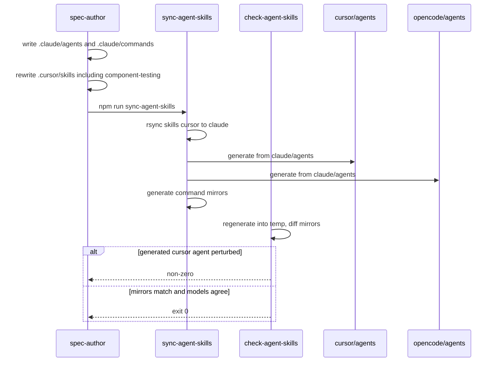

# Harness prose

Current truth for the *content* of this repository's agent harness: the five
phase agents, the `spec-to-ship` command, the phase and support skills, and the
`.cursor/rules` blinkers. One file, not a pile of packet histories.

The directories, model manifest, and sync/check machinery that carry this prose
are a separate capability — see `harness-scaffold.md`.

Folded from the P06 delta (RD-24147), preserved at
`docs/internal/archive/2026-09-07-P06-harness-agents-skills/delta.md`.

## Requirements

### Requirement: Canonical Claude agent files exist
`.claude/agents/` SHALL contain exactly these five markdown files, one per
pipeline phase: `spec-author.md`, `test-author.md`, `coder.md`,
`reviewer.md`, `verifier.md`. Each file's YAML `model:` value SHALL equal
`agents[<name>].claude` in `.harness/models.json`. `reviewer.md` and
`verifier.md` SHALL NOT list `Edit` or `Write` among their `tools:`.

#### Scenario: five canonical Claude agent files exist
- **WHEN** `.claude/agents/` is listed
- **THEN** it contains `spec-author.md`, `test-author.md`, `coder.md`,
  `reviewer.md`, and `verifier.md`

#### Scenario: each Claude agent model matches the manifest
- **WHEN** each `.claude/agents/<name>.md` frontmatter `model:` is read
  alongside `.harness/models.json`
- **THEN** that value equals `agents[name].claude`

#### Scenario: reviewer and verifier cannot edit
- **WHEN** `.claude/agents/reviewer.md` and `.claude/agents/verifier.md` are
  read
- **THEN** neither file's `tools:` list contains `Edit` or `Write`

### Requirement: Canonical spec-to-ship command exists
`.claude/commands/` SHALL contain `spec-to-ship.md`. That file SHALL include
a paragraph that starts with `**Model selection.**` so the Cursor command
translator can append its `generalPurpose` fallback. The command SHALL tell
the orchestrator to stop after the PR is addressed, and SHALL NOT instruct
a merge onto `main` or an archive of the spec delta while the PR is open.

#### Scenario: spec-to-ship command is canonical under Claude
- **WHEN** `.claude/commands/` is listed
- **THEN** it contains `spec-to-ship.md`

#### Scenario: command has a Model selection paragraph
- **WHEN** `.claude/commands/spec-to-ship.md` is read
- **THEN** it contains `**Model selection.**`

#### Scenario: command does not merge or archive on an open PR
- **WHEN** `.claude/commands/spec-to-ship.md` is read
- **THEN** it tells the orchestrator to stop after review threads are
  addressed, and it does not instruct merging onto `main` or moving files
  into `docs/internal/archive/` while the PR is open

### Requirement: Generated agent mirrors carry readonly from the manifest
After a successful `sync-agent-skills`, `.cursor/agents/reviewer.md` and
`.cursor/agents/verifier.md` SHALL have YAML `readonly: true`;
`.cursor/agents/spec-author.md`, `.cursor/agents/test-author.md`, and
`.cursor/agents/coder.md` SHALL have `readonly: false`. The OpenCode
reviewer and verifier mirrors SHALL deny the edit permission.

`.opencode/agents/` SHALL contain the same five agent markdown filenames,
and `.opencode/commands/` SHALL contain `spec-to-ship.md`.

#### Scenario: Cursor readonly flags match the manifest
- **WHEN** the five `.cursor/agents/<name>.md` files are parsed after a
  consistent sync
- **THEN** `readonly` is false, false, false, true, true in phase order

#### Scenario: OpenCode reviewer and verifier deny edit
- **WHEN** `.opencode/agents/reviewer.md` and `.opencode/agents/verifier.md`
  are read after a consistent sync
- **THEN** each file's frontmatter includes `permission:` with `edit: deny`

#### Scenario: OpenCode mirrors are populated
- **WHEN** `.opencode/agents/` and `.opencode/commands/` are listed after a
  consistent sync
- **THEN** the agents directory contains the five phase markdown files and
  the commands directory contains `spec-to-ship.md`

### Requirement: Support skills exist under the Cursor canonical tree
`.cursor/skills/` SHALL contain a `SKILL.md` in each of these directories:
`engineering-principles`, `regression-dog`, `pr-review-style`,
`hotspot-expansion-review`, `mutation-testing`, and `component-testing`,
in addition to the existing phase skills (`spec-to-ship`, `write-spec`,
`write-failing-tests`, `code-to-green`, `review-changes`,
`verify-changes`).

It SHALL NOT contain skill directories named `slack-driven-sessions`,
`post-deploy-verify`, `help-docs-sync`, `refactor-to-hexagonal`,
`10-http-boundaries`, `extend-test-kit`, or `add-module`.

Donor service names SHALL NOT leak into the ported skills: none of
`engineering-principles`, `regression-dog`, `pr-review-style`,
`hotspot-expansion-review`, or `mutation-testing` SHALL mention
`@cycle-processing/contracts`, `pnpm verify`, or `lefthook`.

#### Scenario: six support skills are present
- **WHEN** `.cursor/skills/` is listed
- **THEN** it contains directories named `engineering-principles`,
  `regression-dog`, `pr-review-style`, `hotspot-expansion-review`,
  `mutation-testing`, and `component-testing`, each with a `SKILL.md`

#### Scenario: service-shaped donor skills are absent
- **WHEN** `.cursor/skills/` is listed
- **THEN** it has no directory named `slack-driven-sessions`,
  `post-deploy-verify`, `help-docs-sync`, `refactor-to-hexagonal`,
  `10-http-boundaries`, `extend-test-kit`, or `add-module`

#### Scenario: ported support skills do not name donor service machinery
- **WHEN** the five newly ported support `SKILL.md` files other than
  `component-testing` are read
- **THEN** none of them contains `@cycle-processing/contracts`,
  `pnpm verify`, or `lefthook`

### Requirement: component-testing teaches this repo's current API in Vitest
`.cursor/skills/component-testing/SKILL.md` SHALL be written for this
repository (test-kit is the artifact under development). It SHALL name
`createRig` as the lifecycle-owner factory and SHALL NOT name
`createHarness`. It SHALL show a factory call that injects the rig under
the option key `harness` (for example `harness: rig`). It SHALL close the
lifecycle owner with `rig.close()`. In-repo timer examples SHALL use
`vi.useFakeTimers`. The skill SHALL NOT contain `jest.advanceTimersByTimeAsync`
and SHALL NOT pin the library at `v1.0.0`.

#### Scenario: component-testing names createRig not createHarness
- **WHEN** `.cursor/skills/component-testing/SKILL.md` is read
- **THEN** it contains `createRig` and does not contain `createHarness`

#### Scenario: component-testing keeps the harness option key
- **WHEN** `.cursor/skills/component-testing/SKILL.md` is read
- **THEN** it contains a factory options example that includes `harness:`
  as a property name next to a `rig` value

#### Scenario: component-testing uses Vitest fake timers
- **WHEN** `.cursor/skills/component-testing/SKILL.md` is read
- **THEN** it contains `vi.useFakeTimers` and does not contain
  `jest.advanceTimersByTimeAsync`

#### Scenario: component-testing is not pinned to v1.0.0
- **WHEN** `.cursor/skills/component-testing/SKILL.md` is read
- **THEN** it does not contain the string `v1.0.0`

### Requirement: write-failing-tests no longer warns agents off component-testing
`.cursor/skills/write-failing-tests/SKILL.md` SHALL NOT tell the agent to
ignore `component-testing`. Lifecycle close in that skill SHALL be
`rig.close()`, not `harness.close()`.

#### Scenario: ignore-this-skill warning is gone
- **WHEN** `.cursor/skills/write-failing-tests/SKILL.md` is read
- **THEN** it does not contain `Do not follow` and does not contain
  `Ignore this skill`

#### Scenario: write-failing-tests closes a rig
- **WHEN** `.cursor/skills/write-failing-tests/SKILL.md` is read
- **THEN** it contains `rig.close()` and does not contain `harness.close()`

### Requirement: mutation-testing skill is thin until RD-24153
`.cursor/skills/mutation-testing/SKILL.md` SHALL state that mutation
testing and CRAP have not landed (RD-24153) and that tests resolve through
`dist/`, so a mutant applied to `src` is never loaded. It SHALL NOT
instruct the agent to run `test:mutation`, `pnpm crap`, or `stryker run`
as a current gate of this repository.

#### Scenario: mutation-testing names the missing gate
- **WHEN** `.cursor/skills/mutation-testing/SKILL.md` is read
- **THEN** it contains `RD-24153` and `dist`

#### Scenario: mutation-testing does not run Stryker today
- **WHEN** `.cursor/skills/mutation-testing/SKILL.md` is read
- **THEN** it does not contain `test:mutation`, `pnpm crap`, or
  `stryker run`

### Requirement: Glob-scoped blinkers live under .cursor/rules
`.cursor/rules/` SHALL contain these Cursor `.mdc` files:

- `12-no-escape-hatches.mdc` — glob covering `packages/**/*.ts`
- `13-method-readability.mdc` — glob covering `packages/**/*.ts`
- `15-commands-over-hand-edits.mdc` — `alwaysApply: true` and no `globs:`
  key
- `complexity-budget.mdc` — names the complexity ≤ 12, max-depth ≤ 4,
  max-lines-per-function ≤ 80, max-params ≤ 5 budget, and SHALL NOT claim
  a git hook enforces those numbers (this repository has none)
- `00-architecture-ratchet.mdc` — glob covering `packages/**/*.ts`
- `01-architecture-bssn.mdc` — glob covering `packages/**/*.ts`

It SHALL NOT contain `component-testing.mdc` or `10-http-boundaries.mdc`.

Tracked markdown under `.cursor/agents/`, `.claude/agents/`,
`.cursor/skills/`, and `.claude/skills/` that points at `.cursor/rules/`
SHALL use the word `blinker` or `blinkers` and SHALL NOT call those files
"rules" (the published API already owns `Rule`).

#### Scenario: portable blinker files exist
- **WHEN** `.cursor/rules/` is listed
- **THEN** it contains `12-no-escape-hatches.mdc`,
  `13-method-readability.mdc`, `15-commands-over-hand-edits.mdc`,
  `complexity-budget.mdc`, `00-architecture-ratchet.mdc`, and
  `01-architecture-bssn.mdc`

#### Scenario: no-escape-hatches and method-readability globs cover packages
- **WHEN** `12-no-escape-hatches.mdc` and `13-method-readability.mdc` are
  read
- **THEN** each file's frontmatter `globs` value contains `packages/`

#### Scenario: commands-over-hand-edits is always-on with no globs
- **WHEN** `15-commands-over-hand-edits.mdc` is read
- **THEN** its frontmatter has `alwaysApply: true` and no `globs:` key

#### Scenario: complexity-budget does not invent a hook gate
- **WHEN** `complexity-budget.mdc` is read
- **THEN** it names `complexity` and `12`, and it does not contain
  `lefthook`, `pre-push`, or `husky`

#### Scenario: dropped donor blinkers are absent
- **WHEN** `.cursor/rules/` is listed
- **THEN** it does not contain `component-testing.mdc` or
  `10-http-boundaries.mdc`

#### Scenario: agent and skill prose calls them blinkers
- **WHEN** tracked markdown under `.cursor/agents/`, `.claude/agents/`,
  `.cursor/skills/`, and `.claude/skills/` that contains the path
  `.cursor/rules` is read
- **THEN** each such file contains `blinker` and does not contain the
  phrase `the rules in`

### Requirement: Per-agent files name their skills and do not import donor bugs
`.claude/agents/spec-author.md` SHALL name `write-spec`.
`.claude/agents/test-author.md` SHALL name `write-failing-tests`.
`.claude/agents/coder.md` SHALL name `code-to-green` and SHALL NOT
instruct running `test:mutation`, `stryker run`, or `pnpm crap`.
`.claude/agents/reviewer.md` SHALL name `review-changes` and
`pr-review-style`, and SHALL NOT instruct running `test:mutation`,
`stryker run`, or `pnpm crap`.
`.claude/agents/verifier.md` SHALL name `verify-changes` and `RD-24153`,
and SHALL state that this repository has no mutation testing and no CRAP
report.

#### Scenario: each agent names the skill it drives
- **WHEN** the five `.claude/agents/<name>.md` files are read
- **THEN** spec-author contains `write-spec`, test-author contains
  `write-failing-tests`, coder contains `code-to-green`, reviewer contains
  `review-changes`, and verifier contains `verify-changes`

#### Scenario: coder and reviewer do not run coverage-quality gates
- **WHEN** `.claude/agents/coder.md` and `.claude/agents/reviewer.md` are
  read
- **THEN** neither file contains `test:mutation`, `stryker run`, or
  `pnpm crap`

#### Scenario: reviewer names pr-review-style
- **WHEN** `.claude/agents/reviewer.md` is read
- **THEN** it contains `pr-review-style`

#### Scenario: verifier states the missing gate
- **WHEN** `.claude/agents/verifier.md` is read
- **THEN** it contains `RD-24153` and the phrase `no mutation testing`

### Requirement: New TypeScript for this capability is on the root test and format paths
Tests that encode these scenarios SHALL run as part of the root `npm test`
workspace, and SHALL be included in the root `format:check` glob.

#### Scenario: harness-prose tests are in the Vitest workspace
- **WHEN** `vitest.workspace.ts` is read
- **THEN** it includes a project that picks up the tests for this
  capability

#### Scenario: harness-prose TypeScript is format-checked
- **WHEN** the root `format:check` script is read
- **THEN** its glob covers those test files

## Flow

## Decisions (rung recorded)

| Decision | Outcome | Rung |
| --- | --- | --- |
| Sibling capability `harness-prose.md`, not a dump into `harness-scaffold.md` | Scaffold stays machinery (dirs, manifest, sync/check). Prose is the content those trees hold. Scaffold already deferred this surface to P06 | Source (`harness-scaffold.md` intro) + ticket |
| Keep the empty-canonical skip as fixture safety; require the live tree to be populated so the skip is not taken there | Turning hollow green into a real comparison is the core move; deleting the skip would make a partial clone wipe Cursor agents | Ticket + source (`has_canonical_md` in `scripts/check-agent-skills.sh`) |
| Inverse of the existing populated-mirror scenario: perturbing a generated `.cursor/agents` file fails the check | `check-agent-skills` exiting 0 is not proof until the comparison actually runs | Ticket (phase 5 instruction) |
| Canonical agents/commands stay Claude-shaped (`tools:`, `model:` = claude column); Cursor/OpenCode mirrors are generated | Matches P05 canonical direction | Source (`scripts/agent-sync-lib.sh`) + ticket |
| Add `**Model selection.**` to the Claude command so Cursor translation injects `generalPurpose` | Donor command translator requires that paragraph; bootstrap Cursor command lacked it | Source (`translate_cursor_command`) + donor precedent |
| Command still stops on an open PR — no squash-merge, no archive | This repo's merge is a human action via `vn`; donors ff-merge | Ticket comments + source (bootstrap `.cursor/commands/spec-to-ship.md`) |
| Rewrite `component-testing` for this repo: `createRig` / Vitest / no v1.0.0 pin; keep `harness:` option key | Three defects (consumer-perspective, Jest, removed API). Option key is a deliberate keep | Ticket + source (`core-public-api.md`, `createProbedMock({ harness })`) |
| Delete the write-failing-tests "ignore this skill" warning once the rewrite is true; lifecycle close is `rig.close()` | Stopgap becomes a lie the moment the skill is current | Ticket |
| `mutation-testing` is a thin missing-gate card, not a Stryker how-to | RD-24153 has not landed; tests resolve through `dist/` | Ticket + source (`spec-to-ship` skill, `verify-changes`) |
| Port blinkers `12`, `13`, `15`, plus adapted ratchet, BSSN, and complexity-budget; re-anchor globs to `packages/**/*.ts` | Ticket named those three as nearly-as-is; coder allocation also names ratchet, BSSN, and the budget. This repo's ESLint does not enforce complexity, and there are no git hooks — the budget file must not claim either | Ticket + source (`.eslintrc.json` has no complexity plugin; `ci-gate.md`) |
| Call `.cursor/rules/` contents blinkers in agent/skill prose | `Rule` is a published API concept; RD-24143 spent a major version killing the collision | Ticket |
| Do not port `10-http-boundaries`, hexagonal refactor, `component-testing.mdc`, Slack/post-deploy/help-docs, `extend-test-kit`, `add-module` | Service-shaped; dead in a library monorepo | Ticket |
| Do not add `check-agent-skills` to the five-step `npm run check` chain | P00 pinned that chain; scaffold tests (and these) already invoke the script under `npm test` | Source (`ci-gate.md`, `harness-scaffold.md` out of scope) |
| Extend ci-gate's gate-prose scan to `.cursor/rules/` | New blinkers can describe the gate; leaving them unscanned would hide a `lefthook` copy-paste | Ticket ("new skill prose must comply") + source (ci-gate test lists dirs) |
| Close the core-public-api known-gap row about `createHarness` in component-testing | This packet owns that rewrite | Source (`core-public-api.md` known gaps) + ticket |
| No public API / version bump | Harness markdown and repo tests only | Source |

## Out of scope (deferred)

| Item | Consequence of deferring |
| --- | --- |
| Mutation testing / CRAP (RD-24153) | Phase 5 still cannot tell whether green means anything; the mutation-testing skill is a stated missing gate, not a runner |
| Adding `check-agent-skills` to `npm run check` | A human who runs only `check` still hits the script via tests inside `npm test` |
| husky / lefthook / `prepare` / `core.hooksPath` | Still no git hooks |
| CONTEXT.md / AGENTS.md / CLAUDE.md (P07, RD-24148) | Repo-root agent entrypoints stay as they are |
| Phase-0 steering command + add-adapter skill (P08, RD-24149) | `extend-test-kit` / `add-module` stay unported |
| summon-review-panel (P11, RD-24152) | PR-review-style names the panel idea without that skill |
| ESLint complexity plugin matching the budget numbers | The budget is a blinker convention; lint does not yet fail a 13-complexity function |
| Renaming the `harness` option key, `origin: 'harness'`, or `errors.harnessClosed()` texts | Deliberate keeps from RD-24143 |

## Acceptance mapping

1. `.claude/agents/` has the five phase markdown files; each `model:` equals the manifest `claude` column; reviewer and verifier list no Edit/Write tools.
2. `.claude/commands/spec-to-ship.md` exists, contains `**Model selection.**`, and does not merge or archive on an open PR.
3. After sync, Cursor agent `readonly` is false/false/false/true/true; OpenCode reviewer and verifier deny edit; OpenCode agents and commands trees are populated.
4. Editing a generated `.cursor/agents` file makes `check-agent-skills` exit non-zero.
5. `.cursor/skills/` has the six support skills plus the six phase skills, and does not have the listed service-shaped donor skills; ported support skills do not name cycle-processing / pnpm verify / lefthook.
6. `component-testing` names `createRig` (not `createHarness`), shows `harness: rig`, uses `vi.useFakeTimers`, does not pin `v1.0.0`.
7. `write-failing-tests` has no ignore-this-skill warning and says `rig.close()`.
8. `mutation-testing` names RD-24153 and `dist/` and does not instruct running Stryker as a current gate.
9. `.cursor/rules/` has the six blinker files with the stated globs / alwaysApply; dropped donor blinkers are absent; complexity-budget does not claim ESLint or a hook; agent/skill prose that mentions `.cursor/rules` says blinker.
10. Each canonical agent names its phase skill; coder and reviewer do not run Stryker/CRAP; reviewer names `pr-review-style`; verifier names RD-24153 and no mutation testing.
11. Empty-canonical skip still holds on fixtures; the live `.claude/agents` and `.claude/commands` trees each contain `*.md`.
12. Gate-describing markdown under `.cursor/rules/` is in the ci-gate scan.
13. The component-testing known-gap row is gone from `core-public-api.md`.
14. Tests for these scenarios run under root `npm test` and are in the root `format:check` glob.
