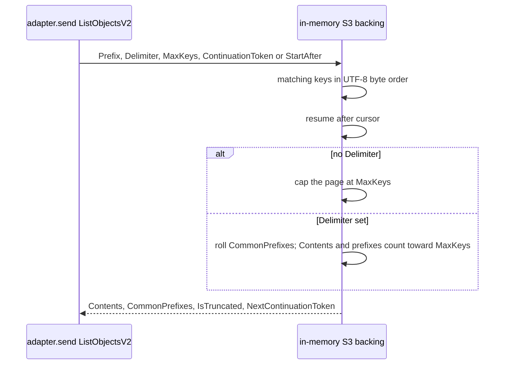

# S3 in-memory backing (list)

Current truth for ListObjects / ListObjectsV2 on the in-memory S3 **backing**
(`packages/s3/src/s3-client/in-memory-backing.ts`). The adapter forwards those
commands; this file is the list contract, not the probe.

Not a semver event: the public `@vnatures/test-kit-s3` surface is unchanged.
Published list prose lives in `packages/s3/README.md`.

Folded from the P10 delta (RD-24151), preserved at
`docs/internal/archive/2026-09-10-P10-s3-handlelist-decomposition/delta.md`.

This is not `core-public-api.md` (that file is the published
`@vnatures/test-kit` surface and uses `## Known gaps`). The complexity-disable
close is also recorded in `docs/internal/spec/ci-gate.md`.

## Requirements

### Requirement: In-memory S3 list honours ListObjectsV2 semantics
The in-memory S3 backing SHALL list stored objects with the ListObjectsV2
contract the adapter already forwards: prefix filtering, delimiter /
common-prefix rollup, `MaxKeys` default-and-cap 1000, continuation-token
pagination, `StartAfter` as the no-token fallback, and UTF-8 byte
lexicographic key order. `ListObjects` (v1) SHALL keep using `Marker` /
`NextMarker` and omitting `KeyCount` through the same handler.

The behaviour lock is
`packages/s3/test/integration/list-pagination.test.ts`.

#### Scenario: prefix filtering is preserved across pages
- **WHEN** objects under two prefixes are listed with `Prefix` set to one of them
- **THEN** only keys under that prefix are returned, in UTF-8 order, with `IsTruncated` false when they fit in one page

#### Scenario: Delimiter rolls common prefixes and counts them toward MaxKeys
- **WHEN** keys `a/1`, `a/2`, `b/1`, `b/2`, `c.txt` are listed with `Delimiter: '/'`
- **THEN** `CommonPrefixes` is `a/`, `b/`, `Contents` is `c.txt`, `KeyCount` is 3, and `IsTruncated` is false

#### Scenario: a common prefix is not split across pages
- **WHEN** keys `a/1`, `a/2`, `a/3`, `b/1` are listed with `Delimiter: '/'` and `MaxKeys: 1`
- **THEN** page 1 is only common prefix `a/` and truncated, and page 2 is only common prefix `b/` and not truncated

#### Scenario: MaxKeys defaults to 1000 and values above 1000 are silently capped
- **WHEN** more than 1000 keys are listed with `MaxKeys` omitted or set above 1000
- **THEN** each page contains at most 1000 keys, `IsTruncated` is true until the last page, and walking `NextContinuationToken` yields every key exactly once in UTF-8 order

#### Scenario: MaxKeys=0 returns an empty non-truncated page
- **WHEN** a bucket with keys is listed with `MaxKeys: 0`
- **THEN** `Contents` is empty, `IsTruncated` is false, and no `NextContinuationToken` is emitted

#### Scenario: non-finite MaxKeys falls back to 1000
- **WHEN** a bucket with fewer than 1000 keys is listed with `MaxKeys: NaN`
- **THEN** every key is returned in one non-truncated page

#### Scenario: continuation resumes after the last key of the previous page
- **WHEN** a listing is paged with `MaxKeys` smaller than the matching key count
- **THEN** non-final pages set `IsTruncated` and `NextContinuationToken`, the next page starts strictly after the previous page's last key, and a `MaxKeys` larger than the remaining count returns the rest in one non-truncated page

#### Scenario: a malformed ContinuationToken restarts from the beginning
- **WHEN** `ContinuationToken` is not a round-trippable token issued by this backing
- **THEN** the listing starts at the first matching key, not at an arbitrary decoded string

#### Scenario: ContinuationToken takes precedence over StartAfter
- **WHEN** `StartAfter` is set alone, listing begins at the first key strictly after that key
- **WHEN** both `ContinuationToken` and `StartAfter` are set
- **THEN** the token cursor wins

#### Scenario: keys are sorted by UTF-8 byte order
- **WHEN** keys differ in UTF-8 vs UTF-16 order
- **THEN** the listing order is UTF-8 byte order

### Requirement: handleList meets the complexity budget without a disable
`packages/s3/src/s3-client/in-memory-backing.ts` SHALL NOT contain
`eslint-disable-next-line complexity -- P10 / RD-24151` or any other
`complexity` / `max-lines-per-function` disable on `handleList` or on
functions extracted from it. `handleList` and every function extracted
from it SHALL be complexity ≤ 12. `npm run lint` SHALL exit 0 without
that disable.

`dispatch` in the same file MAY keep its existing
`eslint-disable-next-line complexity` (complexity 14).

#### Scenario: the P10 handleList complexity disable is gone
- **WHEN** `packages/s3/src/s3-client/in-memory-backing.ts` is read
- **THEN** it does not contain `P10 / RD-24151` and does not contain an
  `eslint-disable` of `complexity` or `max-lines-per-function` whose
  next function is `handleList`

#### Scenario: the only remaining complexity disable in the backing is dispatch
- **WHEN** `packages/s3/src/s3-client/in-memory-backing.ts` is scanned
  for next-line `complexity` disables
- **THEN** exactly one remains, and it is the existing `dispatch`
  disable (`existing function over the published budget; extract on next
  touch`)

## Flow

## Decisions (rung recorded)

| Decision | Outcome | Rung |
| --- | --- | --- |
| Spec home is `s3-backing.md` + `ci-gate.md`, not `core-public-api.md` | `core-public-api.md` is the published `@vnatures/test-kit` surface and uses `## Known gaps`. This file owns list behaviour. `ci-gate.md` records the closed P09 handleList deferral (`## Out of scope (deferred)`) | Source (`core-public-api.md`, `ci-gate.md`) + user prompt to check |
| `dispatch` is out of scope | Ticket title, estimate, and decomposition are ListObjectsV2 semantics inside `handleList`. `dispatch` is a command-name switch at complexity 14. Its comment says extract on next touch **of that method** | Ticket + source |
| Do not edit `list-pagination.test.ts` | It is the behaviour lock for this extract | Ticket |
| No dedicated ListObjects v1 pagination tests | v1 shares `handleList` (`Marker` / `NextMarker`, no `KeyCount`). The lock file is v2-only | Source + lock file |
| `max-lines-per-function` disable on `handleList` did not exist to delete | Re-measure with pinned skip flags: only `complexity` 26 fired | Re-measure (`eslint --no-inline-config`) |
| Not a semver event | Private extract; ListObjectsV2 responses unchanged | Source |

## Out of scope (deferred)

| Item | Consequence of deferring |
| --- | --- |
| Extract `dispatch` (complexity 14) in the same file | It stays behind `eslint-disable-next-line complexity -- existing function over the published budget; extract on next touch` until that method is edited |
| Dedicated ListObjects v1 pagination integration tests | v1 remains covered only by sharing `handleList` with the v2 lock suite |
| Extracting other complexity-13 functions (`recordCallImpl` × 2, `createProbedSequelizeAdapter`, repo-root test helpers) | They stay behind their P09 next-line disables |

## Acceptance mapping

1. Prefix filtering — `list-pagination.test.ts` `prefix filtering is preserved across pages`.
2. Delimiter rollup — `Delimiter rolls up keys into CommonPrefixes and counts toward MaxKeys (M6)`.
3. Common prefix not split — `Delimiter with MaxKeys=1 paginates correctly (common prefix not split across pages)`.
4. MaxKeys default and cap 1000 — `default MaxKeys (omitted) is 1000`, `MaxKeys above 1000 is silently capped at 1000 (real S3 behaviour)`, `paged walk with MaxKeys=5000 over 2500 keys yields every key exactly once`.
5. MaxKeys=0 — `MaxKeys=0 returns an empty, non-truncated page with no token (M5)`.
6. Non-finite MaxKeys — `non-finite MaxKeys (NaN) falls back to default 1000, not an empty/poisoned page`.
7. Continuation pagination — `IsTruncated is true on non-final pages and carries NextContinuationToken`, `continuation resumes after the exact key boundary (no overlap, no skip)`, `2500 keys with MaxKeys=1000 takes exactly 3 pages with stable order`, `MaxKeys larger than key count returns everything in one non-truncated page`.
8. Malformed token — `a malformed ContinuationToken restarts from the beginning (not an arbitrary key)`.
9. StartAfter / token precedence — `StartAfter begins listing after the specified key (M7)`, `ContinuationToken takes precedence over StartAfter (M7)`.
10. UTF-8 order — `keys are sorted by UTF-8 byte order, not UTF-16 code-unit order (L4)`.
11. `in-memory-backing.ts` does not contain `P10 / RD-24151` and has no `complexity` / `max-lines-per-function` disable on `handleList` (`test/ci-gate/s3-handlelist-budget.test.ts`).
12. Exactly one `complexity` next-line disable remains in that file, on `dispatch`.
13. `npm run lint` exits 0 without the P10 disable (`--max-warnings 0`).
